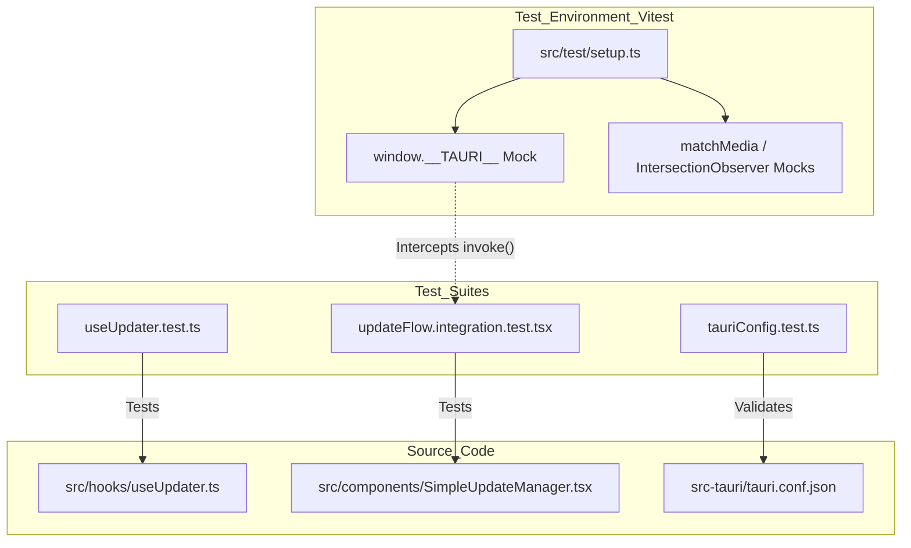
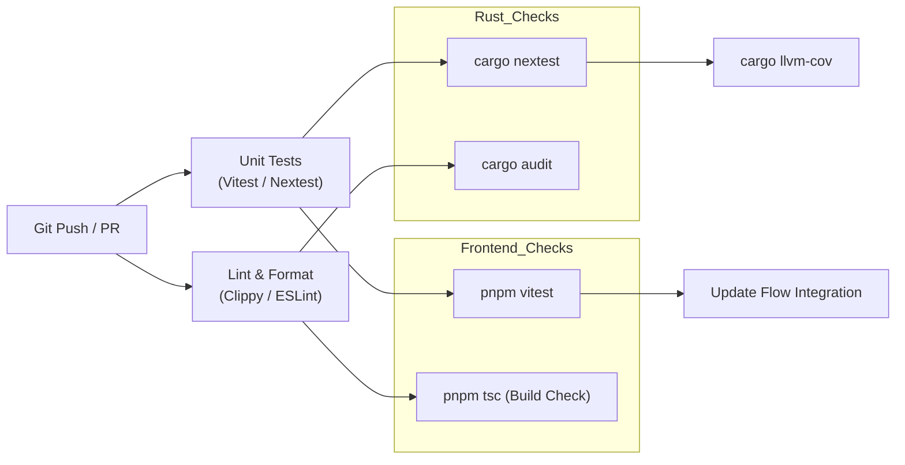

# 테스트

관련 소스 파일

다음 파일들은 이 위키 페이지를 생성하기 위한 컨텍스트로 사용되었습니다.

- [.github/workflows/rust-tests.yml](.github/workflows/rust-tests.yml)
- [.github/workflows/update-flow-tests.yml](.github/workflows/update-flow-tests.yml)
- [CLAUDE.md](CLAUDE.md)
- [mise.toml](mise.toml)
- [src-tauri/src/models/message.rs](src-tauri/src/models/message.rs)
- [src-tauri/src/test_utils.rs](src-tauri/src/test_utils.rs)
- [src-tauri/tests/configImport.test.ts](src-tauri/tests/configImport.test.ts)
- [src-tauri/tests/tauriConfig.test.ts](src-tauri/tests/tauriConfig.test.ts)
- [src/test/setup.ts](src/test/setup.ts)
- [src/test/updateFlow.integration.test.tsx](src/test/updateFlow.integration.test.tsx)

이 페이지는 Claude Code History Viewer의 테스트 인프라를 다루며, 프론트엔드 Vitest suite, Rust 백엔드 test suite, 통합 CI 워크플로를 포함합니다.

---

## 개요

이 프로젝트는 React/TypeScript 프론트엔드와 Rust/Tauri 백엔드 모두의 신뢰성을 보장하기 위해 이중 계층 테스트 전략을 사용합니다.

| 계층 | 프레임워크 | 실행 명령 | 주요 도구 |
|:---|:---|:---|:---|
| **Frontend** | Vitest | `just test` | `vitest`, `@testing-library/react` |
| **Backend** | Cargo | `just rust-test` | `cargo test`, `nextest`, `insta`, `llvm-cov` |

출처: [CLAUDE.md:25-37](), [CLAUDE.md:104-122]()

---

## 프론트엔드 테스트(Vitest)

프론트엔드 테스트는 빠르고 Vite-native 테스트 환경을 제공하는 **Vitest**로 관리됩니다. 테스트는 `src/test/`에 있으며, 컴포넌트 옆에도 `*.test.ts(x)` 형태로 배치됩니다.

### 테스트 환경 및 Mocking
애플리케이션은 Tauri 안에서 실행되므로, 테스트 환경은 컴포넌트가 백엔드 command를 invoke하거나 event를 listen하려 할 때 오류가 발생하지 않도록 `src/test/setup.ts`에서 `__TAURI__` global object를 mock합니다.

**다이어그램: 프론트엔드 테스트 아키텍처 및 Mocking**

출처: [src/test/setup.ts:1-24](), [src/test/setup.ts:27-64](), [src-tauri/tests/tauriConfig.test.ts:1-15]()

### 통합 테스트: 업데이트 Flow
프론트엔드 테스트의 상당 부분은 업데이트 lifecycle에 초점을 맞추며, 버전 확인과 사용자 알림의 신뢰성을 보장합니다.

*   **`updateFlow.integration.test.tsx`**: end-to-end flow를 실행합니다. `UpdateFlowHarness`를 사용해 `PlatformProvider` 안에서 `SettingDropdown`과 `SimpleUpdateManager`를 감쌉니다 [src/test/updateFlow.integration.test.tsx:139-148]().
*   **수동 확인 테스트**: "check for updates"를 클릭하면 UI가 `checking`에서 `up-to-date` 상태로 전환되는지 검증합니다 [src/test/updateFlow.integration.test.tsx:159-190]().
*   **버전 건너뛰기 테스트**: 사용자가 특정 release를 건너뛰도록 선택했을 때 store의 `skipVersion` action이 호출되는지 검증합니다 [src/test/updateFlow.integration.test.tsx:192-218]().

출처: [.github/workflows/update-flow-tests.yml:7-21](), [src/test/updateFlow.integration.test.tsx:1-219]()

---

## 백엔드 테스트(Rust)

Rust 백엔드는 데이터 무결성과 성능을 보장하기 위해 포괄적인 테스트 도구 suite를 활용합니다.

### 테스트 실행 모델
이 프로젝트는 Rust 테스트를 실행하는 두 가지 주요 방식을 지원합니다.
1.  **표준 `cargo test`**: `--test-threads=1`로 실행됩니다. 일부 테스트가 설정 경로 확인을 검증하기 위해 `HOME` 환경 변수를 수정하므로, 병렬로 실행하면 race condition이 발생할 수 있어 필수입니다 [CLAUDE.md:116-125]().
2.  **`cargo nextest`**: CI에 권장되는 runner입니다. 격리된 process에서 테스트를 실행해 안전한 병렬 실행과 JUnit XML reporting을 가능하게 합니다 [ .github/workflows/rust-tests.yml:101-111]().

출처: [CLAUDE.md:116-125](), [.github/workflows/rust-tests.yml:101-111]()

### 테스트 유틸리티(`test_utils.rs`)
`src-tauri/src/test_utils.rs` module은 파일 시스템과 데이터 구조를 시뮬레이션하기 위한 helper를 제공합니다.
*   **`MockClaudeProject`**: project scanning을 테스트하기 위해 `tempfile::TempDir`를 사용해 임시 `.claude/projects` directory 구조를 생성합니다 [src-tauri/src/test_utils.rs:21-63]().
*   **`MessageBuilder`**: analytics와 rendering 테스트를 위해 특정 role, model, token usage를 가진 `ClaudeMessage` instance를 구성하는 fluent API입니다 [src-tauri/src/test_utils.rs:73-165]().

출처: [src-tauri/src/test_utils.rs:1-220]()

### 코드 Coverage 및 Benchmarking
*   **`cargo llvm-cov`**: Rust codebase에 대한 LCOV report를 생성하며, CI의 `coverage` job에 통합되어 있습니다 [ .github/workflows/rust-tests.yml:150-153]().
*   **Benchmark**: data processing 속도의 regression을 추적하기 위해 `main` branch에서 performance benchmark가 실행됩니다 [ .github/workflows/rust-tests.yml:171-207]().

출처: [.github/workflows/rust-tests.yml:150-207]()

---

## 데이터 모델 및 설정 테스트

### 모델 Serialization
`src-tauri/src/models/message.rs`의 테스트는 `TokenUsage` 및 `ClaudeMessage` 구조체가 JSON에서 올바르게 serialize/deserialize되는지 보장합니다. 이는 Tauri IPC bridge에 중요합니다 [src-tauri/src/models/message.rs:186-195]().

### Tauri 설정 검증
이 프로젝트에는 `tauri.conf.json` 파일을 검증하기 위한 Vitest suite가 포함되어 있습니다.
*   **`tauriConfig.test.ts`**: 올바른 v2 schema, product name, window dimension을 확인합니다 [src-tauri/tests/tauriConfig.test.ts:15-173]().
*   **`configImport.test.ts`**: frontend build에서 설정을 JSON module로 성공적으로 import할 수 있는지 검증합니다 [src-tauri/tests/configImport.test.ts:11-35]().

출처: [src-tauri/src/models/message.rs:186-195](), [src-tauri/tests/tauriConfig.test.ts:1-173](), [src-tauri/tests/configImport.test.ts:1-35]()

---

## CI/CD 통합

테스트는 여러 특화된 워크플로에 걸쳐 GitHub Actions를 통해 자동화됩니다.

| Workflow | 책임 |
|:---|:---|
| **Rust Tests** | Ubuntu 및 macOS에서 `cargo nextest`, `clippy`(linting), `fmt`(formatting)를 실행합니다 [ .github/workflows/rust-tests.yml:1-64](). |
| **Update Flow Tests** | 업데이트 관련 프론트엔드 컴포넌트(`SimpleUpdateManager`, `useUpdater`)에 대해 Vitest를 실행합니다 [ .github/workflows/update-flow-tests.yml:1-64](). |
| **Code Coverage** | Rust coverage report를 생성하고 Codecov에 업로드합니다(`main` branch만 해당) [ .github/workflows/rust-tests.yml:114-169](). |
| **Security Audit** | Rust 의존성의 취약점을 확인하기 위해 `cargo audit`를 실행합니다 [ .github/workflows/rust-tests.yml:210-226](). |

**다이어그램: CI Quality Gate Flow**

출처: [CLAUDE.md:104-122](), [.github/workflows/rust-tests.yml:1-226](), [.github/workflows/update-flow-tests.yml:1-64]()
