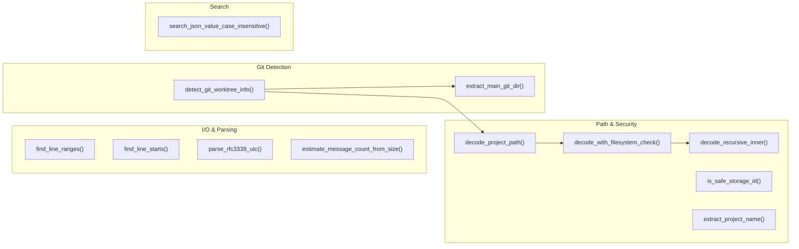
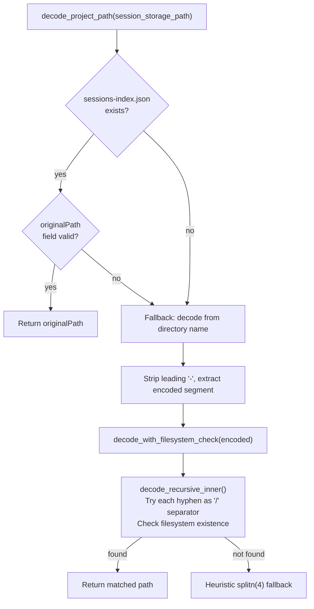
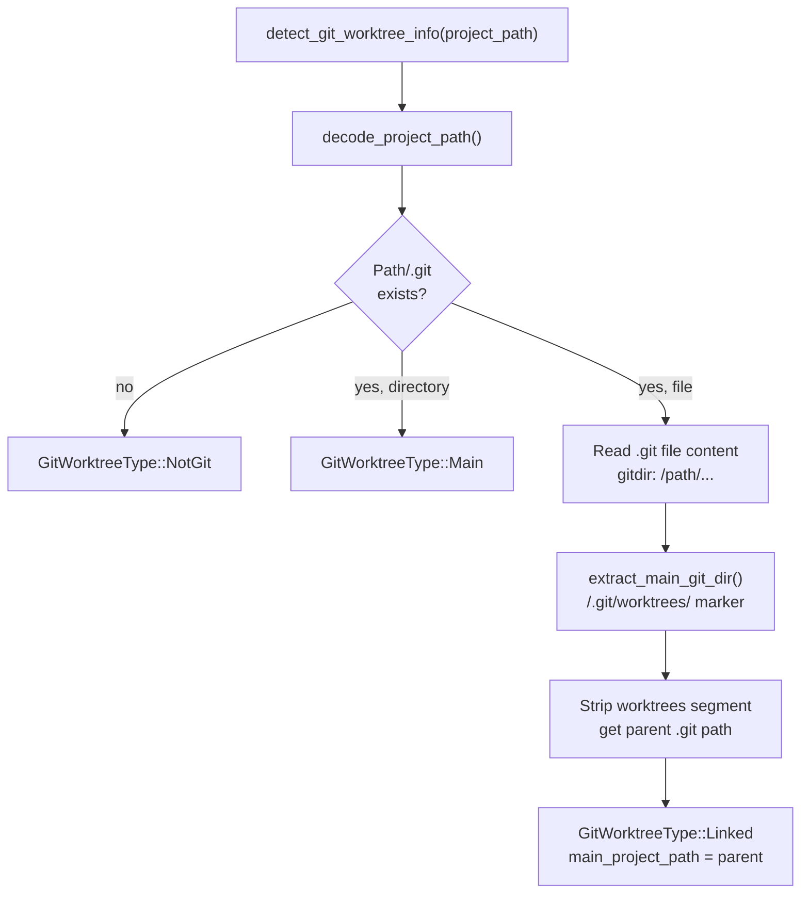
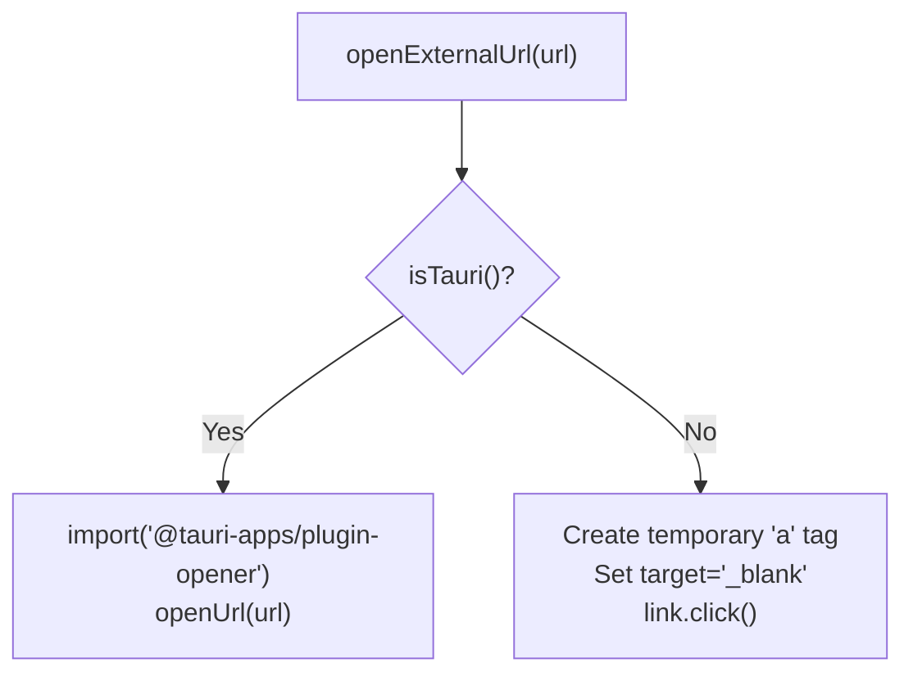

# 유틸리티 함수

관련 소스 파일

다음 파일들은 이 위키 페이지를 생성하기 위한 컨텍스트로 사용되었습니다.

- [src-tauri/src/providers/codex.rs](src-tauri/src/providers/codex.rs)
- [src-tauri/src/providers/gemini.rs](src-tauri/src/providers/gemini.rs)
- [src-tauri/src/providers/opencode.rs](src-tauri/src/providers/opencode.rs)
- [src-tauri/src/utils.rs](src-tauri/src/utils.rs)
- [src/components/AnalyticsDashboard/utils/globalCalculations.ts](src/components/AnalyticsDashboard/utils/globalCalculations.ts)
- [src/components/MessageViewer/helpers/index.ts](src/components/MessageViewer/helpers/index.ts)
- [src/components/MessageViewer/hooks/useMessageVirtualization.ts](src/components/MessageViewer/hooks/useMessageVirtualization.ts)
- [src/hooks/analytics/useAnalyticsNavigation.ts](src/hooks/analytics/useAnalyticsNavigation.ts)
- [src/hooks/useExternalLinks.test.ts](src/hooks/useExternalLinks.test.ts)
- [src/hooks/useExternalLinks.ts](src/hooks/useExternalLinks.ts)
- [src/hooks/useSessionMetadata.ts](src/hooks/useSessionMetadata.ts)
- [src/test/projectSlice.getGroupedProjects.test.ts](src/test/projectSlice.getGroupedProjects.test.ts)
- [src/test/worktreeUtils.test.ts](src/test/worktreeUtils.test.ts)
- [src/utils/cardSemantics.ts](src/utils/cardSemantics.ts)
- [src/utils/formatters.test.ts](src/utils/formatters.test.ts)
- [src/utils/formatters.ts](src/utils/formatters.ts)
- [src/utils/platform.test.ts](src/utils/platform.test.ts)
- [src/utils/platform.ts](src/utils/platform.ts)
- [src/utils/searchIndex.ts](src/utils/searchIndex.ts)
- [src/utils/worktreeUtils.ts](src/utils/worktreeUtils.ts)

이 페이지는 애플리케이션의 Rust 백엔드와 TypeScript 프론트엔드 전반에서 사용되는 공유 유틸리티 함수를 문서화합니다. 이들은 상위 수준 시스템을 지원하지만 특정 단일 기능 영역에 속하지 않는 순수 helper 함수와 작은 module입니다.

이러한 유틸리티 중 일부를 사용하는 analytics 계산 logic에 대한 정보는 [Statistics and Analytics](#5.2)를 참조하세요. `worktreeUtils`가 project tree 표시로 어떻게 이어지는지는 [Project Tree](#3.1)를 참조하세요.

---

## 백엔드 유틸리티(`src-tauri/src/utils.rs`)

모든 백엔드 유틸리티는 [src-tauri/src/utils.rs]()에 있습니다.

### 유틸리티 함수 맵

**다이어그램: 백엔드 유틸리티 함수와 역할**

출처: [src-tauri/src/utils.rs:1-312]()

---

### Line Parsing

두 함수는 memory-mapped JSONL 파일의 raw byte buffer를 scan합니다. 이들은 SIMD 가속 newline 감지를 위해 `memchr` crate를 사용합니다.

| 함수 | 반환값 | 목적 |
|---|---|---|
| `find_line_ranges` | `Vec<(usize, usize)>` | 비어 있지 않은 각 line의 시작 및 끝 byte offset |
| `find_line_starts` | `Vec<usize>` | 각 line의 시작 byte offset |

둘 다 heap 재할당을 줄이기 위해 `ESTIMATED_BYTES_PER_LINE = 500`을 사용해 capacity를 미리 할당합니다.

출처: [src-tauri/src/utils.rs:7-51]()

---

### Project Path Decoding

Claude Code는 path-encoded directory name을 사용해 session data를 `~/.claude/projects/`에 저장합니다. project path의 forward slash는 hyphen으로 바뀌어 `-Users-jack-my-project` 같은 이름이 됩니다. project name에도 hyphen이 포함될 수 있으므로, 단순 치환은 모호합니다.

**다이어그램: decode_project_path 해석 전략**

출처: [src-tauri/src/utils.rs:111-243]()

재귀 함수 `decode_recursive_inner`는 runaway recursion을 방지하기 위해 깊이가 20단계로 제한됩니다. candidate directory segment를 검증할 때 symlink를 따라가지 않도록 `metadata`가 아니라 `std::fs::symlink_metadata`를 호출합니다.

---

### Git Worktree Detection

`detect_git_worktree_info`는 project directory의 `.git` entry를 검사해 project의 git status를 분류합니다.

**다이어그램: detect_git_worktree_info 결정 logic**

출처: [src-tauri/src/utils.rs:245-312]()

linked worktree의 `.git` 파일에는 다음과 같은 line이 포함됩니다.
`gitdir: /Users/jack/main-project/.git/worktrees/feature-branch`

`extract_main_git_dir`는 `/.git/worktrees/` 뒤의 모든 것을 제거해 main repo의 `.git` path를 복원한 다음, `Path::parent()`로 main project root를 얻습니다.

반환 type은 `Option<GitInfo>`이며, `GitInfo`는 `GitWorktreeType` variant(`Main`, `Linked`, `NotGit`)와 optional `main_project_path` string을 보관합니다.

---

### 기타 백엔드 유틸리티

| 함수 | 목적 |
|---|---|
| `extract_project_name(raw)` | encoded directory name에서 앞부분의 `-seg1-seg2-` prefix를 제거해 순수 project name을 얻습니다. [src-tauri/src/utils.rs:54-65]() |
| `estimate_message_count_from_size(size)` | file size를 `AVERAGE_MESSAGE_SIZE_BYTES`(1000.0)로 나눈 뒤 `ceil`을 적용하며, 최솟값은 1입니다. [src-tauri/src/utils.rs:68-72]() |
| `parse_rfc3339_utc(timestamp)` | RFC 3339 string을 `DateTime<Utc>`로 parse합니다. [src-tauri/src/utils.rs:75-79]() |
| `is_safe_storage_id(id)` | Path traversal guard입니다. ID가 단일 normal component인지 보장합니다. [src-tauri/src/utils.rs:85-92]() |
| `search_json_value_case_insensitive(val, q)` | `serde_json::Value` tree를 재귀적으로 순회해 string match를 찾습니다. [src-tauri/src/utils.rs:158-169]() |

출처: [src-tauri/src/utils.rs:53-170]()

---

## 프론트엔드 유틸리티

### Platform 및 Runtime Detection(`src/utils/platform.ts`)

이 유틸리티들은 Tauri desktop environment와 WebUI server mode를 구분합니다.

| 함수 | Logic |
|---|---|
| `isTauri()` | `window.__TAURI_INTERNALS__`가 있으면 true를 반환합니다. [src/utils/platform.ts:28-29]() |
| `isWebUI()` | `!isTauri()`를 반환합니다. [src/utils/platform.ts:32-32]() |
| `isMacOS()` | `navigator.userAgent`에서 "mac"을 확인합니다. [src/utils/platform.ts:16-17]() |
| `getApiBase()` | `window.__WEBUI_API_BASE__` 또는 `window.location.origin`을 반환합니다. [src/utils/platform.ts:41-46]() |

**다이어그램: Platform에 따른 URL 열기**

출처: [src/utils/platform.ts:1-165](), [src/hooks/useExternalLinks.ts:1-47]()

### Worktree Utilities(`src/utils/worktreeUtils.ts`)

이 module은 백엔드가 채운 `git_info` field를 기반으로 `ClaudeProject` object를 grouping합니다.

| 함수 | 전략 |
|---|---|
| `detectWorktreeGroupsByGit` | `main_project_path`를 사용해 `"linked"` worktree를 각각의 `"main"` repo 아래로 grouping합니다. [src/utils/worktreeUtils.ts:97-140]() |
| `detectWorktreeGroupsHybrid` | grouping에 유효한 git info가 있는 project를 분리하고, 나머지는 ungrouped로 처리합니다. [src/utils/worktreeUtils.ts:150-176]() |
| `groupProjectsByDirectory` | parent directory path를 기준으로 project를 grouping합니다. [src/utils/worktreeUtils.ts:233-270]() |

출처: [src/utils/worktreeUtils.ts:1-270]()

### Card Semantics(`src/utils/cardSemantics.ts`)

`getCardSemantics` 함수는 message를 분석해 Session Board에서 사용할 시각적 및 기능적 속성을 결정합니다.

| 속성 | 감지 Logic |
|---|---|
| `isError` | `stopReasonSystem`에 "error"가 있는지 또는 `toolUseResult.is_error === true`인지 확인합니다. [src/utils/cardSemantics.ts:35-48]() |
| `isCancelled` | "customer_cancelled" 또는 "request canceled by user" text를 확인합니다. [src/utils/cardSemantics.ts:51-54]() |
| `isGit` | tool variant 또는 "git"으로 시작하는 shell command와 match합니다. [src/utils/cardSemantics.ts:66-77]() |
| `isFileEdit` | `write_to_file`, `edit_file`, `replace_file_content` 같은 tool name과 match합니다. [src/utils/cardSemantics.ts:88-90]() |
| `brushMatch` | message metadata에 대해 `matchesBrush` predicate를 실행합니다. [src/utils/cardSemantics.ts:160-174]() |

출처: [src/utils/cardSemantics.ts:24-181]()

### Search Indexing(`src/utils/searchIndex.ts`)

프론트엔드는 local message search에 `FlexSearch`를 사용합니다. `extractSearchableText`는 복잡한 `ClaudeMessage` content 구조(`tool_use`, `mcp_tool_use`, `thinking` block 포함)를 순회해 평탄한 searchable string을 만듭니다.

| Content Type | Extraction Logic |
|---|---|
| `text` | 최대 10KB의 raw text를 추출합니다. [src/utils/searchIndex.ts:41-43]() |
| `tool_use` | tool name을 추출합니다. [src/utils/searchIndex.ts:49-51]() |
| `mcp_tool_use` | `server_name` 및 `tool_name`을 추출합니다. [src/utils/searchIndex.ts:94-97]() |
| `image` | 명시적으로 건너뜁니다(searchable하지 않음). [src/utils/searchIndex.ts:36-38]() |

출처: [src/utils/searchIndex.ts:20-151]()

### Formatting Utilities(`src/utils/formatters.ts`)

| 함수 | 목적 |
|---|---|
| `formatDuration` | 분 단위를 "<1m", "45m", "2h 15m" 같은 string으로 변환합니다. [src/utils/formatters.ts:2-9]() |
| `formatNumber` | 큰 숫자를 줄여 표시합니다(예: 1.2M, 15.5K). [src/utils/formatters.ts:11-15]() |
| `formatBytes` | byte count를 사람이 읽기 쉬운 단위(KB, MB, GB)로 변환합니다. [src/utils/formatters.ts:17-26]() |

출처: [src/utils/formatters.ts:1-27]()
