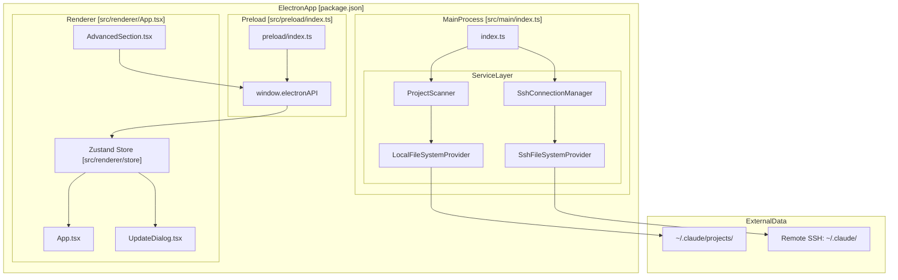
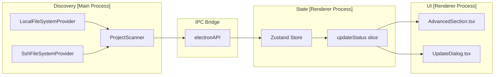

# 개요

관련 소스 파일

다음 파일들은 이 위키 페이지를 생성하기 위한 컨텍스트로 사용되었습니다.

- [.github/workflows/release.yml](.github/workflows/release.yml)
- [README.md](README.md)
- [package.json](package.json)
- [pnpm-lock.yaml](pnpm-lock.yaml)
- [public/compact.mp4](public/compact.mp4)
- [public/context.png](public/context.png)
- [public/noti.mp4](public/noti.mp4)
- [resources/afterInstall.sh](resources/afterInstall.sh)
- [src/main/services/infrastructure/SshConnectionManager.ts](src/main/services/infrastructure/SshConnectionManager.ts)
- [src/renderer/components/common/UpdateDialog.tsx](src/renderer/components/common/UpdateDialog.tsx)
- [src/renderer/components/settings/sections/AdvancedSection.tsx](src/renderer/components/settings/sections/AdvancedSection.tsx)

이 문서는 **claude-devtools**의 목적, 핵심 기능, 아키텍처 기반을 높은 수준에서 소개합니다. 특정 하위 시스템에 대한 자세한 정보는 이 페이지 전반에 연결된 섹션을 참조하세요.

**범위:** 이 페이지는 claude-devtools의 개념 모델과 주요 기능을 다룹니다. 설치 및 설정 지침은 [Getting Started]()를 참조하세요. SSH 원격 접근, 컨텍스트 재구성, 알림 트리거 같은 개별 시스템의 심층 설명은 Architecture 섹션과 그 하위 섹션을 참조하세요.

---

## 목적

**claude-devtools**는 `~/.claude/projects/`에 로컬로 저장된 세션 로그 파일을 파싱하여 Claude Code 세션의 전체 실행 추적을 재구성하는 데스크톱 애플리케이션입니다 [README.md:84-84](). 이 도구는 해당 세션이 터미널, IDE 또는 다른 래퍼 도구에서 실행되었는지와 관계없이, Claude Code 세션 중 발생한 모든 파일 읽기, 실행된 도구 호출, 소비된 토큰, 컨텍스트 주입을 검사할 수 있는 시각적 인터페이스를 제공합니다 [README.md:14-17]().

이 도구는 특정 문제를 해결합니다. 최근 Claude Code 업데이트에서 상세한 실행 출력이 불투명한 요약(`Read 3 files`, `Searched for 1 pattern`)으로 대체되었고, 컨텍스트 사용량 표시기는 세부 내역이 없는 3분할 막대가 되었습니다 [README.md:90-94](). 유일한 대안은 `--verbose` 모드인데, 이 모드는 터미널을 원시 JSON과 시스템 프롬프트로 가득 채웁니다. claude-devtools는 세션 로그에서 누락된 정보를 추출하고 이를 구조화되고 검색 가능한 인터페이스로 제공합니다 [README.md:96-97]().

**핵심 원칙:** claude-devtools는 Claude Code를 래핑하거나 수정하거나 실행하지 않습니다. Claude Code가 이미 디스크에 기록하는 JSONL 세션 파일을 읽는 방식으로 완전히 사후적으로 동작합니다 [README.md:109-112]().

출처: [README.md:14-17](), [README.md:84-84](), [README.md:90-94](), [README.md:96-97](), [README.md:109-112]()

---

## 핵심 기능

| 기능 | 설명 |
|---------|-------------|
| **Context Reconstruction** | 세션 로그에서 턴별 컨텍스트 창 내용을 역공학하여 CLAUDE.md 파일, skill 활성화, 도구 I/O, thinking 같은 범주별 토큰 귀속 내역을 분해합니다 [README.md:118-120](). |
| **SSH Remote Sessions** | SSH/SFTP를 통해 원격 머신에 연결하여 그곳에서 실행 중인 Claude Code 세션을 검사합니다 [src/main/services/infrastructure/SshConnectionManager.ts:1-10](). agent, key, password를 포함한 여러 인증 방식을 지원합니다 [src/main/services/infrastructure/SshConnectionManager.ts:35-35](). |
| **Notification Triggers** | 특정 패턴(예: `.env` 파일 접근 또는 도구 오류)을 감시하는 실시간 모니터링 시스템입니다. 사용자는 정규식 기반의 사용자 지정 트리거를 정의할 수 있습니다. |
| **Tool Call Inspector** | Claude Code 도구를 위한 특화 뷰어입니다. 구문 강조 코드, 인라인 diff, 명령 출력, 재귀적 subagent 트리(`Task`)를 제공합니다. |
| **Team & Subagent Visualization** | Claude Code의 팀 조정 및 subagent 도구 호출을 별도 엔티티로 감지하고 렌더링하여, 팀원 메시지와 subagent 세션을 펼칠 수 있는 트리로 보여줍니다 [README.md:106-106](). |
| **Auto-Updates** | 새 버전을 감지하고, 릴리스 노트를 표시하며, 다운로드를 처리하는 통합 업데이트 시스템입니다 [src/renderer/components/common/UpdateDialog.tsx:1-6](). |

출처: [README.md:118-120](), [src/main/services/infrastructure/SshConnectionManager.ts:1-10](), [src/main/services/infrastructure/SshConnectionManager.ts:35-35](), [README.md:106-106](), [src/renderer/components/common/UpdateDialog.tsx:1-6]()

---

## 기술 스택

claude-devtools는 React 기반 renderer process와 함께 **Electron** 위에 구축되었습니다. 주요 기술은 다음과 같습니다.

| 계층 | 기술 | 목적 |
|-------|-----------|---------|
| **Application Framework** | Electron 40.3 | 크로스 플랫폼 데스크톱 앱 [package.json:86-86]() |
| **Build System** | electron-vite 2.3 | main, preload, renderer를 위한 Vite 기반 번들러 [package.json:88-88]() |
| **UI Framework** | React 18.3 | renderer process의 컴포넌트 기반 UI [package.json:63-63]() |
| **State Management** | Zustand 4.5 | 애플리케이션 상태를 위한 경량 store [package.json:71-71]() |
| **SSH Client** | ssh2 1.17 | SSH 연결 관리 및 SFTP 작업 [package.json:69-69]() |
| **Styling** | Tailwind CSS 3.4 | 유틸리티 우선 CSS 프레임워크 [package.json:108-108]() |
| **Persistence** | idb-keyval 6.2 | 클라이언트 측 저장소를 위한 IndexedDB 래퍼 [package.json:60-60]() |
| **Testing** | Vitest 3.1 | 단위 테스트 프레임워크 [package.json:113-113]() |

출처: [package.json:60-113]()

---

## 고수준 아키텍처

claude-devtools는 관심사의 명확한 분리와 함께 Electron의 다중 프로세스 모델을 따릅니다.

### 시스템 프로세스 다이어그램

**프로세스 역할:**

- **Main Process**: 전체 시스템 접근 권한이 있는 Node.js를 실행합니다. `SshConnectionManager` [src/main/services/infrastructure/SshConnectionManager.ts:57-57]()를 통해 SSH 연결의 수명 주기와 파일 시스템 추상화를 관리합니다.
- **Preload Script**: 보안 경계입니다. renderer process에 최소한의 타입 안전 API를 노출합니다.
- **Renderer Process**: 샌드박스 처리된 React 애플리케이션입니다. `window.electronAPI` [src/renderer/components/settings/sections/AdvancedSection.tsx:7-7]()를 통해 main process와 통신합니다.

출처: [src/main/services/infrastructure/SshConnectionManager.ts:57-57](), [src/renderer/components/settings/sections/AdvancedSection.tsx:7-7](), [src/renderer/App.tsx](), [src/main/index.ts]()

---

## 데이터 흐름: 세션 탐색에서 UI 렌더링까지

다음 다이어그램은 세션 데이터가 파일 시스템에서 UI로 흐르는 방식을 보여줍니다.

### 데이터 파이프라인 다이어그램

**흐름 단계:**

1. **File System Abstraction**: `SshConnectionManager`는 도메인 서비스에 `FileSystemProvider`(local 또는 SSH)를 제공합니다 [src/main/services/infrastructure/SshConnectionManager.ts:7-7]().
2. **Discovery**: `ProjectScanner` 같은 서비스가 디렉터리 구조를 순회하여 Claude Code 세션을 찾습니다.
3. **IPC Transport**: 데이터가 프로세스 경계를 넘어 renderer로 전송됩니다.
4. **State Management**: renderer는 Zustand store를 업데이트합니다. 예를 들어, 애플리케이션 업데이트를 관리하기 위해 `updateStatus`와 `availableVersion`이 저장됩니다 [src/renderer/components/common/UpdateDialog.tsx:42-44]().
5. **UI Rendering**: `AdvancedSection` 같은 컴포넌트는 버전 정보를 표시하고 [src/renderer/components/settings/sections/AdvancedSection.tsx:30-32](), `UpdateDialog`는 `availableVersion`이 설정되었을 때 다운로드를 요청합니다 [src/renderer/components/common/UpdateDialog.tsx:136-141]().

출처: [src/main/services/infrastructure/SshConnectionManager.ts:7-7](), [src/renderer/components/common/UpdateDialog.tsx:42-44](), [src/renderer/components/common/UpdateDialog.tsx:136-141](), [src/renderer/components/settings/sections/AdvancedSection.tsx:30-32]()

---

## SSH 원격 접근

`SshConnectionManager`는 원격 연결의 수명 주기를 처리합니다 [src/main/services/infrastructure/SshConnectionManager.ts:2-10](). 이를 통해 애플리케이션은 기반 `FileSystemProvider`를 교체하는 방식으로 로컬 모드에서 원격 모드로 전환할 수 있습니다.

- **Authentication**: password, private key, SSH agent를 지원합니다 [src/main/services/infrastructure/SshConnectionManager.ts:35-35]().
- **SFTP Integration**: SFTP 채널을 사용해 원격 파일을 로컬 파일처럼 읽습니다 [src/main/services/infrastructure/SshConnectionManager.ts:146-155]().
- **Config Resolution**: `~/.ssh/config`에서 hosts를 파싱하고 확인할 수 있습니다 [src/main/services/infrastructure/SshConnectionManager.ts:111-120]().

출처: [src/main/services/infrastructure/SshConnectionManager.ts:2-10](), [src/main/services/infrastructure/SshConnectionManager.ts:35-35](), [src/main/services/infrastructure/SshConnectionManager.ts:146-155](), [src/main/services/infrastructure/SshConnectionManager.ts:111-120]()

---

## 릴리스 및 업데이트 시스템

이 애플리케이션에는 견고한 릴리스 파이프라인과 앱 내 업데이트 메커니즘이 포함되어 있습니다.

- **CI/CD**: GitHub Actions workflows가 macOS(arm64/x64), Windows, Linux용 멀티 플랫폼 빌드를 처리합니다 [package.json:23-28](), [.github/workflows/release.yml:50-221]().
- **Packaging**: `electron-builder`를 사용해 `.dmg`, `.exe`, `.AppImage` 및 기타 형식을 생성합니다 [package.json:134-165]().
- **Update Dialog**: 새 버전이 감지되면 `UpdateDialog` 컴포넌트가 정규화된 릴리스 노트를 표시하고 다운로드 트리거를 제공합니다 [src/renderer/components/common/UpdateDialog.tsx:100-181]().

출처: [package.json:23-28](), [package.json:134-165](), [.github/workflows/release.yml:50-221](), [src/renderer/components/common/UpdateDialog.tsx:100-181]()
