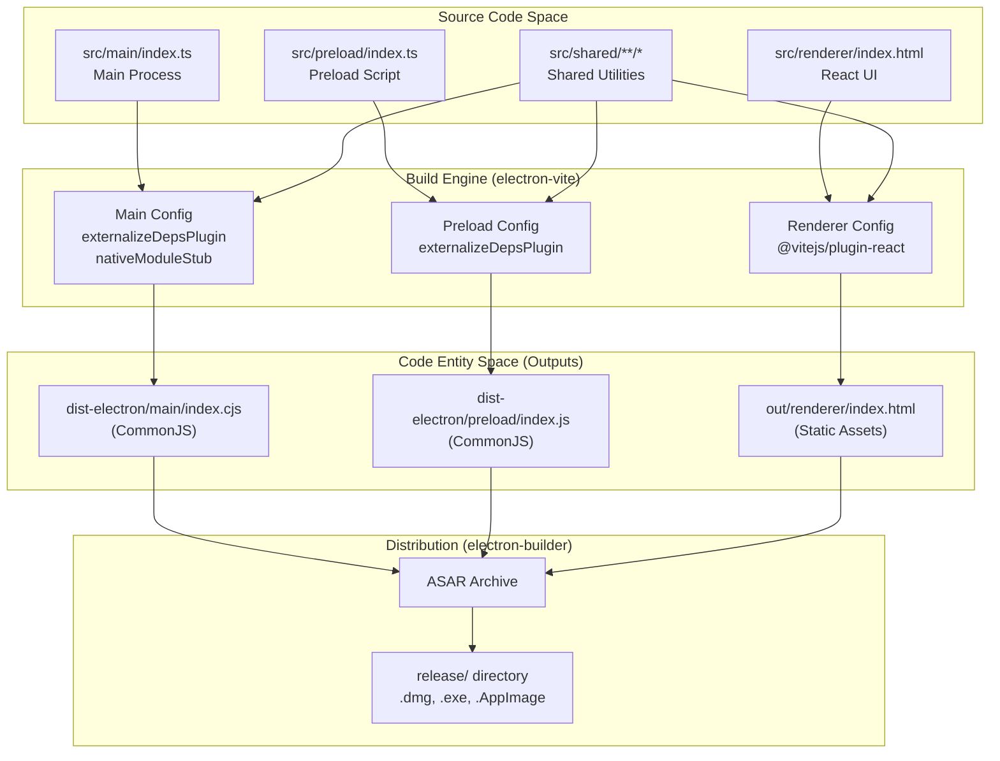
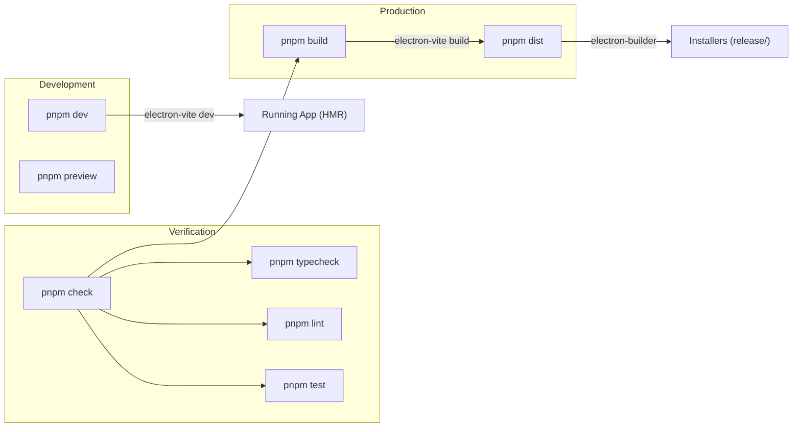

# 빌드 시스템

관련 소스 파일

다음 파일들은 이 위키 페이지를 생성하기 위한 컨텍스트로 사용되었습니다.

- [.github/workflows/release.yml](.github/workflows/release.yml)
- [electron.vite.config.ts](electron.vite.config.ts)
- [package.json](package.json)
- [pnpm-lock.yaml](pnpm-lock.yaml)
- [resources/afterInstall.sh](resources/afterInstall.sh)
- [src/main/services/infrastructure/NotificationManager.ts](src/main/services/infrastructure/NotificationManager.ts)
- [src/main/services/infrastructure/SshConnectionManager.ts](src/main/services/infrastructure/SshConnectionManager.ts)

**목적**: 이 문서는 `claude-devtools`의 개발 도구, bundling configuration, build pipeline을 설명합니다. native module 처리와 dependency management를 포함하여 source code가 development와 production을 위해 어떻게 컴파일되고 패키징되는지 다룹니다.

Electron-Vite 세부 사항은 [Electron-Vite Configuration](#10.1)을 참조하세요. native module 전략은 [Native Module Handling](#10.2)을 참조하세요. package 세부 사항은 [Dependency Management](#10.3)을 참조하세요.

---

## 개요

Claude-devtools는 **electron-vite**를 build system으로 사용하며, Electron의 three-process architecture에 최적화된 Vite 기반 bundling을 제공합니다. build system은 다음을 처리해야 합니다.

- **세 가지 별도 build target**: main process(Node.js), preload script(sandboxed Node.js), renderer process(browser) [electron.vite.config.ts:31-100]().
- **Native module 문제**: `ssh2`와 그 dependency에는 bundled될 수 없는 optional `.node` addon이 포함되어 있으며, 이는 custom stubbing plugin으로 처리됩니다 [electron.vite.config.ts:13-29]().
- **Path alias resolution**: `@main`, `@renderer`, `@preload`, `@shared`를 위한 TypeScript path mapping [electron.vite.config.ts:40-44]().
- **Production bundling**: ASAR packaging에서 pnpm symlink 문제를 피하기 위해 dependency가 main process에 embedded됩니다 [electron.vite.config.ts:7-11]().

**출처**: [package.json:1-182](), [electron.vite.config.ts:1-101]()

---

## Build Pipeline 아키텍처

pipeline은 `electron-vite`가 관리하는 세 가지 별도 configuration을 통해 TypeScript source code를 packaged Electron application으로 변환합니다.

### Build Flow Diagram

**출처**: [electron.vite.config.ts:1-101](), [package.json:121-180]()

---

## 핵심 빌드 고려사항

### Electron-Vite Configuration
프로젝트는 `main`, `preload`, `renderer` 설정을 포함하는 `defineConfig` object를 export하는 단일 `electron.vite.config.ts`를 정의합니다.
- **Main Process**는 dependency가 `__dirname`과 `require`를 사용할 수 있도록 CommonJS(`.cjs`)로 bundled됩니다 [electron.vite.config.ts:52-57]().
- **Preload Script**도 CommonJS이지만 `.js` extension을 사용합니다 [electron.vite.config.ts:76-79]().
- **Renderer Process**는 HMR과 JSX 지원을 위해 표준 Vite React plugin을 사용합니다 [electron.vite.config.ts:91]().

자세한 내용은 [Electron-Vite Configuration](#10.1)을 참조하세요.

### Native Module Handling
애플리케이션은 remote access를 위해 `ssh2`에 의존합니다 [package.json:69](). 이 library는 성능을 위해 `.node` binary addon을 load하려고 시도합니다. 이러한 binary는 JavaScript output에 bundled될 수 없기 때문에 build system은 `nativeModuleStub` Rollup plugin을 사용합니다 [electron.vite.config.ts:16-29](). 이 plugin은 `ssh2`가 pure JavaScript fallback을 사용하도록 강제하여 복잡한 binary rebuild 없이 cross-platform compatibility를 보장합니다.

자세한 내용은 [Native Module Handling](#10.2)을 참조하세요.

### Dependency Management
프로젝트는 **pnpm**을 사용합니다 [package.json:181](). packaging phase 중 안정성을 보장하기 위해 production dependency를 `package.json`에서 명시적으로 읽고 main process code에 bundled합니다 [electron.vite.config.ts:7-11](). 이는 `electron-builder`가 ASAR archive 안에서 pnpm의 symlinked `node_modules`를 resolve하지 못할 수 있는 문제를 우회합니다.

자세한 내용은 [Dependency Management](#10.3)을 참조하세요.

---

## Build Scripts & Automation

시스템은 development, testing, distribution을 위한 포괄적인 script set을 정의합니다.

### Script Relationship Diagram

### 주요 명령

| 명령 | 동작 | 파일 참조 |
|---------|--------|----------------|
| `pnpm dev` | hot-reloading development를 위해 `electron-vite dev`를 시작합니다. | [package.json:21]() |
| `pnpm build` | 모든 process에 대해 `electron-vite build`를 실행합니다. | [package.json:22]() |
| `pnpm dist` | platform-specific installer를 만들기 위해 `electron-builder`를 실행합니다. | [package.json:23]() |
| `pnpm check` | CI용 pipeline: typecheck, lint, test, build를 실행합니다. | [package.json:35]() |
| `pnpm quality` | `check`와 formatting check 및 `knip` dead code analysis를 실행합니다. | [package.json:37]() |

**출처**: [package.json:20-49]()

---

## CI/CD 통합

build system은 `.github/workflows/release.yml`의 GitHub Actions를 통해 자동화됩니다. workflow는 다음을 처리합니다.
1. **Multi-platform runners**: `macos-latest`, `windows-latest`, `ubuntu-latest`를 사용합니다 [release.yml:57-62]().
2. **Environment Setup**: Node.js 20, pnpm, Python(dependency installation 중 `node-gyp`에 필요)을 설정합니다 [release.yml:23-85]().
3. **Code Signing**: macOS notarization을 위해 `CSC_LINK`와 `APPLE_ID` secret을 주입합니다 [release.yml:106-112]().
4. **Artifact Upload**: packaging 전에 production `dist-electron`과 `out/renderer` folder를 upload합니다 [release.yml:41-48]().

**출처**: [.github/workflows/release.yml:1-221]()
