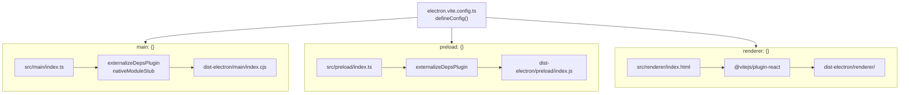
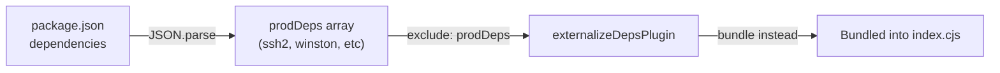
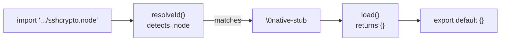
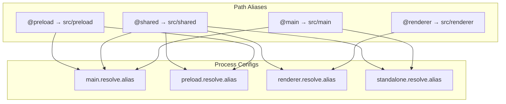

# Electron-Vite Configuration

관련 소스 파일

다음 파일들은 이 위키 페이지를 생성하기 위한 컨텍스트로 사용되었습니다.

- [electron.vite.config.ts](electron.vite.config.ts)
- [src/main/services/infrastructure/NotificationManager.ts](src/main/services/infrastructure/NotificationManager.ts)
- [vite.standalone.config.ts](vite.standalone.config.ts)

## 목적과 범위

이 문서는 `electron-vite`를 사용하는 `claude-devtools`의 build configuration을 설명하며, 세 Electron process(main, preload, renderer)가 어떻게 bundled, compiled, output되는지 다룹니다. 또한 standalone HTTP sidecar server를 위한 특수 configuration도 자세히 설명합니다.

configuration은 주로 [electron.vite.config.ts:1-101]()에 정의되어 있으며 development와 production을 위한 전체 build pipeline을 조율합니다. [vite.standalone.config.ts:1-116]()의 보조 configuration은 non-Electron server build를 처리합니다.

**출처:** [electron.vite.config.ts:1-101](), [vite.standalone.config.ts:1-116]()

---

## Configuration 아키텍처

`electron-vite` build system은 Vite를 확장하여 Electron의 three-process architecture를 처리합니다. 각 process는 서로 다른 target, plugin, output format을 가진 자체 격리된 build configuration을 갖습니다.

### Build Process Flow
"Title: Electron-Vite Process Mapping"

**출처:** [electron.vite.config.ts:31-100]()

---

## Main Process Configuration

main process는 Node.js에서 실행되며 Electron의 `asar` packaging과의 호환성을 보장하기 위해 dependency와 native module에 대한 특수 처리가 필요합니다.

### Build Settings

프로젝트의 `package.json`이 `"type": "module"`을 지정하기 때문에 main process configuration은 `.cjs` extension의 CommonJS output format을 사용합니다 [electron.vite.config.ts:53-56]().

| 설정 | 값 | 이유 |
|---------|-------|--------|
| Entry | `src/main/index.ts` | Application lifecycle entry point [electron.vite.config.ts:50]() |
| Output Directory | `dist-electron/main` | preload/renderer와 격리 [electron.vite.config.ts:47]() |
| Format | `cjs` | `__dirname`/`require`를 사용하는 bundled deps에 필요 [electron.vite.config.ts:55]() |
| File Extension | `.cjs` | ESM package context에서 명시적 CJS [electron.vite.config.ts:56]() |

### Dependency Bundling Strategy

main process는 `electron-builder`의 `asar` packaging에서 `pnpm` symlink 문제를 피하기 위해 모든 production dependency를 bundle합니다 [electron.vite.config.ts:7-9]().

"Title: Main Process Dependency Flow"

configuration은 build time에 `package.json`을 읽고 모든 dependency name을 `exclude` property를 통해 `externalizeDepsPlugin`에 전달하여, externalized되는 대신 bundled되도록 강제합니다 [electron.vite.config.ts:10-11](), [electron.vite.config.ts:34-36]().

### Native Module Stubbing

main process는 custom `nativeModuleStub` plugin을 사용해 `.node` addon import를 empty module로 대체합니다 [electron.vite.config.ts:13-16](). 이는 `ssh2`와 `cpu-features` 같은 package가 bundled될 수 없지만 pure JS fallback을 제공하는 optional native binding을 사용하기 때문에 필요합니다 [electron.vite.config.ts:14-15]().

"Title: Native Module Stubbing Logic"

**출처:** [electron.vite.config.ts:7-29](), [electron.vite.config.ts:32-60]()

---

## Preload Process Configuration

preload script는 보안 격리 상태에서 main process와 renderer process를 연결합니다.

### Build Settings

| 설정 | 값 | 참고 |
|---------|-------|-------|
| Entry | `src/preload/index.ts` | Context bridge setup [electron.vite.config.ts:74]() |
| Output Directory | `dist-electron/preload` | main/renderer와 분리 [electron.vite.config.ts:71]() |
| Format | `cjs` | Electron의 preload context에 필요 [electron.vite.config.ts:77]() |
| File Extension | `.js` | preload의 표준 extension [electron.vite.config.ts:78]() |

preload는 인자 없이 `externalizeDepsPlugin()`을 사용하며, main process configuration과 달리 모든 dependency를 externalize합니다 [electron.vite.config.ts:62]().

**출처:** [electron.vite.config.ts:61-82]()

---

## Renderer Process Configuration

renderer process는 표준 Vite 기반 React application입니다.

### Build Settings

| 설정 | 값 | 참고 |
|---------|-------|-------|
| Entry | `src/renderer/index.html` | 표준 Vite HTML entry [electron.vite.config.ts:95]() |
| Output Directory | `dist-electron/renderer` | Web assets [electron.vite.config.ts:92]() |
| Format | `es` (default) | Modern browser ESM |

### Plugins

renderer는 JSX transformation을 위해 `@vitejs/plugin-react`를 사용합니다 [electron.vite.config.ts:91](). Chromium context에서 실행되므로 bundling 또는 externalization plugin이 필요하지 않습니다.

**출처:** [electron.vite.config.ts:83-99]()

---

## Standalone Server Configuration

"standalone" mode를 위한 별도 configuration이 있으며, 이는 HTTP sidecar server를 위한 단일 CJS bundle을 생성합니다 [vite.standalone.config.ts:1-6]().

### Stubbing Strategy

standalone server는 Electron main process와 code를 공유하므로, 표준 Node.js 환경에서 사용할 수 없는 Electron-specific module을 stub해야 합니다.

1.  **`electronStub`**: `electron`과 `electron-updater` import를 가로채고, `app`, `BrowserWindow`, `ipcMain`, `Notification`에 대한 no-op function을 제공하는 proxy-based mock으로 대체합니다 [vite.standalone.config.ts:46-75]().
2.  **`nativeModuleStub`**: main process stub과 동일하며 `.node` file을 처리합니다 [vite.standalone.config.ts:28-41]().

### Externalization

Node.js built-in과 bundled될 때 깨지는 특정 package(`fastify` ecosystem 등)는 명시적으로 externalize됩니다 [vite.standalone.config.ts:14-25](), [vite.standalone.config.ts:103-109]().

**출처:** [vite.standalone.config.ts:1-116]()

---

## Path Alias Configuration

모든 process는 codebase 전반에서 깔끔한 import를 유지하기 위해 path alias를 사용합니다.

"Title: Path Alias Mapping"

**출처:** [electron.vite.config.ts:40-44](), [electron.vite.config.ts:64-68](), [electron.vite.config.ts:84-89](), [vite.standalone.config.ts:79-85]()

---

## Build Output Summary

build system은 두 개의 주요 output directory를 생성합니다.

1.  **`dist-electron/`**: packaged Electron application component(main, preload, renderer)를 포함합니다 [electron.vite.config.ts:47,71,92]().
2.  **`dist-standalone/`**: HTTP sidecar server를 위한 single-file `index.cjs` bundle을 포함합니다 [vite.standalone.config.ts:92,101]().

| Process | Output Format | Target |
| :--- | :--- | :--- |
| Main | CJS (`.cjs`) | Node.js (Electron) |
| Preload | CJS (`.js`) | Electron Preload |
| Renderer | ESM | Chromium |
| Standalone | CJS (`.cjs`) | Node.js 20 [vite.standalone.config.ts:93]() |

**출처:** [electron.vite.config.ts:46-99](), [vite.standalone.config.ts:91-102]()
