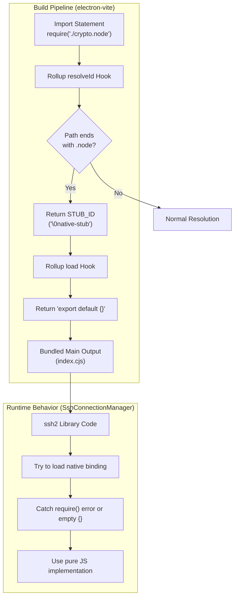
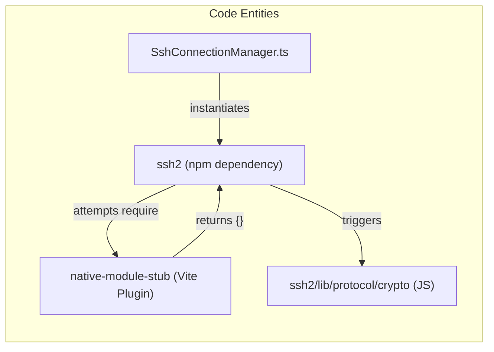

# Native Module Handling

<details>
<summary>관련 소스 파일</summary>

다음 파일들은 이 위키 페이지를 생성하기 위한 컨텍스트로 사용되었습니다.

- [.github/workflows/release.yml](.github/workflows/release.yml)
- [electron.vite.config.ts](electron.vite.config.ts)
- [package.json](package.json)
- [pnpm-lock.yaml](pnpm-lock.yaml)
- [resources/afterInstall.sh](resources/afterInstall.sh)
- [src/main/services/infrastructure/NotificationManager.ts](src/main/services/infrastructure/NotificationManager.ts)
- [src/main/services/infrastructure/SshConnectionManager.ts](src/main/services/infrastructure/SshConnectionManager.ts)

</details>


## 목적과 범위

이 문서는 `claude-devtools`가 build process 중 native Node.js addon(`.node` file)을 처리하는 방식을 설명합니다. native module은 Electron의 `asar` archive format에 bundled될 수 없으므로, build system은 dependency가 optional native binding 대신 pure JavaScript fallback을 사용하도록 강제하는 stubbing strategy를 사용합니다.

일반 build configuration은 [Electron-Vite Configuration](10.1)을 참조하세요. 이러한 native module stub에 의존하는 SSH-specific functionality는 [SSH Connection Manager](5.1)를 참조하세요.

---

## 문제: Electron의 Native Addon

`.node` file로 컴파일된 native Node.js module은 Electron application에서 여러 문제를 일으킵니다.

| 문제 | 설명 |
|-------|-------------|
| **ASAR Incompatibility** | Native `.node` addon은 Electron의 `asar` archive format에서 직접 실행될 수 없습니다 [package.json:126-130](). |
| **Platform-Specific Builds** | native module은 각 target platform과 architecture(예: `arm64` vs `x64`)별로 컴파일되어야 합니다 [package.json:24-28](). |
| **Symlink Resolution** | `electron-builder`가 `asar` archive를 만들 때 `node_modules`의 `pnpm` symlink가 깨질 수 있습니다 [electron.vite.config.ts:7-11](). |
| **Runtime Loading** | `asar`에서 제외하더라도 native module은 runtime에 Node.js loader가 위치를 찾을 수 있도록 특별한 처리가 필요합니다. |

애플리케이션은 SSH connection을 위해 `ssh2` library를 사용하며 [package.json:69](), 여기에는 optional native crypto binding이 포함됩니다. native module의 platform-specific build를 관리하는 대신, build system은 `ssh2`가 pure JavaScript fallback implementation을 사용하도록 강제합니다 [electron.vite.config.ts:13-15]().

**출처:** [package.json:69](), [package.json:126-130](), [electron.vite.config.ts:7-15]()

---

## 해결책: Native Module Stubbing

### 개요

build system은 `.node`로 끝나는 모든 import를 intercept하고 이를 empty module stub으로 대체하는 `nativeModuleStub`이라는 Rollup plugin을 구현합니다 [electron.vite.config.ts:16-29](). 이로 인해 `ssh2`와 `cpu-features` 같은 library는 pure JavaScript implementation으로 graceful fallback합니다.

**Native Module Resolution Flow**


**출처:** [electron.vite.config.ts:16-29](), [src/main/services/infrastructure/SshConnectionManager.ts:18]()

---

## Build Configuration

### nativeModuleStub Plugin

plugin은 virtual module resolution을 처리하기 위해 `electron.vite.config.ts` 안에 정의되어 있습니다.

[electron.vite.config.ts:16-29]()

| Hook | 로직 | 역할 |
|------|-------|------|
| `resolveId` | `source.endsWith('.node')` | module resolution을 intercept하고 virtual ID `\0native-stub`을 반환 |
| `load` | `id === STUB_ID` | module contents를 제공하고 `export default {}`를 반환 |

`\0` prefix는 physical file system에 존재하지 않는 virtual module을 위한 Rollup convention입니다.

**출처:** [electron.vite.config.ts:16-29]()

---

### Main Process Configuration

plugin은 `main` process build configuration에 적용됩니다.

[electron.vite.config.ts:32-38]()

```typescript
main: {
  plugins: [
    externalizeDepsPlugin({
      exclude: prodDeps // Bundle production dependencies into the output
    }),
    nativeModuleStub()   // Apply the .node stubbing plugin
  ],
  // ...
}
```

**핵심 사항:**
- **Dependency Bundling**: Production dependency는 `asar` packaging 중 `pnpm` symlink 문제를 피하기 위해 main process output에 bundled됩니다 [electron.vite.config.ts:7-11]().
- **Output Format**: `package.json`이 `"type": "module"`을 지정하므로 main process는 `.cjs` extension이 있는 `cjs`(CommonJS) format을 사용합니다 [electron.vite.config.ts:53-57]().
- **Entry Point**: main process entry는 `src/main/index.ts`입니다 [electron.vite.config.ts:50]().

**출처:** [electron.vite.config.ts:7-11](), [electron.vite.config.ts:32-57](), [package.json:3]()

---

## 영향받는 Dependencies

### 주요 대상: ssh2

`ssh2` library는 이 stubbing strategy의 주요 consumer입니다. 이는 remote session access를 위한 SSH와 SFTP capability를 제공합니다 [src/main/services/infrastructure/SshConnectionManager.ts:18]().

**Code Entity Mapping**


| Dependency | Native Component | Fallback Behavior |
|------------|------------------|-------------------|
| `ssh2` [package.json:69]() | `crypto.node` | internal pure JS crypto implementation을 사용합니다 [electron.vite.config.ts:14-15](). |
| `cpu-features` | Native CPU detection | 특정 CPU feature 감지에 graceful fail하고 default를 사용합니다 [electron.vite.config.ts:14-15](). |

**출처:** [package.json:69](), [electron.vite.config.ts:13-15](), [src/main/services/infrastructure/SshConnectionManager.ts:18]()

---

## Fallback Behavior와 성능

### Graceful Degradation

`SshConnectionManager`는 missing native module을 처리하는 `ssh2`의 능력에 의존합니다. `SshConnectionManager.connect()`가 호출되면 underlying `Client`가 crypto를 초기화하려고 시도합니다 [src/main/services/infrastructure/SshConnectionManager.ts:135-144](). `.node` file이 stub에서 empty object를 반환하므로 library는 JS-based protocol implementation으로 전환됩니다.

### 성능 영향

| Operation | JS Fallback의 영향 |
|-----------|-----------------------|
| **SSH Handshake** | 미미함. network latency가 주요 요인입니다. |
| **SFTP File Listing** | 미미함. 작은 metadata transfer가 포함됩니다. |
| **Large File Read** | 보통. JS-based decryption은 native `openssl` binding보다 느립니다. |

Claude session log(일반적으로 작은 JSONL file)를 시각화하는 목적에서는 native module distribution의 복잡성과 비교할 때 이 성능 trade-off가 허용 가능합니다.

**출처:** [src/main/services/infrastructure/SshConnectionManager.ts:135-155](), [electron.vite.config.ts:13-15]()

---

## Packaging과 Distribution

`electron-builder` configuration은 stubbed artifact가 최종 installer에 올바르게 packaged되도록 보장합니다.

[package.json:115-130]()

- **asar**: app을 단일 archive로 package하기 위해 enabled(`true`)입니다 [package.json:126]().
- **npmRebuild**: app이 build phase 중 compilation이 필요한 native module에 의존하지 않기 때문에 disabled(`false`)입니다 [package.json:130]().
- **Main Script**: bundled CommonJS output인 `dist-electron/main/index.cjs`를 가리킵니다 [package.json:19]().

### CI/CD Pipeline
GitHub Actions release workflow는 cross-platform build(`macOS`, `Windows`, `Linux`)를 처리합니다 [ .github/workflows/release.yml:50-221](). native module이 stubbed되므로 build process는 runner 간에 동일하며, C++ addon의 복잡한 cross-compilation이 필요 없습니다.

**출처:** [package.json:19](), [package.json:115-130](), [ .github/workflows/release.yml:50-221]()

---

## 검증

native module이 올바르게 stubbed되는지 확인하려면 build output에서 `.node` reference를 검사할 수 있습니다.

1. `pnpm build`를 실행합니다 [package.json:22]().
2. `dist-electron/main/index.cjs`를 검사합니다.
3. `.node`로 끝나는 string을 검색합니다. file path가 아니라 stubbed virtual module로 resolve되어야 합니다.

또한 application에서 `SshConnectionManager.testConnection()` method를 사용해 실제 SSH handshake를 시도함으로써 JS fallback이 동작하는지 확인할 수 있습니다 [src/main/services/infrastructure/SshConnectionManager.ts:195-225]().

**출처:** [package.json:22](), [src/main/services/infrastructure/SshConnectionManager.ts:195-225]()
