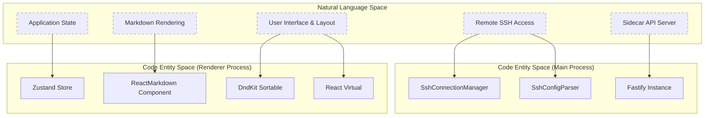
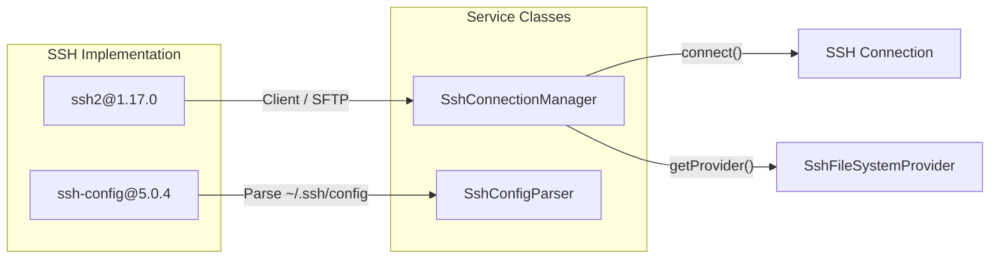

# Dependency Management

<details>
<summary>관련 소스 파일</summary>

다음 파일들은 이 위키 페이지를 생성하기 위한 컨텍스트로 사용되었습니다.

- [.github/workflows/release.yml](.github/workflows/release.yml)
- [CONTRIBUTING.md](CONTRIBUTING.md)
- [package.json](package.json)
- [pnpm-lock.yaml](pnpm-lock.yaml)
- [resources/afterInstall.sh](resources/afterInstall.sh)
- [src/main/services/infrastructure/SshConnectionManager.ts](src/main/services/infrastructure/SshConnectionManager.ts)

</details>


## 목적과 범위

이 페이지는 package manager configuration, 핵심 runtime dependency, development tooling, native module handling을 포함한 `claude-devtools`의 dependency management strategy를 문서화합니다. 프로젝트는 Electron main, preload, renderer process 전반의 모든 dependency를 관리하기 위해 중앙화된 `package.json`을 사용합니다.

---

## Package Manager: pnpm

`claude-devtools`는 **pnpm**(v10.25.0)을 package manager로 사용하며, [package.json:181]()에 pinned version과 integrity hash가 설정되어 있습니다.

**주요 pnpm Configuration:**

- **Strict lockfile**: [pnpm-lock.yaml]() file은 version 9.0을 사용합니다 [pnpm-lock.yaml:1]().
- **Auto-install peers**: 호환되는 peer dependency tree를 보장하기 위해 enabled되어 있습니다 [pnpm-lock.yaml:4]().
- **Workspace support**: single-package repository로 구성되어 있지만, lockfile은 향후 확장을 위해 `importers` structure를 사용합니다 [pnpm-lock.yaml:7-9]().

**출처:** [package.json:181](), [pnpm-lock.yaml:1-9]()

---

## Dependency Categories

### Overview Diagram

다음 다이어그램은 상위 수준 system capability를 이를 구현하는 특정 library와 code entity에 매핑합니다.



**출처:** [package.json:50-72](), [src/main/services/infrastructure/SshConnectionManager.ts:57]()

---

## Core Runtime Dependencies

### UI Framework Stack

| Package | Version | 목적 | 주요 사용처 |
|---------|---------|---------|-----------|
| `react` | ^18.3.1 | UI framework | 모든 renderer component [package.json:63]() |
| `zustand` | ^4.5.0 | State management | Global application state [package.json:71]() |
| `lucide-react` | ^0.562.0 | Icon library | UI iconography [package.json:61]() |
| `@dnd-kit/core` | ^6.3.1 | Drag-and-drop | Tab과 layout management [package.json:51]() |
| `@tanstack/react-virtual`| ^3.10.8 | Virtualization | 큰 session list rendering [package.json:56]() |

**출처:** [package.json:51-71]()

### SSH & Remote Access

SSH implementation은 low-level protocol handling을 위해 `ssh2`에, local configuration parsing을 위해 `ssh-config`에 의존합니다.



**주요 구현 세부 사항:**
- **SshConnectionManager**: `ssh2.Client` lifecycle을 관리하고 system `FileSystemProvider`를 local에서 remote로 전환합니다 [src/main/services/infrastructure/SshConnectionManager.ts:57-79]().
- **ssh-config**: `SshConfigParser`가 host alias와 identity를 resolve하는 데 사용합니다 [src/main/services/infrastructure/SshConnectionManager.ts:109-120]().

**출처:** [package.json:68-69](), [src/main/services/infrastructure/SshConnectionManager.ts:18](), [src/main/services/infrastructure/SshConnectionManager.ts:57-120]()

### Markdown Processing Pipeline

애플리케이션은 표준 `unified` pipeline을 사용해 Claude의 message를 재구성합니다.

| Package | Version | 역할 |
|---------|---------|------|
| `unified` | ^11.0.5 | Core processor [package.json:70]() |
| `remark-parse` | ^11.0.0 | Markdown parser [package.json:67]() |
| `remark-gfm` | ^4.0.1 | GitHub Flavored Markdown support [package.json:66]() |
| `mdast-util-to-hast`| ^13.2.1 | AST transformation [package.json:62]() |
| `react-markdown` | ^10.1.0 | React renderer [package.json:65]() |

**출처:** [package.json:62-70]()

---

## Development & Build Dependencies

### Build Orchestration

프로젝트는 `electron-vite`를 사용해 `main`, `preload`, `renderer`라는 세 개의 별도 target compilation을 조율합니다.

- **electron-vite** (^2.3.0): multi-process build configuration을 처리합니다 [package.json:88]().
- **electron-builder** (^25.1.8): 애플리케이션을 macOS, Windows, Linux용 distributable로 package합니다 [package.json:87]().
- **electron-updater** (^6.7.3): runtime update를 관리합니다 [package.json:58]().

**출처:** [package.json:58](), [package.json:87-88]()

### Quality Control

프로젝트는 여러 devDependency를 통해 엄격한 quality gate를 적용합니다.

- **TypeScript** (^5.9.3): 모든 process 전반의 static type checking에 사용됩니다 [package.json:110]().
- **ESLint** (^9.39.2): security, react, tailwind plugin과 함께 설정되어 있습니다 [package.json:89-101]().
- **Vitest** (^3.1.4): unit test를 위한 primary test runner입니다 [package.json:113]().
- **Knip** (^5.82.1): unused file, dependency, export를 감지합니다 [package.json:104]().

**출처:** [package.json:89-113]()

---

## Native Module Handling

Native module(특히 `ssh2`에 필요한 module)은 Electron environment에서 고유한 문제를 야기합니다.

```mermaid
graph TB
    subgraph "Native Dependency: ssh2"
        JS["JavaScript API"]
        Native["Native Addons (.node)"]
    end
    
    subgraph "Process Availability"
        Main["Main Process"]
        Preload["Preload Script"]
        Renderer["Renderer Process"]
    end
    
    Native -->|"Linked during build"| Main
    Native -.- x|"Stubbed / Blocked"| Preload
    Native -.- x|"Context Isolated"| Renderer
    
    Main -->|"IPC Bridge"| Preload
    Preload -->|"electronAPI"| Renderer
```

**구현 전략:**
- **Build-time**: `electron-builder`는 packaging phase 중 native module의 불필요한 re-compilation을 방지하도록 `npmRebuild: false`로 설정되어 있으며, 대신 `pnpm install` step에 의존합니다 [package.json:130]().
- **Packaging**: `asar` archive가 enabled되어 있지만, 성능 유지를 위해 특정 renderer output은 unpack됩니다 [package.json:126-129]().
- **Runtime**: Native capability는 엄격히 Main process에 한정됩니다. Renderer는 `SshConnectionManager`가 관리하는 IPC bridge를 통해서만 remote file에 접근합니다 [src/main/services/infrastructure/SshConnectionManager.ts:77]().

**출처:** [package.json:126-130](), [src/main/services/infrastructure/SshConnectionManager.ts:18]()

---

## Scripts and Workflow

`package.json`은 dependency와 quality management를 위한 몇 가지 중요한 script를 정의합니다.

| Script | Command | 목적 |
|--------|---------|---------|
| `typecheck` | `tsc --noEmit` | TypeScript integrity를 검증합니다 [package.json:30]() |
| `quality` | `pnpm check && ... && npx knip` | 포괄적인 health check [package.json:37]() |
| `test:coverage` | `vitest run --coverage` | coverage report를 생성합니다 [package.json:44]() |
| `dist` | `electron-builder ...` | production installer를 빌드합니다 [package.json:23]() |

**출처:** [package.json:20-49]()
