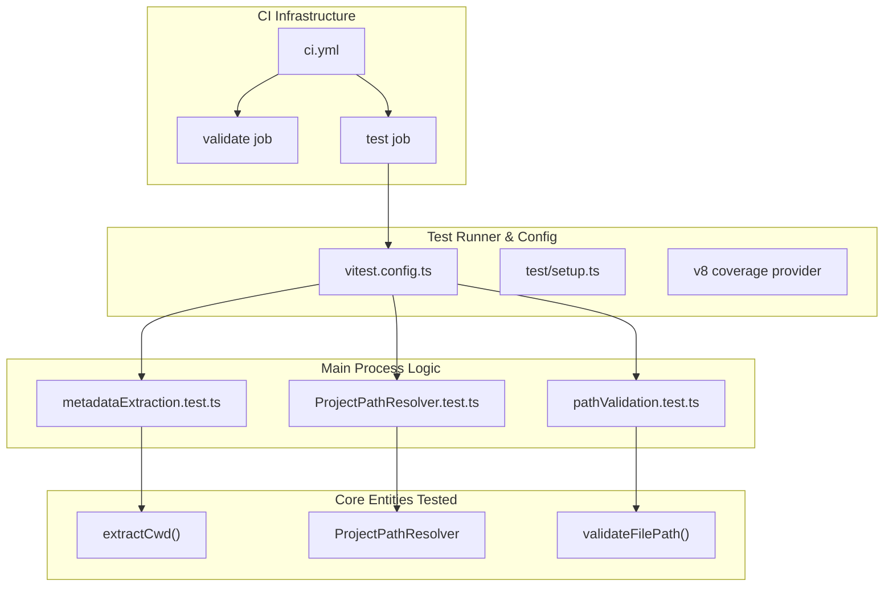
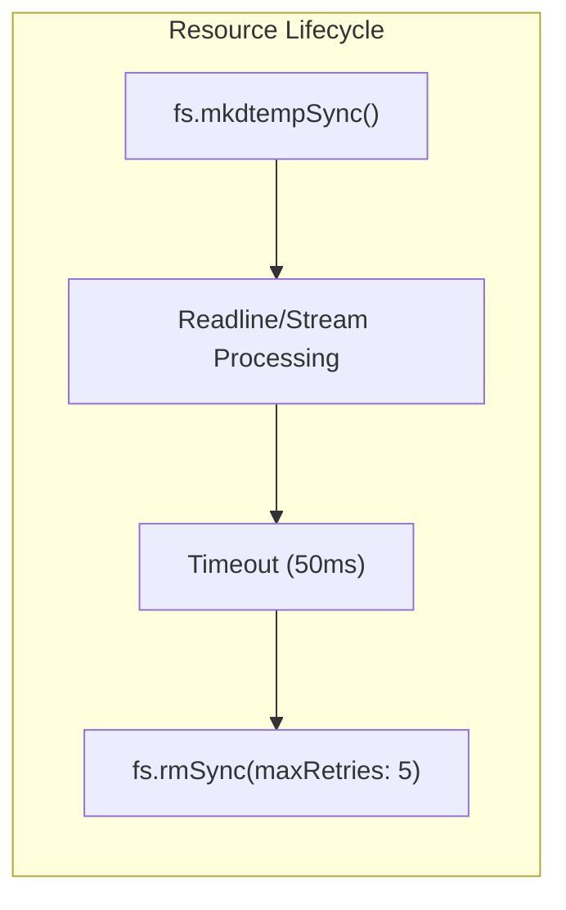

# 테스트

관련 소스 파일

다음 파일들은 이 위키 페이지를 생성하기 위한 컨텍스트로 사용되었습니다.

- [.github/workflows/ci.yml](.github/workflows/ci.yml)
- [src/main/utils/metadataExtraction.ts](src/main/utils/metadataExtraction.ts)
- [src/renderer/components/chat/ChatHistoryLoadingState.tsx](src/renderer/components/chat/ChatHistoryLoadingState.tsx)
- [src/renderer/index.html](src/renderer/index.html)
- [test/main/services/discovery/ProjectPathResolver.test.ts](test/main/services/discovery/ProjectPathResolver.test.ts)
- [test/main/utils/pathValidation.test.ts](test/main/utils/pathValidation.test.ts)
- [vitest.config.ts](vitest.config.ts)

이 페이지는 `claude-devtools`의 testing infrastructure, pattern, execution workflow를 설명합니다. test suite는 여러 platform에서 main process service, utility function, build configuration을 검증합니다.

CI/CD release workflow에 대한 정보는 [CI Pipeline](#11.2)을 참조하세요. unit testing 세부 사항은 [Unit Tests](#11.1)을 참조하세요.

---

## Test Infrastructure 개요

애플리케이션은 **Vitest**를 test runner로 사용하며, GitHub Actions에서 Ubuntu와 Windows 양쪽에서 platform-specific test job을 실행합니다. test는 주로 main process logic과 shared utility에 초점을 맞추며, 필요한 경우 environment simulation을 위해 `happy-dom`을 사용합니다.

다음 다이어그램은 상위 수준 test category를 이를 구동하는 특정 code entity와 configuration에 연결합니다.

### Test System Mapping

**출처:** [vitest.config.ts:1-25](), [.github/workflows/ci.yml:1-83](), [test/main/services/discovery/ProjectPathResolver.test.ts:1-94]()

---

## Unit Test 패턴

Unit test는 `src/` 구조를 반영하여 `test/` directory에 위치합니다. Electron-specific requirement를 처리하기 위해 Vitest의 global API와 custom setup file을 활용합니다.

### Test Environment Configuration
test suite는 15초 timeout으로 설정되어 있으며, shared 또는 renderer-adjacent code를 위한 가벼운 browser-like environment를 제공하기 위해 `happy-dom`을 사용합니다.
- **Globals**: `globals: true`를 통해 enabled됩니다 [vitest.config.ts:6-6]().
- **Environment**: `happy-dom` [vitest.config.ts:7-7]().
- **Setup**: `./test/setup.ts`를 통해 초기화됩니다 [vitest.config.ts:9-9]().

### Path & File System Testing
애플리케이션이 민감한 file path와 Claude Code session data를 관리하므로 path resolution testing은 중요합니다. `ProjectPathResolver` test는 다음을 보장합니다.
1. Absolute `cwd` hint가 우선됩니다 [test/main/services/discovery/ProjectPathResolver.test.ts:34-44]().
2. working directory를 추출하기 위해 session file이 올바르게 parsed됩니다 [test/main/services/discovery/ProjectPathResolver.test.ts:46-61]().
3. Project ID가 fallback으로 decoded됩니다 [test/main/services/discovery/ProjectPathResolver.test.ts:63-71]().

**출처:** [vitest.config.ts:1-25](), [test/main/services/discovery/ProjectPathResolver.test.ts:1-94]()

---

## Mocking과 Resource Management

### File System Resource Handling
test는 file system과 자주 상호작용합니다. cross-platform compatibility(특히 file lock이 엄격한 Windows)를 보장하기 위해 test는 특정 cleanup pattern을 구현합니다.

`ProjectPathResolver.test.ts`에서는 deletion을 시도하기 전에 `readline` interface와 file stream이 handle을 release할 수 있도록 `afterEach`에 명시적 delay가 추가되어 있습니다 [test/main/services/discovery/ProjectPathResolver.test.ts:21-32]().

### Security Validation
`pathValidation.test.ts` suite는 애플리케이션이 `~/.ssh`, `~/.aws`, `.env` file 같은 민감한 directory에 대한 접근을 올바르게 제한하는지 보장합니다 [test/main/utils/pathValidation.test.ts:88-157](). 또한 `..` segment를 사용한 path traversal prevention을 검증합니다 [test/main/utils/pathValidation.test.ts:159-168]().

**출처:** [test/main/services/discovery/ProjectPathResolver.test.ts:21-32](), [test/main/utils/pathValidation.test.ts:88-168]()

---

## CI Pipeline

프로젝트는 GitHub Actions를 사용해 `main`으로의 모든 push와 모든 pull request에서 validation과 testing을 자동화합니다.

### Pipeline Stages
1. **Validate**: Electron-Vite configuration이 유효한지 보장하기 위해 `pnpm typecheck`, `pnpm lint`, 전체 `pnpm build`를 포함한 static analysis를 수행합니다 [.github/workflows/ci.yml:30-56]().
2. **Test**: operating system matrix(`ubuntu-latest`, `windows-latest`) 전반에서 Vitest suite를 실행해 platform-specific pathing 또는 encoding bug를 포착합니다 [.github/workflows/ci.yml:58-83]().

CI에서 사용되는 특정 step과 environment variable에 대한 자세한 내용은 [CI Pipeline](#11.2)을 참조하세요.

**출처:** [.github/workflows/ci.yml:1-83]()

---

## Code Coverage

Coverage는 `v8` provider를 사용해 추적되며, `src/` directory의 모든 `.ts`와 `.tsx` file을 대상으로 합니다.
- **Included**: `src/**/*.ts`, `src/**/*.tsx` [vitest.config.ts:14-14]().
- **Excluded**: Type definition과 전체 Electron runtime 없이는 test하기 어려운 main/preload entry point [vitest.config.ts:15-15]().

**출처:** [vitest.config.ts:11-16]()
