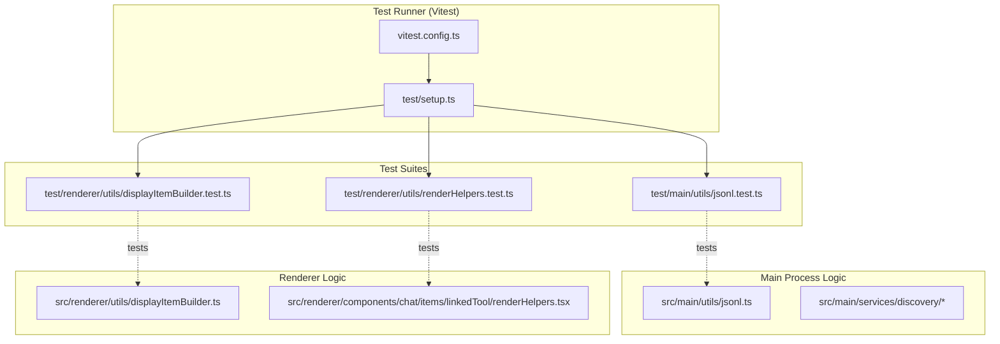
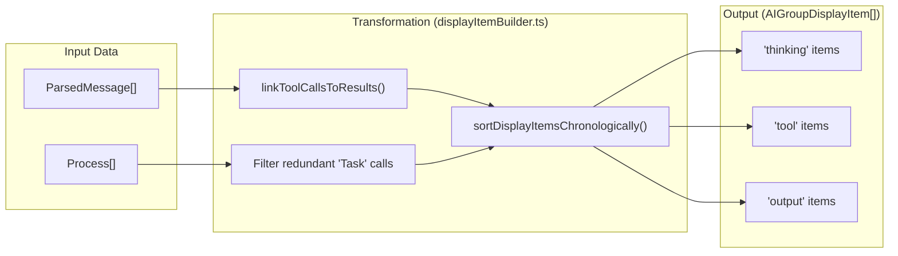

# Unit Tests

<details>
<summary>관련 소스 파일</summary>

다음 파일들은 이 위키 페이지를 생성하기 위한 컨텍스트로 사용되었습니다.

- [src/renderer/components/chat/items/linkedTool/renderHelpers.tsx](src/renderer/components/chat/items/linkedTool/renderHelpers.tsx)
- [src/renderer/utils/displayItemBuilder.ts](src/renderer/utils/displayItemBuilder.ts)
- [test/main/utils/jsonl.test.ts](test/main/utils/jsonl.test.ts)
- [test/renderer/components/renderOutput.test.ts](test/renderer/components/renderOutput.test.ts)
- [test/renderer/utils/displayItemBuilder.test.ts](test/renderer/utils/displayItemBuilder.test.ts)
- [test/renderer/utils/renderHelpers.test.ts](test/renderer/utils/renderHelpers.test.ts)
- [vitest.config.ts](vitest.config.ts)

</details>


## 목적과 범위

이 문서는 `claude-devtools`에서 사용되는 unit testing infrastructure와 pattern을 다룹니다. test framework, Electron API가 mock되는 방식, file system operation을 위한 일반적인 testing pattern, test가 local과 CI에서 실행되는 방식을 설명합니다. test suite는 main process service, shared utility, renderer-side data transformation logic에 초점을 맞춥니다.

---

## Test Framework와 Infrastructure

`claude-devtools`는 **Vitest**를 primary test runner로 사용합니다. infrastructure는 virtual DOM environment를 사용해 Node.js-based logic(Main process)과 DOM-aware logic(Renderer process)을 모두 지원하도록 구성되어 있습니다.

### Test Execution Architecture

다음 다이어그램은 test configuration과 테스트 대상 entity 사이의 관계를 보여줍니다.

**Test Environment to Code Entity Mapping**

**출처:** [vitest.config.ts:1-25](), [test/main/utils/jsonl.test.ts:1-187]()

### 주요 Testing Configuration

| 기능 | Configuration | 목적 |
|---------|---------------|---------|
| **Environment** | `happy-dom` | renderer utility test를 위한 browser-like environment를 제공합니다. |
| **Globals** | `true` | 명시적 import 없이 `describe`, `it`, `expect`를 사용할 수 있게 합니다. |
| **Coverage** | `v8` provider | entry point를 제외하고 `src/**/*.ts`에 대한 report를 생성합니다. |
| **Aliases** | `@shared`, `@main`, `@renderer` | test file에서 깔끔한 import를 위해 source directory를 매핑합니다. |

**출처:** [vitest.config.ts:5-24]()

---

## Mocking Patterns

### Data Factories
깔끔한 test를 유지하기 위해 `ParsedMessage` 같은 mock data structure를 생성하는 "helper" function이 사용됩니다. 이는 required field가 존재하는 한 internal data structure가 커져도 test가 깨지지 않도록 보장합니다.

**Example Factory Pattern:**
```typescript
function createMessage(overrides: Partial<ParsedMessage> = {}): ParsedMessage {
  return {
    uuid: 'test-uuid',
    timestamp: new Date('2024-01-01T10:00:00Z'),
    toolCalls: [],
    toolResults: [],
    // ... defaults
    ...overrides,
  };
}
```
**출처:** [test/main/utils/jsonl.test.ts:10-24](), [test/renderer/utils/displayItemBuilder.test.ts:8-19]()

### File System Isolation
file system과 상호작용하는 test는 side effect를 방지하고 isolation을 보장하기 위해 temporary directory를 활용합니다.

**Temporary Directory Pattern:**
1. `fs.mkdtempSync`와 `os.tmpdir()`을 사용해 고유한 path를 생성합니다.
2. 해당 path 안에서 operation을 수행합니다.
3. `finally` block 또는 `afterEach` hook에서 `recursive: true`와 함께 `fs.rmSync`를 사용해 정리합니다.

**출처:** [test/main/utils/jsonl.test.ts:141-183]()

---

## 일반적인 Test Pattern

### 1. JSONL Metrics Calculation
`calculateMetrics` test는 token usage와 session duration의 수학적 집계를 검증합니다. 여기에는 missing usage data나 single-message session 같은 edge case 처리가 포함됩니다.

| Test Case | Target Logic | Verification |
|-----------|--------------|--------------|
| Token Summation | `calculateMetrics` | `input_tokens`, `output_tokens`, cache token을 합산합니다. |
| Duration | `calculateMetrics` | 가장 이른 timestamp와 가장 늦은 timestamp의 차이를 계산합니다. |
| Metadata Extraction | `analyzeSessionFileMetadata` | branch, count, first message의 single-pass extraction을 검증합니다. |

**출처:** [test/main/utils/jsonl.test.ts:27-137](), [src/main/utils/jsonl.ts:1-484]()

### 2. UI Data Transformation
`buildDisplayItems` test는 raw Claude session message가 UI 친화적인 flat item list로 올바르게 변환되는지 보장합니다.

**Display Item Logic Flow**

**출처:** [src/renderer/utils/displayItemBuilder.ts:94-206](), [test/renderer/utils/displayItemBuilder.test.ts:21-99]()

### 3. Tool Output Formatting
`extractOutputText` utility는 다양한 tool output format(plain text, JSON string, content block array)이 display를 위해 normalize되는지 보장하기 위해 광범위하게 테스트됩니다.

- **Pretty-printing:** raw JSON string이 indentation과 함께 formatting되는지 검증합니다.
- **Content Blocks:** `[{ type: 'text', text: '...' }]` structure에서 text가 추출되는지 보장합니다.
- **Fallback:** image 같은 non-text block이 무시되는 대신 stringified되는지 검증합니다.

**출처:** [src/renderer/components/chat/items/linkedTool/renderHelpers.tsx:131-171](), [test/renderer/utils/renderHelpers.test.ts:6-58]()

---

## Test Execution

### Local Commands
- `pnpm test`: 전체 suite를 실행합니다.
- `pnpm test:coverage`: `text`, `json`, `html` format으로 coverage report를 생성합니다.

**출처:** [vitest.config.ts:11-16]()

### Platform-Specific Considerations
Windows에서 `fs.rmSync`가 포함된 test는 file stream(`analyzeSessionFileMetadata`에서 사용되는 것 등)이 제대로 close되지 않았거나 OS가 handle release에 느린 경우 file locking issue를 만날 수 있습니다. test의 cleanup logic은 이를 완화하기 위해 종종 `maxRetries`와 `retryDelay`를 포함합니다.

**출처:** [test/main/utils/jsonl.test.ts:175-181]()
