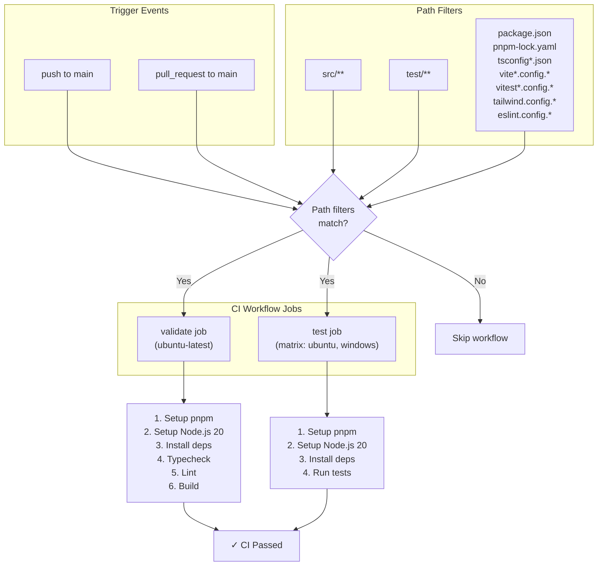
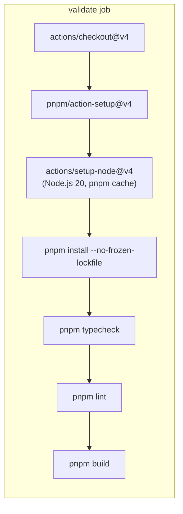
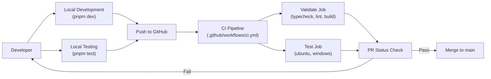

# CI Pipeline

<details>
<summary>관련 소스 파일</summary>

다음 파일들은 이 위키 페이지를 생성하기 위한 컨텍스트로 사용되었습니다.

- [.github/ISSUE_TEMPLATE/bug_report.md](.github/ISSUE_TEMPLATE/bug_report.md)
- [.github/ISSUE_TEMPLATE/feature_request.md](.github/ISSUE_TEMPLATE/feature_request.md)
- [.github/workflows/ci.yml](.github/workflows/ci.yml)
- [src/main/utils/metadataExtraction.ts](src/main/utils/metadataExtraction.ts)
- [src/renderer/components/chat/ChatHistoryLoadingState.tsx](src/renderer/components/chat/ChatHistoryLoadingState.tsx)
- [src/renderer/index.html](src/renderer/index.html)
- [test/main/services/discovery/ProjectPathResolver.test.ts](test/main/services/discovery/ProjectPathResolver.test.ts)
- [test/main/utils/pathValidation.test.ts](test/main/utils/pathValidation.test.ts)

</details>


이 문서는 `claude-devtools`의 code quality를 검증하고 cross-platform compatibility를 보장하는 continuous integration(CI) pipeline을 설명합니다. CI workflow는 main branch에 대한 모든 push와 pull request에서 automated check를 실행합니다.

release pipeline과 multi-platform packaging에 대한 정보는 [12. release-workflow](12.1)를 참조하세요. local development testing은 [11.1 unit-tests](11.1)를 참조하세요.

## 목적과 범위

CI pipeline은 세 가지 주요 기능을 수행합니다.

1.  **Code Quality Validation** - Type checking, linting, successful build verification.
2.  **Cross-Platform Testing** - Ubuntu와 Windows에서 automated test execution.
3.  **Fast Feedback** - release pipeline에 도달하기 전에 issue를 조기에 감지.

workflow는 [.github/workflows/ci.yml:1-83]()에 정의되어 있으며, CI resource usage를 최적화하기 위해 path-based filtering과 함께 병렬로 실행됩니다.

**출처:** [.github/workflows/ci.yml:1-83]()

## Workflow Architecture

CI workflow는 병렬로 실행되는 두 개의 독립적인 job으로 구성됩니다. `validate`는 static analysis와 build verification을 수행하고, `test`는 여러 platform에서 test suite를 실행합니다.

### CI Execution Flow


**출처:** [.github/workflows/ci.yml:3-27](), [.github/workflows/ci.yml:29-83]()

## Trigger Conditions

CI workflow는 불필요한 실행을 피하기 위해 path-based filtering과 함께 두 event type에서 활성화됩니다.

### Event Triggers

| Event Type | Branches | 목적 |
| :--- | :--- | :--- |
| `push` | `main` | merged change 검증 |
| `pull_request` | `main` | pre-merge validation |

**출처:** [.github/workflows/ci.yml:3-5](), [.github/workflows/ci.yml:16-17]()

### Path Filters

workflow는 source code, test, `vite.config.ts` 또는 `eslint.config.js` 같은 configuration file을 포함한 특정 path에 변경이 있을 때만 실행됩니다. 이 filtering은 documentation 또는 관련 없는 GitHub Actions 변경에서 CI가 실행되는 것을 방지합니다.

**출처:** [.github/workflows/ci.yml:6-27]()

## Validate Job

`validate` job은 `ubuntu-latest`에서 실행되며 static analysis와 build verification을 수행합니다. 이 job은 cross-platform testing이 필요하지 않은 issue를 포착합니다.

### Validation Pipeline


### Validation Steps

1.  **Checkout** - `actions/checkout@v4`를 사용해 repository를 가져옵니다.
2.  **Setup pnpm** - `pnpm/action-setup@v4`를 사용해 package manager를 설치합니다.
3.  **Setup Node.js** - pnpm cache가 enabled된 Node.js 20을 설치합니다 [.github/workflows/ci.yml:40-44]().
4.  **Install dependencies** - `pnpm install --no-frozen-lockfile`을 실행합니다 [.github/workflows/ci.yml:47-47]().
5.  **Typecheck** - 모든 process 전반의 TypeScript correctness를 검증하기 위해 `pnpm typecheck`를 실행합니다 [.github/workflows/ci.yml:50-50]().
6.  **Lint** - code style을 강제하기 위해 `pnpm lint`를 실행합니다 [.github/workflows/ci.yml:53-53]().
7.  **Build** - `electron-vite`가 application을 성공적으로 bundle할 수 있는지 검증하기 위해 `pnpm build`를 실행합니다 [.github/workflows/ci.yml:56-56]().

**출처:** [.github/workflows/ci.yml:30-56]()

## Test Job

`test` job은 matrix strategy를 사용해 Ubuntu와 Windows 양쪽에서 실행되어 cross-platform compatibility를 보장합니다. 이는 여러 operating system을 지원해야 하는 Electron application에 중요합니다.

### Matrix Configuration

test job은 GitHub Actions matrix strategy를 사용해 여러 platform에서 test를 실행합니다.

```yaml
strategy:
  fail-fast: false
  matrix:
    os: [ubuntu-latest, windows-latest]
runs-on: ${{ matrix.os }}
```

**주요 configuration:**
*   `fail-fast: false` - 한 platform이 실패해도 양쪽 platform이 모두 완료되어 완전한 failure information을 제공합니다.
*   두 OS variant는 platform-specific issue(예: path separator, file system case sensitivity)를 포착하도록 보장합니다.

**출처:** [.github/workflows/ci.yml:59-63]()

### Test Execution

`pnpm test` command는 다음을 포함하는 Vitest test suite를 실행합니다.
*   `ProjectPathResolver` 같은 main process service의 unit test.
*   path resolution test(cross-platform compatibility에 중요).
*   JSONL parsing과 metadata extraction test [.main/utils/metadataExtraction.ts:1-209]().

test는 Windows file handle delay를 처리하기 위해 platform-specific cleanup logic을 사용합니다. `ProjectPathResolver.test.ts`에서는 directory removal 전에 `readline` stream이 handle을 release할 수 있도록 timeout을 사용합니다 [test/main/services/discovery/ProjectPathResolver.test.ts:21-32]().

**출처:** [.github/workflows/ci.yml:81-82](), [test/main/services/discovery/ProjectPathResolver.test.ts:21-32]()

## Platform-Specific Considerations

### Windows File System Handling

CI pipeline은 Windows-specific behavior를 고려합니다. 예를 들어 metadata extraction에서 `normalizeDriveLetter`를 사용해 CLI(대문자 drive letter)와 VS Code(소문자) 사이의 일관된 path comparison을 보장합니다 [src/main/utils/metadataExtraction.ts:22-27]().

### Path Encoding and Resolution

cross-platform testing은 다음을 처리해야 하는 `ProjectPathResolver`에 필수적입니다.
*   Unix path와 Windows path.
*   WSL mount path translation [src/main/utils/metadataExtraction.ts:64-64]().
*   project location을 resolve하기 위해 session file에서 `cwd` 추출 [test/main/services/discovery/ProjectPathResolver.test.ts:46-61]().

### Security and Validation

CI는 `pathValidation.test.ts`를 통해 path security도 검증하여 application이 민감한 path(`~/.ssh` 또는 `.env` file 등)를 거부하고 여러 OS environment에서 path traversal을 방지하는지 확인합니다 [test/main/utils/pathValidation.test.ts:89-168]().

## Integration with Development Workflow

CI pipeline은 local check에 대한 authoritative validation을 제공하기 위해 development cycle과 통합됩니다.

### CI Integration Model


### Performance Optimization

CI workflow는 여러 optimization을 사용합니다.
1.  **Parallel Job Execution** - `validate`와 `test` job이 동시에 실행됩니다.
2.  **Dependency Caching** - pnpm cache가 installation time을 줄입니다 [.github/workflows/ci.yml:44-44]().
3.  **Non-Frozen Lockfile** - validation 중 minor dependency update를 허용하기 위해 `pnpm install --no-frozen-lockfile`을 실행합니다 [.github/workflows/ci.yml:47-47]().

**출처:** [.github/workflows/ci.yml:40-47](), [.github/workflows/ci.yml:59-63]()
