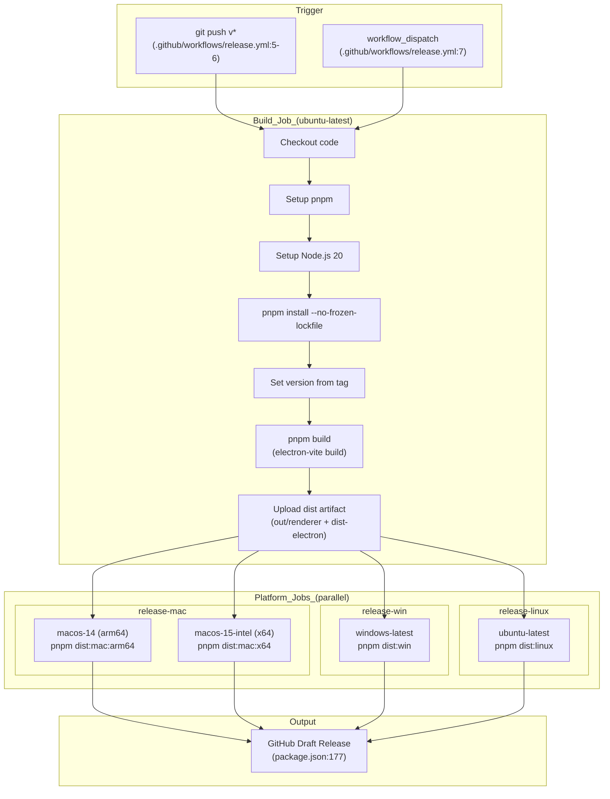

# Release & Distribution

<details>
<summary>관련 소스 파일</summary>

다음 파일들은 이 위키 페이지를 생성하기 위한 컨텍스트로 사용되었습니다.

- [.github/workflows/release.yml](.github/workflows/release.yml)
- [electron.vite.config.ts](electron.vite.config.ts)
- [package.json](package.json)
- [pnpm-lock.yaml](pnpm-lock.yaml)
- [resources/afterInstall.sh](resources/afterInstall.sh)
- [src/main/services/infrastructure/NotificationManager.ts](src/main/services/infrastructure/NotificationManager.ts)
- [src/main/services/infrastructure/SshConnectionManager.ts](src/main/services/infrastructure/SshConnectionManager.ts)

</details>


이 문서는 `claude-devtools`의 release automation, multi-platform packaging, distribution strategy를 설명합니다. GitHub Actions workflow, `electron-builder` configuration, platform-specific build target, artifact generation을 다룹니다.

자세한 GitHub Actions pipeline configuration은 [Release Workflow](#12.1)를 참조하세요. macOS code signing과 notarization 세부 사항은 [Code Signing & Notarization](#12.2)을 참조하세요. auto-update mechanism과 user experience는 [Auto-Updates](#12.3)를 참조하세요.

---

## 개요

release process는 GitHub Actions와 `electron-builder`를 통해 완전히 자동화됩니다. version tag가 push되면(예: `v0.1.0`) workflow가 macOS(arm64와 x64), Windows, Linux용 application을 build 및 package한 다음 GitHub에 draft release로 publish합니다. 시스템은 local development build와 CI-based production release를 모두 지원합니다.

---

## Build Configuration

애플리케이션은 packaging을 위해 **`electron-builder`**를 사용하며, 이는 `package.json`의 `build` field에 설정되어 있습니다 [package.json:115-180](). configuration은 platform-specific target, file inclusion pattern, publishing setting을 지정합니다.

### Core Build Settings

| Property | Value | 목적 |
|----------|-------|---------|
| `appId` | `com.claudecode.context` | macOS bundle identifier [package.json:116]() |
| `productName` | `claude-devtools` | Application display name [package.json:117]() |
| `directories.output` | `release` | Build artifact directory [package.json:119]() |
| `asar` | `true` | source를 ASAR archive로 package [package.json:126]() |
| `npmRebuild` | `false` | native module rebuild 생략(install 중 처리됨) [package.json:130]() |

### File Inclusion

build는 세 가지 주요 output directory를 ASAR archive에 package합니다.
- `out/renderer/**` - React UI bundle(`electron-vite`에서 생성) [package.json:122]()
- `dist-electron/**` - Main과 preload process bundle [package.json:123]()
- `package.json` - Application metadata [package.json:124]()

출처: [package.json:115-133]()

---

## Platform Targets

### Diagram: Platform Build Targets and Outputs

```mermaid
graph TB
    subgraph "Build_Configuration"
        ["package.json:115-180"] -- "build_config" --> BuildConfig["build: { ... }"]
    end
    
    subgraph "macOS_Targets"
        MacConfig["mac: {<br/>category: developer-tools<br/>hardenedRuntime: true<br/>notarize: true<br/>}"]
        DMG["DMG Installer<br/>(signed & notarized)"]
        ZIP["ZIP Archive<br/>(signed & notarized)"]
        MacConfig --> DMG
        MacConfig --> ZIP
    end
    
    subgraph "Windows_Targets"
        WinConfig["win: {<br/>target: nsis<br/>}"]
        NSIS["NSIS Installer<br/>(.exe)"]
        WinConfig --> NSIS
    end
    
    subgraph "Linux_Targets"
        LinuxConfig["linux: {<br/>category: Development<br/>}"]
        AppImage["AppImage<br/>(portable)"]
        DEB["Debian Package<br/>(.deb)"]
        RPM["RPM Package<br/>(.rpm)"]
        Pacman["Pacman Package<br/>(.pacman)"]
        LinuxConfig --> AppImage
        LinuxConfig --> DEB
        LinuxConfig --> RPM
        LinuxConfig --> Pacman
    end
    
    BuildConfig --> MacConfig
    BuildConfig --> WinConfig
    BuildConfig --> LinuxConfig
```

출처: [package.json:134-165]()

---

## Distribution Scripts

`package.json`은 각 platform에서 build와 distribute를 수행하기 위한 npm script를 정의합니다 [package.json:23-28]().

| Script | Command | 목적 |
|--------|---------|---------|
| `dist` | `electron-builder --mac --win --linux` | 모든 platform을 local에서 build [package.json:23]() |
| `dist:mac` | `electron-builder --mac --publish always` | macOS universal build [package.json:24]() |
| `dist:mac:arm64` | `electron-builder --mac --arm64 --publish always` | macOS Apple Silicon [package.json:25]() |
| `dist:mac:x64` | `electron-builder --mac --x64 --publish always` | macOS Intel [package.json:26]() |
| `dist:win` | `electron-builder --win --publish always` | Windows installer [package.json:27]() |
| `dist:linux` | `electron-builder --linux --publish always` | Linux package [package.json:28]() |

`--publish always` flag는 `publish` provider에 지정된 GitHub release로 artifact를 upload합니다 [package.json:174-179]().

출처: [package.json:20-28](), [package.json:174-179]()

---

## Release Workflow Architecture

### Diagram: GitHub Actions Release Pipeline



workflow는 일관성을 보장하기 위해 multi-stage approach를 사용합니다.
1. **Build stage**: platform-agnostic bundle을 생성하기 위해 Ubuntu에서 `pnpm build`(`electron-vite build` [package.json:22]()를 trigger)를 한 번 실행합니다.
2. **Platform stages**: build artifact를 download하고 native runner에서 `electron-builder`를 실행합니다.
3. **Publishing**: 각 platform job은 `GH_TOKEN`을 사용해 artifact를 동일한 draft release에 upload합니다 [.github/workflows/release.yml:107]().

출처: [.github/workflows/release.yml:1-221](), [package.json:20-28]()

---

## Workflow Jobs

### Build Job

초기 build job [.github/workflows/release.yml:13-48]()은 application을 compile합니다.
1. `pnpm install --no-frozen-lockfile`로 dependency를 설치합니다 [.github/workflows/release.yml:30]().
2. Git tag에서 version을 추출하고 [.github/workflows/release.yml:35](), `pnpm pkg set version`으로 `package.json`을 업데이트합니다 [.github/workflows/release.yml:36]().
3. `pnpm build`를 실행합니다 [.github/workflows/release.yml:39]().
4. `out/renderer`와 `dist-electron`을 artifact로 upload합니다 [.github/workflows/release.yml:45-47]().

### Platform-Specific Jobs

각 platform job은 build job 완료에 의존합니다.

**macOS** [.github/workflows/release.yml:50-113]():
- `arm64`와 `x64` architecture에 대해 matrix strategy를 사용합니다 [.github/workflows/release.yml:54-61]().
- `node-gyp` native module compilation을 위해 Python 3.11이 필요합니다 [.github/workflows/release.yml:83-85]().
- code signing secret인 `CSC_LINK`, `CSC_KEY_PASSWORD`, `APPLE_ID`, `APPLE_APP_SPECIFIC_PASSWORD`, `APPLE_TEAM_ID`가 필요합니다 [.github/workflows/release.yml:108-112]().

**Windows** [.github/workflows/release.yml:115-165]():
- `windows-latest`에서 실행됩니다 [.github/workflows/release.yml:117]().
- `pnpm dist:win`을 실행합니다 [.github/workflows/release.yml:165]().

**Linux** [.github/workflows/release.yml:167-221]():
- packaging dependency인 `libarchive-tools`와 `rpm`을 설치합니다 [.github/workflows/release.yml:197]().
- `pnpm dist:linux`를 실행합니다 [.github/workflows/release.yml:220]().

출처: [.github/workflows/release.yml:1-221]()

---

## Version Management

version은 release process 중 동적으로 설정됩니다.
1. 개발자가 tag를 push합니다(예: `v0.1.0`) [.github/workflows/release.yml:6]().
2. workflow가 version string을 추출합니다(예: `0.1.0`) [.github/workflows/release.yml:35]().
3. `pnpm pkg set version="$VERSION"`이 `package.json`의 `version` field를 업데이트합니다 [.github/workflows/release.yml:36]().
4. `electron-builder`가 이 version을 읽어 최종 artifact의 이름을 지정합니다.

출처: [.github/workflows/release.yml:32-36](), [package.json:4]()

---

## Native Module Handling

애플리케이션은 platform-specific compilation이 필요한 native dependency(특히 `ssh2` [package.json:69]())를 포함합니다.

1. **Python Setup**: 모든 platform job은 `node-gyp`를 지원하기 위해 Python 3.11을 설치합니다 [.github/workflows/release.yml:83-85](), [138-140](), [190-192]().
2. **Bundling Logic**: `electron.vite.config.ts`는 `externalizeDepsPlugin`을 사용하지만 production dependency를 제외하여 [electron.vite.config.ts:34-36]() main process output에 bundle합니다.
3. **Native Stubbing**: `nativeModuleStub` plugin [electron.vite.config.ts:16-29]()은 bundling error를 방지하면서 pure JS fallback이 동작할 수 있도록 `.node` addon import를 empty module로 stub 처리합니다.

출처: [electron.vite.config.ts:1-101](), [.github/workflows/release.yml:82-85](), [package.json:69]()

---

## Artifact Outputs

각 platform job은 `release/` directory에 signed/notarized installer를 생성합니다 [package.json:119]().

- **macOS**: `dmg`와 `zip` target [package.json:136-139](). `hardenedRuntime`과 `entitlements`를 포함합니다 [package.json:140-144]().
- **Windows**: `nsis` installer [package.json:152]().
- **Linux**: `AppImage`, `deb`, `rpm`, `pacman` [package.json:158-161]().
- **Linux Post-Install**: `.deb` package에서 `chrome-sandbox` permission을 수정하기 위해 `resources/afterInstall.sh` script가 실행됩니다 [package.json:167](), [resources/afterInstall.sh:1-11]().

출처: [package.json:134-173](), [resources/afterInstall.sh:1-11]()

---

## Auto-Update Integration

애플리케이션은 background update delivery를 위해 `electron-updater` [package.json:58]()를 통합합니다.

- **Provider**: GitHub [package.json:176]().
- **Mechanism**: updater는 GitHub provider를 통해 publish된 새 release를 확인합니다.
- **Renderer UI**: 애플리케이션은 새 version이 있을 때 사용자에게 알리기 위해 `UpdateDialog`([Auto-Updates](#12.3)에서 다룸)를 제공합니다.

출처: [package.json:58](), [package.json:174-179]()
