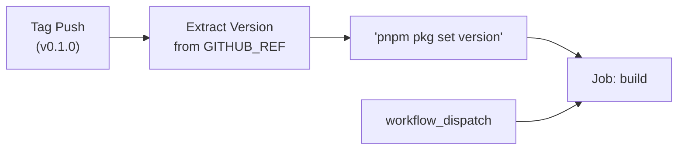
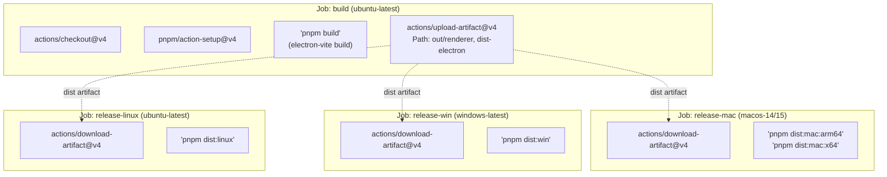

# Release Workflow

<details>
<summary>관련 소스 파일</summary>

다음 파일들은 이 위키 페이지를 생성하기 위한 컨텍스트로 사용되었습니다.

- [.github/workflows/release.yml](.github/workflows/release.yml)
- [electron.vite.config.ts](electron.vite.config.ts)
- [package.json](package.json)
- [pnpm-lock.yaml](pnpm-lock.yaml)
- [resources/afterInstall.sh](resources/afterInstall.sh)
- [src/main/services/infrastructure/NotificationManager.ts](src/main/services/infrastructure/NotificationManager.ts)
- [src/main/services/infrastructure/SshConnectionManager.ts](src/main/services/infrastructure/SshConnectionManager.ts)

</details>


이 페이지는 여러 platform에서 `claude-devtools`의 build, packaging, distribution을 자동화하는 GitHub Actions release pipeline을 문서화합니다. workflow는 `electron-builder`를 사용해 version management, parallel platform build, artifact generation을 처리합니다.

## 개요

release workflow는 [.github/workflows/release.yml:1-221]()에 정의되어 있으며 네 가지 주요 job으로 구성됩니다.
1. **build**: renderer와 main process artifact를 생성하는 공통 build step.
2. **release-mac**: `arm64`와 `x64` architecture 모두에 대한 macOS packaging.
3. **release-win**: Windows packaging(NSIS).
4. **release-linux**: Linux packaging(AppImage, deb, rpm, pacman).

각 platform job은 `build` job에 의존하며, redundant compilation을 최소화하고 platform 간 일관성을 보장하기 위해 shared artifact를 download합니다.

출처: [.github/workflows/release.yml:1-221](), [package.json:23-28]()

## Release Triggers

workflow는 두 가지 mechanism으로 trigger됩니다.

| Trigger Type | 조건 | 사용 사례 |
|-------------|-----------|----------|
| Tag Push | `v*` | version tag(예: `v0.1.0`)가 push될 때 automated release. |
| Manual Dispatch | `workflow_dispatch` | GitHub UI를 통한 manual testing 또는 emergency release. |

version tag로 trigger되면 workflow는 build 전에 version number를 자동으로 추출하고 `package.json`을 업데이트합니다.

### Natural Language to Code: Release Initialization

출처: [.github/workflows/release.yml:3-7](), [.github/workflows/release.yml:32-36]()

## Build Pipeline Architecture

workflow는 **build-once, package-many** architecture를 사용합니다. `build` job은 `electron-vite`를 사용해 application을 bundle하고 결과 directory를 GitHub Action artifact로 upload합니다.

### Natural Language to Code: Pipeline Data Flow

출처: [.github/workflows/release.yml:13-49](), [package.json:21-22]()

### Artifact Contents
`build` job은 다음 directory를 upload합니다.
- `out/renderer`: bundled React frontend.
- `dist-electron`: compiled Main 및 Preload process code(CJS format).

출처: [.github/workflows/release.yml:41-48](), [electron.vite.config.ts:47-59](), [electron.vite.config.ts:71-81]()

## Platform-Specific Packaging

### macOS Builds
macOS job은 Apple Silicon과 Intel architecture 모두를 target으로 하기 위해 matrix strategy를 사용합니다.

| Architecture | Runner | Command |
|--------------|--------|---------|
| `arm64` | `macos-14` | `pnpm dist:mac:arm64` |
| `x64` | `macos-15-intel` | `pnpm dist:mac:x64` |

**Code Signing & Notarization**
macOS build는 `electron-builder`가 app을 sign하고 notarize하기 위한 특정 environment variable을 필요로 합니다.
- `CSC_LINK`: Base64-encoded `.p12` certificate.
- `CSC_KEY_PASSWORD`: certificate password.
- `APPLE_ID`, `APPLE_APP_SPECIFIC_PASSWORD`, `APPLE_TEAM_ID`: Apple notarization service용 credential.

출처: [.github/workflows/release.yml:50-114](), [package.json:134-146]()

### Windows Builds
Windows job은 `windows-latest`에서 실행되며 NSIS installer를 생성합니다. `ssh2` 같은 native dependency가 rebuild를 필요로 할 경우 `node-gyp` 처리를 위해 Python 3.11이 필요합니다.

출처: [.github/workflows/release.yml:115-166](), [package.json:150-155](), [package.json:169-173]()

### Linux Builds
Linux job은 `AppImage`, `deb`, `rpm`, `pacman`이라는 여러 format을 생성합니다. runner에 `libarchive-tools`와 `rpm` system package가 필요합니다.

출처: [.github/workflows/release.yml:167-221](), [package.json:156-165]()

## Build Input Verification

"empty" package를 방지하기 위해 각 platform job은 `electron-builder`를 실행하기 전에 verification step을 수행합니다. 중요한 entry point의 존재를 확인합니다.

```bash
test -f dist-electron/main/index.cjs
test -f dist-electron/preload/index.js
test -f out/renderer/index.html
```

출처: [.github/workflows/release.yml:99-103](), [.github/workflows/release.yml:155-160](), [.github/workflows/release.yml:211-215]()

## Release Artifact Generation

각 platform job의 마지막 step은 `electron-builder`를 trigger하는 `dist` command를 실행하는 것입니다.

| Platform | Script | Config Section |
|----------|--------|----------------|
| Mac | `pnpm dist:mac` | `build.mac` |
| Windows | `pnpm dist:win` | `build.win` |
| Linux | `pnpm dist:linux` | `build.linux` |

**Publishing**
`electron-builder`는 GitHub에 publish하도록 설정되어 있습니다. tag가 push되면 GitHub에 "Draft" release를 만들고 installer, DMG, update manifest(`latest-mac.yml`, `latest.yml`)를 upload합니다.

출처: [package.json:24-28](), [package.json:115-180]()

## Local Build Testing

개발자는 다음 script를 사용해 release process를 local에서 simulate할 수 있습니다.

```bash
# Full build of all processes
pnpm build

# Package for current OS (no upload)
pnpm dist

# Package for specific OS with publish attempt
pnpm dist:mac
pnpm dist:win
pnpm dist:linux
```

출처: [package.json:20-28]()
