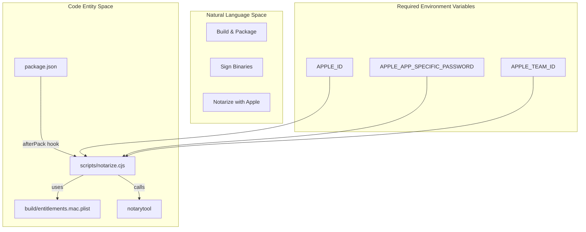
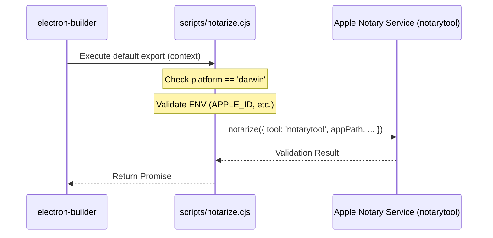
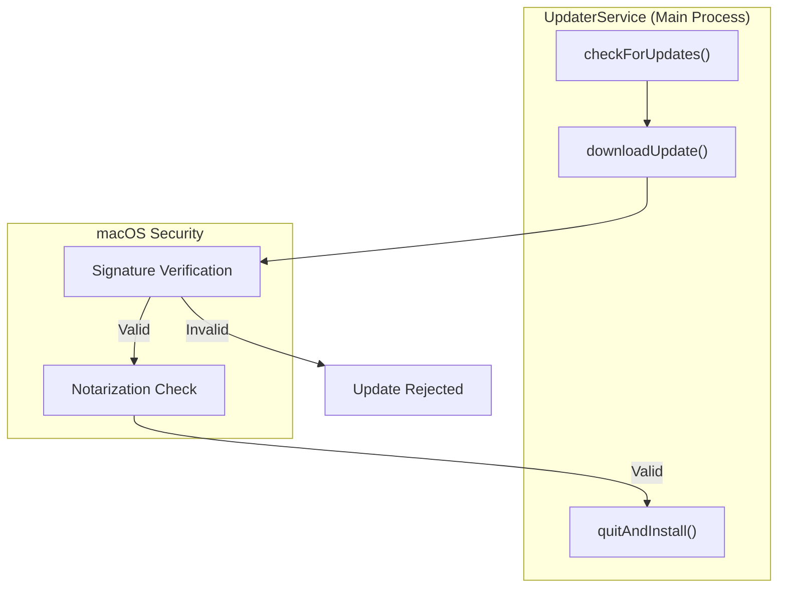

# Code Signing & Notarization

관련 소스 파일

다음 파일들은 이 위키 페이지를 생성하기 위한 컨텍스트로 사용되었습니다.

- [build/entitlements.mac.plist](build/entitlements.mac.plist)
- [resources/entitlements.mac.inherit.plist](resources/entitlements.mac.inherit.plist)
- [resources/entitlements.mac.plist](resources/entitlements.mac.plist)
- [scripts/notarize.cjs](scripts/notarize.cjs)
- [src/main/ipc/updater.ts](src/main/ipc/updater.ts)
- [src/main/services/infrastructure/UpdaterService.ts](src/main/services/infrastructure/UpdaterService.ts)

이 문서는 claude-devtools의 macOS code signing과 notarization process를 다룹니다. code signing은 application의 무결성과 진본성을 보장하며, notarization은 app이 security warning 없이 macOS에서 실행될 수 있도록 하는 Apple의 validation process입니다. 이 페이지는 macOS signing과 notarization configuration, 특수 notarization script, Electron environment에 필요한 entitlement에 중점을 둡니다.

## 개요

macOS는 App Store 외부에서 배포되는 application이 유효한 Developer ID certificate로 **code signed**되고 Apple에서 **notarized**될 것을 요구합니다. 이것이 없으면 사용자는 쉬운 설치를 막는 security warning(Gatekeeper)을 만나게 됩니다.

claude-devtools의 signing과 notarization process는 다음을 포함합니다.

1.  **Code Signing**: Developer ID Application certificate로 모든 executable code에 암호학적으로 서명합니다.
2.  **Hardened Runtime**: runtime code injection을 제한하는 security feature를 활성화합니다.
3.  **Entitlements**: `.plist` file을 통해 필요한 system capability(JIT, unsigned memory)를 선언합니다.
4.  **Notarization**: malware scanning을 위해 `notarytool`을 통해 signed build를 Apple에 제출합니다.
5.  **Stapling**: offline verification을 위해 notarization ticket을 build에 첨부합니다.

**Signing and Notarization Logic Flow**

다음 다이어그램은 build system이 `notarize.cjs`를 사용해 raw source에서 notarized app bundle로 전환되는 방식을 보여줍니다.

출처: [scripts/notarize.cjs:1-22](), [build/entitlements.mac.plist:1-12]()

## Entitlements Configuration

Electron application(V8 JIT를 사용하고 native module을 load할 수 있음)의 기능을 유지하면서 **Hardened Runtime** 요구사항을 충족하려면 특정 entitlement를 부여해야 합니다.

프로젝트는 build stage와 process type에 따라 여러 entitlement profile을 유지합니다.

| File Path | Key Entitlements | 목적 |
|:---|:---|:---|
| `build/entitlements.mac.plist` | `com.apple.security.cs.allow-jit`, `com.apple.security.cs.allow-unsigned-executable-memory`, `com.apple.security.cs.allow-dyld-environment-variables` | JIT와 DYLD override를 허용하는 main build entitlement. |
| `resources/entitlements.mac.plist` | `com.apple.security.cs.allow-jit`, `com.apple.security.cs.allow-unsigned-executable-memory`, `com.apple.security.cs.disable-library-validation` | main process를 위한 production entitlement. |
| `resources/entitlements.mac.inherit.plist` | `com.apple.security.inherit` | child process(예: utility worker)가 parent의 security context를 상속하도록 보장합니다. |

### 주요 Entitlement 설명

*   **`com.apple.security.cs.allow-jit`**: V8 engine이 JavaScript를 효율적으로 실행하는 데 필수적입니다 [build/entitlements.mac.plist:5-6]().
*   **`com.apple.security.cs.allow-unsigned-executable-memory`**: runtime에 code를 생성하는 특정 native module(`ssh2` 또는 SQLite 등)을 load하는 데 필요합니다 [resources/entitlements.mac.plist:7-8]().
*   **`com.apple.security.cs.disable-library-validation`**: 같은 Team ID로 서명되지 않은 framework 또는 plugin을 app이 load할 수 있게 하며, 복잡한 Electron dependency에 종종 필요합니다 [resources/entitlements.mac.plist:9-10]().

출처: [build/entitlements.mac.plist:1-12](), [resources/entitlements.mac.plist:1-12](), [resources/entitlements.mac.inherit.plist:1-14]()

## Notarization Script (`notarize.cjs`)

application은 `scripts/notarize.cjs`에 있는 custom notarization script를 사용합니다. 이 script는 일반적으로 `electron-builder`에 의해 `afterPack` hook으로 호출됩니다.

**구현 세부 사항:**
*   **Platform Check**: platform이 `darwin`이 아니면 script가 즉시 종료됩니다 [scripts/notarize.cjs:5-5]().
*   **Credential Validation**: `APPLE_ID`, `APPLE_APP_SPECIFIC_PASSWORD`, `APPLE_TEAM_ID`의 존재를 확인합니다. 누락된 경우 log message와 함께 notarization을 건너뜁니다 [scripts/notarize.cjs:7-10]().
*   **Tooling**: legacy `altool` 대신 최신 `notarytool`을 사용합니다 [scripts/notarize.cjs:15-15]().
*   **Targeting**: `appBundleId` `com.claudecode.context`를 사용하여 `appOutDir`에 있는 `.app` bundle을 대상으로 합니다 [scripts/notarize.cjs:16-17]().

**Notarization Data Flow**

출처: [scripts/notarize.cjs:1-22]()

## 업데이트와의 관계

올바른 code signing은 **Auto-Update** system의 전제 조건입니다. `UpdaterService`는 `electron-updater`에 의존하며, 이는 installation을 허용하기 전에 downloaded update artifact의 signature를 검증합니다.

*   **Verification**: update가 downloaded되었지만 signature가 현재 실행 중인 application의 signature와 일치하지 않으면 security reason으로 update installation이 실패합니다.
*   **Installation**: `UpdaterService.quitAndInstall()` method는 update process의 마지막 step을 trigger하며, 새 binary가 macOS Gatekeeper check를 통과했다고 가정합니다 [src/main/services/infrastructure/UpdaterService.ts:63-65]().

**Update Verification Sequence**

출처: [src/main/services/infrastructure/UpdaterService.ts:39-65](), [src/main/ipc/updater.ts:31-33]()

## Troubleshooting

### Missing Credentials
build log에 `Skipping notarization: Apple credentials not set`이 표시되면 다음 environment variable이 CI/CD environment 또는 local shell에 export되어 있는지 확인하세요 [scripts/notarize.cjs:7-10]().
*   `APPLE_ID`
*   `APPLE_APP_SPECIFIC_PASSWORD`
*   `APPLE_TEAM_ID`

### Entitlement Conflicts
application이 launch 시 "Code Signature Invalid" 또는 "Trace/BPT trap" error로 crash하면 `resources/entitlements.mac.plist`의 entitlement가 사용 중인 native module의 requirement와 일치하는지 확인하세요 [resources/entitlements.mac.plist:1-12](). 특히 `ssh2` 같은 module을 load하는 경우 `com.apple.security.cs.allow-unsigned-executable-memory`가 `true`로 설정되어 있는지 확인하세요 [resources/entitlements.mac.plist:7-8]().

출처: [scripts/notarize.cjs:7-10](), [resources/entitlements.mac.plist:5-10]()
