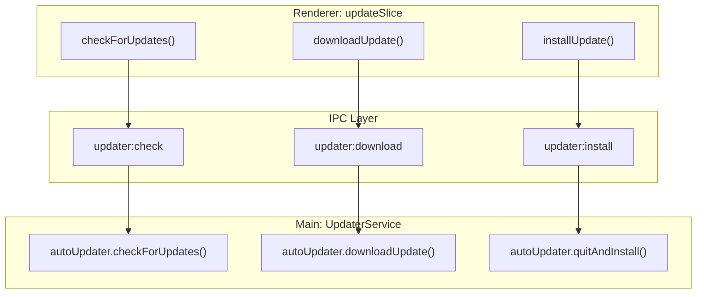
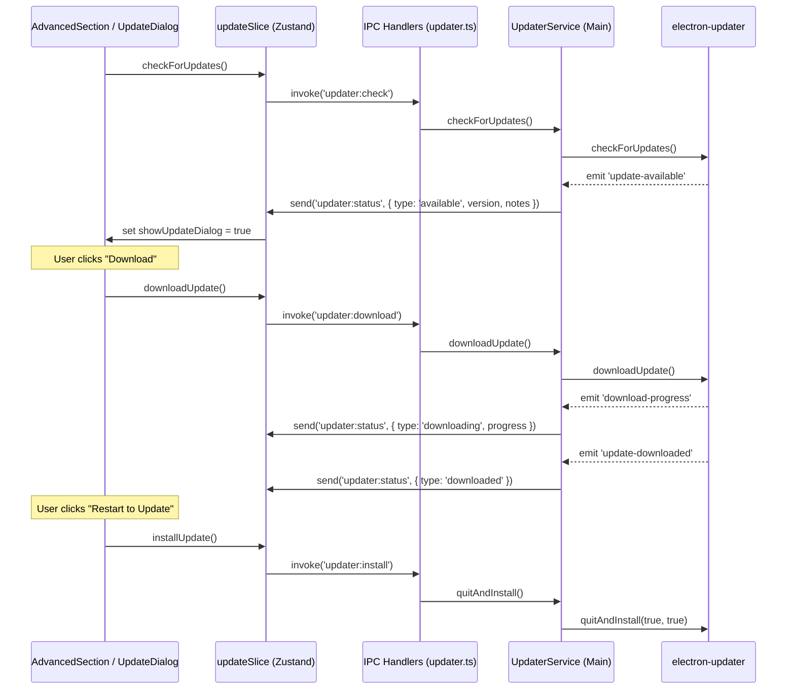

# Auto-Updates

관련 소스 파일

다음 파일들은 이 위키 페이지를 생성하기 위한 컨텍스트로 사용되었습니다.

- [README.md](README.md)
- [build/entitlements.mac.plist](build/entitlements.mac.plist)
- [scripts/notarize.cjs](scripts/notarize.cjs)
- [src/main/ipc/updater.ts](src/main/ipc/updater.ts)
- [src/main/services/infrastructure/UpdaterService.ts](src/main/services/infrastructure/UpdaterService.ts)
- [src/renderer/components/common/UpdateDialog.tsx](src/renderer/components/common/UpdateDialog.tsx)
- [src/renderer/components/settings/sections/AdvancedSection.tsx](src/renderer/components/settings/sections/AdvancedSection.tsx)
- [src/renderer/store/slices/updateSlice.ts](src/renderer/store/slices/updateSlice.ts)

이 페이지는 update detection, download orchestration, version management를 위한 user interface를 처리하는 auto-update system을 문서화합니다. 시스템은 Main process에서 `electron-updater`를 사용해 GitHub Releases를 모니터링하고, Renderer에서 custom React-based UI를 사용해 release notes와 progress를 표시합니다.

---

## 개요

auto-update system은 IPC로 조율되는 Main과 Renderer process 사이의 split architecture를 따릅니다.

1.  **UpdaterService (Main)**: update 확인, download 관리, 최종 installation 처리를 위해 `electron-updater`를 감쌉니다. [src/main/services/infrastructure/UpdaterService.ts:19-121]()
2.  **updateSlice (Renderer)**: 현재 update state(예: `checking`, `available`, `downloading`)를 유지하는 Zustand store slice입니다. [src/renderer/store/slices/updateSlice.ts:17-83]()
3.  **UpdateDialog (Renderer)**: release notes를 렌더링하고 "Download" action을 제공하는 modal component입니다. [src/renderer/components/common/UpdateDialog.tsx:41-181]()
4.  **AdvancedSection (Renderer)**: Settings에 있으며, manual "Check for Updates" 기능과 version information을 제공합니다. [src/renderer/components/settings/sections/AdvancedSection.tsx:22-196]()

---

## Main Process: UpdaterService

`UpdaterService`는 OTA(Over-The-Air) update의 핵심 engine입니다. 사용자 제어를 보장하기 위해 특정 동작으로 `electron-updater`를 설정합니다.

### Configuration과 Lifecycle
service는 app이 새 version을 가져오기 시작하기 전에 사용자가 명시적으로 확인해야 하도록 `autoDownload`를 비활성화합니다 [src/main/services/infrastructure/UpdaterService.ts:23](). 그러나 download가 완료된 후 최종 update step을 간소화하기 위해 `autoInstallOnAppQuit`는 활성화됩니다 [src/main/services/infrastructure/UpdaterService.ts:24]().

### Event Mapping
service는 내부 `electron-updater` event를 통합 `UpdaterStatus` type으로 매핑하고 `updater:status` IPC channel을 통해 Renderer로 전달합니다 [src/main/services/infrastructure/UpdaterService.ts:67-71]().

| electron-updater Event | Renderer로 전송되는 Status | 포함 데이터 |
| :--- | :--- | :--- |
| `checking-for-update` | `checking` | - |
| `update-available` | `available` | `version`, `releaseNotes` |
| `update-not-available`| `not-available` | - |
| `download-progress` | `downloading` | `percent`, `transferred`, `total` |
| `update-downloaded` | `downloaded` | `version` |
| `error` | `error` | `error` (string) |

**출처:** [src/main/services/infrastructure/UpdaterService.ts:73-119]()

---

## Renderer Process: State & UI

### Update State Management
Zustand store의 `updateSlice`는 update lifecycle의 global state를 관리합니다. Main process로 IPC call을 trigger하는 action을 제공합니다.

**출처:** [src/renderer/store/slices/updateSlice.ts:56-74](), [src/main/ipc/updater.ts:30-34]()

### UpdateDialog Component
store의 `updateStatus`가 `available`이 되면 `UpdateDialog`가 trigger됩니다 [src/renderer/components/common/UpdateDialog.tsx:42-43]().

#### Release Notes Normalization
GitHub의 release notes에는 HTML이 포함되는 경우가 많습니다. `normalizeReleaseNotes` function은 Markdown으로 렌더링하기 전에 이 data를 정리합니다.
1.  **Block Conversion**: `
`, ` `, `
` 같은 tag를 newline으로 대체합니다 [src/renderer/components/common/UpdateDialog.tsx:24-29]().
2.  **Entity Decoding**: `DOMParser`를 사용해 HTML entity(예: `&mdash;`)를 decode하고 raw text content를 추출합니다 [src/renderer/components/common/UpdateDialog.tsx:33-35]().
3.  **Markdown Rendering**: 정리된 text를 표시하기 위해 `remarkGfm`과 함께 `ReactMarkdown`을 사용합니다 [src/renderer/components/common/UpdateDialog.tsx:153-155]().

### Settings Integration
`AdvancedSection`은 update를 위한 보조 entry point를 제공합니다. 현재 version(`api.getAppVersion()`으로 가져옴 [src/renderer/components/settings/sections/AdvancedSection.tsx:49]())과 `updateStatus`를 반영하는 dynamic button을 표시합니다 [src/renderer/components/settings/sections/AdvancedSection.tsx:56-90]().

---

## Update Flow Diagram

다음 다이어그램은 detection에서 installation까지의 흐름을 보여주며 UI와 Service entity를 연결합니다.

**출처:** [src/main/services/infrastructure/UpdaterService.ts:73-119](), [src/renderer/store/slices/updateSlice.ts:46-83](), [src/main/ipc/updater.ts:53-75]()

---

## Security & Distribution

### Code Signing & Notarization
macOS에서는 application이 올바르게 signed 및 notarized된 경우에만 update가 허용됩니다.
-   **Entitlements**: app은 Electron runtime을 지원하기 위해 `allow-jit`와 `allow-unsigned-executable-memory`를 요청합니다 [build/entitlements.mac.plist:5-8]().
-   **Notarization**: script(`notarize.cjs`)는 `@electron/notarize`를 사용해 `APPLE_ID`와 `APPLE_TEAM_ID` environment variable로 `.app` bundle을 Apple의 notary service에 제출합니다 [scripts/notarize.cjs:14-21]().

### Manual Installation
auto-updater가 `.dmg`(macOS)와 `.exe`(Windows)를 처리하지만, 다른 platform의 사용자나 manual install을 선호하는 사용자는 GitHub에서 asset을 직접 download할 수 있습니다.
-   **macOS**: `.dmg` (Universal/ARM64/x64) [README.md:78-79]()
-   **Linux**: `.AppImage`, `.deb`, `.rpm`, `.pacman` [README.md:80]()
-   **Windows**: `.exe` installer [README.md:81]()

**출처:** [build/entitlements.mac.plist:1-12](), [scripts/notarize.cjs:1-22](), [README.md:76-83]()
