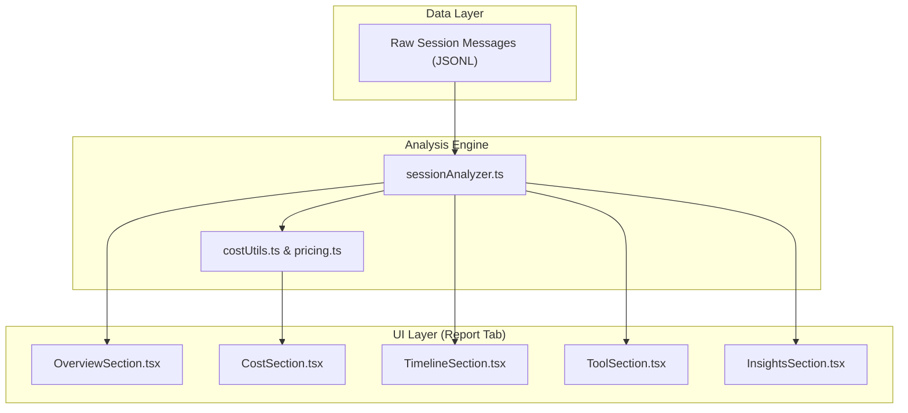

# 세션 분석과 리포팅

관련 소스 파일

다음 파일들은 이 위키 페이지를 생성하기 위한 컨텍스트로 사용되었습니다.

- [CONTRIBUTING.md](CONTRIBUTING.md)

**Session Analysis & Reporting** engine은 `claude-devtools`의 분석 핵심입니다. 원시 Claude Code session log(JSONL)를 구조화된 metric, cost estimate, performance insight로 변환합니다. 애플리케이션은 message-by-message 상세 뷰를 제공하지만, Reporting engine은 이 data를 집계하여 사용자가 session의 전체 lifecycle에 걸친 token consumption, financial cost, agent behavior를 이해할 수 있도록 돕습니다.

### High-Level Architecture

analysis pipeline은 UI에서 session이 선택될 때 시작됩니다. `sessionAnalyzer`는 raw message array를 처리하여 cumulative total을 계산하고 tool execution 또는 subagent spawn 같은 특정 pattern을 식별합니다. 이렇게 분석된 data는 **Report Tab**과 여러 specialized section에서 소비됩니다.

출처: [CONTRIBUTING.md:7-13]()

---

### [Session Analyzer](#13.1)

`sessionAnalyzer`는 data transformation의 무거운 작업을 담당하는 utility입니다. session history를 순회하여 특정 시점의 context window 상태를 재구성합니다. 다음을 추적합니다.
- **Token Deltas**: 각 exchange에서 추가되거나 제거된 token 수.
- **Context Composition**: user input, assistant output, tool result의 비율.
- **Agent Lifecycle**: Claude가 subagent를 spawn하는 시점과 이들이 전체 session에 기여하는 방식을 감지.

analysis logic과 metrics extraction에 대한 자세한 내용은 [Session Analyzer](#13.1)를 참조하세요.

---

### [Cost & Pricing](#13.2)

`claude-devtools`의 주요 목표 중 하나는 Claude Code usage에 대한 financial visibility를 제공하는 것입니다. cost engine은 token count를 특정 Anthropic model pricing tier(예: Claude 3.5 Sonnet)에 매핑합니다.

| Component | Responsibility |
| :--- | :--- |
| **Pricing Data** | input, output, cache hit에 대한 최신 rate를 유지합니다. |
| **Cost Calculator** | analyzer가 생성한 metric에 pricing logic을 적용합니다. |
| **Formatting** | currency conversion과 human-readable token cost display를 처리합니다. |

pricing model과 calculation logic에 대한 자세한 내용은 [Cost & Pricing](#13.2)를 참조하세요.

---

### [Report Sections](#13.3)

UI의 **Report Tab**은 여러 modular component로 구성되며, 각 component는 session의 특정 dimension에 초점을 맞춥니다. 이러한 section은 복잡한 data를 이해하기 쉬운 visualization과 summary로 변환합니다.

- **Overview**: duration, total tokens, primary goal에 대한 high-level summary.
- **Timeline**: activity burst와 idle time의 시각적 표현.
- **Tool Usage**: 어떤 tool(예: `ls`, `grep`, `edit`)이 가장 자주 사용되었는지와 성공률에 대한 통계.
- **Friction & Quality**: Claude가 같은 command를 반복하는 "loops" 또는 token을 낭비한 error를 식별하는 heuristic.
- **Git Insights**: session 중 repository에 이루어진 변경 사항을 요약합니다.

개별 UI component와 해당 specific metric에 대한 자세한 내용은 [Report Sections](#13.3)을 참조하세요.

출처: [CONTRIBUTING.md:11-12]()
