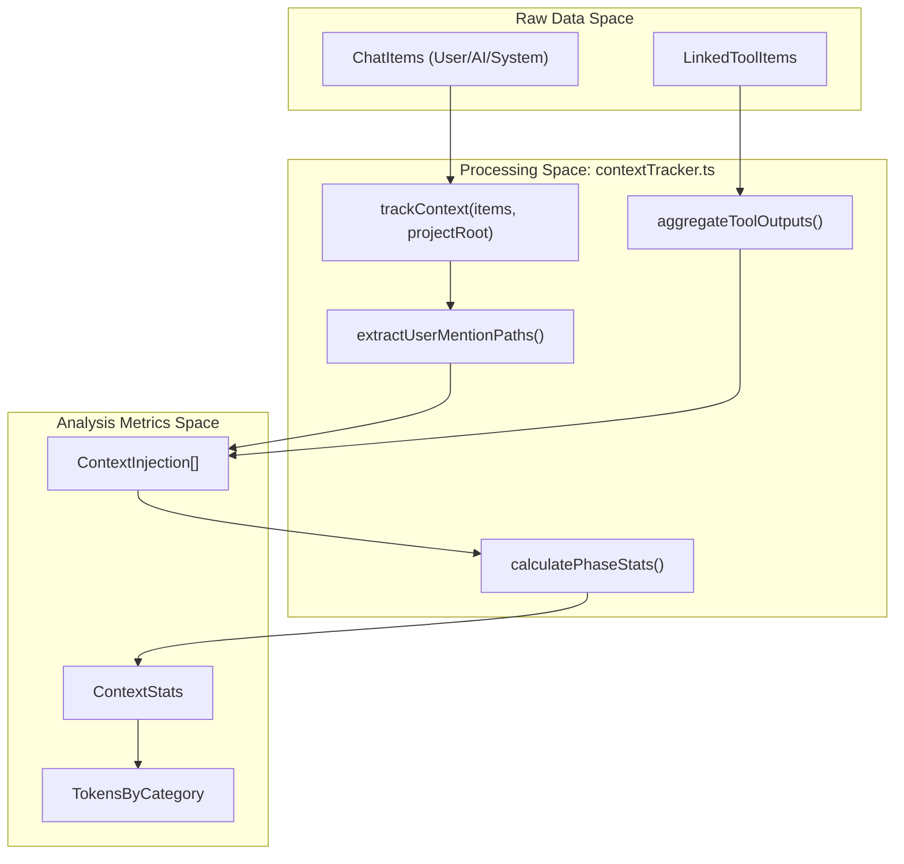

# Session Analyzer

<details>
<summary>관련 소스 파일</summary>

다음 파일들은 이 위키 페이지를 생성하기 위한 컨텍스트로 사용되었습니다.

- [src/renderer/components/chat/ChatHistoryItem.tsx](src/renderer/components/chat/ChatHistoryItem.tsx)
- [src/renderer/components/chat/ContextBadge.tsx](src/renderer/components/chat/ContextBadge.tsx)
- [src/renderer/components/chat/SessionContextPanel/components/FlatInjectionList.tsx](src/renderer/components/chat/SessionContextPanel/components/FlatInjectionList.tsx)
- [src/renderer/types/contextInjection.ts](src/renderer/types/contextInjection.ts)
- [src/renderer/utils/contextTracker.ts](src/renderer/utils/contextTracker.ts)

</details>


**Session Analyzer**는 raw session data(message, tool call, file mention)를 구조화된 metric과 analysis data로 변환하는 핵심 utility입니다. 주로 `contextTracker.ts` utility를 통해 동작하며, token distribution을 계산하고 context injection source를 식별하며 conversation state가 시간에 따라 어떻게 변화하는지 추적합니다.

## 개요

analysis engine은 특정 turn에서 LLM의 context window를 어떤 data가 소비하고 있는지 식별하는 **Context Tracking**에 초점을 맞춥니다. 여기에는 다음이 포함됩니다.
*   **CLAUDE.md files**: 프로젝트별 instruction과 rule.
*   **Mentioned Files**: `@-mentions`를 통해 명시적으로 추가된 file.
*   **Tool Outputs**: `ls`, `grep`, `read_file` 같은 tool에서 반환된 data.
*   **Overhead**: thinking block, task coordination(subagent management), user prompt.

출처: `src/renderer/utils/contextTracker.ts:4-10`(), `src/renderer/types/contextInjection.ts:2-5`()

## Implementation & Data Flow

analysis process는 session이 load되거나 update될 때 trigger됩니다. raw message group을 "Context-Aware" state로 강화하는 pipeline을 따릅니다.

### Analysis Pipeline

다음 다이어그램은 raw chat item이 UI에서 사용되는 `ContextStats`와 `ContextInjection` object로 처리되는 방식을 보여줍니다.

**Data Transformation Flow**

출처: `src/renderer/utils/contextTracker.ts:250-265`(), `src/renderer/utils/contextTracker.ts:184-189`()

### 주요 함수

| Function | File | 설명 |
| :--- | :--- | :--- |
| `trackContext` | `contextTracker.ts` | session analysis의 entry point. 모든 chat group을 순회하여 context injection timeline을 구축합니다. |
| `aggregateToolOutputs` | `contextTracker.ts` | 한 turn의 모든 tool에 대해 `callTokens`, `resultTokens`, `skillInstructionsTokenCount`의 token을 합산합니다. |
| `extractUserMentionPaths` | `claudeMdTracker.ts` | user message에서 `@path/to/file` pattern을 regex 기반으로 감지합니다. |
| `calculatePhaseStats` | `contextTracker.ts` | 특정 "Phase"(conversation의 slice)에 대한 injection을 `ContextStats`로 집계합니다. |

출처: `src/renderer/utils/contextTracker.ts:250-255`(), `src/renderer/utils/contextTracker.ts:184-190`(), `src/renderer/utils/contextTracker.ts:608-615`()

## Context Tracking Logic

analyzer는 "New" context(현재 turn에서 도입됨)와 "Cumulative" context(현재 window에 있는 전체 context)를 구분합니다.

### Token Calculation
Claude session metadata에서 정확한 count가 제공되지 않는 한 token은 `estimateTokens`(대략 `charCount / 4`)를 사용해 추정됩니다.
*   **Mentioned Files**: 대형 file에 대한 비현실적인 추정을 방지하기 위해 `MAX_MENTIONED_FILE_TOKENS`(25,000)로 제한됩니다.
*   **Tool Outputs**: tool call(Claude가 보낸 것)과 result(tool이 반환한 것)를 포함합니다.

출처: `src/renderer/types/contextInjection.ts:17-18`(), `src/renderer/utils/contextTracker.ts:202-208`()

### Task Coordination vs. Tool Outputs
analyzer는 subagent management를 standard tool과 다르게 취급합니다. `TASK_COORDINATION_TOOL_NAMES`에 정의된 tool(예: `SendMessage`, `TeamCreate`, `TaskCreate`)은 general tool metric에서 제외되고 `task-coordination` overhead로 분류됩니다.

출처: `src/renderer/utils/contextTracker.ts:63-72`(), `src/renderer/utils/contextTracker.ts:194-197`()

## UI 컴포넌트로의 변환

분석된 data는 `ContextBadge`와 `FlatInjectionList` component에서 소비되어 사용자에게 "Token Audit"을 제공합니다.

**Context Entity Relationship**
```mermaid
classDiagram
    class "ContextStats" {
        +TokensByCategory totalTokens
        +NewCountsByCategory newCounts
        +ContextInjection[] newInjections
    }
    class "ContextInjection" {
        <<interface>>
        +string id
        +string category
        +number estimatedTokens
    }
    class "ToolOutputInjection" {
        +number turnIndex
        +ToolTokenBreakdown[] toolBreakdown
    }
    class "MentionedFileInjection" {
        +string path
        +boolean exists
    }

    ContextStats o-- ContextInjection
    ContextInjection <|-- ToolOutputInjection
    ContextInjection <|-- MentionedFileInjection
    ContextInjection <|-- "ClaudeMdContextInjection"
    ContextInjection <|-- "ThinkingTextInjection"
```
출처: `src/renderer/types/contextInjection.ts:27-44`(), `src/renderer/types/contextInjection.ts:83-98`(), `src/renderer/types/contextInjection.ts:241-255`()

### Reporting을 위한 Denormalization
"Session Report" tab에서 `FlatInjectionList` component는 nested `ContextInjection` object를 `FlatRow` item list로 평탄화합니다. 이를 통해 UI는 개별 tool call이나 file mention을 token size 내림차순으로 정렬할 수 있어 "context hogs"를 쉽게 식별할 수 있습니다.

출처: `src/renderer/components/chat/SessionContextPanel/components/FlatInjectionList.tsx:58-62`(), `src/renderer/components/chat/SessionContextPanel/components/FlatInjectionList.tsx:159-160`()

## Data Structures

### ContextStats
session의 특정 시점에 대한 analyzer의 primary output입니다.
```typescript
export interface ContextStats {
  totalTokens: TokensByCategory;
  newCounts: NewCountsByCategory;
  newInjections: ContextInjection[];
  compactionDelta?: CompactionTokenDelta;
}
```
출처: `src/renderer/types/contextInjection.ts:241-246`()

### TokensByCategory
context window의 distribution을 추적합니다.
*   `claudeMd`: CLAUDE.md file에서 온 token.
*   `mentionedFiles`: @-mention에서 온 token.
*   `toolOutputs`: standard tool result에서 온 token.
*   `thinkingText`: LLM thinking block과 text response.
*   `taskCoordination`: Subagent/Team overhead.
*   `userMessages`: user 자신의 prompt.

출처: `src/renderer/types/contextInjection.ts:211-218`()
