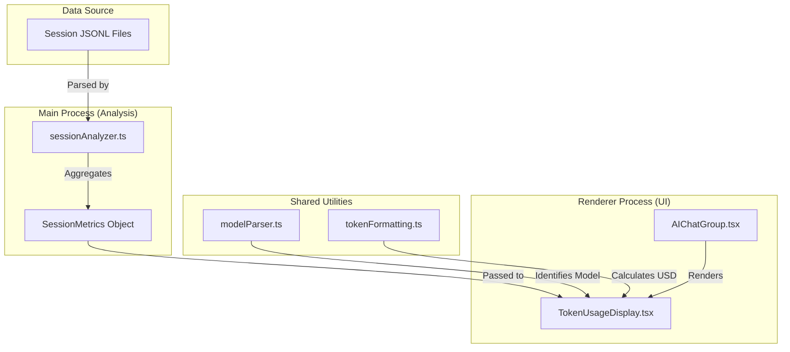
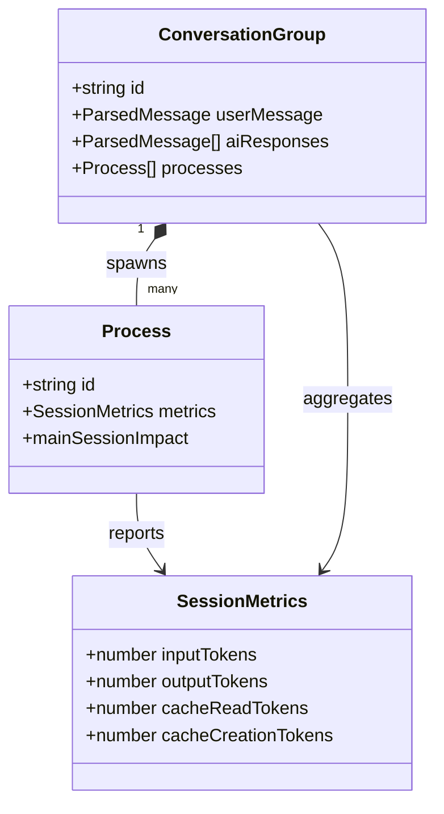

# 비용과 가격 책정

관련 소스 파일

다음 파일들은 이 위키 페이지를 생성하기 위한 컨텍스트로 사용되었습니다.

- [.gitignore](.gitignore)
- [CONTRIBUTING.md](CONTRIBUTING.md)
- [src/main/types/chunks.ts](src/main/types/chunks.ts)
- [src/renderer/components/chat/AIChatGroup.tsx](src/renderer/components/chat/AIChatGroup.tsx)
- [src/renderer/components/common/TokenUsageDisplay.tsx](src/renderer/components/common/TokenUsageDisplay.tsx)

`claude-devtools`의 **Cost & Pricing** system은 Claude Code session의 재정적 영향을 투명하게 보여줍니다. provider-specific pricing model을 사용해 session metadata의 raw token count를 사람이 읽기 쉬운 cost metric으로 변환합니다. 이 기능은 주로 **Session Report** tab과 **TokenUsageDisplay** component에 표시됩니다.

## 개요

Claude Code session은 input(prompt), cache reads, cache writes, output 등 여러 category에서 token을 소비합니다. `claude-devtools`는 다음 방식으로 이러한 token의 cost를 계산합니다.
1.  **Parsing Session Metrics**: session의 JSONL message와 metadata에서 token usage를 추출합니다 [src/main/types/chunks.ts:89-90]().
2.  **Applying Pricing Models**: 사용된 model(예: Claude 3.5 Sonnet)을 기준으로 token count를 USD 값에 매핑합니다 [src/shared/utils/tokenFormatting.ts:1-20]().
3.  **Visualizing Impact**: chat view에서 exchange별 cost를 표시하고 report에서 aggregated session total을 표시합니다 [src/renderer/components/chat/AIChatGroup.tsx:187-188]().

## Core Logic & Data Flow

cost calculation은 raw session data에서 UI component로 이어지는 흐름을 따릅니다.

### Cost Calculation Pipeline

pipeline은 session analysis 중 집계되는 `SessionMetrics`에서 시작합니다.

| Entity | 역할 |
| :--- | :--- |
| `SessionMetrics` | `inputTokens`, `outputTokens`, `cacheReadTokens`, `cacheCreationTokens`를 포함하는 interface [src/main/types/domain.ts:125-132](). |
| `estimateTokens` | 공식 metric이 없을 때 raw string content에서 token count를 추정하는 utility [src/shared/utils/tokenFormatting.ts:9-10](). |
| `formatTokensCompact` | UI display를 위해 큰 token number(예: 1.2k)를 formatting합니다 [src/shared/utils/tokenFormatting.ts:16-16](). |
| `TokenUsageDisplay` | token breakdown과 관련 cost를 시각화하는 renderer component [src/renderer/components/common/TokenUsageDisplay.tsx:25-52](). |

### Cost Data Flow Diagram

이 다이어그램은 token data가 session file에서 analyzer를 거쳐 pricing utility로 흐르는 방식을 보여줍니다.

Title: Token and Cost Data Flow

출처: [src/main/types/chunks.ts:89-90](), [src/renderer/components/common/TokenUsageDisplay.tsx:25-52](), [src/shared/utils/tokenFormatting.ts:9-18]()

## Token & Cost Formatting

애플리케이션은 local session과 remote session 전반에서 일관된 pricing calculation을 보장하기 위해 shared utility set을 사용합니다.

### 주요 Formatting Functions

*   **`formatTokensCompact(count: number)`**: raw integer를 "1.5k" 또는 "2.3M" 같은 사람이 읽기 쉬운 string으로 변환합니다 [src/shared/utils/tokenFormatting.ts:16-16]().
*   **`formatTokensDetailed(count: number)`**: detailed tooltip을 위해 쉼표로 구분된 정확한 number를 반환합니다 [src/renderer/components/common/TokenUsageDisplay.tsx:17-17]().
*   **Cost Calculation**: 현재 codebase는 token count에 초점을 맞추지만, token을 `input`, `output`, `cache_read`, `cache_creation`으로 분류하여 USD calculation을 위한 hook을 제공합니다 [src/renderer/components/common/TokenUsageDisplay.tsx:27-33]().

### Context Breakdown

cost는 단순한 flat rate가 아니라 Claude Code가 context를 관리하는 방식의 영향을 받습니다. `SessionContextSection`은 token이 어디에서 소비되고 있는지 분해합니다.

*   **CLAUDE.md**: project instruction이 소비한 token [src/renderer/components/common/TokenUsageDisplay.tsx:156-166]().
*   **Mentioned Files**: `@`를 통해 context에 명시적으로 추가된 file의 token [src/renderer/components/common/TokenUsageDisplay.tsx:168-179]().
*   **Tool Outputs**: shell command 또는 file read 결과가 소비한 token [src/renderer/components/common/TokenUsageDisplay.tsx:181-190]().
*   **Thinking/Text**: model이 reasoning phase 중 생성한 token [src/renderer/components/common/TokenUsageDisplay.tsx:109-110]().

출처: [src/renderer/components/common/TokenUsageDisplay.tsx:58-120](), [src/shared/utils/tokenFormatting.ts:1-20]()

## Session Report: Cost Section

session report의 Cost section은 전체 session expenditure에 대한 high-level summary를 제공합니다.

### 구현 세부 사항

report는 session 내 모든 `ConversationGroup` object의 `SessionMetrics`를 집계합니다 [src/main/types/chunks.ts:194-210]().

Title: Cost Aggregation Logic

출처: [src/main/types/chunks.ts:26-70](), [src/main/types/chunks.ts:194-210](), [src/main/types/domain.ts:125-132]()

### Subagent Impact

`claude-devtools` pricing의 독특한 측면은 subagent에 대한 `mainSessionImpact` calculation입니다. subagent가 spawn되면 두 방식으로 token을 소비합니다.
1.  **Internal Usage**: subagent가 자체 internal loop에서 사용하는 token [src/main/types/chunks.ts:54-55]().
2.  **Main Session Impact**: `Task` tool call과 그 최종 result가 **parent** session의 context window에서 소비하는 token [src/main/types/chunks.ts:56-63]().

`Process` interface는 subagent가 main conversation flow에 얼마나 "expensive"했는지 완전한 그림을 제공하기 위해 둘 다 추적합니다 [src/main/types/chunks.ts:26-70]().

출처: [src/main/types/chunks.ts:52-63](), [src/main/types/chunks.ts:89-90]()
