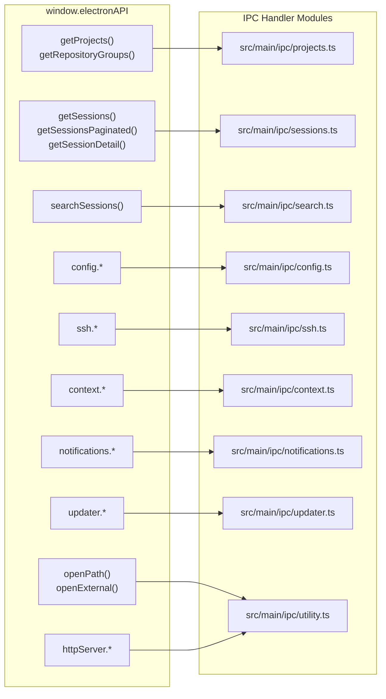
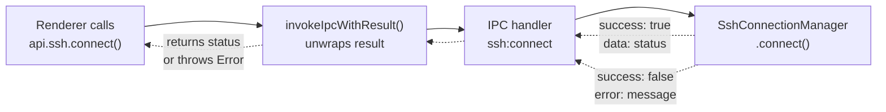
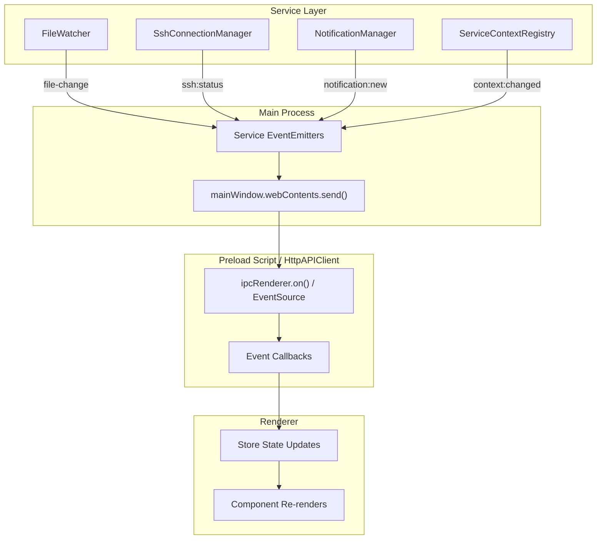
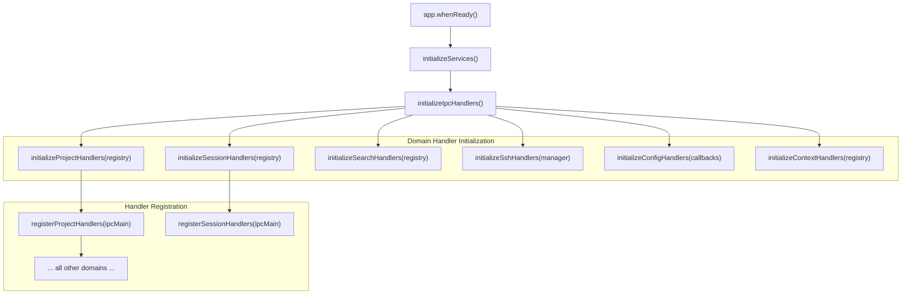
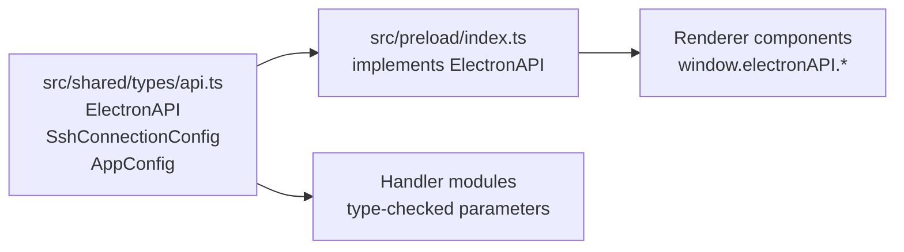

# API Reference

<details>
<summary>관련 소스 파일</summary>

다음 파일들은 이 위키 페이지를 생성하기 위한 컨텍스트로 사용되었습니다.

- [src/main/ipc/context.ts](src/main/ipc/context.ts)
- [src/main/ipc/handlers.ts](src/main/ipc/handlers.ts)
- [src/main/ipc/ssh.ts](src/main/ipc/ssh.ts)
- [src/preload/index.ts](src/preload/index.ts)
- [src/renderer/api/httpClient.ts](src/renderer/api/httpClient.ts)
- [src/renderer/store/slices/connectionSlice.ts](src/renderer/store/slices/connectionSlice.ts)
- [src/shared/types/api.ts](src/shared/types/api.ts)

</details>


이 문서는 claude-devtools가 노출하는 API surface에 대한 포괄적인 개요를 제공합니다. API는 type-safe IPC bridge 또는 선택적 HTTP sidecar server를 통해 renderer process(React UI)와 main process(Node.js services) 사이의 통신을 가능하게 합니다.

**범위**: 이 페이지는 전체 API architecture, domain organization, error handling pattern을 다룹니다. 자세한 method signature와 parameter는 다음을 참조하세요.
- [ElectronAPI Interface](#14.1) — `window.electronAPI` method와 sub-API의 전체 reference
- [IPC Handler Reference](#14.2) — 모든 IPC channel, parameter, return type
- [Service Context API](#14.3) — ServiceContextRegistry, FileSystemProvider, context lifecycle
- [Path Utilities](#14.4) — Path encoding/decoding function과 project ID management

IPC layer가 전체 architecture에 어떻게 들어맞는지는 [IPC Communication Layer](#3.3)를 참조하세요.

---

## API Architecture

API는 type safety를 유지하면서 process isolation을 강제하는 세 개의 distinct layer로 Electron security model을 따릅니다. 또한 `HttpAPIClient`는 browser mode에서 실행될 때 renderer가 표준 HTTP/SSE를 통해 통신할 수 있게 합니다.

### Three-Layer Communication Model

```mermaid
graph TB
    subgraph "Renderer Process (React)"
        ["React Components"]
        ["Zustand Store Actions"]
        ["window.electronAPI"]
    end
    
    subgraph "Preload Script (Security Boundary)"
        ["contextBridge.exposeInMainWorld()"]
        ["invokeIpcWithResult<T>()"]
        ["EventListeners"]
    end
    
    subgraph "Main Process (Node.js)"
        ["ipcMain.handle()"]
        
        subgraph "Handler Modules"
            SSHHandlers["src/main/ipc/ssh.ts"]
            ConfigHandlers["src/main/ipc/config.ts"]
            ContextHandlers["src/main/ipc/context.ts"]
            ProjectHandlers["src/main/ipc/projects.ts"]
            SessionHandlers["src/main/ipc/sessions.ts"]
            NotificationHandlers["src/main/ipc/notifications.ts"]
        end
        
        subgraph "Service Layer"
            SshManager["SshConnectionManager"]
            ConfigManager["ConfigManager"]
            Registry["ServiceContextRegistry"]
            ProjectScanner["ProjectScanner"]
            NotifManager["NotificationManager"]
        end
    end
    
    ["React Components"] --> ["Zustand Store Actions"]
    ["Zustand Store Actions"] --> ["window.electronAPI"]
    ["window.electronAPI"] --> ["contextBridge.exposeInMainWorld()"]
    ["contextBridge.exposeInMainWorld()"] --> ["invokeIpcWithResult<T>()"]
    ["contextBridge.exposeInMainWorld()"] --> ["EventListeners"]
    
    ["invokeIpcWithResult<T>()"] --> ["ipcMain.handle()"]
    ["EventListeners"] -.->|"listen"| ["ipcMain.handle()"]
    
    ["ipcMain.handle()"] --> SSHHandlers
    ["ipcMain.handle()"] --> ConfigHandlers
    ["ipcMain.handle()"] --> ContextHandlers
    ["ipcMain.handle()"] --> ProjectHandlers
    ["ipcMain.handle()"] --> SessionHandlers
    ["ipcMain.handle()"] --> NotificationHandlers
    
    SSHHandlers --> SshManager
    ConfigHandlers --> ConfigManager
    ContextHandlers --> Registry
    ProjectHandlers --> Registry
    SessionHandlers --> Registry
    NotificationHandlers --> NotifManager
```

**출처**: [src/preload/index.ts:1-449](), [src/main/ipc/handlers.ts:1-123](), [src/renderer/api/httpClient.ts:46-175]()

### Security Boundary

preload script는 `contextBridge.exposeInMainWorld()`를 사용해 renderer에 제어된 API surface를 노출합니다. 이를 통해 renderer가 Node.js 또는 Electron API에 직접 접근할 수 없도록 보장합니다.

```typescript
// Preload exposes only specific methods
contextBridge.exposeInMainWorld('electronAPI', electronAPI);
```

**출처**: [src/preload/index.ts:448]()

---

## Domain Organization

API는 functional domain으로 구성되며, 각 domain은 자체 IPC handler module과 `electronAPI` object의 namespace를 갖습니다.

### API Domain Overview



**출처**: [src/main/ipc/handlers.ts:64-101](), [src/shared/types/api.ts:307-408]()

### Domain Summary Table

| Domain | Namespace | 목적 | Handler Module |
|--------|-----------|---------|----------------|
| **Projects** | Top-level methods | Project와 repository listing | `src/main/ipc/projects.ts` |
| **Sessions** | Top-level methods | Session CRUD, pagination, detail views | `src/main/ipc/sessions.ts` |
| **Search** | `searchSessions()` | Cross-session search | `src/main/ipc/search.ts` |
| **Config** | `config.*` | Application settings, trigger, Claude root | `src/main/ipc/config.ts` |
| **SSH** | `ssh.*` | SSH connection lifecycle | `src/main/ipc/ssh.ts` |
| **Context** | `context.*` | Context switching(local/SSH) | `src/main/ipc/context.ts` |
| **Notifications** | `notifications.*` | Error notification CRUD | `src/main/ipc/notifications.ts` |
| **Updater** | `updater.*` | Auto-update check와 download | `src/main/ipc/updater.ts` |
| **Shell** | `openPath()`, `openExternal()` | File system과 URL opening | `src/main/ipc/utility.ts` |
| **HTTP Server** | `httpServer.*` | Sidecar server control | `src/main/ipc/utility.ts` |
| **Window** | `windowControls.*` | Window minimize/maximize/close | `src/main/ipc/window.ts` |

**출처**: [src/preload/index.ts:122-445](), [src/shared/types/api.ts:52-408]()

---

## Error Handling Pattern

모든 IPC handler는 API boundary 전반에서 일관된 error handling을 제공하기 위해 표준화된 `IpcResult<T>` structure를 반환합니다.

### IpcResult<T> Structure

```typescript
interface IpcResult<T> {
  success: boolean;
  data?: T;
  error?: string;
}
```

**출처**: [src/preload/index.ts:85-89]()

### Type-Safe Error Unwrapping

preload script는 `IpcResult<T>` response를 자동으로 unwrap하고 `success: false`일 때 error를 throw하기 위해 `invokeIpcWithResult<T>()`를 제공합니다.

```typescript
async function invokeIpcWithResult<T>(channel: string, ...args: unknown[]): Promise<T> {
  const result = (await ipcRenderer.invoke(channel, ...args)) as IpcResult<T>;
  if (!result.success) {
    throw new Error(result.error ?? 'Unknown error');
  }
  return result.data as T;
}
```

**출처**: [src/preload/index.ts:103-109]()

### Handler Implementation Pattern



**Example handler implementation**:

```typescript
ipcMain.handle(SSH_CONNECT, async (_event, config: SshConnectionConfig) => {
  try {
    await connectionManager.connect(config);
    // ... create SSH context ...
    return { success: true, data: connectionManager.getStatus() };
  } catch (err) {
    const message = err instanceof Error ? err.message : String(err);
    return { success: false, error: message };
  }
});
```

**출처**: [src/main/ipc/ssh.ts:70-116](), [src/preload/index.ts:217-295]()

---

## Event Broadcasting

request-response IPC 외에도 API는 real-time update를 위해 main process에서 renderer로의 one-way event broadcasting을 지원합니다. Electron mode에서는 `ipcRenderer.on`을 사용하고, browser mode에서는 Server-Sent Events(SSE)를 사용합니다.

### Event Flow Architecture



**출처**: [src/main/index.ts:105-139](), [src/preload/index.ts:318-346](), [src/renderer/api/httpClient.ts:61-86]()

### Event Types and Channels

| Event Channel | Payload | Emitted By | 목적 |
|---------------|---------|------------|---------|
| `file-change` | `IpcFileChangePayload` | `FileWatcher` | 새 session file 또는 content update |
| `todo-change` | `IpcFileChangePayload` | `FileWatcher` | Checklist item state change |
| `ssh:status` | `SshConnectionStatus` | `SshConnectionManager` | Connection state change |
| `context:changed` | `ContextInfo` | `ServiceContextRegistry` | Active context switched |
| `notification:new` | `DetectedError` | `NotificationManager` | 새 error notification |
| `notification:updated` | `{ total, unreadCount }` | `NotificationManager` | Notification count 변경 |
| `zoom:changed` | `number` | Main process | Window zoom factor 변경 |

**출처**: [src/preload/index.ts:91-97](), [src/preload/index.ts:318-346](), [src/shared/types/api.ts:68-72]()

---

## Handler Registration Process

IPC handler는 domain logic을 `ipcMain` object에 연결하는 중앙화된 initialization function을 통해 application startup 중 등록됩니다.



**Handler registration code**:

```typescript
export function initializeIpcHandlers(
  registry: ServiceContextRegistry,
  updater: UpdaterService,
  sshManager: SshConnectionManager,
  contextCallbacks: { rewire: (context: ServiceContext) => void; ... }
): void {
  // Initialize domain handlers with dependencies
  initializeProjectHandlers(registry);
  initializeSessionHandlers(registry);
  // ... other domains ...
  
  // Register all handlers on ipcMain
  registerProjectHandlers(ipcMain);
  registerSessionHandlers(ipcMain);
  // ... other domains ...
}
```

**출처**: [src/main/ipc/handlers.ts:64-101](), [src/main/ipc/ssh.ts:55-63](), [src/main/ipc/context.ts:38-44]()

---

## Type Safety Across Boundaries

API는 `src/shared/types/`에 정의된 shared TypeScript type을 사용해 end-to-end type safety를 유지합니다.

### Type Flow Diagram



**주요 type file**:
- `src/shared/types/api.ts` — API interface definition [src/shared/types/api.ts:1-419]()
- `src/shared/types/notifications.ts` — Notification과 config type
- `src/main/types/index.ts` — Main process data structure

---

## Usage Example

### Renderer Component Using the API

```typescript
// SSH connection from renderer store
const connectSsh = async (config: SshConnectionConfig): Promise<void> => {
  set({ connectionState: 'connecting' });
  
  try {
    // Call through electronAPI bridge
    const status = await api.ssh.connect(config);
    
    set({
      connectionMode: status.state === 'connected' ? 'ssh' : 'local',
      connectionState: status.state,
      connectedHost: status.host,
      activeContextId: `ssh-${config.host}`,
    });
  } catch (err) {
    set({
      connectionState: 'error',
      connectionError: err instanceof Error ? err.message : String(err),
    });
  }
};
```

**출처**: [src/renderer/store/slices/connectionSlice.ts:65-129]()

### Event Listener Setup

```typescript
// Initialize event listeners at app startup
useEffect(() => {
  const cleanupFileChange = window.electronAPI.onFileChange((event) => {
    // Handle file change
  });
  
  const cleanupSshStatus = window.electronAPI.ssh.onStatus((_, status) => {
    setConnectionStatus(status.state, status.host, status.error);
  });
  
  return () => {
    cleanupFileChange();
    cleanupSshStatus();
  };
}, []);
```

**출처**: [src/preload/index.ts:318-325](), [src/preload/index.ts:394-405]()

---

## Key File References

### Type Definitions
- [src/shared/types/api.ts:1-419]() — 전체 API type definition
- [src/shared/types/notifications.ts]() — Notification type
- [src/main/types/index.ts]() — Main process data structure

### Preload & Client
- [src/preload/index.ts:122-448]() — ElectronAPI implementation
- [src/renderer/api/httpClient.ts:46-175]() — browser mode를 위한 HTTP-based API client

### IPC Handlers
- [src/main/ipc/handlers.ts:1-123]() — Handler orchestration
- [src/main/ipc/ssh.ts:1-227]() — SSH connection handler
- [src/main/ipc/context.ts:1-97]() — Context switching handler
- [src/main/ipc/projects.ts]() — Project listing handler
- [src/main/ipc/sessions.ts]() — Session CRUD handler
- [src/main/ipc/notifications.ts]() — Notification handler

특정 API method와 parameter에 대한 자세한 문서는 하위 페이지를 참조하세요.
- [ElectronAPI Interface](#14.1) — Method signature와 return type
- [IPC Handler Reference](#14.2) — Channel name과 handler implementation
- [Service Context API](#14.3) — Context management와 file system abstraction
- [Path Utilities](#14.4) — Path encoding/decoding function
