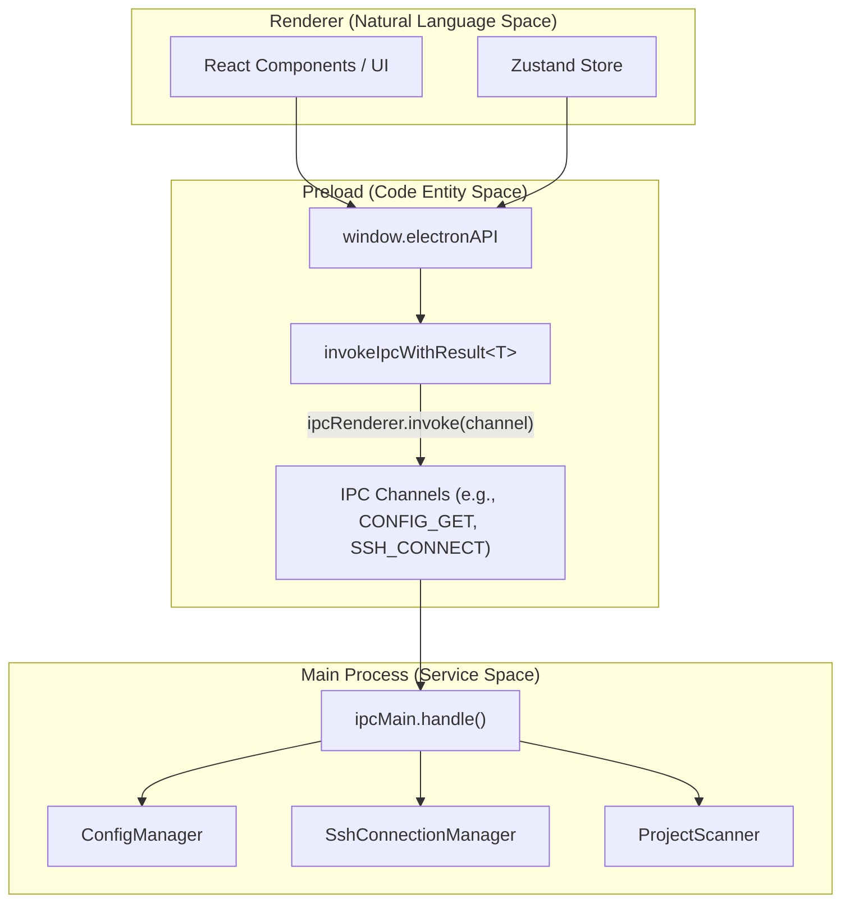
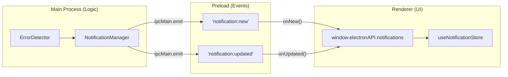

# ElectronAPI Interface

<details>
<summary>관련 소스 파일</summary>

다음 파일들은 이 위키 페이지를 생성하기 위한 컨텍스트로 사용되었습니다.

- [src/preload/index.ts](src/preload/index.ts)
- [src/renderer/api/httpClient.ts](src/renderer/api/httpClient.ts)
- [src/shared/types/api.ts](src/shared/types/api.ts)

</details>


이 페이지는 renderer process에 노출되는 `window.electronAPI` interface의 전체 reference를 제공합니다. 이 API는 React UI와 main process의 Node.js service 사이의 기본 bridge 역할을 하며, Electron의 `contextBridge`를 통해 안전한 inter-process communication을 가능하게 합니다.

main process의 IPC handler implementation에 대한 정보는 [IPC Handler Reference](14.2)를 참조하세요. context management API는 [Service Context API](14.3)를 참조하세요.

## 목적과 아키텍처

`ElectronAPI` interface는 [src/shared/types/api.ts:305-412]()에 정의되어 있고 [src/preload/index.ts:128-449]()에 구현되어 있습니다. Node.js API에 대한 직접 접근을 막아 Electron의 security model을 유지하면서 모든 main process 기능에 type-safe access를 제공합니다.

애플리케이션은 [src/renderer/api/httpClient.ts:46-523]()에 대체 implementation인 `HttpAPIClient`도 제공합니다. 이 class는 동일한 `ElectronAPI` interface를 구현하지만 Electron IPC 대신 `fetch`와 Server-Sent Events(SSE)를 사용하여, 선택적 sidecar server에 연결된 상태에서 UI가 표준 web browser에서 실행될 수 있게 합니다.

API는 여러 sub-namespace로 구성됩니다.
- **Core methods**: Session과 project data retrieval
- **`notifications`**: Error detection과 notification management
- **`config`**: Application settings와 configuration
- **`ssh`**: Remote SSH connection management
- **`context`**: Context switching(local/SSH)
- **`updater`**: Auto-update functionality
- **`session`**: Navigation과 deep linking
- **`windowControls`**: Platform-specific window operation
- **`httpServer`**: Optional HTTP sidecar server control

**출처:** [src/preload/index.ts:1-449](), [src/shared/types/api.ts:1-419](), [src/renderer/api/httpClient.ts:46-75]()

## API Exposure Mechanism

다음 다이어그램은 `ElectronAPI`가 "Natural Language Space"(UI interaction)를 "Code Entity Space"(IPC channel과 service)에 연결하는 방식을 보여줍니다.

### Bridge to Code Entities: IPC Mapping

**출처:** [src/preload/index.ts:128-449](), [src/preload/constants/ipcChannels.ts:1-57]()

## IPC Result Pattern

실패할 수 있는 모든 IPC operation은 일관된 error handling을 위해 `IpcResult<T>` wrapper를 사용합니다. 이 structure는 Node.js main process에서 발생한 error가 catch 가능한 JavaScript error로 React UI에 올바르게 전파되도록 보장합니다.

```typescript
interface IpcResult<T> {
  success: boolean;
  data?: T;
  error?: string;
}
```

preload script의 `invokeIpcWithResult<T>()` helper는 이 structure를 자동으로 unwrap합니다. `success`가 false이면 `error` field에 제공된 string을 사용해 `Error`를 throw하고, 그렇지 않으면 typed `data`를 반환합니다.

**출처:** [src/preload/index.ts:85-109]()

## Core Session and Project Methods

### Session Data Retrieval

| Method | Parameters | Return Type | 설명 |
|--------|-----------|-------------|-------------|
| `getProjects()` | none | `Promise<Project[]>` | 발견된 모든 project 목록 [src/preload/index.ts:130]() |
| `getSessions(projectId)` | `projectId: string` | `Promise<Session[]>` | project의 모든 session 가져오기 [src/preload/index.ts:131]() |
| `getSessionsPaginated(projectId, cursor, limit?, options?)` | `projectId: string`<br/>`cursor: string \| null`<br/>`limit?: number`<br/>`options?: SessionsPaginationOptions` | `Promise<PaginatedSessionsResult>` | cursor-based pagination을 사용하는 paginated session list [src/preload/index.ts:132-137]() |
| `searchSessions(projectId, query, maxResults?)` | `projectId: string`<br/>`query: string`<br/>`maxResults?: number` | `Promise<SearchSessionsResult>` | content로 session 검색 [src/preload/index.ts:138-139]() |
| `searchAllProjects(query, maxResults?)` | `query: string`<br/>`maxResults?: number` | `Promise<SearchSessionsResult>` | Global cross-project search [src/preload/index.ts:140-141]() |
| `getSessionDetail(projectId, sessionId)` | `projectId: string`<br/>`sessionId: string` | `Promise<SessionDetail \| null>` | 전체 session conversation detail [src/preload/index.ts:142-143]() |
| `getSessionMetrics(projectId, sessionId)` | `projectId: string`<br/>`sessionId: string` | `Promise<SessionMetrics \| null>` | Token usage와 timing metric [src/preload/index.ts:144-145]() |
| `getWaterfallData(projectId, sessionId)` | `projectId: string`<br/>`sessionId: string` | `Promise<WaterfallData \| null>` | token usage를 위한 waterfall chart data [src/preload/index.ts:146-147]() |

**출처:** [src/preload/index.ts:128-153](), [src/shared/types/api.ts:307-335]()

### Repository and Worktree Methods

시스템은 project를 underlying repository별로 grouping하여 Git worktree를 지원합니다.

| Method | Parameters | Return Type | 설명 |
|--------|-----------|-------------|-------------|
| `getRepositoryGroups()` | none | `Promise<RepositoryGroup[]>` | worktree support가 포함된 Git repository grouping [src/preload/index.ts:156]() |
| `getWorktreeSessions(worktreeId)` | `worktreeId: string` | `Promise<Session[]>` | 특정 worktree의 session [src/preload/index.ts:157-158]() |

**출처:** [src/preload/index.ts:156-158](), [src/shared/types/api.ts:338-339]()

## Notifications Sub-API

`notifications` sub-API는 error detection notification을 관리하고 IPC event를 통해 real-time update를 제공합니다.

### Bridge to Code Entities: Notification Flow

**출처:** [src/preload/index.ts:179-213](), [src/shared/types/api.ts:61-73]()

### Notifications Methods

| Method | Parameters | Return Type | 설명 |
|--------|-----------|-------------|-------------|
| `notifications.get(options?)` | `{ limit?: number, offset?: number }` | `Promise<NotificationsResult>` | paginated notification 반환 [src/preload/index.ts:180-181]() |
| `notifications.markRead(id)` | `id: string` | `Promise<boolean>` | 단일 notification을 read로 표시 [src/preload/index.ts:182]() |
| `notifications.markAllRead()` | none | `Promise<boolean>` | 모든 notification을 read로 표시 [src/preload/index.ts:183]() |
| `notifications.delete(id)` | `id: string` | `Promise<boolean>` | 단일 notification 삭제 [src/preload/index.ts:184]() |
| `notifications.getUnreadCount()` | none | `Promise<number>` | badge display를 위한 count 가져오기 [src/preload/index.ts:186]() |

**출처:** [src/preload/index.ts:179-213](), [src/shared/types/api.ts:61-73]()

## Config Sub-API

`config` sub-API는 application settings, notification trigger, Claude root detection을 관리합니다.

### Configuration and Trigger Methods

| Method | Parameters | Return Type | 설명 |
|--------|-----------|-------------|-------------|
| `config.get()` | none | `Promise<AppConfig>` | complete configuration object 가져오기 [src/preload/index.ts:217]() |
| `config.update(section, data)` | `section: string`<br/>`data: object` | `Promise<AppConfig>` | 특정 config section 업데이트 [src/preload/index.ts:218]() |
| `config.addTrigger(trigger)` | `trigger: Omit<NotificationTrigger, 'isBuiltin'>` | `Promise<AppConfig>` | custom notification trigger 추가 [src/preload/index.ts:227]() |
| `config.testTrigger(trigger)` | `trigger: NotificationTrigger` | `Promise<TriggerTestResult>` | session에 대해 trigger 테스트 [src/preload/index.ts:232]() |
| `config.getClaudeRootInfo()` | none | `Promise<ClaudeRootInfo>` | resolved Claude root path 가져오기 [src/preload/index.ts:236]() |
| `config.pinSession(projectId, sessionId)` | `projectId: string`<br/>`sessionId: string` | `Promise<void>` | session을 상단에 pin [src/preload/index.ts:241]() |
| `config.hideSession(projectId, sessionId)` | `projectId: string`<br/>`sessionId: string` | `Promise<void>` | list에서 session 숨기기 [src/preload/index.ts:245]() |

**출처:** [src/preload/index.ts:216-295](), [src/shared/types/api.ts:82-119]()

## SSH Sub-API

`ssh` sub-API는 remote SSH connection을 관리합니다. local `~/.ssh/config` file과 통합되어 매끄러운 connection experience를 제공합니다.

| Method | Parameters | Return Type | 설명 |
|--------|-----------|-------------|-------------|
| `ssh.connect(config)` | `config: SshConnectionConfig` | `Promise<SshConnectionStatus>` | SSH connection 수립 [src/preload/index.ts:370]() |
| `ssh.disconnect()` | none | `Promise<SshConnectionStatus>` | active connection 닫기 [src/preload/index.ts:371]() |
| `ssh.getState()` | none | `Promise<SshConnectionStatus>` | 현재 connection state 가져오기 [src/preload/index.ts:372]() |
| `ssh.getConfigHosts()` | none | `Promise<SshConfigHostEntry[]>` | `~/.ssh/config`의 host 목록 [src/preload/index.ts:374]() |
| `ssh.resolveHost(alias)` | `alias: string` | `Promise<SshConfigHostEntry \| null>` | SSH config alias resolve [src/preload/index.ts:375]() |
| `ssh.onStatus(callback)` | `(event, status: SshConnectionStatus) => void` | `() => void` | status change listen [src/preload/index.ts:380-394]() |

**출처:** [src/preload/index.ts:368-406](), [src/shared/types/api.ts:194-277]()

## Context Sub-API

`context` sub-API는 애플리케이션의 execution environment(Local vs. SSH)를 관리합니다.

| Method | Parameters | Return Type | 설명 |
|--------|-----------|-------------|-------------|
| `context.list()` | none | `Promise<ContextInfo[]>` | available context 목록 [src/preload/index.ts:409]() |
| `context.getActive()` | none | `Promise<string>` | active context ID 가져오기 [src/preload/index.ts:410]() |
| `context.switch(contextId)` | `contextId: string` | `Promise<{ contextId: string }>` | context 전환 [src/preload/index.ts:411]() |
| `context.onChanged(callback)` | `(event, data: ContextInfo) => void` | `() => void` | context switch listen [src/preload/index.ts:413-426]() |

**출처:** [src/preload/index.ts:408-431](), [src/shared/types/api.ts:183-192]()

## Real-Time Event Listeners

`ElectronAPI`는 real-time filesystem과 application event를 위한 여러 listener를 제공합니다.

| Method | Callback Signature | 설명 |
|--------|-------------------|-------------|
| `onFileChange(callback)` | `(event: FileChangeEvent) => void` | session file 변경 시 발생 [src/preload/index.ts:304-318]() |
| `onTodoChange(callback)` | `(event: FileChangeEvent) => void` | `TODO.md` 변경 시 발생 [src/preload/index.ts:320-334]() |
| `onZoomFactorChanged(cb)` | `(zoomFactor: number) => void` | window zoom 변경 시 발생 [src/preload/index.ts:342-347]() |

**출처:** [src/preload/index.ts:304-347](), [src/shared/types/api.ts:369-375]()

## Global Type Declaration

`ElectronAPI` interface는 `Window` interface의 declaration merging을 통해 global typing되어 renderer process 전반에서 완전한 TypeScript support를 보장합니다.

```typescript
declare global {
  interface Window {
    electronAPI: ElectronAPI;
  }
}
```

**출처:** [src/shared/types/api.ts:414-418]()
