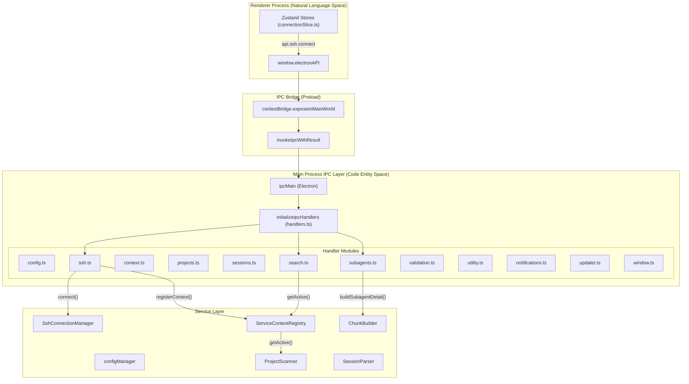
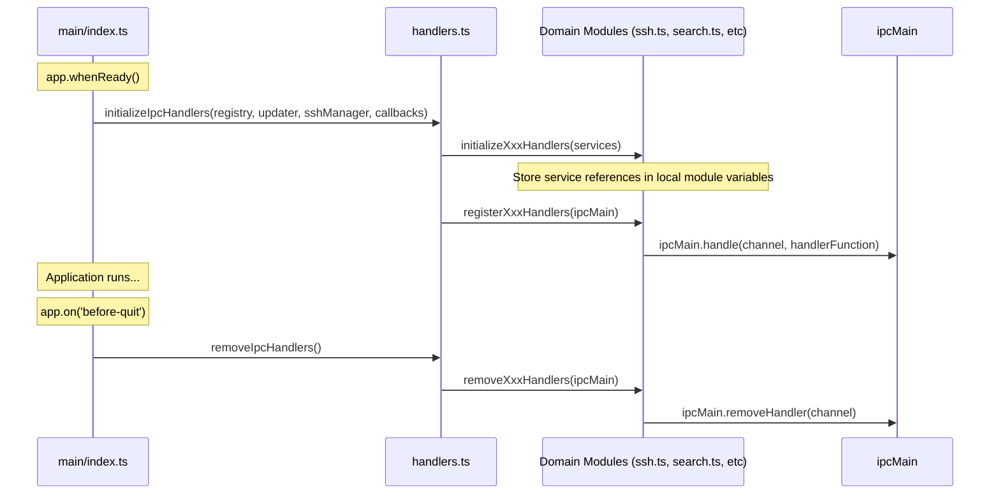

# IPC Handler Reference

관련 소스 파일

다음 파일들은 이 위키 페이지를 생성하기 위한 컨텍스트로 사용되었습니다.

- [src/main/http/search.ts](src/main/http/search.ts)
- [src/main/ipc/context.ts](src/main/ipc/context.ts)
- [src/main/ipc/handlers.ts](src/main/ipc/handlers.ts)
- [src/main/ipc/projects.ts](src/main/ipc/projects.ts)
- [src/main/ipc/search.ts](src/main/ipc/search.ts)
- [src/main/ipc/ssh.ts](src/main/ipc/ssh.ts)
- [src/main/ipc/subagents.ts](src/main/ipc/subagents.ts)
- [src/main/services/analysis/ChunkBuilder.ts](src/main/services/analysis/ChunkBuilder.ts)
- [src/main/services/analysis/SubagentDetailBuilder.ts](src/main/services/analysis/SubagentDetailBuilder.ts)
- [src/renderer/store/slices/connectionSlice.ts](src/renderer/store/slices/connectionSlice.ts)
- [src/renderer/utils/keyboardUtils.ts](src/renderer/utils/keyboardUtils.ts)
- [test/main/ipc/globalSearch.test.ts](test/main/ipc/globalSearch.test.ts)
- [test/renderer/utils/keyboardUtils.test.ts](test/renderer/utils/keyboardUtils.test.ts)

이 페이지는 main process에 등록된 모든 IPC channel, parameter, return type을 문서화합니다. 이러한 handler를 호출하는 renderer-side API는 [ElectronAPI Interface]()를 참조하세요. handler가 위임하는 service layer는 [Service Context API]()를 참조하세요.

---

## 개요

IPC handler는 `src/main/ipc/` 아래의 **domain module**로 구성되며, 각 module은 특정 기능 영역을 담당합니다. `handlers.ts` orchestrator는 application startup 시 모든 handler를 초기화하고 등록합니다. [src/main/ipc/handlers.ts:1-14]()

모든 handler는 일관된 pattern을 따릅니다.
- `ipcMain.handle(channelName, handlerFunction)`을 통해 등록됩니다 [src/main/ipc/handlers.ts:87-98]()
- `IpcResult<T>` object를 반환합니다: `{ success: boolean; data?: T; error?: string }` [src/main/ipc/ssh.ts:110-114]()
- 처리 전에 input parameter를 검증합니다 [src/main/ipc/subagents.ts:62-75]()
- business logic은 service layer에 위임합니다 [src/main/ipc/search.ts:75-79]()
- error를 graceful하게 처리하고 설명적인 error message를 반환합니다 [src/main/ipc/ssh.ts:111-114]()

**출처:** [src/main/ipc/handlers.ts:1-123]()

---

## Handler Architecture

다음 다이어그램은 handler module이 IPC channel을 main process service에 연결하는 방식을 보여줍니다.

### IPC Data Flow and Entity Mapping

**주요 컴포넌트:**
- **Handler Modules**: 기능별로 구성된 domain-specific IPC handler입니다. [src/main/ipc/handlers.ts:1-14]()
- **ServiceContextRegistry**: active context의 service(ProjectScanner, SessionParser 등)에 접근할 수 있게 합니다. [src/main/ipc/handlers.ts:65]()
- **Singleton Services**: `SshConnectionManager` 또는 `UpdaterService`처럼 특정 context에 묶이지 않는 global service입니다. [src/main/ipc/handlers.ts:66-67]()

**출처:** [src/main/ipc/handlers.ts:14-102](), [src/main/ipc/ssh.ts:41-43](), [src/main/ipc/subagents.ts:19-21]()

---

## Handler Registration Lifecycle

handler는 application initialization 중 등록되고 shutdown 시 제거됩니다.

### Registration Sequence

**초기화 단계:**

1. **Initialize** - domain module은 service instance를 받아 module-level variable(예: `let registry: ServiceContextRegistry`)에 저장합니다. [src/main/ipc/ssh.ts:41-43](), [src/main/ipc/subagents.ts:25-27]()
2. **Register** - 각 module은 `ipcMain.handle()`로 handler를 등록합니다. [src/main/ipc/ssh.ts:69-70](), [src/main/ipc/search.ts:32-35]()
3. **Cleanup** - shutdown 시 모든 handler가 `ipcMain.removeHandler()`로 명시적으로 제거됩니다. [src/main/ipc/handlers.ts:107-122](), [src/main/ipc/context.ts:92-96]()

**출처:** [src/main/ipc/handlers.ts:64-122](), [src/main/ipc/ssh.ts:41-63](), [src/main/ipc/context.ts:38-44]()

---

## Common Patterns

### IpcResult Type
모든 handler는 일관된 result wrapper를 반환합니다(종종 domain type에 정의되거나 추론됨).
- **Success**: `{ success: true, data: resultData }` [src/main/ipc/ssh.ts:110]()
- **Failure**: `{ success: false, error: "Error message" }` [src/main/ipc/ssh.ts:114]()

### Error Handling Pattern
모든 handler는 main process crash를 방지하고 renderer에 feedback을 제공하기 위해 operation을 try-catch block으로 감쌉니다. [src/main/ipc/search.ts:63-85](), [src/main/ipc/subagents.ts:61-121]()

### Channel Naming Convention
channel은 일반적으로 `domain:action` 또는 `kebab-case` pattern을 따릅니다.
- `ssh:connect`, `ssh:disconnect`, `ssh:getState` [src/main/ipc/ssh.ts:14-16]()
- `context:list`, `context:switch` [src/main/ipc/context.ts:13-15]()
- `search-sessions`, `search-all-projects` [src/main/ipc/search.ts:33-34]()
- `get-subagent-detail` [src/main/ipc/subagents.ts:33]()

---

## SSH Handlers

SSH connection lifecycle과 remote host configuration을 관리합니다.

| Channel Name | Parameters | Return Type | 설명 |
|--------------|------------|-------------|-------------|
| `ssh:connect` | `config: SshConnectionConfig` | `IpcResult<SshConnectionStatus>` | SSH host에 연결하고 SSH `ServiceContext`를 생성한 뒤 active context를 전환합니다. [src/main/ipc/ssh.ts:70-116]() |
| `ssh:disconnect` | None | `IpcResult<SshConnectionStatus>` | SSH 연결을 해제하고 SSH context를 destroy한 뒤 local로 다시 전환합니다. [src/main/ipc/ssh.ts:118-146]() |
| `ssh:getState` | None | `SshConnectionStatus` | 현재 connection state(connected, connecting 등)를 반환합니다. [src/main/ipc/ssh.ts:148-150]() |
| `ssh:test` | `config: SshConnectionConfig` | `IpcResult<TestResult>` | context 전환 없이 connection을 test합니다. [src/main/ipc/ssh.ts:152-160]() |
| `ssh:getConfigHosts` | None | `IpcResult<SshConfigHostEntry[]>` | `~/.ssh/config`를 parse하고 host entry를 반환합니다. [src/main/ipc/ssh.ts:162-171]() |
| `ssh:resolveHost` | `alias: string` | `IpcResult<SshConfigHostEntry \| null>` | SSH config alias를 전체 host entry로 resolve합니다. [src/main/ipc/ssh.ts:173-182]() |
| `ssh:saveLastConnection` | `config: SshLastConnection` | `IpcResult` | 마지막 connection config를 `configManager`에 저장합니다. [src/main/ipc/ssh.ts:184-200]() |

**출처:** [src/main/ipc/ssh.ts:14-21](), [src/main/ipc/ssh.ts:69-200]()

---

## Context Handlers

local과 SSH environment 사이의 context switching을 관리합니다.

| Channel Name | Parameters | Return Type | 설명 |
|--------------|------------|-------------|-------------|
| `context:list` | None | `IpcResult<ContextInfo[]>` | 등록된 모든 context(local + active SSH context)를 나열합니다. [src/main/ipc/context.ts:51-60]() |
| `context:getActive` | None | `IpcResult<string>` | active context ID(예: "local", "ssh-host")를 반환합니다. [src/main/ipc/context.ts:62-71]() |
| `context:switch` | `contextId: string` | `IpcResult<{ contextId: string }>` | 지정한 context로 전환하고 file watcher를 다시 연결합니다. [src/main/ipc/context.ts:73-87]() |

**출처:** [src/main/ipc/context.ts:13-15](), [src/main/ipc/context.ts:50-91]()

---

## Search Handlers

Cross-session search 기능입니다.

| Channel Name | Parameters | Return Type | 설명 |
|--------------|------------|-------------|-------------|
| `search-sessions` | `projectId: string`, `query: string`, `maxResults?: number` | `SearchSessionsResult` | 특정 project의 session 전체를 검색합니다. [src/main/ipc/search.ts:57-85]() |
| `search-all-projects` | `query: string`, `maxResults?: number` | `SearchSessionsResult` | active context에서 발견된 모든 project를 검색합니다. [src/main/ipc/search.ts:91-111]() |

**출처:** [src/main/ipc/search.ts:32-47](), [src/main/ipc/search.ts:57-111]()

---

## Subagents Handlers

nested subagent session의 detail을 가져옵니다.

| Channel Name | Parameters | Return Type | 설명 |
|--------------|------------|-------------|-------------|
| `get-subagent-detail` | `projectId`, `sessionId`, `subagentId` | `SubagentDetail \| null` | subagent session의 전체 conversation과 metric을 반환합니다. [src/main/ipc/subagents.ts:55-122]() |

**구현 세부 사항:**
handler는 `ChunkBuilder.buildSubagentDetail`을 사용해 subagent의 특정 JSONL file(project의 `subagents/` directory에 위치)을 parse하고 추가 nested subagent를 resolve합니다. [src/main/ipc/subagents.ts:97-105](), [src/main/services/analysis/SubagentDetailBuilder.ts:43-52]()

**출처:** [src/main/ipc/subagents.ts:32-36](), [src/main/ipc/subagents.ts:55-122]()

---

## Handler Module Map

다음 table은 handler module을 primary service dependency에 매핑합니다.

| Module | File Path | Primary Services |
|--------|-----------|------------------|
| SSH | `src/main/ipc/ssh.ts` | `SshConnectionManager`, `ServiceContextRegistry` [src/main/ipc/ssh.ts:41-43]() |
| Context | `src/main/ipc/context.ts` | `ServiceContextRegistry` [src/main/ipc/context.ts:26]() |
| Search | `src/main/ipc/search.ts` | `ProjectScanner`(active context를 통해) [src/main/ipc/search.ts:73]() |
| Subagents | `src/main/ipc/subagents.ts` | `ChunkBuilder`, `SessionParser`, `SubagentResolver` [src/main/ipc/subagents.ts:80-81]() |
| Config | `src/main/ipc/config.ts` | `configManager` [src/main/ipc/handlers.ts:82-84]() |
| Projects | `src/main/ipc/projects.ts` | `ProjectScanner` [src/main/ipc/handlers.ts:75]() |
| Sessions | `src/main/ipc/sessions.ts` | `SessionParser` [src/main/ipc/handlers.ts:76]() |

**출처:** [src/main/ipc/handlers.ts:74-84](), [src/main/ipc/ssh.ts:41-43](), [src/main/ipc/subagents.ts:80-81]()
