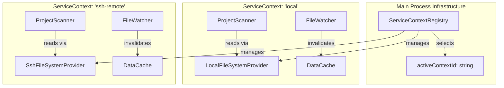
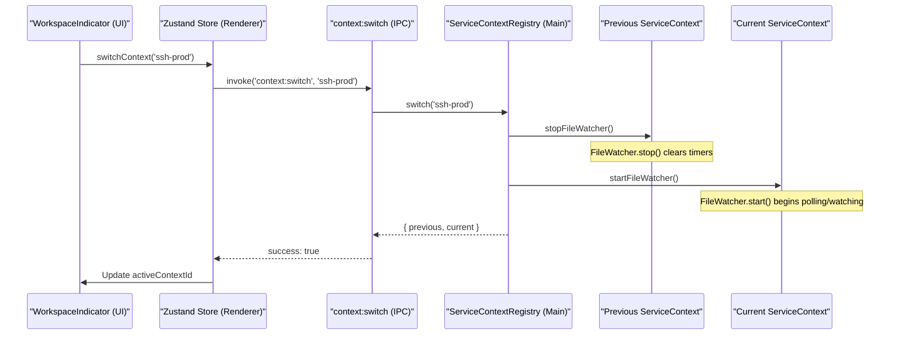

# Service Context API

<details>
<summary>관련 소스 파일</summary>

다음 파일들은 이 위키 페이지를 생성하기 위한 컨텍스트로 사용되었습니다.

- [src/main/services/discovery/ProjectPathResolver.ts](src/main/services/discovery/ProjectPathResolver.ts)
- [src/main/services/infrastructure/DataCache.ts](src/main/services/infrastructure/DataCache.ts)
- [src/main/services/infrastructure/FileSystemProvider.ts](src/main/services/infrastructure/FileSystemProvider.ts)
- [src/main/services/infrastructure/FileWatcher.ts](src/main/services/infrastructure/FileWatcher.ts)
- [src/main/services/infrastructure/ServiceContext.ts](src/main/services/infrastructure/ServiceContext.ts)
- [src/main/services/infrastructure/ServiceContextRegistry.ts](src/main/services/infrastructure/ServiceContextRegistry.ts)
- [src/main/services/infrastructure/SshFileSystemProvider.ts](src/main/services/infrastructure/SshFileSystemProvider.ts)
- [src/main/services/infrastructure/index.ts](src/main/services/infrastructure/index.ts)
- [src/renderer/components/common/WorkspaceIndicator.tsx](src/renderer/components/common/WorkspaceIndicator.tsx)

</details>


## 목적과 범위

**Service Context API**는 `claude-devtools`에서 격리된 execution environment를 관리하기 위한 핵심 architectural abstraction을 제공합니다. **Service Context**는 특정 filesystem provider에 연결된 완전한 service stack(project scanner, session parser, file watcher 등)을 캡슐화합니다.

**ServiceContextRegistry**는 이러한 context를 관리하여 application이 local development environment와 SSH를 통해 접근하는 remote environment 사이를 매끄럽게 전환할 수 있게 합니다. 이 시스템은 data caching, file watching, project discovery가 각 workspace마다 격리되고 일관되게 유지되도록 보장합니다.

**출처:** [src/main/services/infrastructure/ServiceContext.ts:1-12](), [src/main/services/infrastructure/ServiceContextRegistry.ts:1-17]()

---

## Core Components

### ServiceContext
`ServiceContext`는 단일 workspace를 위한 모든 session-data service를 묶는 container class입니다. 이 service들의 lifecycle을 관리하여 함께 시작, 중지, dispose되도록 보장합니다.

| Service | Responsibility |
| :--- | :--- |
| `ProjectScanner` | `.jsonl` session file을 발견하고 project로 구성합니다. |
| `SessionParser` | raw session data를 읽고 구조화된 message로 변환합니다. |
| `FileWatcher` | real-time update를 위해 filesystem을 모니터링하고 cache를 무효화합니다. |
| `DataCache` | 성능 향상을 위한 parsed session metadata의 TTL 포함 LRU cache입니다. |
| `SubagentResolver` | parent session과 nested subagent 사이의 link를 resolve합니다. |
| `ChunkBuilder` | incremental session log에서 conversation history를 재구성합니다. |

**출처:** [src/main/services/infrastructure/ServiceContext.ts:62-77](), [src/main/services/infrastructure/ServiceContext.ts:88-119]()

### ServiceContextRegistry
`ServiceContextRegistry`는 등록된 모든 context(하나의 `local` context와 잠재적으로 여러 `ssh` context)를 추적하는 coordinator입니다. `local` context는 영구적이며 destroy될 수 없다는 rule을 강제합니다.

**주요 책임:**
- **Context Tracking:** 사용 가능한 모든 environment의 `Map<string, ServiceContext>`를 유지합니다.
- **Active Context Management:** `activeContextId`를 추적하고 context 사이의 전환 logic을 처리합니다.
- **Lifecycle Enforcement:** 전환 시 이전 context의 `FileWatcher`는 pause되고 새 context는 resume되도록 보장합니다.

**출처:** [src/main/services/infrastructure/ServiceContextRegistry.ts:31-42](), [src/main/services/infrastructure/ServiceContextRegistry.ts:119-146]()

### FileSystemProvider
이 abstract interface는 `ProjectScanner`와 `SessionParser` 같은 service가 local disk와 remote server 중 어디와 상호작용하는지 알 필요 없이 동작할 수 있게 합니다.

- **`LocalFileSystemProvider`**: 표준 Node.js `fs` module을 사용합니다.
- **`SshFileSystemProvider`**: `ssh2` SFTP connection을 감싸며 transient network failure에 대한 retry를 제공합니다.

**출처:** [src/main/services/infrastructure/FileSystemProvider.ts:60-81](), [src/main/services/infrastructure/SshFileSystemProvider.ts:23-32]()

---

## Architecture Diagrams

### Context Management and Data Flow
이 다이어그램은 `ServiceContextRegistry`가 high-level IPC handler와 low-level service instance 사이의 간극을 연결하는 방식을 보여줍니다.


**출처:** [src/main/services/infrastructure/ServiceContextRegistry.ts:31-33](), [src/main/services/infrastructure/ServiceContext.ts:62-77]()

### Context Switching Sequence
이 다이어그램은 workspace 전환이라는 "Natural Language Space" 요청이 "Code Entity Space" method call로 변환되는 방식을 보여줍니다.


**출처:** [src/main/services/infrastructure/ServiceContextRegistry.ts:119-146](), [src/renderer/components/common/WorkspaceIndicator.tsx:18-25](), [src/main/services/infrastructure/FileWatcher.ts:148-195]()

---

## FileSystem Abstraction

`FileSystemProvider` interface는 모든 session-data service가 provider-agnostic하게 동작하도록 보장합니다.

### Interface Definition
이 interface는 JSONL file parsing에 필요한 기본 read-only operation과 stream creation을 다룹니다.

| Method | Description |
| :--- | :--- |
| `exists(path)` | file/directory 존재 여부를 확인합니다. |
| `readFile(path)` | file content를 string(UTF-8)으로 읽습니다. |
| `readdir(path)` | directory entry를 `FsDirent` object로 나열합니다. |
| `stat(path)` | file size와 modification timestamp를 반환합니다. |
| `createReadStream(path)` | incremental parsing을 위한 `Readable` stream을 반환합니다. |

**출처:** [src/main/services/infrastructure/FileSystemProvider.ts:60-81]()

### SSH Implementation Details
`SshFileSystemProvider`에는 SFTP의 세부 차이를 처리하기 위한 특정 logic이 포함되어 있습니다.
- **Error Classification:** SFTP error를 `not_found`, `transient`, `permanent`로 분류합니다.
- **Retry Logic:** `transient` error(예: SSH code 4)를 exponential backoff로 자동 retry합니다.
- **Stream Wrapping:** 표준 parsing utility와의 호환성을 보장하기 위해 raw SFTP stream을 Node.js `PassThrough`로 감쌉니다.

**출처:** [src/main/services/infrastructure/SshFileSystemProvider.ts:21-25](), [src/main/services/infrastructure/SshFileSystemProvider.ts:34-55](), [src/main/services/infrastructure/SshFileSystemProvider.ts:178-200]()

---

## Lifecycle and State Management

### Context Registration
context는 일반적으로 application startup 중(`local`) 또는 SSH connection이 성공적으로 수립될 때 등록됩니다.

[src/main/services/infrastructure/ServiceContextRegistry.ts:48-55]()
```typescript
registerContext(context: ServiceContext): void {
  if (this.contexts.has(context.id)) {
    throw new Error(`Context already registered: ${context.id}`);
  }
  this.contexts.set(context.id, context);
}
```

### FileWatcher Integration
`FileWatcher` behavior는 `FileSystemProvider` type에 따라 달라집니다. `local` context에서는 native `fs.watch`를 사용합니다. `ssh` context에서는 polling mechanism으로 fallback합니다.

- **SSH Polling:** remote filesystem을 3000ms마다 poll합니다(`SSH_POLL_INTERVAL_MS`).
- **Catch-up Scan:** OS가 놓친 event를 감지하기 위해 30초마다 주기적으로 full scan을 수행합니다.

**출처:** [src/main/services/infrastructure/FileWatcher.ts:73-82](), [src/main/services/infrastructure/FileWatcher.ts:137-141]()

### Data Caching
각 context는 자체 `DataCache`를 유지합니다. 이는 서로 다른 workspace 사이의 session data cross-contamination을 방지합니다. cache는 composite key(예: `projectId/sessionId`)를 사용하며, 해당 file change가 감지될 때마다 `FileWatcher`에 의해 무효화됩니다.

**출처:** [src/main/services/infrastructure/DataCache.ts:27-40](), [src/main/services/infrastructure/DataCache.ts:198-200]()

---

## Summary Table: Service Dependencies

| Service | Dependency | Reason |
| :--- | :--- | :--- |
| `ProjectScanner` | `FileSystemProvider` | directory를 나열하고 file existence를 확인하기 위해. |
| `SessionParser` | `ProjectScanner` | relative path와 project metadata를 resolve하기 위해. |
| `FileWatcher` | `DataCache` | file change 시 특정 cache entry를 무효화하기 위해. |
| `FileWatcher` | `FileSystemProvider` | remote file에 대한 polling 또는 stat check를 수행하기 위해. |
| `ServiceContext` | All Services | aggregate lifecycle을 묶고 관리하기 위해. |

**출처:** [src/main/services/infrastructure/ServiceContext.ts:91-116]()
