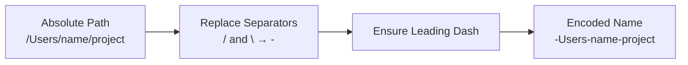
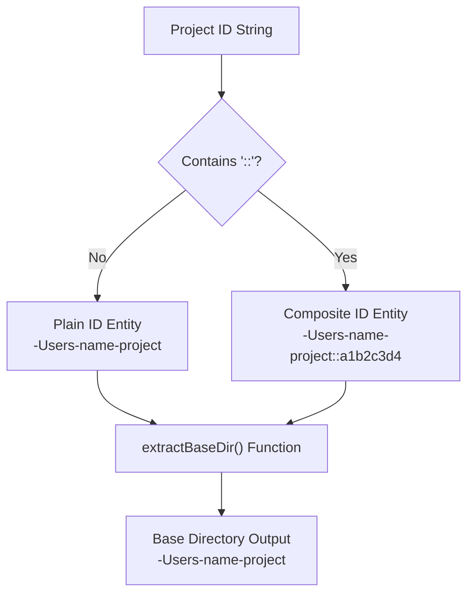
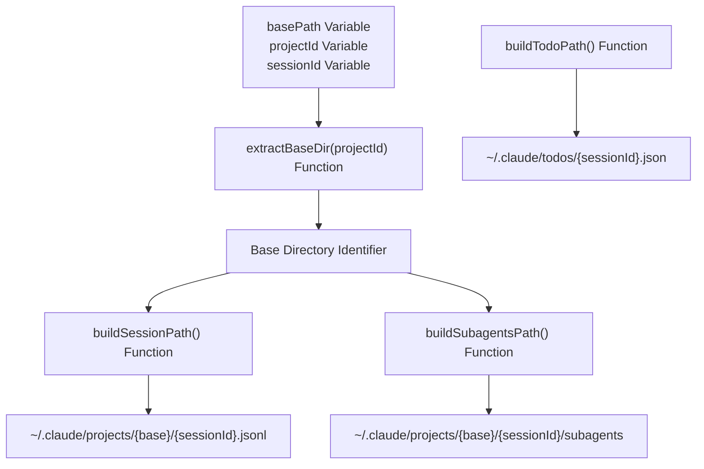
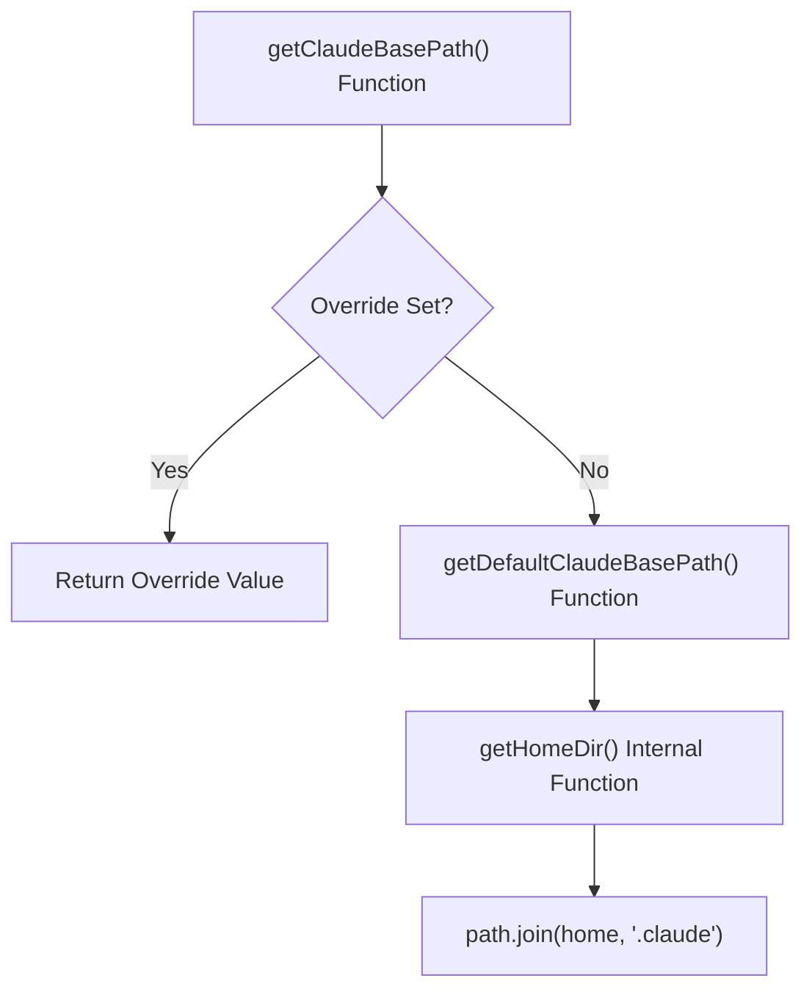
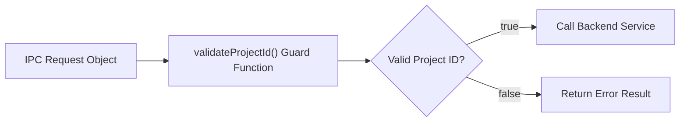

# Path Utilities

<details>
<summary>관련 소스 파일</summary>

다음 파일들은 이 위키 페이지를 생성하기 위한 컨텍스트로 사용되었습니다.

- [src/main/ipc/config.ts](src/main/ipc/config.ts)
- [src/main/services/error/ErrorTriggerChecker.ts](src/main/services/error/ErrorTriggerChecker.ts)
- [src/main/utils/pathDecoder.ts](src/main/utils/pathDecoder.ts)
- [src/main/utils/pathValidation.ts](src/main/utils/pathValidation.ts)
- [src/renderer/components/notifications/NotificationRow.tsx](src/renderer/components/notifications/NotificationRow.tsx)
- [test/main/ipc/guards.test.ts](test/main/ipc/guards.test.ts)
- [test/main/utils/pathDecoder.test.ts](test/main/utils/pathDecoder.test.ts)
- [test/mocks/electronAPI.ts](test/mocks/electronAPI.ts)

</details>


이 페이지는 `src/main/utils/pathDecoder.ts`에서 제공하는 path manipulation function을 문서화합니다. 이러한 utility는 Claude Code의 directory naming scheme encoding/decoding, project ID validation, file path construction, Claude base directory configuration 관리를 처리합니다.

Claude Code의 path encoding이 어떻게 동작하고 composite project ID가 왜 존재하는지에 대한 개념적 이해는 [Path Encoding & Project IDs]()를 참조하세요. context system에서의 사용은 [Service Context API]()를 참조하세요.

## Core Encoding and Decoding

absolute filesystem path와 Claude Code의 directory naming format 사이를 변환하기 위한 기본 operation입니다.

### Encoding Flow

Title: Path Encoding Logic


**출처:** [src/main/utils/pathDecoder.ts:27-36]()

### `encodePath(absolutePath: string): string`

모든 path separator(`/`와 `\`)를 dash로 대체하여 absolute filesystem path를 Claude Code의 directory naming format으로 변환합니다 [src/main/utils/pathDecoder.ts:32-32]().

**Parameters:**
- `absolutePath` - encode할 absolute path(예: `/Users/username/projectname`) [src/main/utils/pathDecoder.ts:27-27]().

**Returns:** encoded directory name(예: `-Users-username-projectname`) [src/main/utils/pathDecoder.ts:35-36]().

**Examples:**
```typescript
encodePath('/Users/username/projectname')
// Returns: '-Users-username-projectname'

encodePath('C:\\Users\\username\\projectname')
// Returns: '-C:-Users-username-projectname'
```

**Platform Support:**

| Platform | Input Example | Encoded Output |
|----------|---------------|----------------|
| macOS/Linux | `/Users/name/project` | `-Users-name-project` |
| Windows | `C:\Users\name\project` | `-C:-Users-name-project` |
| WSL | `/home/user/project` | `-home-user-project` |

**출처:** [src/main/utils/pathDecoder.ts:20-36](), [test/main/utils/pathDecoder.test.ts:18-44]()

### `decodePath(encodedName: string): string`

directory name을 원래 path로 다시 decode합니다 [src/main/utils/pathDecoder.ts:45-76](). **중요:** dash가 포함된 path에서는 손실이 발생합니다 [src/main/utils/pathDecoder.ts:11-13](). 정확한 path resolution을 위해서는 JSONL parser의 `extractCwd()`를 사용하여 session file에서 실제 working directory를 읽으세요.

**Parameters:**
- `encodedName` - encoded directory name(예: `-Users-username-projectname`) [src/main/utils/pathDecoder.ts:45-45]().

**Returns:** decoded path(예: `/Users/username/projectname`) [src/main/utils/pathDecoder.ts:75-76]().

**Legacy Format Support:**
이 function은 drive separator가 leading dash 없이 `--`로 encode된 legacy Windows format(`C--Users-name-project`)을 처리합니다 [src/main/utils/pathDecoder.ts:52-58]().

**Examples:**
```typescript
decodePath('-Users-username-projectname')
// Returns: '/Users/username/projectname'

decodePath('-C:-Users-username-projectname')
// Returns: 'C:/Users/username/projectname'

// Legacy Windows format
decodePath('C--Users-username-projectname')
// Returns: 'C:/Users/username/projectname'
```

**Lossy Encoding Warning:**
```typescript
// Paths with dashes are ambiguous
encodePath('/Users/name/claude-devtools')
// Returns: '-Users-name-claude-devtools'

decodePath('-Users-name-claude-devtools')
// Returns: '/Users/name/claude/devtools' (WRONG!)
```

**출처:** [src/main/utils/pathDecoder.ts:38-76](), [test/main/utils/pathDecoder.test.ts:46-82]()

### `extractProjectName(encodedName: string, cwdHint?: string): string`

encoded directory name에서 project name(last path segment)을 추출합니다 [src/main/utils/pathDecoder.ts:84-95](). 가능한 경우 `cwdHint` parameter(실제 filesystem path)를 우선 사용합니다. `decodePath`는 dash가 포함된 path에서 손실이 발생하기 때문입니다 [src/main/utils/pathDecoder.ts:87-91]().

**Parameters:**
- `encodedName` - encoded directory name [src/main/utils/pathDecoder.ts:84-84]().
- `cwdHint` - session metadata에서 온 optional actual filesystem path [src/main/utils/pathDecoder.ts:84-84]().

**Returns:** project name [src/main/utils/pathDecoder.ts:94-95]().

**Examples:**
```typescript
extractProjectName('-Users-username-projectname')
// Returns: 'projectname'

// Without cwdHint, dashes are decoded as slashes (lossy)
extractProjectName('-Users-name-claude-devtools')
// Returns: 'devtools'

// With cwdHint, the actual project name is preserved
extractProjectName('-Users-name-claude-devtools', '/Users/name/claude-devtools')
// Returns: 'claude-devtools'
```

**출처:** [src/main/utils/pathDecoder.ts:79-95](), [test/main/utils/pathDecoder.test.ts:84-117]()

## Validation Functions

### `isValidEncodedPath(encodedName: string): boolean`

directory name이 Claude Code의 encoding pattern을 따르는지 검증합니다 [src/main/utils/pathDecoder.ts:124-160]().

**Validation Rules:**
1. `-`로 시작해야 합니다(absolute path를 나타냄) [src/main/utils/pathDecoder.ts:136-138]() **또는** legacy Windows format(`C--...`)과 match되어야 합니다 [src/main/utils/pathDecoder.ts:131-133]().
2. alphanumeric, underscore, dot, space, dash, optional colon만 포함할 수 있습니다 [src/main/utils/pathDecoder.ts:143-146]().
3. colon(`:`)은 시작 부분의 Windows drive notation(예: `-C:-Users-name`)에만 허용됩니다 [src/main/utils/pathDecoder.ts:150-159]().

**Examples:**
```typescript
isValidEncodedPath('-Users-username-projectname')
// Returns: true

isValidEncodedPath('-C:-Users-username-projectname')
// Returns: true (Windows drive notation)

isValidEncodedPath('C--Users-username-projectname')
// Returns: true (legacy Windows format)

isValidEncodedPath('Users-username-projectname')
// Returns: false (missing leading dash)

isValidEncodedPath('-Users-name:project')
// Returns: false (misplaced colon)
```

**출처:** [src/main/utils/pathDecoder.ts:118-160](), [test/main/utils/pathDecoder.test.ts:119-160]()

### `isValidProjectId(projectId: string): boolean`

plain encoded path 또는 composite subproject ID일 수 있는 project ID를 검증합니다 [src/main/utils/pathDecoder.ts:169-185]().

**Composite ID Format:** `{encodedPath}::{8-char-hex}` [src/main/utils/pathDecoder.ts:164-164]().

**Examples:**
```typescript
// Plain encoded path
isValidProjectId('-Users-name-project')
// Returns: true

// Composite ID with hash
isValidProjectId('-Users-name-project::a1b2c3d4')
// Returns: true

isValidProjectId('-Users-name-project::xyz')
// Returns: false (hash must be 8 hex characters)
```

**출처:** [src/main/utils/pathDecoder.ts:169-185]()

## Composite Project ID Handling

Title: Project ID Structure Parsing


**출처:** [src/main/utils/pathDecoder.ts:188-198]()

### `extractBaseDir(projectId: string): string`

project ID에서 base directory(encoded path)를 추출합니다 [src/main/utils/pathDecoder.ts:192-198](). composite ID(`{encoded}::{hash}`)에서는 encoded part만 반환합니다 [src/main/utils/pathDecoder.ts:195-195](). plain ID에서는 ID를 그대로 반환합니다 [src/main/utils/pathDecoder.ts:197-197]().

이는 project ID가 composite인지 여부와 관계없이 base directory가 필요한 path construction function에 필수적입니다.

**Examples:**
```typescript
extractBaseDir('-Users-name-project')
// Returns: '-Users-name-project'

extractBaseDir('-Users-name-project::a1b2c3d4')
// Returns: '-Users-name-project'
```

**Usage:** `buildSessionPath`와 `buildSubagentsPath`가 plain 및 composite project ID를 동일하게 처리하기 위해 내부적으로 호출합니다.

**출처:** [src/main/utils/pathDecoder.ts:192-198]()

## Path Construction

이 function들은 다양한 Claude Code artifact에 대한 absolute path를 build하며, composite project ID를 자동으로 처리합니다.

### Path Construction Flow

Title: Artifact Path Generation


**출처:** [src/main/utils/pathDecoder.ts:210-234]()

### `buildSessionPath(basePath: string, projectId: string, sessionId: string): string`

session JSONL file에 대한 absolute path를 구성합니다 [src/main/utils/pathDecoder.ts:210-216](). base directory를 추출하여 composite project ID를 처리합니다 [src/main/utils/pathDecoder.ts:214-214]().

**Parameters:**
- `basePath` - base directory(일반적으로 `getProjectsBasePath()`에서 가져옴)
- `projectId` - project ID(plain 또는 composite)
- `sessionId` - session ID

**Returns:** session file에 대한 absolute path [src/main/utils/pathDecoder.ts:215-215]().

**Examples:**
```typescript
buildSessionPath('/Users/name/.claude/projects', '-Users-name-project', 'abc123')
// Returns: '/Users/name/.claude/projects/-Users-name-project/abc123.jsonl'

// Handles composite IDs
buildSessionPath('/Users/name/.claude/projects', '-Users-name-project::a1b2c3d4', 'abc123')
// Returns: '/Users/name/.claude/projects/-Users-name-project/abc123.jsonl'
```

**출처:** [src/main/utils/pathDecoder.ts:210-216](), [test/main/utils/pathDecoder.test.ts:182-194]()

### `buildSubagentsPath(basePath: string, projectId: string, sessionId: string): string`

session의 subagents directory에 대한 absolute path를 구성합니다 [src/main/utils/pathDecoder.ts:218-224](). base directory를 추출하여 composite project ID를 처리합니다 [src/main/utils/pathDecoder.ts:222-222]().

**Parameters:**
- `basePath` - base directory(일반적으로 `getProjectsBasePath()`에서 가져옴)
- `projectId` - project ID(plain 또는 composite)
- `sessionId` - session ID

**Returns:** subagents directory에 대한 absolute path [src/main/utils/pathDecoder.ts:223-223]().

**Examples:**
```typescript
buildSubagentsPath('/Users/name/.claude/projects', '-Users-name-project', 'abc123')
// Returns: '/Users/name/.claude/projects/-Users-name-project/abc123/subagents'
```

**출처:** [src/main/utils/pathDecoder.ts:218-224](), [test/main/utils/pathDecoder.test.ts:196-202]()

### `buildTodoPath(claudeBasePath: string, sessionId: string): string`

session의 task list file(`todos` directory에 저장됨)에 대한 absolute path를 구성합니다 [src/main/utils/pathDecoder.ts:226-231]().

**Parameters:**
- `claudeBasePath` - Claude base directory(`getClaudeBasePath()`에서 가져옴)
- `sessionId` - session ID

**Returns:** todo file에 대한 absolute path [src/main/utils/pathDecoder.ts:230-230]().

**Examples:**
```typescript
buildTodoPath('/Users/name/.claude', 'abc123')
// Returns: '/Users/name/.claude/todos/abc123.json'
```

**출처:** [src/main/utils/pathDecoder.ts:226-231](), [test/main/utils/pathDecoder.test.ts:204-210]()

## Claude Base Path Management

Claude base path(일반적으로 `~/.claude`)는 custom installation 또는 WSL environment를 지원하기 위해 override될 수 있습니다. override는 module-level variable에 저장됩니다 [src/main/utils/pathDecoder.ts:239-239]().

### Base Path Resolution Flow

Title: Claude Directory Discovery


**출처:** [src/main/utils/pathDecoder.ts:241-319]()

### `getClaudeBasePath(): string`

현재 설정된 Claude base directory를 반환합니다 [src/main/utils/pathDecoder.ts:309-312](). override가 설정되어 있으면 override를 반환하고, 그렇지 않으면 `~/.claude`를 반환합니다.

**Returns:** Claude base directory에 대한 absolute path [src/main/utils/pathDecoder.ts:311-311]().

**Examples:**
```typescript
// Default behavior
getClaudeBasePath()
// Returns: '/Users/name/.claude'

// After setting override
setClaudeBasePathOverride('/mnt/c/Users/name/.claude')
getClaudeBasePath()
// Returns: '/mnt/c/Users/name/.claude'
```

**출처:** [src/main/utils/pathDecoder.ts:309-312]()

### `setClaudeBasePathOverride(claudeBasePath: string | null | undefined): void`

Claude base directory를 override합니다 [src/main/utils/pathDecoder.ts:294-305](). override를 해제하고 auto-detection으로 돌아가려면 `null` 또는 `undefined`를 전달합니다.

**Parameters:**
- `claudeBasePath` - override path 또는 override를 clear하기 위한 null

**Normalization:**
- whitespace trim
- path separator normalize
- absolute path로 resolve
- trailing slash 제거(root 제외)
- non-absolute path 거부

**Examples:**
```typescript
// Set override
setClaudeBasePathOverride('/custom/path/.claude')

// Clear override
setClaudeBasePathOverride(null)

// Invalid paths are rejected (normalized to null)
setClaudeBasePathOverride('relative/path')  // Rejected
setClaudeBasePathOverride('')               // Rejected
```

**출처:** [src/main/utils/pathDecoder.ts:294-305]()

### `getAutoDetectedClaudeBasePath(): string`

override를 고려하지 않고 auto-detected Claude base path(`~/.claude`)를 반환합니다 [src/main/utils/pathDecoder.ts:259-263](). UI에서 default path를 표시할 때 유용합니다.

**Returns:** `~/.claude` path [src/main/utils/pathDecoder.ts:262-262]().

**출처:** [src/main/utils/pathDecoder.ts:259-263]()

### `getProjectsBasePath(): string`

projects directory path(`~/.claude/projects`)를 반환합니다 [src/main/utils/pathDecoder.ts:314-319](). base path override를 존중합니다.

**Returns:** projects directory에 대한 absolute path [src/main/utils/pathDecoder.ts:318-318]().

**출처:** [src/main/utils/pathDecoder.ts:314-319](), [test/main/utils/pathDecoder.test.ts:212-216]()

### `getTodosBasePath(): string`

todos directory path(`~/.claude/todos`)를 반환합니다 [src/main/utils/pathDecoder.ts:321-326](). base path override를 존중합니다.

**Returns:** todos directory에 대한 absolute path [src/main/utils/pathDecoder.ts:325-325]().

**출처:** [src/main/utils/pathDecoder.ts:321-326](), [test/main/utils/pathDecoder.test.ts:218-222]()

### Home Directory Resolution

`getHomeDir()` function(private)은 platform 전반에서 user home directory를 resolve합니다 [src/main/utils/pathDecoder.ts:241-251]().

**Resolution Order:**
1. `$HOME` (POSIX) [src/main/utils/pathDecoder.ts:242-242]()
2. `$USERPROFILE` (Windows) [src/main/utils/pathDecoder.ts:243-243]()
3. `$HOMEDRIVE$HOMEPATH` (Windows fallback) [src/main/utils/pathDecoder.ts:244-244]()
4. `os.homedir()` (Node.js API) [src/main/utils/pathDecoder.ts:245-245]()
5. `/` (last resort) [src/main/utils/pathDecoder.ts:250-250]()

**출처:** [src/main/utils/pathDecoder.ts:241-251]()

## Session ID Extraction

### `extractSessionId(filename: string): string`

`.jsonl` extension을 제거하여 JSONL filename에서 session ID를 추출합니다 [src/main/utils/pathDecoder.ts:210-212]().

**Parameters:**
- `filename` - filename(예: `abc123.jsonl`) [src/main/utils/pathDecoder.ts:210-210]().

**Returns:** session ID(예: `abc123`) [src/main/utils/pathDecoder.ts:211-211]().

**Examples:**
```typescript
extractSessionId('abc123.jsonl')
// Returns: 'abc123'

extractSessionId('550e8400-e29b-41d4-a716-446655440000.jsonl')
// Returns: '550e8400-e29b-41d4-a716-446655440000'

// Works even without extension
extractSessionId('session123')
// Returns: 'session123'
```

**출처:** [src/main/utils/pathDecoder.ts:210-212](), [test/main/utils/pathDecoder.test.ts:162-180]()

## Usage in IPC Guards

validation function은 filesystem operation을 수행하기 전에 request parameter가 안전한지 확인하기 위해 IPC handler에서 사용됩니다.

### `validateProjectId` Integration

Title: IPC Request Validation


**Example from IPC guards:**
```typescript
export function validateProjectId(projectId: unknown): ValidationResult<string> {
  if (typeof projectId !== 'string' || !isValidProjectId(projectId)) {
    return { valid: false, error: 'Invalid project ID' };
  }
  return { valid: true, value: projectId };
}
```

**출처:** [test/main/ipc/guards.test.ts:1-54]()

## Summary Table

| Function | Purpose | Input | Output |
|----------|---------|-------|--------|
| `encodePath` | path를 directory name으로 변환 | Absolute path | Encoded name |
| `decodePath` | directory name을 path로 변환 | Encoded name | Decoded path(lossy) |
| `extractProjectName` | project name 가져오기 | Encoded name, optional cwdHint | Project name |
| `isValidEncodedPath` | encoded path 검증 | Encoded name | boolean |
| `isValidProjectId` | project ID 검증 | Project ID | boolean |
| `extractBaseDir` | composite ID에서 base 가져오기 | Project ID | Base directory |
| `buildSessionPath` | session file path build | basePath, projectId, sessionId | Absolute path |
| `buildSubagentsPath` | subagents dir path build | basePath, projectId, sessionId | Absolute path |
| `buildTodoPath` | todo file path build | claudeBasePath, sessionId | Absolute path |
| `getClaudeBasePath` | Claude base directory 가져오기 | None | Absolute path |
| `setClaudeBasePathOverride` | base directory override | Path or null | void |
| `getProjectsBasePath` | projects directory 가져오기 | None | Absolute path |
| `getTodosBasePath` | todos directory 가져오기 | None | Absolute path |
| `extractSessionId` | filename에서 ID 추출 | Filename | Session ID |

**출처:** [src/main/utils/pathDecoder.ts:1-326]()
