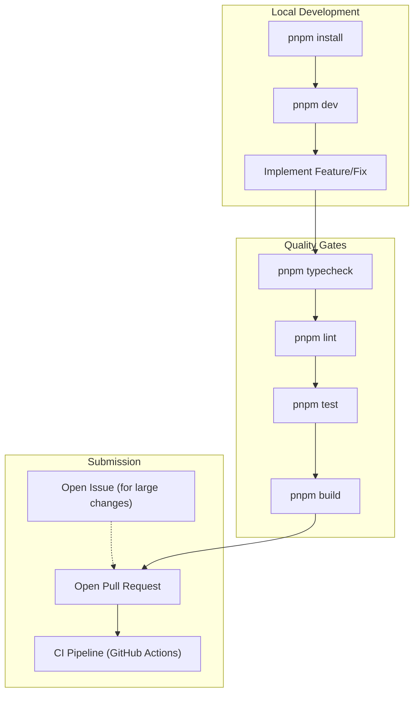

# Contributing

관련 소스 파일

다음 파일들은 이 위키 페이지를 생성하기 위한 컨텍스트로 사용되었습니다.

- [CONTRIBUTING.md](CONTRIBUTING.md)

이 페이지는 `claude-devtools`에 기여하기 위한 high-level technical guideline을 제공합니다. project philosophy, development workflow, pull request에 필요한 standard를 설명합니다.

## Project Philosophy & Scope

`claude-devtools`는 token flow, context injection, tool execution처럼 Claude Code의 "invisible" part에 대한 visibility를 제공하도록 특별히 설계되었습니다 [CONTRIBUTING.md:5-7]().

**Core Priorities:**
1.  **Parity with Claude Code**: agent team과 context tracking 같은 새로운 capability를 빠르게 채택합니다 [CONTRIBUTING.md:11-11]().
2.  **Context Engineering Insight**: 사용자가 context window usage를 최적화하는 데 도움이 되는 feature에 집중합니다 [CONTRIBUTING.md:12-12]().
3.  **Stability over Novelty**: professional workflow를 위한 reliable하고 빠른 tool을 우선합니다 [CONTRIBUTING.md:13-13]().

**Out of Scope:**
*   context visibility와 관련 없는 대규모 custom feature [CONTRIBUTING.md:16-16]().
*   구체적인 문제를 해결하지 않으면서 maintenance burden을 늘리는 speculative feature [CONTRIBUTING.md:17-17]().

**출처:** [CONTRIBUTING.md:1-21]()

## Development Lifecycle

다음 다이어그램은 local setup부터 CI validation까지 change에 기여하는 표준 workflow를 보여줍니다.

### Contribution Workflow

**출처:** [CONTRIBUTING.md:27-40](), [.github/workflows/ci.yml:1-83]()

## Technical Contribution Areas

특정 유형의 contribution에 대한 자세한 technical guide가 제공됩니다.

### 1. Development Setup
시작하기 전에 **Node.js 20+**와 **pnpm 10+**가 설치되어 있는지 확인하세요 [CONTRIBUTING.md:23-24](). 프로젝트는 macOS와 Windows를 지원합니다 [CONTRIBUTING.md:25-25]().
environment variable과 development mode 실행에 대한 자세한 지침은 **[Development Setup](#15.1)**을 참조하세요.

### 2. Extending Functionality (IPC)
대부분의 feature는 Main process(Node.js services)와 Renderer process(React UI) 사이의 coordination이 필요합니다. 이는 type-safe IPC layer를 통해 처리됩니다.
새 handler를 추가하는 step-by-step guide는 **[Adding IPC Methods](#15.2)**를 참조하세요.

### 3. Standards & Quality
모든 contribution은 TypeScript type checking, ESLint validation, Vitest unit test를 포함한 strict quality gate를 통과해야 합니다 [CONTRIBUTING.md:33-40]().
coding pattern과 naming convention에 대한 자세한 내용은 **[Code Style & Quality](#15.3)**를 참조하세요.

## AI-Assisted Contributions

contributor가 제출한 code에 대해 full responsibility를 진다면 AI coding tool 사용은 허용됩니다 [CONTRIBUTING.md:52-52]().

*   **Review Requirement**: AI-generated code의 모든 line은 contributor가 읽고 이해해야 합니다 [CONTRIBUTING.md:54-54]().
*   **No Artifacts**: planning document, session log(예: `.speckit/`), step-by-step plan 같은 AI workflow artifact를 commit하지 마세요 [CONTRIBUTING.md:55-55]().
*   **Manual Verification**: AI-generated code는 application을 실행하고 edge case를 확인하여 manually verified되어야 합니다 [CONTRIBUTING.md:56-56]().

**출처:** [CONTRIBUTING.md:50-58]()

## Pull Request Guidelines

*   **Focus**: change는 작게 유지하고 PR 하나당 단일 목적에 집중하세요 [CONTRIBUTING.md:43-43]().
*   **Tests**: behavior change에는 test를 포함하거나 조정하세요 [CONTRIBUTING.md:44-44]().
*   **Commits**: conventional commit(예: `feat:`, `fix:`, `chore:`)을 선호합니다 [CONTRIBUTING.md:66-66]().
*   **Discussion**: large change 또는 new dependency는 PR을 열기 전에 Issue에서 **반드시** 논의해야 합니다 [CONTRIBUTING.md:47-47]().

### Prohibited Content
다음 항목은 repository contribution에 절대 포함해서는 안 됩니다.
*   Personal planning/workflow artifact [CONTRIBUTING.md:60-60]().
*   runtime에 fetch할 수 있는 large static data blob [CONTRIBUTING.md:61-61]().
*   prior alignment 없는 experimental feature [CONTRIBUTING.md:63-63]().

**출처:** [CONTRIBUTING.md:42-68]()
