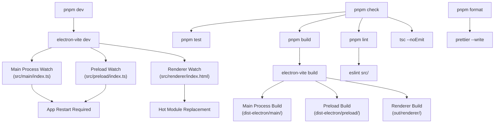
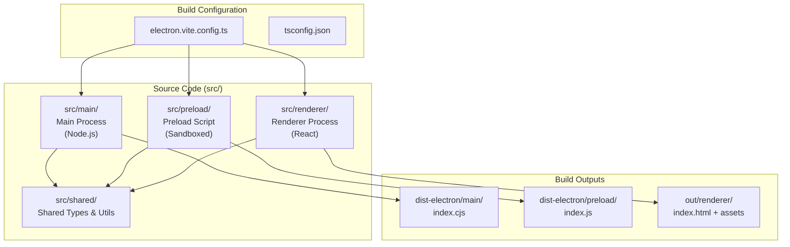
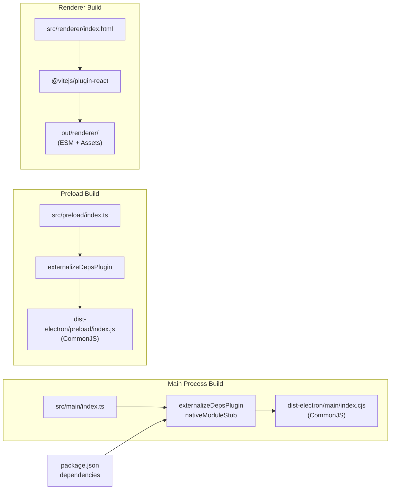

# Development Setup

<details>
<summary>관련 소스 파일</summary>

다음 파일들은 이 위키 페이지를 생성하기 위한 컨텍스트로 사용되었습니다.

- [.github/workflows/release.yml](.github/workflows/release.yml)
- [electron.vite.config.ts](electron.vite.config.ts)
- [package.json](package.json)
- [pnpm-lock.yaml](pnpm-lock.yaml)
- [resources/afterInstall.sh](resources/afterInstall.sh)
- [src/main/services/infrastructure/NotificationManager.ts](src/main/services/infrastructure/NotificationManager.ts)
- [src/main/services/infrastructure/SshConnectionManager.ts](src/main/services/infrastructure/SshConnectionManager.ts)

</details>


이 문서는 `claude-devtools`에 기여하기 위한 local development environment 설정을 다룹니다. prerequisite, installation step, development mode에서 application 실행, development workflow 개요를 포함합니다.

build system configuration 세부 사항은 [Build System]()을 참조하세요. deployment와 distribution은 [Release & Distribution]()을 참조하세요. end-user installation instruction은 [Getting Started]()를 참조하세요.

---

## Prerequisites

`claude-devtools`는 development machine에 다음 tool이 설치되어 있어야 합니다.

| Tool | Minimum Version | Purpose |
|------|----------------|---------|
| **Node.js** | 20.x | JavaScript runtime(CI에 지정됨) |
| **pnpm** | 10.25.0 | Package manager(`package.json`에서 강제됨) |
| **Git** | Any recent version | Version control |

프로젝트는 `package.json`의 `packageManager` field를 통해 강제되는 **pnpm**을 package manager로 사용합니다 [package.json:181-181](). workspace와 dependency resolution 차이 때문에 `npm` 또는 `yarn`을 사용하면 올바르게 동작하지 않습니다.

**출처:** [package.json:181-181](), [.github/workflows/release.yml:26-26]()

---

## Installation

### 1. Clone the Repository

```bash
git clone https://github.com/matt1398/claude-devtools.git
cd claude-devtools
```

### 2. Install Dependencies

```bash
pnpm install
```

pnpm은 다음을 수행합니다.
- 모든 production 및 development dependency를 설치합니다 [package.json:50-114]().
- Electron과 Vite를 위한 environment를 설정합니다 [package.json:86-88]().
- `ssh2`의 native module requirement를 처리합니다 [package.json:69-69]().

installation은 build system의 stubbing mechanism을 통해 native `.node` addon을 자동으로 처리하여 모든 native dependency를 local에서 compile하지 않고도 cross-platform compatibility를 보장합니다.

**출처:** [package.json:50-114](), [package.json:181-181]()

---

## Running in Development Mode

### Start the Development Server

```bash
pnpm dev
```

이 command는 `electron-vite dev`를 시작합니다 [package.json:21-21](). 이는 다음을 수행합니다.

1. **세 process 모두 build**(main, preload, renderer)를 watch mode로 수행합니다.
2. **Electron application을 시작**하고 hot reload를 활성화합니다.
3. renderer window에서 **DevTools를 자동으로 엽니다**.
4. **file change를 watch**하고 영향을 받은 process를 rebuild합니다.

application은 development window로 실행됩니다. renderer process의 file change는 Hot Module Replacement(HMR)를 지원하고, main 또는 preload process의 변경은 application restart를 trigger합니다.

**출처:** [package.json:21-21](), [electron.vite.config.ts:31-100]()

---

## Development Workflow

### Development Command Workflow



**출처:** [package.json:20-49](), [electron.vite.config.ts:1-100]()

### Key Development Scripts

| Script | Command | Purpose |
|--------|---------|---------|
| **dev** | `pnpm dev` | hot reload가 포함된 development server 시작 [package.json:21-21]() |
| **build** | `pnpm build` | 모든 process의 production build [package.json:22-22]() |
| **typecheck** | `pnpm typecheck` | file emit 없이 TypeScript type checking 실행 [package.json:30-30]() |
| **lint** | `pnpm lint` | linting error 확인 [package.json:31-31]() |
| **format** | `pnpm format` | Prettier로 code format [package.json:33-33]() |
| **test** | `pnpm test` | Vitest로 모든 test 실행 [package.json:42-42]() |
| **check** | `pnpm check` | 모든 quality check(typecheck + lint + test + build) 실행 [package.json:35-35]() |
| **standalone** | `pnpm standalone` | `tsx`를 통해 sidecar server 실행 [package.json:46-46]() |

**출처:** [package.json:20-49]()

---

## Project Structure

### Electron Three-Process Architecture



**출처:** [electron.vite.config.ts:31-100]()

### Key Directories

| Directory | Purpose | Build Output |
|-----------|---------|--------------|
| **src/main/** | Main process service(예: `SshConnectionManager`, `NotificationManager`), IPC handler | `dist-electron/main/` [electron.vite.config.ts:47-47]() |
| **src/preload/** | Security boundary, `window.electronAPI` 노출 | `dist-electron/preload/` [electron.vite.config.ts:71-71]() |
| **src/renderer/** | React UI component와 state management | `out/renderer/` [electron.vite.config.ts:122-122]() |
| **src/shared/** | process 간 공유되는 type definition과 utility | (output에 bundled됨) |

### Path Aliases

build system은 더 깔끔한 import를 위해 `electron.vite.config.ts`에서 path alias를 설정합니다.

- `@main/*` → `src/main/*` [electron.vite.config.ts:41-41]()
- `@preload/*` → `src/preload/*` [electron.vite.config.ts:65-65]()
- `@renderer/*` → `src/renderer/*` [electron.vite.config.ts:86-86]()
- `@shared/*` → `src/shared/*` [electron.vite.config.ts:42-42]()

**출처:** [electron.vite.config.ts:39-90]()

---

## Development Build Pipeline

### electron-vite Configuration Overview



**출처:** [electron.vite.config.ts:31-100]()

### Native Module Handling

`nativeModuleStub` plugin [electron.vite.config.ts:16-29]()은 `.node`로 끝나는 import를 intercept하고 empty module로 대체합니다. 이는 optional native binding을 사용하지만 pure JS fallback이 있는 `ssh2` [package.json:69-69]() 같은 dependency에 중요합니다.

```typescript
function nativeModuleStub(): Plugin {
  const STUB_ID = '\0native-stub'
  return {
    name: 'native-module-stub',
    resolveId(source) {
      if (source.endsWith('.node')) return STUB_ID
      return null
    },
    load(id) {
      if (id === STUB_ID) return 'export default {}'
      return null
    }
  }
}
```

**출처:** [electron.vite.config.ts:16-29]()

---

## Testing During Development

### Running Tests

```bash
# Run all tests once
pnpm test

# Run tests in watch mode
pnpm test:watch

# Generate coverage report
pnpm test:coverage
```

test suite는 **Vitest**를 사용합니다 [package.json:113-113](). 특정 subsystem을 위한 specialized test가 있습니다.
- `test:chunks`: Chunk building logic [package.json:38-38]()
- `test:semantic`: Semantic step parsing [package.json:39-39]()
- `test:noise`: Noise filtering logic [package.json:40-40]()

**출처:** [package.json:38-45]()

---

## Common Development Issues

### Issue: SSH Connection Failures

**Symptom:** development 중 remote host에 연결할 수 없습니다.

**Solution:** `SshConnectionManager`는 `ssh2` library와 local SSH configuration에 의존합니다 [src/main/services/infrastructure/SshConnectionManager.ts:57-71](). `SshConfigParser`가 host alias를 resolve하기 위해 `~/.ssh/config` file을 읽으므로, 이 file이 유효하고 접근 가능한지 확인하세요 [src/main/services/infrastructure/SshConnectionManager.ts:111-113]().

### Issue: Notification Persistence

**Symptom:** notification이 나타나지 않거나 history가 사라집니다.

**Solution:** `NotificationManager`는 data를 `~/.claude/claude-devtools-notifications.json`에 저장합니다 [src/main/services/infrastructure/NotificationManager.ts:80-80](). process가 `~/.claude` directory에 write permission을 가지고 있는지 확인하세요. manager는 startup 시 history를 100개 entry로 prune합니다 [src/main/services/infrastructure/NotificationManager.ts:199-214]().

**출처:** [src/main/services/infrastructure/SshConnectionManager.ts:111-121](), [src/main/services/infrastructure/NotificationManager.ts:74-80](), [src/main/services/infrastructure/NotificationManager.ts:199-214]()
