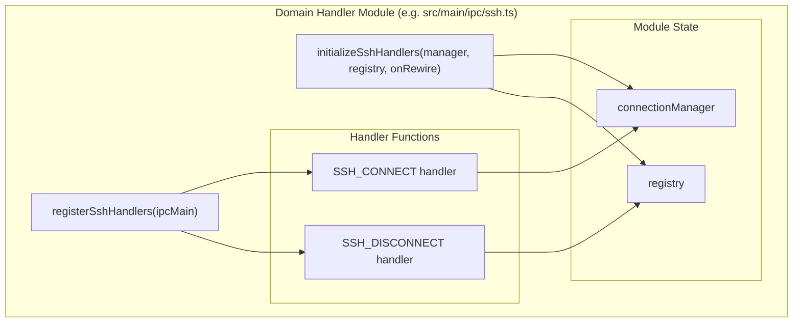

# IPC 메서드 추가하기

<details>
<summary>관련 소스 파일</summary>

다음 파일들은 이 위키 페이지를 생성하기 위한 컨텍스트로 사용되었습니다.

- [.claude/commands/devtools/chatgroup-architecture.md](.claude/commands/devtools/chatgroup-architecture.md)
- [.claude/commands/devtools/design-system.md](.claude/commands/devtools/design-system.md)
- [.claude/commands/devtools/explain-visible-context.md](.claude/commands/devtools/explain-visible-context.md)
- [.claude/commands/devtools/markdown-search-logic.md](.claude/commands/devtools/markdown-search-logic.md)
- [.claude/commands/devtools/navigation-scroll.md](.claude/commands/devtools/navigation-scroll.md)
- [CLAUDE.md](CLAUDE.md)
- [LICENSE](LICENSE)
- [src/main/ipc/context.ts](src/main/ipc/context.ts)
- [src/main/ipc/handlers.ts](src/main/ipc/handlers.ts)
- [src/main/ipc/ssh.ts](src/main/ipc/ssh.ts)
- [src/preload/index.ts](src/preload/index.ts)
- [src/renderer/api/httpClient.ts](src/renderer/api/httpClient.ts)
- [src/renderer/store/slices/connectionSlice.ts](src/renderer/store/slices/connectionSlice.ts)
- [src/shared/types/api.ts](src/shared/types/api.ts)

</details>


이 문서는 renderer process와 main process 사이에 새로운 IPC 통신 메서드를 추가하는 개발자를 위한 단계별 가이드를 제공합니다. 일반적인 IPC 아키텍처 개요는 **3.3. IPC Communication Layer**를 참조하세요. 전체 API 레퍼런스는 **14.1. ElectronAPI Interface**와 **14.2. IPC Handler Reference**를 참조하세요.

## 개요

새 IPC 메서드를 추가하려면 다음 작업이 필요합니다.
1. 요청/응답 데이터의 TypeScript 타입을 정의합니다.
2. preload script에 채널 상수를 추가합니다.
3. main process에서 핸들러를 구현합니다.
4. 핸들러를 `ipcMain`에 등록합니다.
5. preload에서 `contextBridge`를 통해 메서드를 노출합니다.
6. renderer에서 `window.electronAPI`를 통해 메서드를 사용합니다.

이 시스템은 일관된 오류 처리를 위해 **표준화된 결과 래퍼**(`IpcResult<T>`)를 사용하고, 관련 핸들러를 묶기 위해 **도메인 기반 구성**을 사용합니다.

## IPC 통신 흐름

다음 다이어그램은 React 컴포넌트에서 Electron 보안 경계를 거쳐 main process 서비스까지 이어지는 데이터 흐름을 보여줍니다.

### 시스템 데이터 흐름: Renderer에서 Main으로

```mermaid
flowchart LR
    subgraph Renderer["Renderer Process"]
        Component["React Component"]
        StoreAction["Store Action (e.g. createConnectionSlice)"]
        API["window.electronAPI"]
    end
    
    subgraph Preload["Preload Script (src/preload/index.ts)"]
        ContextBridge["contextBridge.exposeInMainWorld"]
        InvokeHelper["invokeIpcWithResult&lt;T&gt;"]
        ChannelConstants["IPC Channel Constants"]
    end
    
    subgraph Main["Main Process"]
        IpcMain["ipcMain.handle()"]
        DomainHandler["Domain Handler (e.g. src/main/ipc/ssh.ts)"]
        Service["Service Layer (e.g. SshConnectionManager)"]
    end
    
    Component --> StoreAction
    StoreAction --> API
    API --> ContextBridge
    ContextBridge --> InvokeHelper
    InvokeHelper --> ChannelConstants
    ChannelConstants --> IpcMain
    IpcMain --> DomainHandler
    DomainHandler --> Service
    Service -.->|"IpcResult&lt;T&gt;"| DomainHandler
    DomainHandler -.->|"IpcResult&lt;T&gt;"| IpcMain
    IpcMain -.->|"IpcResult&lt;T&gt;"| InvokeHelper
    InvokeHelper -.->|"T (or throws)"| API
    API -.->|"T"| StoreAction
```

출처: [src/preload/index.ts:1-128](), [src/main/ipc/handlers.ts:1-101]()

## 1단계: 타입 정의

요청 및 응답 타입을 `src/shared/types/api.ts`에 정의하여 main process와 renderer process 양쪽에서 접근할 수 있게 합니다.

**패턴:**
[src/shared/types/api.ts:36-39]()는 `AgentConfig` 같은 간단한 interface 정의를 보여줍니다. 복잡한 작업의 경우 특정 결과 interface를 정의하세요.

**config API 예시:**
[src/shared/types/api.ts:121-128]()는 `getClaudeRootInfo` IPC 호출에서 반환되는 `ClaudeRootInfo`를 정의합니다.

```typescript
export interface ClaudeRootInfo {
  defaultPath: string;
  resolvedPath: string;
  customPath: string | null;
}
```

`ConfigAPI` [src/shared/types/api.ts:82-119]() 또는 `NotificationsAPI` [src/shared/types/api.ts:61-73]() 같은 적절한 하위 API interface에 메서드 시그니처를 추가하세요.

출처: [src/shared/types/api.ts:1-157]()

## 2단계: 채널 상수 추가

IPC 채널 이름을 `src/preload/constants/ipcChannels.ts`에 추가하세요. 이렇게 하면 호출자와 핸들러 사이의 일관성을 보장할 수 있습니다.

**상수 예시:**
[src/preload/index.ts:1-31]()는 `SSH_CONNECT`와 `CONTEXT_SWITCH` 같은 상수를 import합니다.
[src/preload/index.ts:32-57]()는 `CONFIG_GET`과 `CONFIG_UPDATE` 같은 상수를 import합니다.

**명명 규칙:** `DOMAIN:OPERATION` 패턴을 사용하세요(예: `ssh:connect`, `config:getClaudeRootInfo`).

출처: [src/preload/index.ts:1-57]()

## 3단계: 핸들러 구현

`src/main/ipc/`에 핸들러 모듈을 만들거나 업데이트하세요. 핸들러는 도메인별로 구성됩니다(예: `ssh.ts`, `context.ts`, `sessions.ts`).

### 핸들러 모듈 구조

출처: [src/main/ipc/ssh.ts:41-116](), [src/main/ipc/context.ts:26-50]()

### IpcResult 패턴
모든 핸들러는 `IpcResult<T>` 객체를 반환해야 합니다 [src/preload/index.ts:85-89]().
```typescript
interface IpcResult<T> {
  success: boolean;
  data?: T;
  error?: string;
}
```

**구현 예시:**
[src/main/ipc/ssh.ts:70-116]()는 `SSH_CONNECT` 핸들러를 보여줍니다. 이 핸들러는 서비스 호출을 try-catch로 감싸고 성공 객체 또는 오류 메시지를 반환합니다.

출처: [src/main/ipc/ssh.ts:70-116](), [src/preload/index.ts:85-89]()

## 4단계: Main Orchestrator에 등록

`src/main/ipc/handlers.ts` 파일은 중앙 registry 역할을 합니다. 여기에 초기화 호출과 등록 호출을 추가하세요.

[src/main/ipc/handlers.ts:64-101]()는 `initializeIpcHandlers` 함수를 보여줍니다.
1. 필요한 서비스를 전달하여 `initializeDomainHandlers`를 호출합니다.
2. `ipcMain`을 전달하여 `registerDomainHandlers`를 호출합니다.

[src/main/ipc/handlers.ts:107-122]()는 `removeIpcHandlers` 함수를 보여줍니다. 개발 중 hot-reload 과정에서 메모리 누수나 중복 핸들러를 방지하려면 해당 도메인의 remove 함수를 호출해야 합니다.

출처: [src/main/ipc/handlers.ts:64-122]()

## 5단계: Preload를 통해 노출

`src/preload/index.ts`에서 `electronAPI` 객체에 메서드를 추가하세요. `invokeIpcWithResult<T>` 헬퍼 [src/preload/index.ts:103-109]()를 사용하면 `IpcResult`를 자동으로 unwrap하고 호출 실패 시 오류를 throw할 수 있습니다.

**SSH 구현 예시:**
[src/preload/index.ts:369-381]()는 IPC 호출을 래핑하는 방식을 보여줍니다.
```typescript
ssh: {
  connect: async (config: SshConnectionConfig): Promise<SshConnectionStatus> => {
    return invokeIpcWithResult<SshConnectionStatus>(SSH_CONNECT, config);
  },
  // ...
}
```

이벤트 리스너(Main에서 Renderer로)의 경우 `ipcRenderer.on`을 사용하고 cleanup 함수를 반환하세요.
[src/preload/index.ts:187-198]()는 `onNew` notification listener를 보여줍니다.

출처: [src/preload/index.ts:103-109](), [src/preload/index.ts:187-198](), [src/preload/index.ts:369-381]()

## 6단계: Renderer에서 사용

노출된 메서드는 `window.electronAPI`에서 사용할 수 있습니다. renderer process에서는 일반적으로 `api` alias [src/renderer/store/slices/connectionSlice.ts:8]()를 통해 접근합니다.

### Zustand Store에서 사용
Store action은 API를 호출하고 결과에 따라 application state를 업데이트합니다.

[src/renderer/store/slices/connectionSlice.ts:65-73]()는 `api.ssh.connect(config)`를 호출하는 `connectSsh` action을 보여줍니다.

### HTTP Sidecar 지원
애플리케이션이 browser mode(HTTP sidecar를 통해)에서 실행되는 경우, `HttpAPIClient`도 새 메서드를 구현하여 parity를 유지해야 합니다.
[src/renderer/api/httpClient.ts:46-175]()는 `ipcRenderer.invoke` 대신 `fetch`를 사용하는 `ElectronAPI` interface의 HTTP 기반 구현을 포함합니다.

출처: [src/renderer/store/slices/connectionSlice.ts:8-73](), [src/renderer/api/httpClient.ts:46-175]()

## 모범 사례 요약

| 규칙 | 이유 |
| :--- | :--- |
| **항상 `invokeIpcWithResult` 사용** | renderer에서 일관되게 오류를 throw하도록 보장합니다 [src/preload/index.ts:103](). |
| **도메인 네임스페이스 사용** | `electronAPI`를 체계적으로 유지합니다(예: `api.ssh.*`, `api.config.*`) [src/preload/index.ts:216](). |
| **Cleanup 함수 반환** | 모든 `onEvent` listener에서 메모리 누수를 방지합니다 [src/preload/index.ts:192](). |
| **HTTP Parity 구현** | browser mode에서 해당 메서드가 필요하다면 `HttpAPIClient`를 업데이트하세요 [src/renderer/api/httpClient.ts:46](). |

출처: [src/preload/index.ts:103-216](), [src/renderer/api/httpClient.ts:46]()
