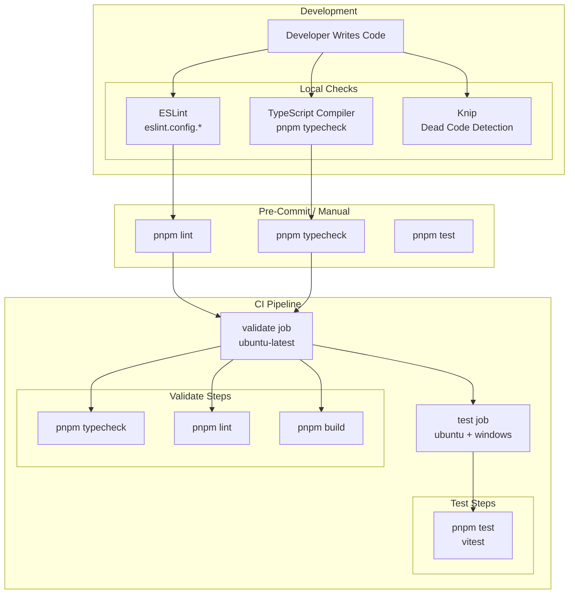
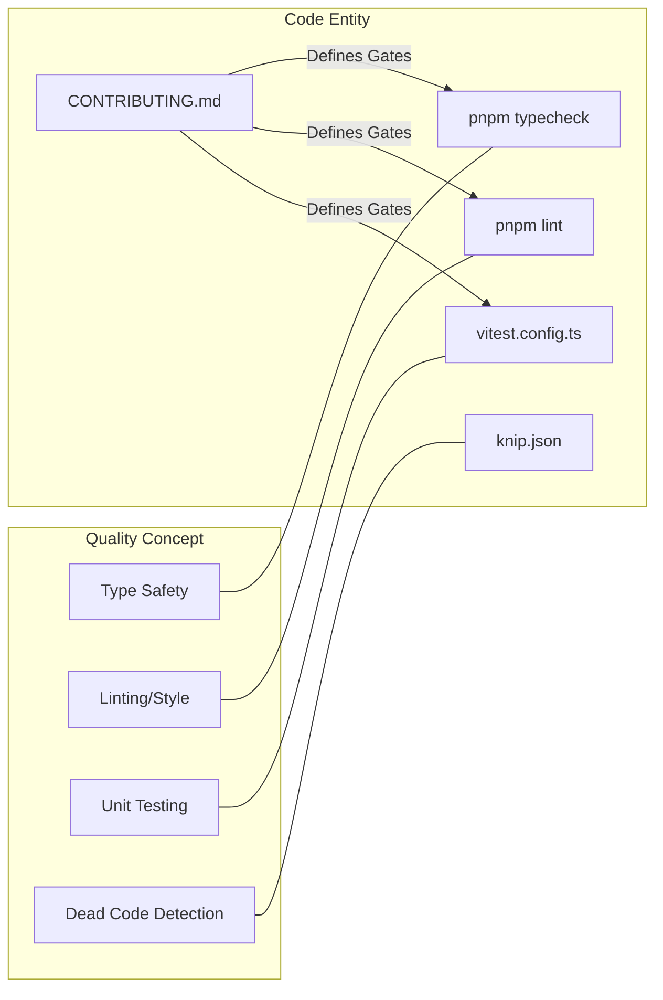

# 코드 스타일 및 품질

관련 소스 파일

다음 파일들은 이 위키 페이지를 생성하기 위한 컨텍스트로 사용되었습니다.

- [CONTRIBUTING.md](CONTRIBUTING.md)
- [vitest.config.ts](vitest.config.ts)

이 페이지는 `claude-devtools` 코드베이스에서 사용하는 코드 품질 표준, 도구, 규칙을 문서화합니다. linting, formatting, type checking, testing practices, CI validation gate를 다룹니다.

## 품질 Toolchain 개요

코드베이스는 주로 `pnpm` script와 GitHub Actions를 통해 조율되는 여러 계층의 자동화된 검증으로 품질을 강제합니다.

**출처:** [CONTRIBUTING.md:33-40](), [vitest.config.ts:1-17]()

## 품질 Gate

Pull Request를 열기 전에 contributor는 다음 품질 gate를 로컬에서 실행해야 합니다.

1.  `pnpm typecheck`: 프로젝트 전반의 TypeScript 타입을 검증합니다 [CONTRIBUTING.md:36]().
2.  `pnpm lint`: ESLint를 실행하여 coding standard를 강제합니다 [CONTRIBUTING.md:37]().
3.  `pnpm test`: Vitest suite를 실행합니다 [CONTRIBUTING.md:38]().
4.  `pnpm build`: `electron-vite` build process가 오류 없이 완료되는지 확인합니다 [CONTRIBUTING.md:39]().

**출처:** [CONTRIBUTING.md:33-40]()

## 테스트 표준

프로젝트는 unit testing에 **Vitest**를 사용하며, renderer-side 호환성을 위해 `happy-dom` 환경을 사용합니다.

### 테스트 설정

`vitest.config.ts` 파일은 테스트 환경과 coverage 요구사항을 정의합니다.

| 기능 | 설정 | 파일:라인 |
| :--- | :--- | :--- |
| **환경** | `happy-dom` | [vitest.config.ts:7]() |
| **Global API** | 활성화됨(`globals: true`) | [vitest.config.ts:6]() |
| **Timeout** | 15,000ms | [vitest.config.ts:8]() |
| **Coverage Provider** | `v8` | [vitest.config.ts:12]() |
| **Setup File** | `./test/setup.ts` | [vitest.config.ts:9]() |

### Coverage 제외

로직에 집중하기 위해 특정 entry point와 type definition은 coverage metric에서 제외됩니다.
*   `src/**/*.d.ts` (Type definition) [vitest.config.ts:15]()
*   `src/main/index.ts` (Main process entry) [vitest.config.ts:15]()
*   `src/preload/index.ts` (Preload bridge entry) [vitest.config.ts:15]()

**출처:** [vitest.config.ts:1-25]()

## 코드 구성 및 Path Alias

프로젝트는 깔끔한 import 구조를 유지하고 process별 관심사를 엄격히 분리하기 위해 path alias를 활용합니다. 이 alias들은 build configuration과 test runner 양쪽에 정의되어 있습니다.

### Path Mapping

| Alias | 대상 디렉터리 | 목적 |
| :--- | :--- | :--- |
| `@shared` | `src/shared` | Main과 Renderer 양쪽에서 사용하는 코드 [vitest.config.ts:20]() |
| `@main` | `src/main` | Main process logic 및 service [vitest.config.ts:21]() |
| `@renderer` | `src/renderer` | React UI 및 frontend state [vitest.config.ts:22]() |

**출처:** [vitest.config.ts:18-24]()

## AI 지원 Contribution 표준

AI 도구 사용은 허용되지만, 프로젝트는 "hallucinated" logic이나 technical debt를 방지하기 위해 AI 생성 코드에 엄격한 품질 표준을 적용합니다.

### AI 코드 요구사항
*   **Human Review:** AI가 생성한 코드의 모든 줄은 contributor가 읽고 이해해야 합니다 [CONTRIBUTING.md:52-54]().
*   **No Artifacts:** AI workflow file(예: `.speckit/`, `docs/plans/`, session log)은 repository에 commit하면 **안 됩니다** [CONTRIBUTING.md:55]().
*   **Intentionality:** Contributor는 PR의 모든 줄에 대한 근거를 설명할 수 있어야 합니다 [CONTRIBUTING.md:57]().
*   **Manual Verification:** AI 코드는 앱에서 수동으로 테스트해야 하며, AI가 예측했을 수 있는 범위를 넘어 edge case를 확인해야 합니다 [CONTRIBUTING.md:56]().

**출처:** [CONTRIBUTING.md:50-58]()

## Commit 및 PR 가이드라인

고품질 git history를 유지하기 위해 프로젝트는 다음 규칙을 따릅니다.

*   **Commit Style:** Conventional commit을 권장합니다(`feat:`, `fix:`, `chore:`, `docs:`) [CONTRIBUTING.md:66]().
*   **Rationale:** 사소하지 않은 변경은 commit body에 근거를 포함해야 합니다 [CONTRIBUTING.md:67]().
*   **PR Scope:** PR은 단일 목적에 집중하도록 유지하세요. 큰 변경이나 새로운 dependency는 Issue에서 사전 논의가 필요합니다 [CONTRIBUTING.md:43-47]().

**출처:** [CONTRIBUTING.md:42-49](), [CONTRIBUTING.md:65-68]()

## Code Entity Space Mapping

다음 다이어그램은 high-level 품질 개념을 코드베이스의 특정 configuration entity에 매핑합니다.

**출처:** [CONTRIBUTING.md:33-40](), [vitest.config.ts:1-25]()
