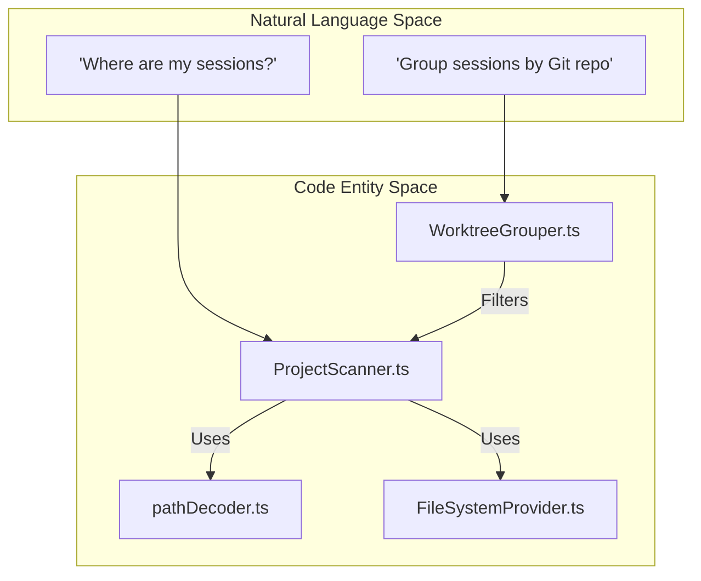
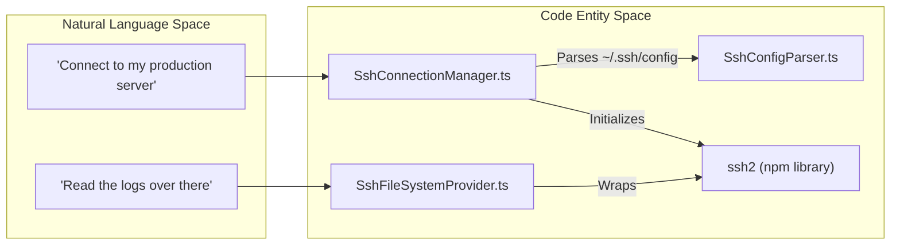

# 용어집

관련 소스 파일

다음 파일들은 이 위키 페이지를 생성하기 위한 컨텍스트로 사용되었습니다.

- [.github/workflows/release.yml](.github/workflows/release.yml)
- [README.md](README.md)
- [package.json](package.json)
- [pnpm-lock.yaml](pnpm-lock.yaml)
- [resources/afterInstall.sh](resources/afterInstall.sh)
- [src/main/services/discovery/ProjectScanner.ts](src/main/services/discovery/ProjectScanner.ts)
- [src/main/services/infrastructure/SshConnectionManager.ts](src/main/services/infrastructure/SshConnectionManager.ts)
- [src/main/types/messages.ts](src/main/types/messages.ts)
- [src/main/utils/jsonl.ts](src/main/utils/jsonl.ts)
- [src/preload/index.ts](src/preload/index.ts)
- [src/renderer/api/httpClient.ts](src/renderer/api/httpClient.ts)
- [src/renderer/components/chat/ChatHistoryItem.tsx](src/renderer/components/chat/ChatHistoryItem.tsx)
- [src/renderer/components/chat/ContextBadge.tsx](src/renderer/components/chat/ContextBadge.tsx)
- [src/renderer/components/chat/SessionContextPanel/components/FlatInjectionList.tsx](src/renderer/components/chat/SessionContextPanel/components/FlatInjectionList.tsx)
- [src/renderer/components/common/UpdateDialog.tsx](src/renderer/components/common/UpdateDialog.tsx)
- [src/renderer/components/settings/sections/AdvancedSection.tsx](src/renderer/components/settings/sections/AdvancedSection.tsx)
- [src/renderer/components/sidebar/SessionItem.tsx](src/renderer/components/sidebar/SessionItem.tsx)
- [src/renderer/store/slices/sessionSlice.ts](src/renderer/store/slices/sessionSlice.ts)
- [src/renderer/types/contextInjection.ts](src/renderer/types/contextInjection.ts)
- [src/renderer/utils/contextTracker.ts](src/renderer/utils/contextTracker.ts)
- [src/shared/types/api.ts](src/shared/types/api.ts)

이 페이지는 `claude-devtools` 프로젝트 전반에서 사용되는 코드베이스 고유 용어, 전문 용어, 도메인 개념의 정의를 제공합니다. 온보딩 중인 엔지니어가 추상적인 개념이 특정 code entity에 어떻게 매핑되는지 이해할 수 있도록 돕는 기술 레퍼런스 역할을 합니다.

## 핵심 개념

### Session
**Session**은 Claude Code의 단일 실행 인스턴스를 나타냅니다. 사용자의 `.claude/projects/` 디렉터리에 저장된 `.jsonl` 파일을 기반으로 합니다. 각 session은 message(user, assistant, system)와 tool call의 시퀀스를 포함합니다.

*   **Code Entity:** `Session` interface [src/main/types/index.ts:23-28]().
*   **Data Flow:** `ProjectScanner`가 디스크에서 이를 읽고 [src/main/services/discovery/ProjectScanner.ts:5-9](), `parseJsonlFile` utility가 raw line을 구조화된 객체로 변환합니다 [src/main/utils/jsonl.ts:52-55]().

### Project
**Project**는 사용자 머신의 특정 디렉터리와 연결된 session의 논리적 그룹입니다. Claude Code는 project path를 `~/.claude/projects/` 내부의 디렉터리 이름으로 인코딩합니다.

*   **Code Entity:** `Project` interface [src/shared/types/api.ts:21-21]().
*   **Implementation:** Project는 `projectId`로 식별되며, 이는 종종 working directory의 base64-encoded path입니다 [src/main/utils/pathDecoder.ts:38-44]().

### Context Reconstruction
raw JSONL log를 읽어 conversation state를 재구성하는 과정입니다. 여기에는 Claude Code CLI에서 일반적으로 숨겨지는 hidden system prompt, tool output, token usage가 포함됩니다.

*   **Key Logic:** `analyzeSessionFileMetadata` [src/main/utils/jsonl.ts:30-33]() 및 `sessionAnalyzer` [src/main/services/analysis/SessionAnalyzer.ts]().

---

## 기술 용어 및 약어

| 용어 | 정의 | Code Pointer |
| :--- | :--- | :--- |
| **JSONL** | JSON Lines. 각 줄이 유효한 JSON 객체인 Claude Code log의 저장 형식입니다. | [src/main/utils/jsonl.ts:4-8]() |
| **IPC** | Inter-Process Communication. Electron이 Main process와 Renderer process 사이에서 데이터를 전송하는 데 사용하는 메커니즘입니다. | [src/preload/index.ts:128-154]() |
| **Sidechain** | Claude가 생성한 보조 conversation thread(예: subagent용)로, main chat과 병렬로 실행됩니다. | [src/main/types/index.ts:124-125]() |
| **SFTP** | SSH File Transfer Protocol. 앱이 remote server에서 session log를 읽는 데 사용합니다. | [src/main/services/infrastructure/SshConnectionManager.ts:6-10]() |
| **SSE** | Server-Sent Events. HTTP Sidecar가 browser-based renderer에 update를 push하는 데 사용합니다. | [src/renderer/api/httpClient.ts:4-7]() |
| **Worktree** | 동일한 repository에 연결된 여러 working tree를 허용하는 Git 기능입니다. 앱은 이를 함께 그룹화합니다. | [src/main/services/discovery/WorktreeGrouper.ts:13-16]() |

---

## 도메인 매핑: 자연어에서 코드로

다음 다이어그램은 사용자가 feature를 설명하는 방식과 해당 feature가 코드베이스에서 구현되는 방식 사이의 간극을 연결합니다.

### Session Discovery Mapping
*"Finding my Claude logs"가 Scanning subsystem에 어떻게 매핑되는지.*

**출처:** [src/main/services/discovery/ProjectScanner.ts:11-16](), [src/main/utils/pathDecoder.ts:41-44](), [src/main/services/infrastructure/FileSystemProvider.ts:57-58]()

### Remote Access Mapping
*"Connecting to my server"가 SSH subsystem에 어떻게 매핑되는지.*

**출처:** [src/main/services/infrastructure/SshConnectionManager.ts:1-10](), [src/main/services/infrastructure/SshFileSystemProvider.ts:22-23](), [src/main/services/infrastructure/SshConfigParser.ts:21-22]()

---

## 시스템 약어

*   **`CSC`**: Code Signing Certificate. release pipeline에서 macOS notarization에 사용됩니다 [ .github/workflows/release.yml:108-109]().
*   **`UNC`**: Universal Naming Convention. Windows에서 WSL path를 resolve하는 데 특별히 사용됩니다(예: `\\wsl$\Ubuntu\...`) [src/shared/types/api.ts:103-104]().
*   **`JSONL Line`**: 단일 `ChatHistoryEntry`이며, 이후 `ParsedMessage`로 parse됩니다 [src/main/utils/jsonl.ts:88-95]().

---

## 구현 세부사항: 데이터 흐름

### Message의 Lifecycle
1.  **Read:** `LocalFileSystemProvider` 또는 `SshFileSystemProvider`가 `.jsonl` 파일에서 한 줄을 읽습니다.
2.  **Parse:** `parseJsonlLine`이 string을 `ChatHistoryEntry`로 변환합니다 [src/main/utils/jsonl.ts:88-95]().
3.  **Refine:** `parseChatHistoryEntry`가 tool call과 token usage를 추출하고, 이것이 "Sidechain" message인지 식별합니다 [src/main/utils/jsonl.ts:104-194]().
4.  **Deduplicate:** streaming assistant response의 경우, `deduplicateStreamingMessages`는 최종 chunk(완전한 token count를 포함)만 유지되도록 보장합니다 [src/main/utils/jsonl.ts:224-233]().
5.  **Store:** message는 IPC를 통해 Renderer로 전송되고 Zustand store의 `sessionSlice`에 저장됩니다 [src/renderer/store/slices/sessionSlice.ts:85-105]().

**출처:** [src/main/utils/jsonl.ts:1-233](), [src/renderer/store/slices/sessionSlice.ts:1-105](), [src/main/services/infrastructure/FileSystemProvider.ts:1-30]()
