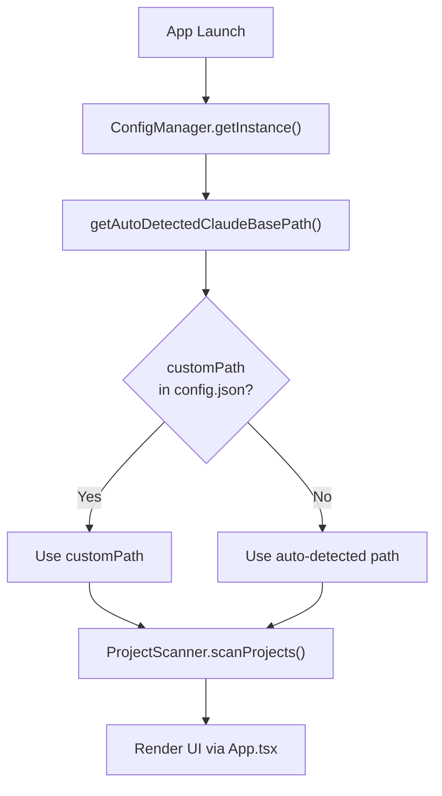
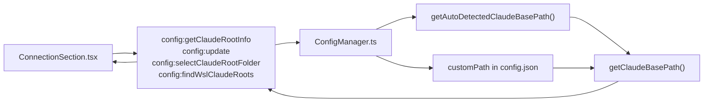
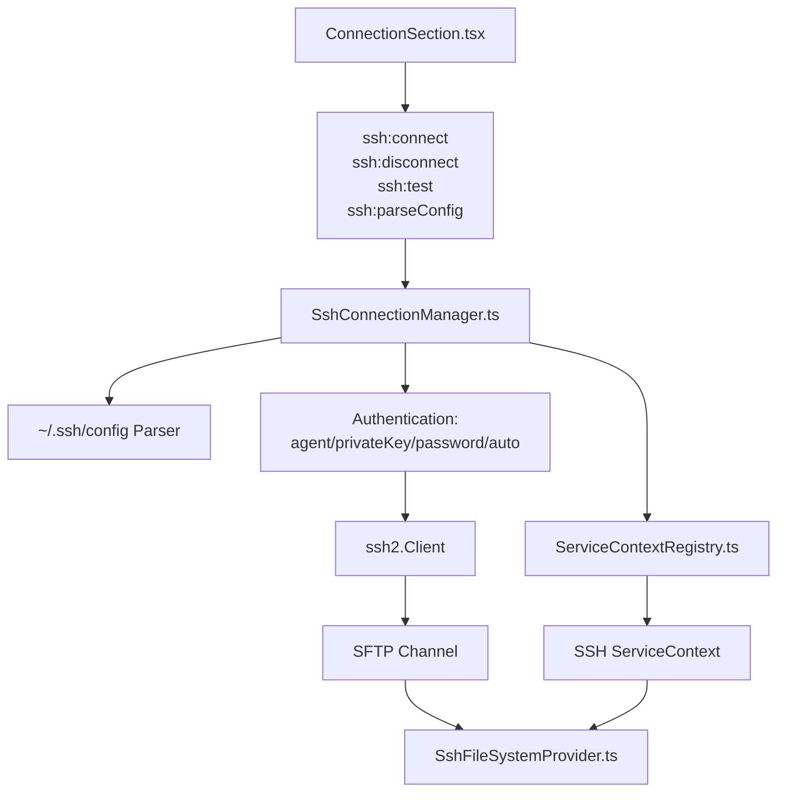

# 시작하기

<details>
<summary>관련 소스 파일</summary>

다음 파일들은 이 위키 페이지를 생성하기 위한 컨텍스트로 사용되었습니다.

- [.dockerignore](.dockerignore)
- [Dockerfile](Dockerfile)
- [README.md](README.md)
- [SECURITY.md](SECURITY.md)
- [docker-compose.yml](docker-compose.yml)
- [src/renderer/components/common/UpdateDialog.tsx](src/renderer/components/common/UpdateDialog.tsx)
- [src/renderer/components/settings/sections/AdvancedSection.tsx](src/renderer/components/settings/sections/AdvancedSection.tsx)
- [vite.standalone.config.ts](vite.standalone.config.ts)

</details>


이 문서는 `claude-devtools`의 설치, 초기 구성, 기본 사용법을 다룹니다. 로컬 Claude 루트 디렉터리를 구성하고, SSH 원격 연결을 설정하며, 애플리케이션 인터페이스를 탐색하는 방법을 설명합니다.

기반 시스템의 아키텍처 세부 정보는 [Architecture]()를 참조하세요. SSH 연결 내부 구조는 [SSH Remote Access]()를 참조하세요. 구성 관리 세부 정보는 [Configuration Management]()를 참조하세요.

---

## 사전 요구 사항

`claude-devtools`는 Claude Code의 데이터 디렉터리에서 세션 로그를 읽습니다. 애플리케이션이 올바른 디렉터리를 가리키도록 하는 것 외에는 API 키나 추가 구성이 필요하지 않습니다.

**시스템 요구 사항:**
- `~/.claude/`에 세션 데이터가 있는 Claude Code 설치
- macOS(10.13+), Windows(10+) 또는 Linux
- SSH 원격 접근의 경우: 대상 머신에 SFTP 지원 SSH 서버

**출처:** [README.md:84-85](), [README.md:26-26]()

---

## 설치

[latest release](https://github.com/matt1398/claude-devtools/releases/latest)에서 적절한 설치 파일을 다운로드하세요.

| 플랫폼 | 패키지 형식 | 설치 참고 사항 |
|----------|---------------|-------------------|
| **macOS (Apple Silicon)** | `.dmg` (arm64) | Applications 폴더로 드래그합니다. 첫 실행 시 우클릭 → Open을 선택합니다(Gatekeeper 우회). [README.md:78-78]() |
| **macOS (Intel)** | `.dmg` (x64) | Apple Silicon과 동일합니다. [README.md:79-79]() |
| **Windows** | `.exe` | 표준 설치 프로그램입니다. SmartScreen이 표시될 수 있습니다. "More info" → "Run anyway"를 클릭하세요. [README.md:81-81]() |
| **Linux** | `.AppImage`, `.deb`, `.rpm`, `.pacman` | AppImage는 포터블 형식입니다. 패키지 형식은 시스템 패키지 관리자와 통합됩니다. [README.md:80-80]() |
| **Homebrew (macOS)** | Cask | `brew install --cask claude-devtools`. [README.md:70-72]() |
| **Docker** | Image | `docker compose up`. `http://localhost:3456`을 엽니다. [README.md:82-82]() |

이 애플리케이션은 서명되지 않았으므로 macOS와 Windows에서 보안 경고가 표시됩니다. 공식 스토어 외부에서 배포되는 오픈소스 애플리케이션에서는 예상되는 동작입니다.

---

## 첫 실행: 자동 감지

### 초기화 흐름

첫 실행 시 애플리케이션은 플랫폼별 휴리스틱을 사용해 Claude 루트 디렉터리를 자동으로 감지합니다.

**자연어와 코드 엔티티 매핑: 초기화**



**자동 감지 로직:**
1. `CLAUDE_HOME` 환경 변수를 확인합니다.
2. `~/.claude`로 폴백합니다(사용자 홈 디렉터리로 확장됨).
3. Windows의 경우: `C:\Users\<username>\.claude`로 해석합니다.
4. macOS/Linux의 경우: `/Users/<username>/.claude` 또는 `/home/<username>/.claude`로 해석합니다.

**출처:** [Dockerfile:49-49](), [SECURITY.md:19-22]()

---

## 로컬 Claude 루트 구성

### 구성 시스템 아키텍처

로컬 Claude 루트는 `ConfigManager`가 관리하며, IPC 핸들러를 통해 조회하거나 재정의할 수 있습니다.

**자연어와 코드 엔티티 매핑: 구성 IPC**



### 현재 구성 보기

Settings 패널(⌘ + , 또는 Cmd+Comma)은 **Connection → Local Claude Root** 아래에 현재 Claude 루트 구성을 표시합니다.

### 수동 재정의

자동 감지된 경로를 재정의하려면 다음을 수행하세요.

1. Settings(⌘ + ,)를 엽니다.
2. **Connection → Local Claude Root**로 이동합니다.
3. **Select Folder**를 클릭합니다.
4. 디렉터리를 선택합니다(검증 과정에서 `.claude` 이름과 `projects/` 하위 디렉터리를 확인합니다).

폴더 선택기는 Electron의 네이티브 `dialog.showOpenDialog` [vite.standalone.config.ts:58-58]()를 통해 구현됩니다.

선택 후 구성은 `~/.claude/claude-devtools-config.json` [SECURITY.md:21-21]()에 유지되며, 새 루트에서 프로젝트를 다시 스캔하기 위해 워크스페이스가 재설정됩니다.

### WSL 지원(Windows 전용)

Windows에서 자동 감지된 경로가 Windows 스타일 경로(예: `C:\Users\...`)이고 WSL 내부에서 Claude Code를 사용 중이라면, 앱이 WSL 배포판과 해당 `~/.claude` 디렉터리를 스캔할 수 있습니다.

---

## SSH 원격 접근 설정

### SSH 연결 아키텍처

SSH 시스템은 `SshConnectionManager`를 사용해 연결을 수립하고, `ServiceContextRegistry`를 사용해 격리된 컨텍스트를 관리합니다.



### 연결 방식

네 가지 인증 방식이 지원됩니다.

| 방식 | 설명 | 구성 |
|--------|-------------|---------------|
| **Auto** | `~/.ssh/config`에서 읽습니다 | SSH config에 Host alias가 있어야 합니다 |
| **Agent** | SSH agent forwarding을 사용합니다 | 키가 로드된 상태로 Agent가 실행 중이어야 합니다 |
| **Private Key** | 키 파일을 직접 사용합니다 | private key 파일 경로(예: `~/.ssh/id_rsa`) |
| **Password** | 대화형 password 프롬프트를 사용합니다 | Password는 저장되지 않습니다(연결 시 입력 요청) |

**출처:** [SECURITY.md:10-10]()

---

## Docker / Standalone 모드

Electron을 사용할 수 없는 환경(예: headless servers, 원격 개발 containers)에서는 `claude-devtools`를 standalone 모드로 실행할 수 있습니다.

### Docker로 실행

```bash
docker compose up
```

이 명령은 포트 `3456`에서 Fastify 기반 HTTP 서버를 시작합니다 [docker-compose.yml:19-19](). 기본적으로 `${CLAUDE_DIR:-~/.claude}`를 `/data/.claude`에 읽기 전용으로 마운트합니다 [docker-compose.yml:21-21]().

### 보안 및 격리

- **No Outbound Calls**: standalone 모드에서는 auto-updater와 SSH 기능이 비활성화됩니다 [SECURITY.md:15-15]().
- **Network Isolation**: 최대한의 보안을 위해 `--network none`으로 실행하세요 [SECURITY.md:29-31]().
- **Read-Only**: 볼륨 마운트는 `:ro`를 사용하여 앱이 세션 로그를 절대 수정하지 않도록 합니다 [SECURITY.md:20-20]().

**출처:** [Dockerfile:1-56](), [docker-compose.yml:1-34](), [vite.standalone.config.ts:1-116]()

---

## 자동 업데이트(Electron 전용)

애플리케이션은 `GitHub Releases API` [SECURITY.md:9-9]()를 사용해 업데이트를 확인합니다.

1. **Update Check**: 실행 시 또는 **Settings → About → Check for Updates** [src/renderer/components/settings/sections/AdvancedSection.tsx:157-172]()를 통해 수동으로 트리거됩니다.
2. **Notification**: 업데이트가 있으면 `updateStatus`가 `available`로 변경됩니다 [src/renderer/components/settings/sections/AdvancedSection.tsx:72-81]().
3. **Dialog**: `UpdateDialog` 컴포넌트는 HTML에서 Markdown으로 파싱된 릴리스 노트를 표시합니다 [src/renderer/components/common/UpdateDialog.tsx:20-39]().
4. **Action**: **Download**를 클릭하면 store를 통해 `downloadUpdate`가 트리거됩니다 [src/renderer/components/common/UpdateDialog.tsx:45-45]().

**출처:** [src/renderer/components/common/UpdateDialog.tsx:41-181](), [src/renderer/components/settings/sections/AdvancedSection.tsx:56-90]()

---

## 고급 구성 관리

**Settings → Advanced**에서 사용자는 애플리케이션의 내부 구성 상태를 관리할 수 있습니다.

- **Reset to Defaults**: 모든 사용자 지정 설정을 지웁니다 [src/renderer/components/settings/sections/AdvancedSection.tsx:97-107]().
- **Export/Import Config**: 설정과 SSH profiles의 이식성을 제공합니다 [src/renderer/components/settings/sections/AdvancedSection.tsx:109-131]().
- **Open in Editor**: 시스템 기본 편집기에서 `claude-devtools-config.json` 파일을 직접 엽니다(Electron 전용) [src/renderer/components/settings/sections/AdvancedSection.tsx:133-144]().

**출처:** [src/renderer/components/settings/sections/AdvancedSection.tsx:94-145](), [SECURITY.md:21-21]()
