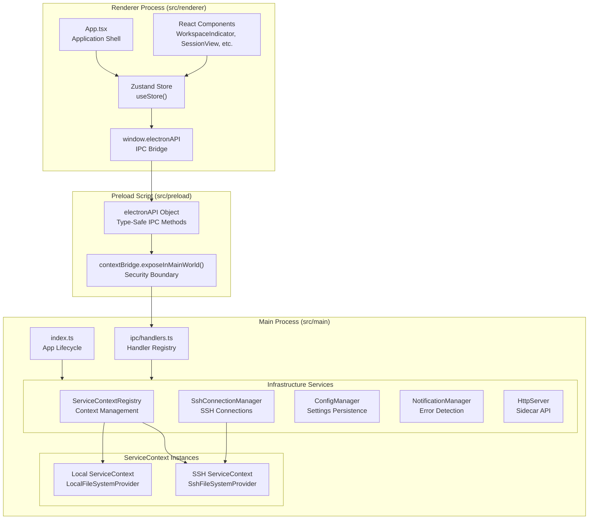
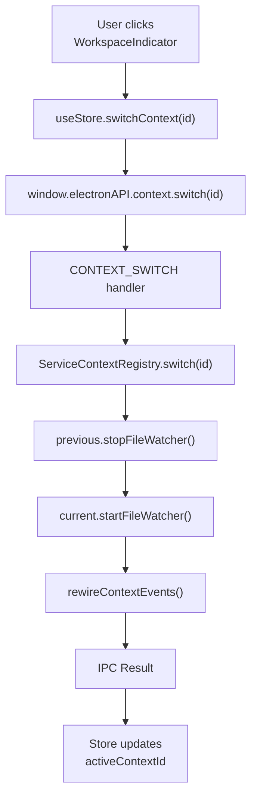

# 아키텍처

관련 소스 파일

다음 파일들은 이 위키 페이지를 생성하기 위한 컨텍스트로 사용되었습니다.

- [src/main/index.ts](src/main/index.ts)
- [src/main/services/infrastructure/ServiceContext.ts](src/main/services/infrastructure/ServiceContext.ts)
- [src/main/services/infrastructure/ServiceContextRegistry.ts](src/main/services/infrastructure/ServiceContextRegistry.ts)
- [src/main/services/infrastructure/index.ts](src/main/services/infrastructure/index.ts)
- [src/preload/constants/ipcChannels.ts](src/preload/constants/ipcChannels.ts)
- [src/renderer/components/common/WorkspaceIndicator.tsx](src/renderer/components/common/WorkspaceIndicator.tsx)

## 목적과 범위

이 페이지는 claude-devtools의 시스템 아키텍처와 설계 철학을 높은 수준에서 개괄합니다. 주요 아키텍처 패턴, 컴포넌트 구성, 애플리케이션 전반의 데이터 흐름을 다룹니다. 특정 하위 시스템에 대한 자세한 정보는 다음을 참조하세요.

- [Electron Process Model](#3.1) — 3개 프로세스로 구성된 Electron 아키텍처가 어떻게 구조화되는지: main process 서비스, preload 보안 경계, renderer UI
- [Multi-Context System](#3.2) — `ServiceContextRegistry`, 컨텍스트 전환, 그리고 애플리케이션이 로컬 및 SSH 원격 환경을 모두 지원하는 방식
- [IPC Communication Layer](#3.3) — 프로세스 간 통신 패턴, `electronAPI` 브리지, 핸들러 등록, 타입 안전 IPC 추상화
- [State Management](#3.4) — Zustand store 아키텍처, slice 구성, 실시간 이벤트 처리, 컨텍스트 스냅샷

## 설계 철학

Claude-devtools는 엄격한 프로세스 분리와 함께 Electron의 보안 모델을 따르며, main process에서 서비스 지향 아키텍처를 사용합니다. 애플리케이션은 확장성을 염두에 두고 설계되었으며, 통합 추상화 계층을 통해 로컬 및 원격(SSH) 데이터 소스를 모두 지원합니다.

### 핵심 원칙

| 원칙 | 구현 |
|-----------|---------------|
| **Security First** | Context isolation, renderer에서 Node.js 미사용, `contextBridge` API 노출 |
| **Abstraction** | 로컬/SSH 투명성을 위한 `FileSystemProvider` 인터페이스 |
| **Service-Oriented** | 명확한 책임을 가진 도메인 서비스 |
| **Type Safety** | 전체 TypeScript 사용, `IpcResult<T>` 패턴을 통한 타입 안전 IPC |
| **Real-Time** | file watcher와 IPC broadcast를 통한 이벤트 기반 업데이트 |

출처: [src/main/index.ts:1-10](), [src/main/services/infrastructure/FileSystemProvider.ts:1-21]()

## 고수준 아키텍처

애플리케이션은 main process의 서비스 계층과 renderer의 React 기반 UI를 갖춘 Electron의 3개 프로세스 모델을 따릅니다.

### 프로세스 경계와 서비스 계층

**핵심 컴포넌트:**

- **Main Process** ([src/main/index.ts:1-10]()): 서비스를 초기화하고, window 수명 주기를 관리하며, `ServiceContextRegistry`를 통해 컨텍스트 전환을 조율합니다.
- **Preload Script**: `contextBridge`를 통해 `electronAPI`를 노출하여 renderer가 main process와 통신할 수 있는 안전하고 타입 안전한 인터페이스를 제공합니다.
- **Renderer Process**: 상태 관리를 위해 Zustand를 사용하는 React 애플리케이션입니다. 오직 `window.electronAPI` 브리지를 통해서만 백엔드와 상호작용합니다.
- **Service Layer**: SSH, 구성, 알림 같은 횡단 관심사를 처리하는 singleton infrastructure services([src/main/services/infrastructure/index.ts:1-33]())의 모음입니다.
- **Context System**: `ServiceContext` instances([src/main/services/infrastructure/ServiceContext.ts:62-80]())는 특정 환경(로컬 또는 원격)을 위한 전체 파싱 및 스캔 스택을 캡슐화합니다.

출처: [src/main/index.ts:62-83](), [src/main/services/infrastructure/index.ts:1-33](), [src/main/services/infrastructure/ServiceContext.ts:62-80]()

## 서비스 아키텍처

main process는 기능을 도메인 서비스로 구성하며, 이 서비스들은 시작 시 초기화되고 IPC 핸들러를 통해 접근됩니다.

### 핵심 서비스

| 서비스 | 책임 | 수명 주기 |
|---------|-----------------|-----------|
| `ServiceContextRegistry` | 여러 `ServiceContext` instances를 관리하고 활성 인스턴스를 추적합니다. | Singleton, [src/main/services/infrastructure/ServiceContextRegistry.ts:31-220]() |
| `ServiceContext` | 특정 워크스페이스에 대한 `ProjectScanner`, `SessionParser`, `FileWatcher`를 묶습니다. | Per-context, [src/main/services/infrastructure/ServiceContext.ts:62-80]() |
| `SshConnectionManager` | SSH 연결 수명 주기와 SFTP 접근을 관리합니다. | Singleton, [src/main/services/infrastructure/SshConnectionManager.ts:1-50]() |
| `ConfigManager` | 애플리케이션 설정을 유지하고 Claude 루트 감지를 처리합니다. | Singleton, [src/main/services/infrastructure/ConfigManager.ts:1-40]() |
| `NotificationManager` | 세션의 오류를 감지하고 네이티브/UI 알림을 전달합니다. | Singleton, [src/main/services/infrastructure/NotificationManager.ts:1-25]() |
| `HttpServer` | 외부 API 접근 및 SSE 이벤트를 위한 Fastify 기반 sidecar입니다. | Singleton, [src/main/services/infrastructure/HttpServer.ts:1-23]() |

출처: [src/main/services/infrastructure/index.ts:1-33](), [src/main/index.ts:78-83]()

## 데이터 흐름 패턴

### 세션 탐색 및 표시 파이프라인

```mermaid
graph LR
    FS["File System<br/>~/.claude/projects/"]
    FSProvider["FileSystemProvider<br/>Local or SSH"]
    Scanner["ProjectScanner<br/>scanProjects()"]
    Parser["SessionParser<br/>parseSessionFile()"]
    Cache["DataCache<br/>LRU Storage"]
    IPC["IPC Handler<br/>get-sessions"]
    Store["sessionSlice<br/>Zustand State"]
    UI["SessionList Component"]
    
    FS --> FSProvider
    FSProvider --> Scanner
    Scanner --> Parser
    Parser --> Cache
    Cache --> IPC
    IPC --> Store
    Store --> UI
```

각 `ServiceContext`는 자체 탐색 및 파싱 서비스 스택을 포함합니다([src/main/services/infrastructure/ServiceContext.ts:81-119]()). `FileSystemProvider` 인터페이스를 통해 파일 시스템을 추상화함으로써, 나머지 스택은 데이터가 로컬인지 원격인지에 영향을 받지 않습니다.

출처: [src/main/services/infrastructure/ServiceContext.ts:81-119](), [src/main/services/infrastructure/FileSystemProvider.ts:1-21]()

### 실시간 업데이트 흐름

File watcher는 컨텍스트별로 존재합니다. `FileWatcher`([src/main/services/infrastructure/FileWatcher.ts:1-26]())가 파일 변경을 감지하면, 이벤트는 `wireFileWatcherEvents`([src/main/index.ts:105-139]())를 통해 연결되어 Electron renderer와 연결된 모든 HTTP SSE 클라이언트에 알립니다.

출처: [src/main/index.ts:105-139](), [src/main/services/infrastructure/ServiceContext.ts:144-160]()

## 컨텍스트 전환 메커니즘

애플리케이션은 런타임에 로컬 환경과 SSH 환경 간 전환을 지원합니다. `ServiceContextRegistry`([src/main/services/infrastructure/ServiceContextRegistry.ts:119-146]())는 이전 컨텍스트의 `FileWatcher`를 중지하고 새 컨텍스트의 `FileWatcher`를 시작하는 방식으로 이를 관리합니다.

### Context Registry와 전환

`WorkspaceIndicator` 컴포넌트([src/renderer/components/common/WorkspaceIndicator.tsx:17-138]())는 이 전환을 위한 UI를 제공하여, 사용자가 서로 다른 구성 환경 사이를 이동할 수 있게 합니다.

출처: [src/main/services/infrastructure/ServiceContextRegistry.ts:119-146](), [src/renderer/components/common/WorkspaceIndicator.tsx:17-138](), [src/main/index.ts:164-175]()

## IPC 핸들러 구성

IPC 핸들러는 main process에 중앙화되어 있으며 도메인별로 구성됩니다. main process와 renderer process 간 일관성을 보장하기 위해 `@preload/constants/ipcChannels`의 상수를 사용합니다.

| 도메인 | 채널 접두사 | 목적 |
|--------|----------------|---------|
| Config | `config:` | 설정, ignore lists, triggers |
| SSH | `ssh:` | 연결, host resolution, status |
| Context | `context:` | 환경 전환 및 목록 조회 |
| Updater | `updater:` | 업데이트 확인 및 설치 |
| Window | `window:` | 사용자 지정 title bar controls |

출처: [src/preload/constants/ipcChannels.ts:1-180](), [src/main/index.ts:24-25]()

## 상태 관리 아키텍처

renderer는 전역 상태 관리를 위해 Zustand를 사용하며, 모듈식 slice로 구성됩니다. 이 상태에는 main process에서 가져온 데이터(sessions, projects)와 UI 상태(active tabs, search filters)가 포함됩니다.

store의 책임은 다음과 같습니다.
1.  **Data Fetching**: `window.electronAPI`를 통해 IPC 메서드를 호출합니다.
2.  **Event Listening**: `file-change` 또는 `ssh:status` 같은 실시간 이벤트를 구독합니다.
3.  **Context Snapshots**: 로컬 및 SSH 컨텍스트 사이를 전환할 때 UI 상태를 저장하고 복원합니다.

출처: [src/renderer/store/index.ts:1-20](), [src/renderer/components/common/WorkspaceIndicator.tsx:18-25]()
