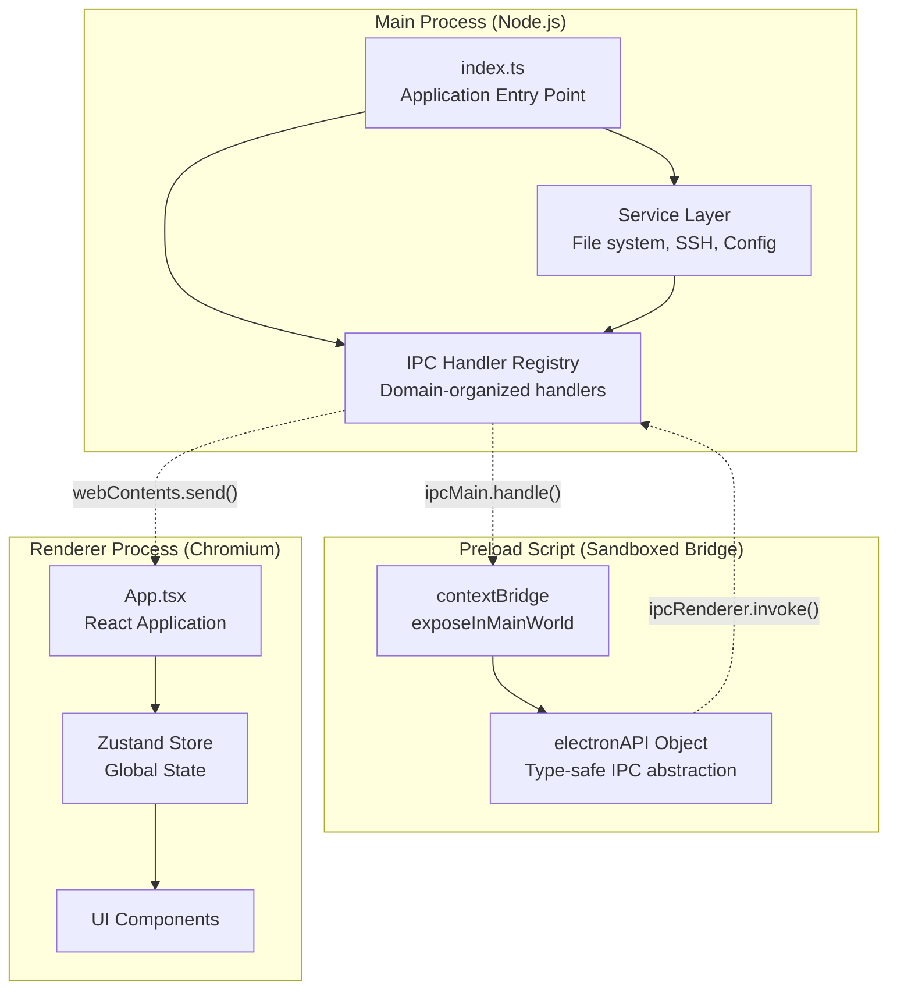
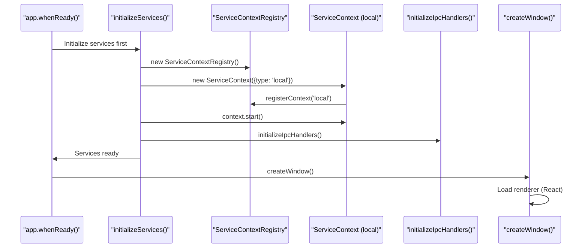
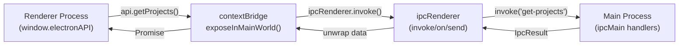
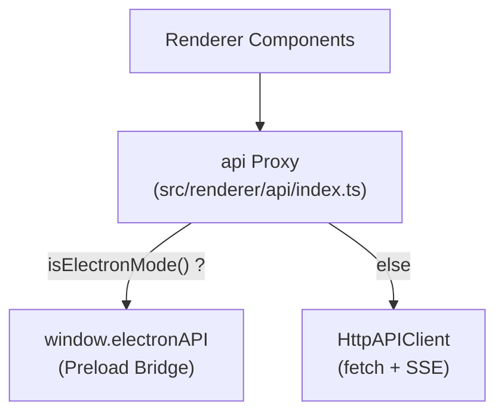
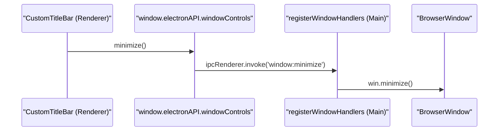

# Electron 프로세스 모델

<details>
<summary>관련 소스 파일</summary>

다음 파일들은 이 위키 페이지를 생성하기 위한 컨텍스트로 사용되었습니다.

- [src/main/index.ts](src/main/index.ts)
- [src/main/ipc/window.ts](src/main/ipc/window.ts)
- [src/preload/constants/ipcChannels.ts](src/preload/constants/ipcChannels.ts)
- [src/preload/index.ts](src/preload/index.ts)
- [src/renderer/api/httpClient.ts](src/renderer/api/httpClient.ts)
- [src/renderer/api/index.ts](src/renderer/api/index.ts)
- [src/renderer/components/common/UpdateBanner.tsx](src/renderer/components/common/UpdateBanner.tsx)
- [src/renderer/components/layout/CustomTitleBar.tsx](src/renderer/components/layout/CustomTitleBar.tsx)
- [src/renderer/components/layout/SidebarHeader.tsx](src/renderer/components/layout/SidebarHeader.tsx)
- [src/renderer/components/layout/TabbedLayout.tsx](src/renderer/components/layout/TabbedLayout.tsx)
- [src/shared/types/api.ts](src/shared/types/api.ts)

</details>


## 목적과 범위

이 페이지는 `claude-devtools`가 사용하는 3개 프로세스 Electron 아키텍처를 문서화합니다. 여기에는 **main process**(권한 있는 접근을 가진 Node.js 환경), **preload script**(보안 경계), **renderer process**(React UI를 실행하는 샌드박스 처리된 브라우저 환경)가 포함됩니다. 또한 HTTP sidecar를 통해 renderer가 Electron 모드와 standalone 브라우저 모드 모두에서 동작할 수 있게 하는 통합 API 어댑터도 다룹니다.

main process가 관리하는 특정 서비스와 컨텍스트에 대한 정보는 [Multi-Context System]()을 참조하세요. IPC 통신 패턴과 핸들러 구현 세부 정보는 [IPC Communication Layer]()를 참조하세요. renderer 측 상태 관리 패턴은 [State Management]()를 참조하세요.

---

## 3개 프로세스 아키텍처 개요

Claude-devtools는 엄격한 프로세스 분리를 적용하는 Electron의 보안 우선 아키텍처를 따릅니다. 각 프로세스는 서로 다른 책임과 기능을 가집니다.

Title: Process Architecture Overview


**프로세스 격리 보장:**
- Main process는 전체 Node.js API 접근 권한과 파일 시스템 권한을 가집니다 [src/main/index.ts:1-10]().
- Preload script는 `contextIsolation: true`와 제한된 API 노출 환경에서 실행됩니다 [src/main/index.ts:436-437]().
- Renderer process는 Node.js API에 직접 접근할 수 없으며 `window.electronAPI` 브리지를 사용해야 합니다 [src/renderer/api/index.ts:1-13]().

**출처:** [src/main/index.ts:1-60](), [src/preload/index.ts:1-31](), [src/renderer/api/index.ts:1-13]()

---

## Main Process: 권한 있는 서비스 계층

main process(`src/main/index.ts`)는 애플리케이션 오케스트레이터 역할을 하며 수명 주기, 서비스, 시스템 수준 작업을 관리합니다.

### 핵심 책임

| 책임 | 구현 | 주요 클래스 / 함수 |
|---------------|----------------|-------------|
| **Application Lifecycle** | Window 생성, app ready/quit 핸들러 | `BrowserWindow`, `app` [src/main/index.ts:20-20]() |
| **Service Registry** | 컨텍스트 범위 서비스 인스턴스 | `ServiceContextRegistry` [src/main/index.ts:67-67]() |
| **SSH Management** | 원격 연결 수명 주기 | `SshConnectionManager` [src/main/index.ts:68-68]() |
| **File Watching** | 실시간 세션 업데이트 | `wireFileWatcherEvents` [src/main/index.ts:105-139]() |
| **Configuration** | 설정 유지 | `configManager` [src/main/index.ts:63-63]() |
| **Notifications** | 네이티브 OS 알림 | `NotificationManager` [src/main/index.ts:65-65]() |
| **HTTP Server** | 선택적 sidecar API | `HttpServer` [src/main/index.ts:61-61]() |
| **Auto-Updates** | 업데이트 확인/설치 | `UpdaterService` [src/main/index.ts:69-69]() |

### 서비스 초기화 흐름

Title: Main Process Initialization Sequence


**출처:** [src/main/index.ts:229-342](), [src/main/index.ts:540-585]()

### 전역 서비스 인스턴스

main process는 애플리케이션 전반의 상태를 조율하기 위해 singleton 또는 registry가 관리하는 서비스 인스턴스를 유지합니다.

```typescript
// Global service state (src/main/index.ts:76-83)
let mainWindow: BrowserWindow | null = null;
let contextRegistry: ServiceContextRegistry;
let notificationManager: NotificationManager;
let updaterService: UpdaterService;
let sshConnectionManager: SshConnectionManager;
let httpServer: HttpServer;
```

**서비스 수명 주기:**
1. **Initialization**: window가 열리기 전에 서비스가 생성되고 로컬 컨텍스트가 시작됩니다 [src/main/index.ts:229-277]().
2. **Operation**: 활성 `ServiceContext`의 File watcher 이벤트는 `webContents.send`를 통해 renderer에 연결됩니다 [src/main/index.ts:105-139]().
3. **Shutdown**: `before-quit` 이벤트 중 컨텍스트와 연결이 정리되어 폐기됩니다 [src/main/index.ts:375-407]().

**출처:** [src/main/index.ts:76-83](), [src/main/index.ts:229-342](), [src/main/index.ts:375-407]()

---

## Preload Script: 보안 경계

preload script(`src/preload/index.ts`)는 renderer process와 Node.js API 사이의 **유일한** 브리지입니다. Electron의 `contextBridge`를 사용해 통제된 API 표면을 노출합니다.

### contextBridge 아키텍처

Title: Preload Bridge Data Flow


**보안 원칙:**
- Renderer는 `require()`, `fs`, `child_process`에 직접 접근할 수 없습니다 [src/main/index.ts:435-437]().
- 모든 기능은 `contextBridge.exposeInMainWorld('electronAPI', ...)`를 통해 명시적으로 노출되어야 합니다 [src/preload/index.ts:448-448]().
- 일관성을 보장하기 위해 타입 안전 API 인터페이스는 공유 코드에 정의됩니다 [src/shared/types/api.ts:61-119]().

**출처:** [src/preload/index.ts:448-448](), [src/shared/types/api.ts:128-200](), [src/main/index.ts:435-437]()

### ElectronAPI 인터페이스

preload script는 포괄적인 `electronAPI` 객체를 노출합니다. 주요 기능 영역은 다음과 같습니다.

| 영역 | 예시 메서드 | 파일 참조 |
|---------|---------|-----------------|
| **Core Data** | `getProjects()`, `getSessions()` | [src/preload/index.ts:130-131]() |
| **Notifications** | `notifications.get()`, `notifications.onNew()` | [src/preload/index.ts:179-187]() |
| **Config** | `config.get()`, `config.update()` | [src/preload/index.ts:218-219]() |
| **SSH** | `ssh.connect()`, `ssh.getStatus()` | [src/preload/index.ts:382-392]() |
| **Updater** | `updater.check()`, `updater.install()` | [src/preload/index.ts:434-436]() |
| **Window** | `windowControls.minimize()`, `windowControls.close()` | [src/preload/index.ts:333-338]() |

**출처:** [src/preload/index.ts:128-445](), [src/shared/types/api.ts:61-119]()

### 타입 안전 IPC 래퍼

많은 IPC 작업은 프로세스 경계 전반에서 오류를 우아하게 처리하기 위해 표준 `IpcResult<T>` 구조를 사용합니다.

```typescript
// src/preload/index.ts:85-89
interface IpcResult<T> {
  success: boolean;
  data?: T;
  error?: string;
}

// src/preload/index.ts:103-109
async function invokeIpcWithResult<T>(channel: string, ...args: unknown[]): Promise<T> {
  const result = (await ipcRenderer.invoke(channel, ...args)) as IpcResult<T>;
  if (!result.success) {
    throw new Error(result.error ?? 'Unknown error');
  }
  return result.data as T;
}
```

**출처:** [src/preload/index.ts:85-109]()

---

## Renderer Process: 통합 API 어댑터

renderer process는 **Electron Mode**(네이티브 앱)와 **Browser Mode**(HTTP sidecar 경유)라는 두 가지 모드를 지원합니다. 이는 `src/renderer/api/index.ts`의 통합 API 어댑터가 관리합니다.

### 통합 API 아키텍처

Title: Renderer API Abstraction


**핵심 엔티티:**
- `isElectronMode()`: `window.electronAPI`의 존재 여부를 확인합니다 [src/renderer/api/index.ts:57-57]().
- `HttpAPIClient`: 요청에는 `fetch`, 실시간 이벤트에는 `EventSource`(SSE)를 사용하여 `ElectronAPI` 인터페이스를 구현합니다 [src/renderer/api/httpClient.ts:46-55]().
- `api`: 처음 접근할 때 구현체를 지연 해석하는 Proxy 객체입니다 [src/renderer/api/index.ts:59-68]().

**출처:** [src/renderer/api/index.ts:37-68](), [src/renderer/api/httpClient.ts:1-55]()

### 실시간 이벤트 처리

실시간 업데이트(예: 파일 변경 또는 SSH 상태)는 모드에 따라 다르게 전달됩니다.
- **Electron**: preload script에 설정된 `ipcRenderer.on` 리스너 [src/preload/index.ts:318-325]().
- **Browser**: `HttpAPIClient`의 `EventSource`(SSE) 리스너 [src/renderer/api/httpClient.ts:61-86]().

**출처:** [src/preload/index.ts:318-325](), [src/renderer/api/httpClient.ts:61-86]()

---

## Window Controls와 플랫폼 적응

네이티브 title bar가 숨겨진 플랫폼(Windows/Linux)의 경우 renderer가 사용자 지정 window controls를 제공합니다.

### 사용자 지정 Title Bar 흐름

Title: Window Control IPC Flow


**핵심 컴포넌트:**
- `CustomTitleBar`: minimize/maximize/close 버튼을 렌더링하는 React 컴포넌트입니다 [src/renderer/components/layout/CustomTitleBar.tsx:23-96]().
- `registerWindowHandlers`: window 조작을 위한 main process 핸들러입니다 [src/main/ipc/window.ts:19-49]().
- `needsCustomTitleBar()`: OS와 구성에 따라 사용자 지정 bar를 표시해야 하는지 결정하는 로직입니다 [src/renderer/components/layout/CustomTitleBar.tsx:17-21]().

**출처:** [src/renderer/components/layout/CustomTitleBar.tsx:17-96](), [src/main/ipc/window.ts:19-49]()

### 플랫폼별 UI
- **macOS**: 네이티브 traffic lights를 사용합니다. 레이아웃은 `--macos-traffic-light-padding-left` CSS 변수를 사용해 공간을 확보합니다 [src/renderer/components/layout/TabbedLayout.tsx:27-34]().
- **Windows/Linux**: `TabbedLayout` 상단에 `CustomTitleBar` 컴포넌트를 렌더링합니다 [src/renderer/components/layout/TabbedLayout.tsx:36-36]().

**출처:** [src/renderer/components/layout/TabbedLayout.tsx:23-52](), [src/renderer/components/layout/SidebarHeader.tsx:198-200]()
