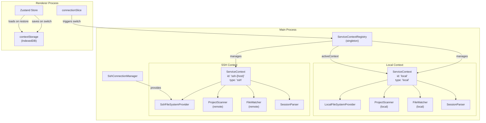
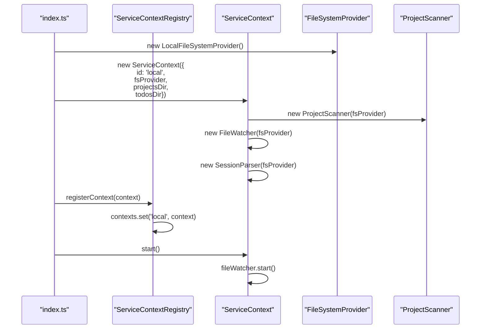
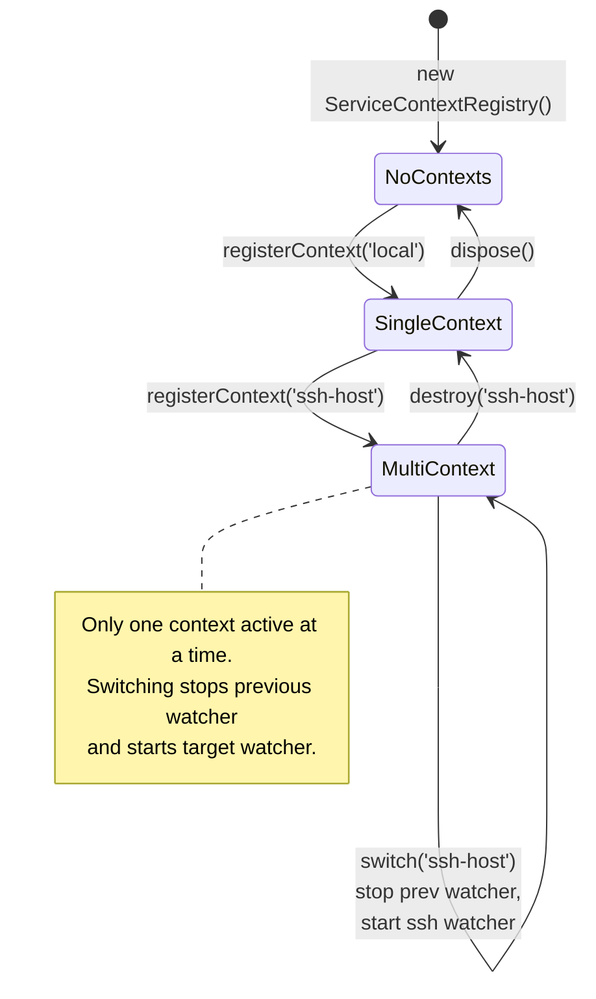
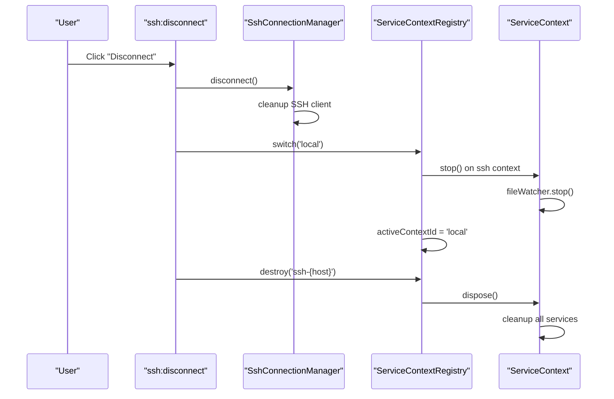
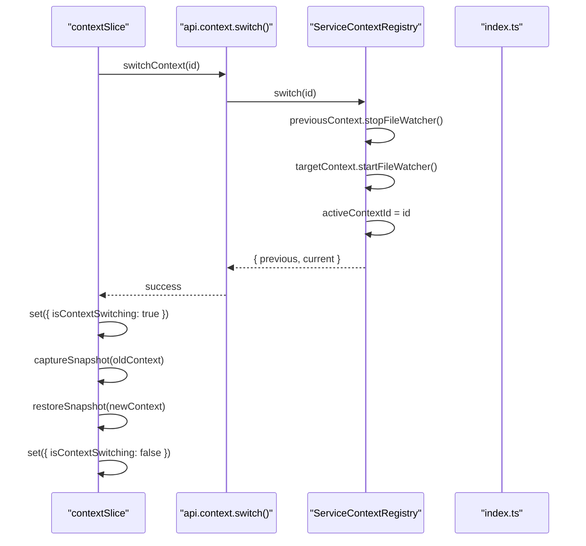

# Multi-Context 시스템

<details>
<summary>관련 소스 파일</summary>

다음 파일들은 이 위키 페이지를 생성하기 위한 컨텍스트로 사용되었습니다.

- [src/main/services/infrastructure/ServiceContext.ts](src/main/services/infrastructure/ServiceContext.ts)
- [src/main/services/infrastructure/ServiceContextRegistry.ts](src/main/services/infrastructure/ServiceContextRegistry.ts)
- [src/main/services/infrastructure/index.ts](src/main/services/infrastructure/index.ts)
- [src/renderer/components/common/ConnectionStatusBadge.tsx](src/renderer/components/common/ConnectionStatusBadge.tsx)
- [src/renderer/components/common/ContextSwitchOverlay.tsx](src/renderer/components/common/ContextSwitchOverlay.tsx)
- [src/renderer/components/common/WorkspaceIndicator.tsx](src/renderer/components/common/WorkspaceIndicator.tsx)
- [src/renderer/services/contextStorage.ts](src/renderer/services/contextStorage.ts)
- [src/renderer/store/slices/contextSlice.ts](src/renderer/store/slices/contextSlice.ts)
- [src/renderer/store/types.ts](src/renderer/store/types.ts)

</details>


## 목적과 범위

Multi-Context 시스템은 claude-devtools가 애플리케이션을 재시작하지 않고도 로컬 실행 환경과 원격 SSH 실행 환경 사이를 매끄럽게 전환할 수 있게 합니다. 각 컨텍스트는 동일한 renderer process를 공유하면서도, 자체적으로 격리된 서비스 스택(filesystem provider, project scanner, file watcher, session parser)을 유지합니다. 이 페이지는 `ServiceContextRegistry`, `ServiceContext` 수명 주기, 컨텍스트 전환 메커니즘, 스냅샷 기반 워크스페이스 복원을 다룹니다.

SSH 연결 관리 세부 정보는 [SSH Connection Manager]()를 참조하세요. 컨텍스트 스냅샷 IndexedDB 스키마는 [State Management]()를 참조하세요.

---

## 아키텍처 개요

이 시스템은 **ServiceContextRegistry**(singleton 관리자), 개별 **ServiceContext** 인스턴스(격리된 실행 환경), 플러그형 **FileSystemProvider** 구현체라는 세 계층으로 구성됩니다.

### Multi-Context 시스템 아키텍처



**출처:** [src/main/services/infrastructure/ServiceContextRegistry.ts:31-33](), [src/main/services/infrastructure/ServiceContext.ts:62-77](), [src/main/services/infrastructure/index.ts:14-15]()

---

## ServiceContext 구조

`ServiceContext`는 특정 환경에서 Claude 세션을 스캔하고, 파싱하고, 모니터링하는 데 필요한 모든 서비스를 캡슐화합니다. 각 컨텍스트는 자체적으로 다음을 가집니다.

| 컴포넌트 | 목적 | 인터페이스 |
|-----------|---------|-----------|
| `fsProvider` | 파일 시스템 추상화 | `FileSystemProvider` [src/main/services/infrastructure/FileSystemProvider.ts:1-20]() |
| `projectScanner` | 세션 탐색 | `ProjectScanner` [src/main/services/discovery/ProjectScanner.ts:1-30]() |
| `fileWatcher` | 실시간 파일 변경 | `FileWatcher` [src/main/services/infrastructure/FileWatcher.ts:1-20]() |
| `sessionParser` | JSONL 파싱 | `SessionParser` [src/main/services/parsing/SessionParser.ts:1-20]() |
| `subagentResolver` | 중첩 세션 감지 | `SubagentResolver` [src/main/services/discovery/SubagentResolver.ts:1-20]() |
| `chunkBuilder` | 대화 구조 | `ChunkBuilder` [src/main/services/analysis/ChunkBuilder.ts:1-20]() |
| `dataCache` | 다계층 캐싱 | `DataCache` [src/main/services/infrastructure/DataCache.ts:1-20]() |

### ServiceContext 생성



**출처:** [src/main/services/infrastructure/ServiceContext.ts:81-120](), [src/main/services/infrastructure/ServiceContextRegistry.ts:48-55]()

---

## ServiceContextRegistry

`ServiceContextRegistry`는 등록된 모든 컨텍스트를 관리하고 단일 활성 컨텍스트 의미론을 강제하는 singleton입니다. 기본값이 `'local'`인 `activeContextId`를 추적합니다 [src/main/services/infrastructure/ServiceContextRegistry.ts:33]().

### 핵심 메서드

```typescript
// Key methods from ServiceContextRegistry
class ServiceContextRegistry {
  registerContext(context: ServiceContext): void // [src/main/services/infrastructure/ServiceContextRegistry.ts:48]()
  get(id: string): ServiceContext | undefined // [src/main/services/infrastructure/ServiceContextRegistry.ts:100]()
  getActive(): ServiceContext // [src/main/services/infrastructure/ServiceContextRegistry.ts:88]()
  getActiveContextId(): string // [src/main/services/infrastructure/ServiceContextRegistry.ts:201]()
  list(): Array<{ id: string; type: 'local' | 'ssh' }> // [src/main/services/infrastructure/ServiceContextRegistry.ts:191]()
  switch(targetId: string): { previous: ServiceContext; current: ServiceContext } // [src/main/services/infrastructure/ServiceContextRegistry.ts:119]()
  destroy(id: string): void // [src/main/services/infrastructure/ServiceContextRegistry.ts:156]()
  dispose(): void // [src/main/services/infrastructure/ServiceContextRegistry.ts:209]()
}
```

### Context Registry 상태 머신



**출처:** [src/main/services/infrastructure/ServiceContextRegistry.ts:119-146](), [src/main/services/infrastructure/ServiceContextRegistry.ts:156-185]()

---

## Context 수명 주기

### Context 등록과 활성화

애플리케이션이 시작되면 로컬 컨텍스트가 생성되고 등록됩니다. SSH 연결이 수립되면 새 SSH 컨텍스트가 등록되고 활성화됩니다.

1. **Creation** - `new ServiceContext(config)`는 모든 내부 서비스를 초기화합니다 [src/main/services/infrastructure/ServiceContext.ts:81-119]().
2. **Registration** - `registry.registerContext(context)`는 이를 내부 Map에 추가합니다 [src/main/services/infrastructure/ServiceContextRegistry.ts:53]().
3. **Start** - `context.start()`는 file watcher와 cache auto-cleanup을 활성화합니다 [src/main/services/infrastructure/ServiceContext.ts:125-138]().
4. **Switch** - `registry.switch(id)`는 이전 watcher를 일시 중지하고 새 watcher를 재개합니다 [src/main/services/infrastructure/ServiceContextRegistry.ts:135-141]().

### Context 폐기 흐름



**출처:** [src/main/services/infrastructure/ServiceContextRegistry.ts:156-185](), [src/main/services/infrastructure/ServiceContext.ts:166-189]()

---

## Context 전환 흐름

컨텍스트 전환은 main process와 renderer process 사이에서 조율되는 작업입니다. renderer는 `contextSlice`를 사용해 수명 주기를 관리하며, 여기에는 `ContextSwitchOverlay` 표시도 포함됩니다 [src/renderer/components/common/ContextSwitchOverlay.tsx:12-38]().

### 전환 시퀀스 다이어그램



**출처:** [src/renderer/store/slices/contextSlice.ts:33-36](), [src/main/services/infrastructure/ServiceContextRegistry.ts:119-146]()

---

## Context 스냅샷

컨텍스트 전환 시 즉각적인 워크스페이스 복원을 가능하게 하기 위해 renderer는 `contextStorage`를 통해 상태 스냅샷을 IndexedDB에 유지합니다 [src/renderer/services/contextStorage.ts:81-93]().

### 스냅샷 스키마

`ContextSnapshot` 인터페이스는 유지 가능한 상태를 캡처합니다 [src/renderer/services/contextStorage.ts:30-63]().

| 필드 | 타입 | 목적 |
|-------|------|---------|
| `projects` | `Project[]` | 프로젝트 목록 |
| `sessions` | `Session[]` | 세션 목록 |
| `openTabs` | `Tab[]` | 열린 세션 탭 |
| `paneLayout` | `PaneLayout` | 다중 pane 레이아웃 |
| `notifications` | `DetectedError[]` | 알림 inbox |
| `sidebarCollapsed` | `boolean` | sidebar 상태 |

스냅샷에는 **5분 TTL**(`SNAPSHOT_TTL_MS`)이 있습니다 [src/renderer/services/contextStorage.ts:18]().

### 스냅샷 저장/복원 흐름

전환 시 `contextSlice`는 대상 컨텍스트의 데이터로 store를 업데이트하기 전에 현재 상태를 캡처합니다 [src/renderer/store/slices/contextSlice.ts:186-215](). IndexedDB에 유효한 스냅샷이 있으면 이를 사용해 UI 상태(tabs, scroll positions, selections)를 복원합니다 [src/renderer/store/slices/contextSlice.ts:77-180]().

**출처:** [src/renderer/services/contextStorage.ts:1-201](), [src/renderer/store/slices/contextSlice.ts:42-180]()

---

## Local vs SSH Contexts

### 비교표

| 관점 | Local Context | SSH Context |
|--------|---------------|-------------|
| **ID** | `'local'` | `'ssh-{host}'` |
| **Type** | `'local'` | `'ssh'` |
| **FileSystemProvider** | `LocalFileSystemProvider` | `SshFileSystemProvider` |
| **Lifecycle** | 영구적이며 폐기할 수 없습니다 [src/main/services/infrastructure/ServiceContextRegistry.ts:157]() | 일시적이며 연결 해제 시 폐기됩니다 |
| **File Watching** | Chokidar를 통한 네이티브 OS 이벤트 | SFTP polling/stat monitoring |

### 시각적 표시기

`WorkspaceIndicator` 컴포넌트는 활성 워크스페이스를 보여주며 드롭다운을 통한 전환을 허용합니다 [src/renderer/components/common/WorkspaceIndicator.tsx:17-138](). `ConnectionStatusBadge`는 연결 상태에 대한 시각적 피드백을 제공합니다 [src/renderer/components/common/ConnectionStatusBadge.tsx:20-53]().

**출처:** [src/main/services/infrastructure/ServiceContext.ts:35-46](), [src/renderer/components/common/ConnectionStatusBadge.tsx:30-52]()

---

## 요약

Multi-Context 시스템은 다음을 제공합니다.

1. **Service Isolation** - 각 컨텍스트는 자체 `ProjectScanner`, `FileWatcher`, `DataCache`를 가집니다 [src/main/services/infrastructure/ServiceContext.ts:71-76]().
2. **Registry Management** - `ServiceContextRegistry`가 등록과 전환을 조율합니다 [src/main/services/infrastructure/ServiceContextRegistry.ts:31]().
3. **State Persistence** - `contextStorage`는 즉각적인 복원을 위해 UI 스냅샷을 IndexedDB에 저장합니다 [src/renderer/services/contextStorage.ts:81]().
4. **UI Coordination** - `contextSlice`는 전환 상태와 스냅샷 수명 주기를 관리합니다 [src/renderer/store/slices/contextSlice.ts:24]().
