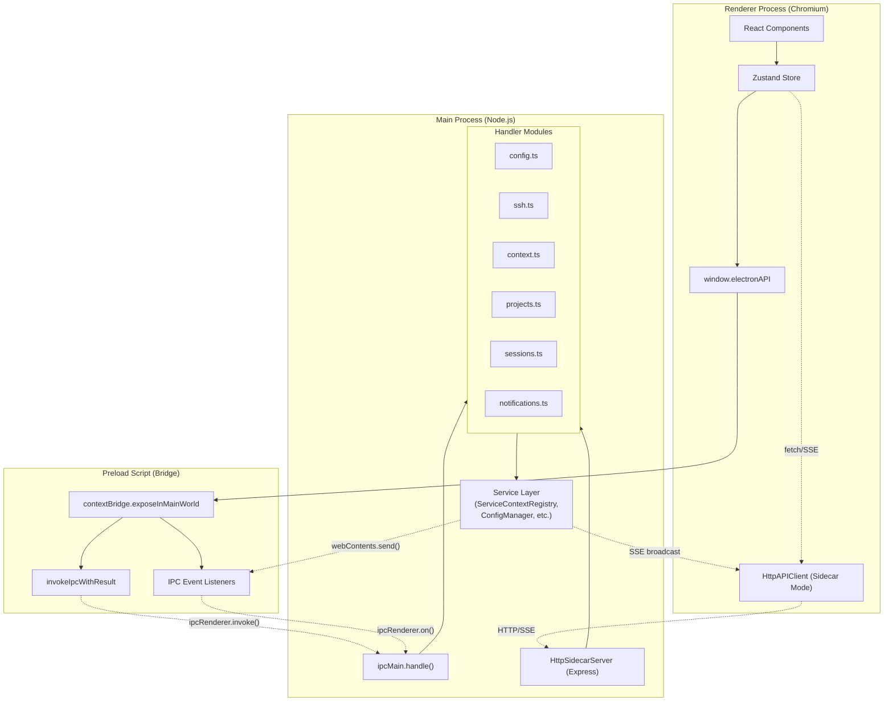
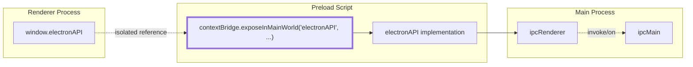
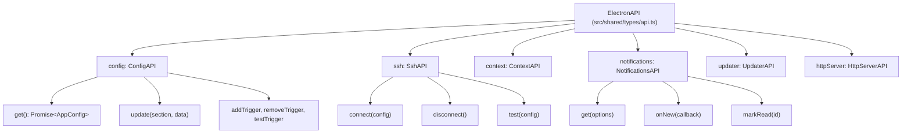
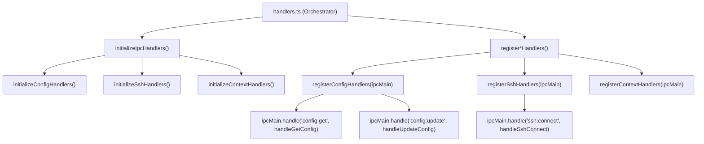
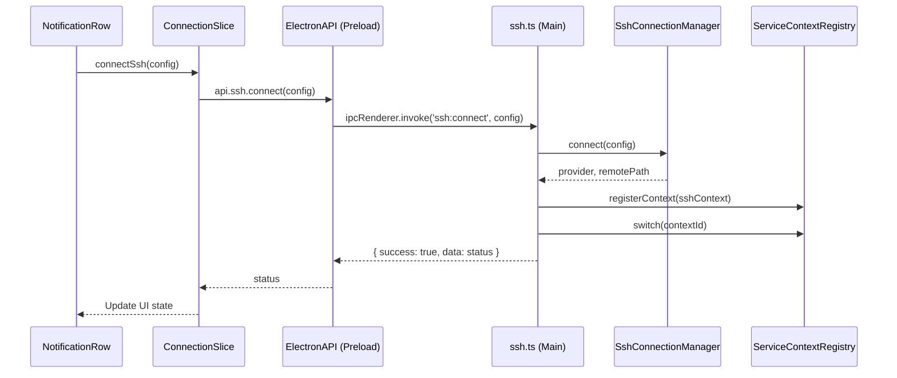

# IPC 통신 계층

<details>
<summary>관련 소스 파일</summary>

다음 파일들은 이 위키 페이지를 생성하기 위한 컨텍스트로 사용되었습니다.

- [src/main/ipc/config.ts](src/main/ipc/config.ts)
- [src/main/ipc/context.ts](src/main/ipc/context.ts)
- [src/main/ipc/handlers.ts](src/main/ipc/handlers.ts)
- [src/main/ipc/ssh.ts](src/main/ipc/ssh.ts)
- [src/main/services/error/ErrorTriggerChecker.ts](src/main/services/error/ErrorTriggerChecker.ts)
- [src/main/utils/pathDecoder.ts](src/main/utils/pathDecoder.ts)
- [src/preload/index.ts](src/preload/index.ts)
- [src/renderer/api/httpClient.ts](src/renderer/api/httpClient.ts)
- [src/renderer/components/notifications/NotificationRow.tsx](src/renderer/components/notifications/NotificationRow.tsx)
- [src/renderer/store/slices/connectionSlice.ts](src/renderer/store/slices/connectionSlice.ts)
- [src/shared/types/api.ts](src/shared/types/api.ts)
- [test/main/ipc/guards.test.ts](test/main/ipc/guards.test.ts)
- [test/main/utils/pathDecoder.test.ts](test/main/utils/pathDecoder.test.ts)
- [test/mocks/electronAPI.ts](test/mocks/electronAPI.ts)

</details>


IPC(Inter-Process Communication) 통신 계층은 renderer process(React UI)와 main process(Node.js 서비스) 사이에 타입 안전하고 보안성 있는 통신을 제공합니다. 이 계층은 `contextBridge`를 사용해 엄격하게 제어되는 API 표면을 노출하면서 Node.js API를 renderer로부터 격리하여 Electron의 보안 모델을 구현합니다.

이 페이지는 IPC 브리지 아키텍처, 핸들러 등록, 통신 패턴을 다룹니다. IPC 핸들러가 호출하는 서비스에 대한 정보는 [Multi-Context System](3.2)을 참조하세요. IPC API를 사용하는 renderer의 상태 관리는 [State Management](3.4)를 참조하세요.

---

## 아키텍처 개요

IPC 계층은 Electron의 보안 모델을 강제하는 3계층 아키텍처를 사용합니다. 또한 브라우저 전용 환경(Sidecar 모드)을 위한 대체 HTTP 기반 통신 경로도 지원합니다.

### 프로세스 통신 흐름



**핵심 책임:**

| 계층 | 책임 | Context Isolation |
|-------|---------------|-------------------|
| **Renderer** | UI 컴포넌트, 사용자 상호작용 | Node.js 접근 없음 |
| **Preload** | 보안 경계, 타입 안전 API | 제한된 Electron API |
| **Main** | 파일 시스템, 서비스, 네이티브 API | 전체 Node.js/Electron |

출처: [src/preload/index.ts:1-449](), [src/main/ipc/handlers.ts:1-123](), [src/renderer/api/httpClient.ts:46-55]()

---

## 보안 경계: contextBridge

preload script는 `contextBridge.exposeInMainWorld()`를 사용해 renderer가 접근할 수 있는 샌드박스 API 객체를 생성하되, `require`, `process`, `__dirname` 같은 Node.js 전역은 노출하지 않습니다.



`contextBridge`는 다음을 보장합니다.
- Renderer는 `ipcRenderer`에 직접 접근할 수 없습니다.
- 모든 통신은 명시적으로 노출된 메서드를 통해 이루어집니다.
- TypeScript 인터페이스를 통해 타입 안전성이 강제됩니다.

**구현:**

[src/preload/index.ts:447-448]():
```typescript
contextBridge.exposeInMainWorld('electronAPI', electronAPI);
```

`electronAPI` 객체는 [src/shared/types/api.ts:307-408]()에 정의된 `ElectronAPI` 인터페이스를 통해 엄격하게 타입이 지정됩니다.

출처: [src/preload/index.ts:447-449](), [src/shared/types/api.ts:307-408]()

---

## ElectronAPI 인터페이스 구조

`ElectronAPI` 인터페이스는 main process의 도메인별 핸들러 모듈을 반영하여 메서드를 논리적 하위 API로 구성합니다.



**타입 정의:**

각 하위 API는 [src/shared/types/api.ts]()의 인터페이스로 정의됩니다.

| 인터페이스 | 목적 | 주요 메서드 |
|-----------|---------|-------------|
| `ConfigAPI` | 앱 구성 및 Claude 루트 감지 | `get()`, `update()`, `getClaudeRootInfo()` |
| `SshAPI` | SSH 연결 수명 주기 및 host resolution | `connect()`, `disconnect()`, `resolveHost()` |
| `ContextAPI` | Multi-context 전환(Local vs SSH) | `list()`, `switch()`, `getActive()` |
| `NotificationsAPI` | 오류 감지 및 inbox 관리 | `get()`, `markRead()`, `onNew()` |
| `UpdaterAPI` | 애플리케이션 자동 업데이트 조율 | `check()`, `download()`, `install()` |

출처: [src/shared/types/api.ts:1-419](), [src/preload/index.ts:122-445]()

---

## IPC 핸들러 구성

핸들러는 `src/main/ipc/` 아래의 도메인별 모듈로 구성됩니다. 각 모듈은 서비스 의존성을 받는 초기화 함수와 Electron `ipcMain`용 등록 함수를 내보냅니다.



### 도메인 핸들러

| 모듈 | 채널 | 목적 |
|--------|----------|---------|
| `config.ts` | `config:*` | 유지, 알림 트리거, 폴더 선택 dialogs [src/main/ipc/config.ts:80-125]() |
| `ssh.ts` | `ssh:*` | 연결 관리, SSH config host 파싱 [src/main/ipc/ssh.ts:69-116]() |
| `context.ts` | `context:*` | 활성 서비스 컨텍스트 목록 조회 및 전환 [src/main/ipc/context.ts:50-90]() |
| `projects.ts` | `get-projects` | Claude 프로젝트 디렉터리 탐색 [src/main/ipc/handlers.ts:87-87]() |
| `sessions.ts` | `get-sessions*` | JSONL 세션 데이터의 pagination 및 조회 [src/main/ipc/handlers.ts:88-88]() |

출처: [src/main/ipc/handlers.ts:1-123](), [src/main/ipc/config.ts:1-125](), [src/main/ipc/ssh.ts:69-200](), [src/main/ipc/context.ts:50-97]()

---

## 오류 처리 패턴: IpcResult<T>

모든 IPC 핸들러는 표준화된 `IpcResult<T>` 구조를 반환합니다. preload script는 타입 안전 래퍼를 사용해 이 결과를 언랩하거나 설명적인 오류를 던집니다.

[src/preload/index.ts:85-89]():
```typescript
interface IpcResult<T> {
  success: boolean;
  data?: T;
  error?: string;
}
```

### invokeIpcWithResult 래퍼

이 함수는 IPC 프로토콜 세부 사항을 추상화하여 renderer가 원시 데이터 또는 표준 JavaScript `Error`만 받도록 보장합니다.

[src/preload/index.ts:103-109]():
```typescript
async function invokeIpcWithResult<T>(channel: string, ...args: unknown[]): Promise<T> {
  const result = (await ipcRenderer.invoke(channel, ...args)) as IpcResult<T>;
  if (!result.success) {
    throw new Error(result.error ?? 'Unknown error');
  }
  return result.data as T;
}
```

출처: [src/preload/index.ts:79-109]()

---

## 요청-응답 흐름: SSH 연결 예시

다음 다이어그램은 UI 작업에서 main process 서비스로, 그리고 다시 돌아오는 흐름을 보여줍니다.



**구현 세부 사항:**
- `ConnectionSlice`는 `local` 모드에서 `ssh` 모드로의 고수준 상태 전환을 관리합니다 [src/renderer/store/slices/connectionSlice.ts:65-103]().
- main process의 SSH 핸들러는 연결을 조율하고 전역 `ServiceContext`를 전환합니다 [src/main/ipc/ssh.ts:70-116]().

출처: [src/renderer/store/slices/connectionSlice.ts:65-129](), [src/main/ipc/ssh.ts:70-116](), [src/preload/index.ts:370-372]()

---

## 경로 인코딩 및 검증

Claude Code 프로젝트 디렉터리는 인코딩된 형식(예: `-Users-name-project`)을 사용하므로, IPC 계층은 프로세스 간에 유효한 프로젝트 ID가 전달되도록 `pathDecoder.ts`를 활용합니다.

[src/main/utils/pathDecoder.ts:27-36]():
```typescript
export function encodePath(absolutePath: string): string {
  const encoded = absolutePath.replace(/[/\\]/g, '-');
  return encoded.startsWith('-') ? encoded : `-${encoded}`;
}
```

### IPC Guards
요청을 처리하기 전에 핸들러는 path traversal 또는 잘못된 요청을 방지하기 위해 guard를 사용해 프로젝트 및 세션 ID를 검증합니다.

| Guard 함수 | 검증 로직 | 출처 |
|----------------|------------------|--------|
| `validateProjectId` | 선행 dash와 유효 문자를 확인합니다 | [test/main/ipc/guards.test.ts:11-33]() |
| `validateSessionId` | 유효한 JSONL filename 형식인지 확인합니다 | [test/main/ipc/guards.test.ts:35-38]() |
| `isValidEncodedPath`| legacy 및 최신 Windows/POSIX 형식을 검증합니다 | [src/main/utils/pathDecoder.ts:124-160]() |

출처: [src/main/utils/pathDecoder.ts:1-216](), [test/main/ipc/guards.test.ts:1-55]()

---

## Sidecar HTTP 구현

Electron의 IPC를 사용할 수 없는 환경(예: 브라우저 전용 모드)을 위해 시스템은 `HttpAPIClient`를 제공합니다. 이 클래스는 동일한 `ElectronAPI` 인터페이스를 구현하지만, 요청에는 `fetch`를 사용하고 실시간 업데이트에는 `EventSource`(Server-Sent Events)를 사용합니다.

### EventSource(SSE) 인프라
`HttpAPIClient`는 파일 변경 같은 broadcast 이벤트를 수신하기 위해 sidecar server와 지속 연결을 유지합니다.

[src/renderer/api/httpClient.ts:61-68]():
```typescript
private initEventSource(): void {
  this.eventSource = new EventSource(`${this.baseUrl}/api/events`);
  this.eventSource.onerror = () => {
    console.warn('[HttpAPIClient] SSE connection error, will reconnect...');
  };
}
```

### 날짜용 JSON Reviver
structured clone을 통해 `Date` 객체를 보존하는 Electron IPC와 달리, HTTP 직렬화는 날짜를 문자열로 변환합니다. `HttpAPIClient`는 사용자 지정 reviver를 사용해 `Date` 인스턴스를 복원합니다.

[src/renderer/api/httpClient.ts:99-107]():
```typescript
private static readonly ISO_DATE_RE = /^\d{4}-\d{2}-\d{2}T\d{2}:\d{2}:\d{2}(?:\.\d{1,9})?Z?$/;

private static reviveDates(_key: string, value: unknown): unknown {
  if (typeof value === 'string' && HttpAPIClient.ISO_DATE_RE.test(value)) {
    const d = new Date(value);
    if (!isNaN(d.getTime())) return d;
  }
  return value;
}
```

출처: [src/renderer/api/httpClient.ts:1-116](), [src/renderer/api/httpClient.ts:46-107]()
