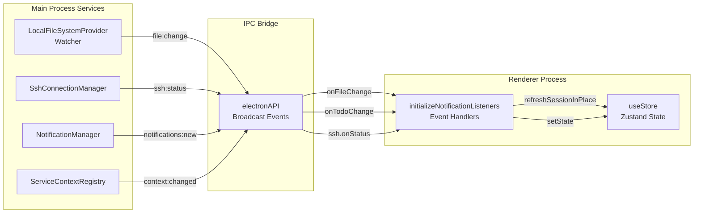
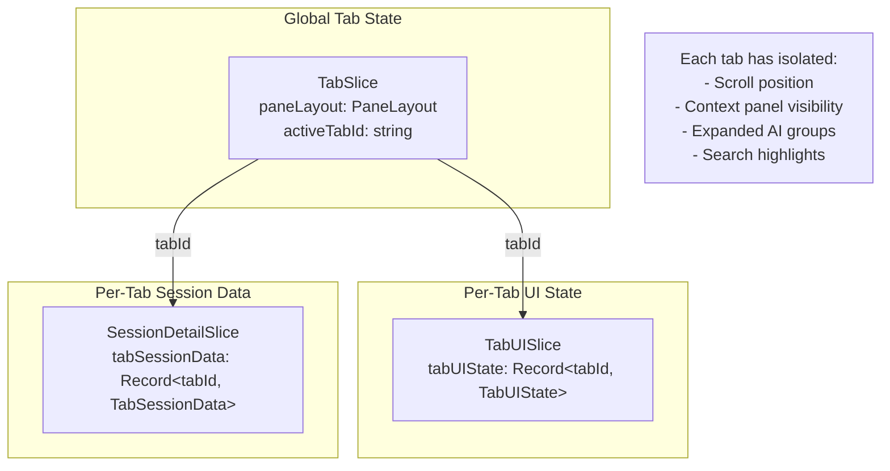

# 상태 관리

<details>
<summary>관련 소스 파일</summary>

다음 파일들은 이 위키 페이지를 생성하기 위한 컨텍스트로 사용되었습니다.

- [src/main/services/infrastructure/LocalFileSystemProvider.ts](src/main/services/infrastructure/LocalFileSystemProvider.ts)
- [src/renderer/components/chat/DisplayItemList.tsx](src/renderer/components/chat/DisplayItemList.tsx)
- [src/renderer/components/chat/items/ExecutionTrace.tsx](src/renderer/components/chat/items/ExecutionTrace.tsx)
- [src/renderer/components/chat/items/LinkedToolItem.tsx](src/renderer/components/chat/items/LinkedToolItem.tsx)
- [src/renderer/components/chat/items/TextItem.tsx](src/renderer/components/chat/items/TextItem.tsx)
- [src/renderer/components/chat/items/ThinkingItem.tsx](src/renderer/components/chat/items/ThinkingItem.tsx)
- [src/renderer/components/layout/PaneContent.tsx](src/renderer/components/layout/PaneContent.tsx)
- [src/renderer/components/layout/SortableTab.tsx](src/renderer/components/layout/SortableTab.tsx)
- [src/renderer/components/notifications/NotificationsView.tsx](src/renderer/components/notifications/NotificationsView.tsx)
- [src/renderer/hooks/useAutoScrollBottom.ts](src/renderer/hooks/useAutoScrollBottom.ts)
- [src/renderer/store/index.ts](src/renderer/store/index.ts)
- [src/renderer/store/slices/notificationSlice.ts](src/renderer/store/slices/notificationSlice.ts)
- [src/renderer/store/slices/projectSlice.ts](src/renderer/store/slices/projectSlice.ts)
- [src/renderer/store/slices/sessionDetailSlice.ts](src/renderer/store/slices/sessionDetailSlice.ts)
- [src/renderer/store/slices/tabSlice.ts](src/renderer/store/slices/tabSlice.ts)
- [src/renderer/types/tabs.ts](src/renderer/types/tabs.ts)
- [test/renderer/store/notificationSlice.test.ts](test/renderer/store/notificationSlice.test.ts)
- [test/renderer/store/sessionSlice.test.ts](test/renderer/store/sessionSlice.test.ts)
- [test/renderer/store/tabSlice.test.ts](test/renderer/store/tabSlice.test.ts)

</details>


## 목적과 범위

이 문서는 claude-devtools의 상태 관리 아키텍처를 설명하며, Zustand store 구조, slice 구성, 실시간 이벤트 처리, 컨텍스트 스냅샷을 다룹니다. 애플리케이션은 데이터, UI, 시스템 범주로 구성된 15개의 특화 slice를 결합한 통합 전역 store를 사용합니다.

store는 renderer process의 중심 허브 역할을 하며, IPC 이벤트를 통해 main process와 동기화하고 파일 시스템 변경, SSH 상태 업데이트, 알림 트리거에 반응하는 반응형 UI를 유지합니다.

---

## Store 아키텍처

애플리케이션은 전역 상태 관리 솔루션으로 Zustand를 사용합니다. store는 각각 특정 상태 도메인을 담당하는 여러 독립 slice를 결합하여 생성됩니다.

### Store 생성

메인 store는 [src/renderer/store/index.ts:32-48]()에서 모든 slice creator를 병합하여 생성됩니다.

```typescript
export const useStore = create<AppState>()((...args) => ({
  ...createProjectSlice(...args),
  ...createRepositorySlice(...args),
  ...createSessionSlice(...args),
  ...createSessionDetailSlice(...args),
  ...createSubagentSlice(...args),
  ...createConversationSlice(...args),
  ...createTabSlice(...args),
  ...createTabUISlice(...args),
  ...createPaneSlice(...args),
  ...createUISlice(...args),
  ...createNotificationSlice(...args),
  ...createConfigSlice(...args),
  ...createConnectionSlice(...args),
  ...createContextSlice(...args),
  ...createUpdateSlice(...args),
}));
```

각 slice는 Zustand의 `StateCreator` 패턴을 사용해 생성되며, 상태 변경과 접근을 위한 `set` 및 `get` 함수를 받습니다.

**출처:** [src/renderer/store/index.ts:1-48]()

---

## Slice 구성

store는 세 가지 범주로 구성된 15개의 slice를 결합합니다.

| 범주 | Slice | 목적 |
|----------|--------|---------|
| **Data** | `projectSlice`, `repositorySlice`, `sessionSlice`, `sessionDetailSlice`, `subagentSlice`, `conversationSlice` | Repository groups, session lists, conversation data, subagent processes |
| **UI** | `tabSlice`, `tabUISlice`, `paneSlice`, `uiSlice` | Tab management, multi-pane layouts, sidebar/settings visibility, search state |
| **System** | `configSlice`, `connectionSlice`, `contextSlice`, `notificationSlice`, `updateSlice` | Application settings, SSH connection state, context switching, notifications, auto-updates |

### Slice 아키텍처 다이어그램

```mermaid
graph TB
    subgraph "Global Store (Zustand)"
        Store["useStore<br/>Combined State"]
    end
    
    subgraph "Data Slices"
        ProjectSlice["createProjectSlice<br/>Repository Groups"]
        RepositorySlice["createRepositorySlice<br/>Grouped Worktrees"]
        SessionSlice["createSessionSlice<br/>Paginated Sessions"]
        DetailSlice["createSessionDetailSlice<br/>Conversation Detail"]
        SubagentSlice["createSubagentSlice<br/>Nested Sessions"]
        ConversationSlice["createConversationSlice<br/>AI Group Expansion"]
    end
    
    subgraph "UI Slices"
        TabSlice["createTabSlice<br/>Tab Management"]
        TabUISlice["createTabUISlice<br/>Tab-Specific UI"]
        PaneSlice["createPaneSlice<br/>Layout Config"]
        UISlice["createUISlice<br/>Sidebar/Settings"]
    end
    
    subgraph "System Slices"
        ConfigSlice["createConfigSlice<br/>Settings"]
        ConnectionSlice["createConnectionSlice<br/>SSH State"]
        ContextSlice["createContextSlice<br/>Active Context"]
        NotificationSlice["createNotificationSlice<br/>Alert List"]
        UpdateSlice["createUpdateSlice<br/>Auto-Update"]
    end
    
    Store --> ProjectSlice
    Store --> RepositorySlice
    Store --> SessionSlice
    Store --> DetailSlice
    Store --> SubagentSlice
    Store --> ConversationSlice
    Store --> TabSlice
    Store --> TabUISlice
    Store --> PaneSlice
    Store --> UISlice
    Store --> ConfigSlice
    Store --> ConnectionSlice
    Store --> ContextSlice
    Store --> NotificationSlice
    Store --> UpdateSlice
```



**출처:** [src/renderer/store/index.ts:32-48](), [src/renderer/store/slices/sessionDetailSlice.ts:122-125](), [src/renderer/store/slices/tabSlice.ts:118-118]()

---

## 상태 초기화 및 이벤트 처리

상태 초기화는 앱 시작 시 발생합니다. [src/renderer/store/index.ts:62-362]()의 `initializeNotificationListeners` 함수는 main process의 broadcast 이벤트에 대한 핸들러를 등록합니다.

### IPC 이벤트 리스너 등록

| 이벤트 | 핸들러 | 목적 |
|-------|---------|---------|
| `api.notifications.onNew` | [index.ts:103-120]() | 새 알림을 목록에 추가합니다 |
| `api.notifications.onUpdated` | [index.ts:123-136]() | 읽지 않은 알림 수를 업데이트합니다 |
| `api.notifications.onClicked` | [index.ts:138-149]() | OS 알림을 클릭했을 때 오류로 이동합니다 |
| `api.onTodoChange` | [index.ts:171-205]() | task-list 파일이 변경되면 세션을 새로 고칩니다 |
| `api.onFileChange` | [index.ts:208-268]() | 파일 시스템 변경 시 세션을 새로 고칩니다 |
| `api.onStatus` | [index.ts:271-313]() | 자동 업데이트 상태와 진행률을 업데이트합니다 |
| `api.ssh.onStatus` | [index.ts:318-332]() | SSH 연결 상태를 동기화합니다 |
| `api.context.onChanged` | [index.ts:335-348]() | renderer 측 컨텍스트 전환을 트리거합니다 |

### IPC 이벤트 흐름 다이어그램



**출처:** [src/renderer/store/index.ts:62-362](), [src/main/services/infrastructure/LocalFileSystemProvider.ts:1-50]()

---

## 실시간 업데이트

애플리케이션은 파일 시스템 변경에 실시간으로 반응하여 반응형 UI를 유지합니다. 파일 변경 이벤트는 과도한 업데이트를 피하기 위해 debounce/throttle된 새로 고침을 트리거합니다.

### 새로 고침 전략

store는 [src/renderer/store/index.ts:64-100]()에서 두 가지 새로 고침 메커니즘을 구현합니다.

1. **Project Refresh**(300ms debounce) - 새 세션이 감지될 때 트리거되며, `refreshSessionsInPlace`를 통해 세션 목록을 새로 고칩니다.
2. **Session Refresh**(150ms throttle) - 세션 내용이 변경될 때 트리거되며, `refreshSessionInPlace`를 통해 대화 데이터를 새로 고칩니다.

### Multi-Pane 인식

파일 변경이 감지되면 store는 새로 고침을 트리거하기 전에 해당 세션이 pane에 표시되어 있는지 확인합니다 [src/renderer/store/index.ts:158-168]().

```typescript
const isSessionVisibleInAnyPane = (sessionId: string): boolean => {
  const { paneLayout } = useStore.getState();
  return paneLayout.panes.some(
    (pane) =>
      pane.activeTabId != null &&
      pane.tabs.some(
        (tab) =>
          tab.id === pane.activeTabId && tab.type === 'session' && tab.sessionId === sessionId
      )
  );
};
```

**출처:** [src/renderer/store/index.ts:64-100](), [src/renderer/store/index.ts:158-168]()

---

## Generation 추적

여러 비동기 작업이 같은 상태를 업데이트할 때 race condition을 방지하기 위해 store는 generation counter를 사용합니다. 새 요청이 시작되면 이전 요청의 응답은 폐기됩니다.

### Generation Counter 메커니즘

[src/renderer/store/slices/sessionDetailSlice.ts:24-27]()는 generation tracker를 선언합니다.

```typescript
const sessionRefreshGeneration = new Map<string, number>();
const sessionRefreshInFlight = new Set<string>();
const sessionRefreshQueued = new Set<string>();
let sessionDetailFetchGeneration = 0;
```

### 동작 중인 Generation 추적

[src/renderer/store/slices/sessionDetailSlice.ts:150-177]()는 generation tracking이 오래된 덮어쓰기를 방지하는 방식을 보여줍니다.

```typescript
fetchSessionDetail: async (projectId: string, sessionId: string, tabId?: string) => {
  const requestGeneration = ++sessionDetailFetchGeneration;
  // ... set loading state
  try {
    const detail = await api.getSessionDetail(projectId, sessionId);
    if (requestGeneration !== sessionDetailFetchGeneration) {
      return; // Discard stale response
    }
    // ... process and update state
  }
}
```

**출처:** [src/renderer/store/slices/sessionDetailSlice.ts:24-27](), [src/renderer/store/slices/sessionDetailSlice.ts:150-177]()

---

## Tab 및 Pane 관리

애플리케이션은 각 tab이 서로 다른 콘텐츠 유형을 호스팅할 수 있는 복잡한 multi-pane 레이아웃을 지원합니다. `tabSlice`는 중복 제거와 상태 복원을 포함하여 이러한 tab의 수명 주기를 관리합니다.

### Tab 탐색 요청

탐색은 [src/renderer/types/tabs.ts:54-65]()에 정의된 통합 요청 모델을 통해 처리됩니다. 이를 통해 특정 AI groups 또는 검색 일치 항목으로 정밀한 deep-linking이 가능합니다.

```typescript
export interface TabNavigationRequest {
  id: string; // Unique nonce per click
  kind: 'error' | 'search' | 'autoBottom';
  source: 'notification' | 'triggerPreview' | 'commandPalette' | 'sessionOpen';
  highlight: TriggerColor | 'yellow' | 'none';
  payload: ErrorNavigationPayload | SearchNavigationPayload | Record<string, never>;
}
```

### Tab 수명 주기 로직

- **Deduplication**: 세션을 열 때 store는 해당 세션이 이미 어떤 pane에 열려 있는지 확인합니다 [src/renderer/store/slices/tabSlice.ts:135-143]().
- **Dashboard Replacement**: 활성 tab이 dashboard인 경우 clutter를 줄이기 위해 새 세션 tab으로 대체됩니다 [src/renderer/store/slices/tabSlice.ts:147-169]().
- **Scroll Restoration**: tab 사이를 전환할 때 tab scroll position이 저장되고 복원됩니다 [src/renderer/store/slices/tabSlice.ts:53-53]().

### Tab 데이터 격리 다이어그램



**출처:** [src/renderer/types/tabs.ts:54-65](), [src/renderer/store/slices/tabSlice.ts:135-169](), [src/renderer/store/slices/sessionDetailSlice.ts:104-105]()

---

## Context 스냅샷

로컬 컨텍스트와 SSH 컨텍스트 사이를 전환할 때, 애플리케이션은 현재 워크스페이스 상태의 스냅샷을 IndexedDB에 저장하고 다시 전환할 때 이를 복원합니다.

### 스냅샷 복원 로직

컨텍스트 시스템은 즉각적인 워크스페이스 복구를 제공하기 위해 스냅샷을 사용합니다. 여기에는 다음이 포함됩니다.
- **Projects & Sessions**: 사용 가능한 프로젝트 목록과 현재 선택된 세션.
- **Tab Layout**: 열려 있는 모든 tab, 순서, 각 pane의 활성 tab.
- **UI State**: sidebar collapse state와 기타 전역 UI toggles.

스냅샷에는 사용자가 오래 자리를 비운 뒤 오래된 데이터로 돌아오지 않도록 5분의 TTL(Time-To-Live)이 있습니다.

**출처:** [src/renderer/store/slices/contextSlice.ts:1-50](), [src/renderer/store/slices/projectSlice.ts:69-97]()

---

## UI 통합

컴포넌트는 최적화된 selector와 hook을 사용해 store 상태를 소비합니다.

### Auto-Scroll 관리

`useAutoScrollBottom` hook [src/renderer/hooks/useAutoScrollBottom.ts:116-231]()은 실시간 세션 업데이트 중 scroll position을 유지하기 위해 store와 통합됩니다. 사용자가 "at bottom" 상태인지, 따라서 새 콘텐츠를 따라가야 하는지 판단하기 위해 threshold check를 사용합니다.

### Tab 렌더링

`PaneContent` 컴포넌트 [src/renderer/components/layout/PaneContent.tsx:20-55]()는 CSS display toggle(`display: isActive ? 'flex' : 'none'`)을 사용해 모든 tab이 mounted 상태로 유지되도록 합니다. 이를 통해 Zustand에 저장되지 않는 컴포넌트 로컬 상태(예: input field contents)가 보존됩니다.

**출처:** [src/renderer/hooks/useAutoScrollBottom.ts:116-231](), [src/renderer/components/layout/PaneContent.tsx:20-55]()
