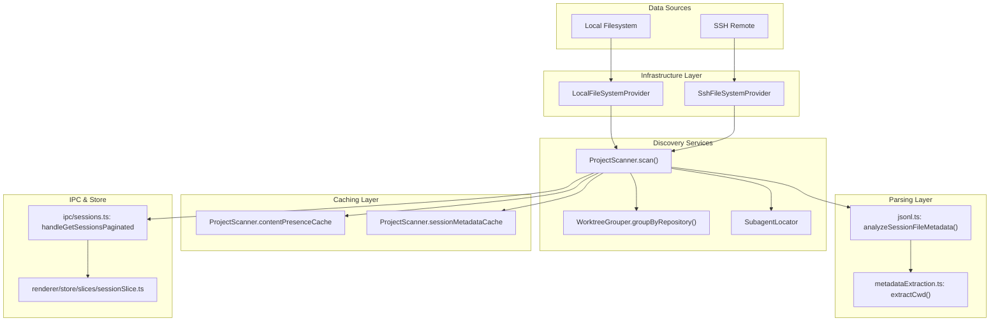
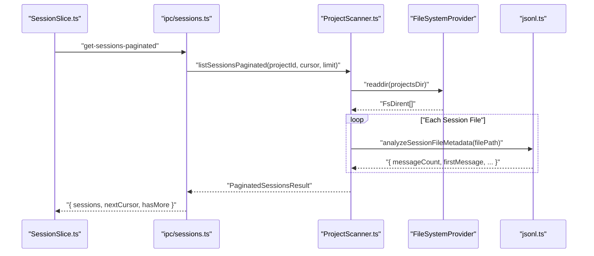

# 세션 탐색 및 파싱

<details>
<summary>관련 소스 파일</summary>

다음 파일들은 이 위키 페이지를 생성하기 위한 컨텍스트로 사용되었습니다.

- [src/main/http/sessions.ts](src/main/http/sessions.ts)
- [src/main/ipc/sessions.ts](src/main/ipc/sessions.ts)
- [src/main/services/discovery/ProjectScanner.ts](src/main/services/discovery/ProjectScanner.ts)
- [src/main/types/domain.ts](src/main/types/domain.ts)
- [src/main/types/messages.ts](src/main/types/messages.ts)
- [src/main/utils/jsonl.ts](src/main/utils/jsonl.ts)
- [src/renderer/components/sidebar/SessionItem.tsx](src/renderer/components/sidebar/SessionItem.tsx)
- [src/renderer/store/slices/sessionSlice.ts](src/renderer/store/slices/sessionSlice.ts)

</details>


## 목적과 범위

이 섹션은 `claude-devtools`가 파일 시스템에서 Claude Code 세션 파일을 탐색, 색인, 파싱하는 방식을 설명합니다. 전체 탐색 파이프라인, 디렉터리 구조 규칙, 원시 JSONL 파일을 UI에 표시되는 구조화된 세션 메타데이터로 변환하는 과정을 다룹니다.

특정 하위 시스템에 대한 자세한 정보:
- **Project scanning implementation**: [Project Scanner](#4.1)를 참조하세요
- **Path encoding and composite project IDs**: [Path Encoding & Project IDs](#4.2)를 참조하세요
- **JSONL file format and parsing**: [JSONL Parsing](#4.3)을 참조하세요
- **Caching and performance optimization**: [Caching Strategy](#4.4)를 참조하세요
- **SSH remote access**: [SSH Remote Access](#5)를 참조하세요
- **Multi-context architecture**: [Multi-Context System](#3.2)을 참조하세요

**출처**: [src/main/services/discovery/ProjectScanner.ts:1-16]()

---

## 개요

세션 탐색은 Claude Code의 데이터 디렉터리(`~/.claude/projects/`)를 스캔하고 원시 JSONL 세션 파일을 구조화된 메타데이터로 변환하는 과정입니다. 이 시스템은 세 가지 데이터 소스를 지원합니다.

1. **Local filesystem** - 표준 `~/.claude/` 디렉터리.
2. **SSH remote** - SFTP를 통해 접근하는 원격 `~/.claude/`.
3. **WSL** - UNC 경로를 통해 접근하는 Windows Subsystem for Linux 경로.

탐색 파이프라인은 파일 시스템 스캔, 경로 디코딩, 세션 필터링, 메타데이터 추출, 캐싱이라는 여러 단계로 구성됩니다. 모든 작업은 `FileSystemProvider` 인터페이스 [src/main/services/infrastructure/FileSystemProvider.ts]()를 통해 추상화되어, 동일한 로직이 로컬 및 원격 컨텍스트에서 동작할 수 있습니다.

**출처**: [src/main/services/discovery/ProjectScanner.ts:18-58](), [src/main/services/discovery/ProjectScanner.ts:116-156]()

---

## Claude Code 디렉터리 구조

Claude Code는 `~/.claude/` 아래의 예측 가능한 디렉터리 구조에 세션 데이터를 저장합니다.

```
~/.claude/
├── projects/
│   └── {encoded-path}/               # Project directory (encoded absolute path)
│       ├── {session-id}.jsonl        # Session file (JSONL format)
│       └── {session-id}/
│           └── subagents/            # Nested subagent sessions
│               └── {subagent-id}.jsonl
└── todos/
    └── {session-id}.json             # Task list data for session [src/main/services/discovery/ProjectScanner.ts:8]()
```

### 인코딩된 경로 형식

프로젝트 디렉터리는 파일 시스템 구분자가 dash로 대체되는 경로 인코딩 방식을 사용합니다. 이는 `pathDecoder.ts` [src/main/utils/pathDecoder.ts:1-44]()에서 처리됩니다.

| 원본 경로 | 인코딩된 디렉터리 이름 |
|--------------|------------------------|
| `/Users/username/project` | `-Users-username-project` |
| `C:\Users\username\project` | `-C:-Users-username-project` |

**출처**: [src/main/utils/pathDecoder.ts:1-44](), [src/main/services/discovery/ProjectScanner.ts:5-10]()

---

## 탐색 파이프라인 아키텍처

다음 다이어그램은 파일 시스템 스캔부터 UI 렌더링까지 전체 세션 탐색 파이프라인을 보여줍니다.

### Discovery Pipeline: Code Entity Mapping


**출처**: [src/main/services/discovery/ProjectScanner.ts:64-106](), [src/main/ipc/sessions.ts:105-134](), [src/renderer/store/slices/sessionSlice.ts:124-167]()

---

## Multi-Context 탐색

탐색 시스템은 `ServiceContextRegistry`를 통해 여러 파일 시스템 컨텍스트를 지원합니다. 각 컨텍스트(로컬 또는 SSH)는 적절한 `FileSystemProvider`와 함께 자체 `ProjectScanner` 인스턴스를 유지합니다.

### 컨텍스트 전환 로직
```mermaid
graph LR
    subgraph "Registry"
        Registry["ServiceContextRegistry.getActive()"]
    end
    
    subgraph "Local Context"
        L_Provider["LocalFileSystemProvider"]
        L_Scanner["ProjectScanner (local)"]
        Registry --> L_Scanner
        L_Scanner --> L_Provider
    end
    
    subgraph "SSH Context"
        S_Provider["SshFileSystemProvider"]
        S_Scanner["ProjectScanner (ssh)"]
        Registry --> S_Scanner
        S_Scanner --> S_Provider
    end
```

**출처**: [src/main/ipc/sessions.ts:121-122](), [src/main/services/discovery/ProjectScanner.ts:145-151]()

---

## 핵심 컴포넌트

### ProjectScanner

`ProjectScanner` 클래스는 세션 탐색의 기본 오케스트레이터입니다 [src/main/services/discovery/ProjectScanner.ts:64]().

| 컴포넌트 | 책임 | 주요 메서드 |
|-----------|---------------|-------------|
| `ProjectScanner` | 탐색 파이프라인을 조율합니다 | `scan()`, `listSessions()`, `listSessionsPaginated()` |
| `WorktreeGrouper` | git worktree를 그룹화합니다 | `groupByRepository()` |
| `SubagentLocator` | 중첩 subagent 파일을 감지합니다 | `findSubagentFiles()` |
| `SessionSearcher` | 세션 간 텍스트 검색 | `searchSessions()` |

scanner는 반복 접근을 최적화하기 위해 `contentPresenceCache`, `sessionMetadataCache`, `sessionPreviewCache`라는 세 개의 인메모리 캐시를 유지합니다 [src/main/services/discovery/ProjectScanner.ts:67-82]().

**출처**: [src/main/services/discovery/ProjectScanner.ts:64-106](), [src/main/services/discovery/ProjectScanner.ts:173-188]()

---

## 세션 탐색 흐름

파일 감지에서 UI 렌더링까지의 흐름은 다음과 같습니다.



**출처**: [src/main/ipc/sessions.ts:105-134](), [src/renderer/store/slices/sessionSlice.ts:124-167](), [src/main/utils/jsonl.ts:52-82]()

---

## 메타데이터 수준

scanner는 특히 SSH에서 성능을 최적화하기 위해 두 가지 메타데이터 추출 모드를 지원합니다.

### Deep Metadata(`metadataLevel: 'deep'`)
- `analyzeSessionFileMetadata`를 통한 전체 JSONL 파일 파싱.
- `firstMessage`, `messageCount`, `gitBranch`, `contextConsumption`을 추출합니다 [src/main/types/domain.ts:81-112]().
- 로컬 파일 시스템에서 기본값으로 사용됩니다.

### Light Metadata(`metadataLevel: 'light'`)
- 파일 시스템 stats만 사용합니다(mtime, size).
- 스트리밍 읽기를 통해 첫 메시지 preview를 추출합니다.
- latency를 줄이기 위해 SSH 연결에서 기본값으로 사용됩니다 [src/main/ipc/sessions.ts:178-185]().

**출처**: [src/main/services/discovery/ProjectScanner.ts:25-28](), [src/main/ipc/sessions.ts:177-186](), [src/main/types/domain.ts:65-112]()

---

## 노이즈 필터링

탐색 파이프라인은 "noise" 메시지(내부 메타데이터와 도구 출력)만 포함하는 세션을 필터링합니다. 이는 `SessionContentFilter` [src/main/services/discovery/SessionContentFilter.ts]()가 처리합니다.

1. `readline`을 사용해 JSONL 파일을 줄 단위로 스트리밍합니다 [src/main/utils/jsonl.ts:63-66]().
2. `<local-command-stdout>` 같은 system-only tags가 있는 메시지를 건너뜁니다 [src/main/types/messages.ts:178-182]().
3. 사용자에게 보이는 메시지가 없는 세션은 UI에서 제외됩니다.

**출처**: [src/main/utils/jsonl.ts:10-28](), [src/main/types/messages.ts:165-210]()

---

## Pagination 전략

scanner는 수천 개의 세션이 있는 프로젝트를 처리하기 위해 cursor 기반 pagination을 구현합니다.

1. **Initial Load**: `fetchSessionsInitial`은 처음 20개 세션을 가져옵니다 [src/renderer/store/slices/sessionSlice.ts:124-134]().
2. **Cursor Generation**: 백엔드는 다음 페이지를 위한 `nextCursor`를 반환합니다 [src/main/ipc/sessions.ts:118-129]().
3. **Next Page**: `fetchSessionsMore`는 cursor를 사용해 후속 batch를 가져옵니다 [src/renderer/store/slices/sessionSlice.ts:170-185]().

**출처**: [src/renderer/store/slices/sessionSlice.ts:124-200](), [src/main/ipc/sessions.ts:105-134]()

---

## 실시간 업데이트

이 시스템은 generation tracking을 사용해 빠른 파일 변경 상황에서도 last-write-wins를 보장합니다.

1. Renderer가 `refreshSessionsInPlace(projectId)`를 호출합니다 [src/renderer/store/slices/sessionSlice.ts:54]().
2. `projectRefreshGeneration` map은 프로젝트별 최신 요청을 추적합니다 [src/renderer/store/slices/sessionSlice.ts:18]().
3. 더 새로운 generation이 시작된 경우 파일 시스템의 오래된 응답은 폐기됩니다.

**출처**: [src/renderer/store/slices/sessionSlice.ts:15-18](), [src/renderer/store/slices/sessionSlice.ts:54]()
