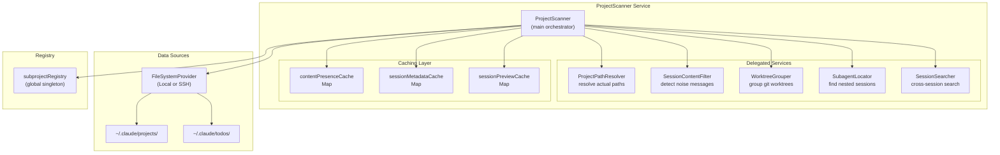
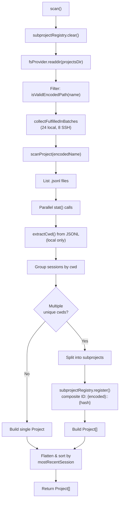
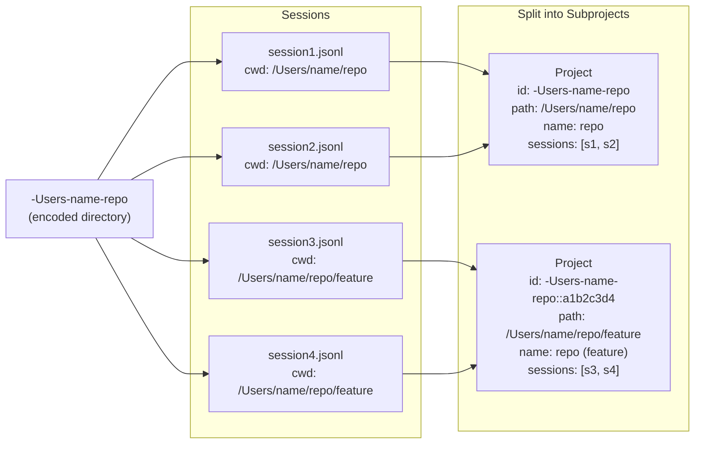
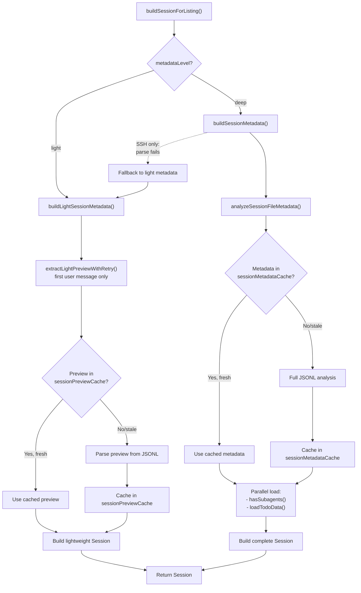
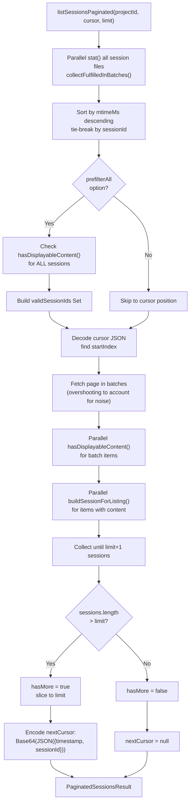
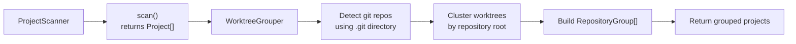
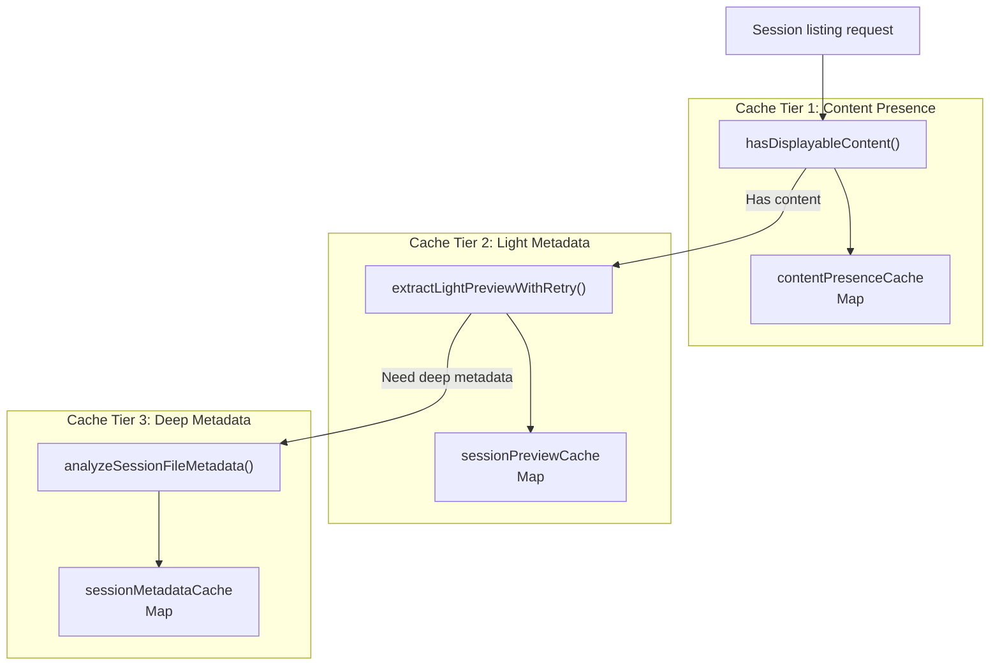
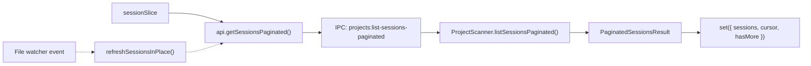

# Project Scanner

<details>
<summary>관련 소스 파일</summary>

다음 파일들은 이 위키 페이지를 생성하기 위한 컨텍스트로 사용되었습니다.

- [src/main/ipc/utility.ts](src/main/ipc/utility.ts)
- [src/main/services/discovery/ProjectScanner.ts](src/main/services/discovery/ProjectScanner.ts)
- [src/main/services/discovery/SearchTextExtractor.ts](src/main/services/discovery/SearchTextExtractor.ts)
- [src/main/services/discovery/SubagentLocator.ts](src/main/services/discovery/SubagentLocator.ts)
- [src/main/services/discovery/WorktreeGrouper.ts](src/main/services/discovery/WorktreeGrouper.ts)
- [src/main/services/discovery/index.ts](src/main/services/discovery/index.ts)
- [src/main/services/parsing/GitIdentityResolver.ts](src/main/services/parsing/GitIdentityResolver.ts)
- [src/renderer/components/sidebar/SessionItem.tsx](src/renderer/components/sidebar/SessionItem.tsx)
- [src/renderer/store/slices/sessionSlice.ts](src/renderer/store/slices/sessionSlice.ts)
- [test/main/services/discovery/ProjectScanner.cwdSplit.test.ts](test/main/services/discovery/ProjectScanner.cwdSplit.test.ts)
- [test/main/services/discovery/SearchTextCache.test.ts](test/main/services/discovery/SearchTextCache.test.ts)
- [test/main/services/discovery/SearchTextExtractor.test.ts](test/main/services/discovery/SearchTextExtractor.test.ts)

</details>


`ProjectScanner` 서비스는 `~/.claude/projects/` 디렉터리에서 Claude Code 세션 파일을 탐색하고 색인하는 책임을 집니다. 프로젝트 디렉터리를 스캔하고, 세션 메타데이터를 추출하며, 세션이 여러 작업 디렉터리에 걸쳐 있을 때 subproject 분할을 처리하고, SSH 성능을 위한 적극적인 캐싱과 함께 paginated session listings를 제공합니다.

Claude Code가 사용하는 경로 인코딩 방식에 대한 정보는 [Path Encoding & Project IDs](4.2)를 참조하세요. 개별 세션 파일 파싱 세부 정보는 [JSONL Parsing](4.3)을 참조하세요. 다계층 캐싱 아키텍처는 [Caching Strategy](4.4)를 참조하세요.

**출처**: [src/main/services/discovery/ProjectScanner.ts:1-16]()

## 디렉터리 구조

Claude Code는 `~/.claude/` 아래의 특정 디렉터리 구조에 세션 데이터를 저장합니다.

```
~/.claude/
├── projects/              # Project directories (encoded paths)
│   ├── -Users-name-app/   # Encoded path: /Users/name/app
│   │   ├── session1.jsonl
│   │   ├── session2.jsonl
│   │   └── session3/
│   │       └── subagents/ # Nested session files
│   └── -home-user-repo/   # Another project
│       └── abc123.jsonl
└── todos/                 # Task list data
    └── session1.json
```

`ProjectScanner`는 완전한 세션 메타데이터를 구축하기 위해 `projectsDir`(`~/.claude/projects/`)와 `todosDir`(`~/.claude/todos/`) 모두에서 읽습니다.

**출처**: [src/main/services/discovery/ProjectScanner.ts:96-106](), [src/main/utils/pathDecoder.ts:41-42]()

## 핵심 아키텍처



**출처**: [src/main/services/discovery/ProjectScanner.ts:64-106]()

## 프로젝트 탐색 워크플로

### 메인 스캔 흐름



`scan()` 메서드는 `~/.claude/projects/`의 모든 디렉터리를 읽고, 유효한 인코딩 경로를 필터링하며, 각 디렉터리를 처리하여 프로젝트 메타데이터를 추출하는 방식으로 프로젝트 탐색을 조율합니다. 프로젝트 디렉터리 안의 세션은 `cwd`(current working directory)를 기준으로 그룹화되며, 고유한 `cwd` 값이 여러 개인 프로젝트는 composite ID를 가진 subproject로 분할됩니다.

**출처**: [src/main/services/discovery/ProjectScanner.ts:116-156](), [src/main/services/discovery/ProjectScanner.ts:205-365]()

### Subproject 분할

프로젝트 디렉터리에 서로 다른 `cwd` 값을 가진 세션이 포함되어 있으면 `ProjectScanner`는 이를 별도의 논리적 프로젝트로 분할합니다. 이는 Claude Code 세션이 같은 repository의 서로 다른 worktree 또는 하위 디렉터리에서 실행되는 경우를 처리합니다.



Composite project ID는 `{encodedPath}::{8-char-hex}` 형식을 따르며, hash는 실제 `cwd` 경로에서 파생됩니다. `subprojectRegistry`는 composite ID와 해당 세션 집합 사이의 매핑을 유지합니다.

**출처**: [src/main/services/discovery/ProjectScanner.ts:264-359](), [src/main/services/discovery/SubprojectRegistry.ts:1-100]()

## 세션 메타데이터 추출

### 메타데이터 수준

`ProjectScanner`는 서로 다른 컨텍스트에 최적화된 두 가지 메타데이터 추출 수준을 지원합니다.

| 수준 | 모드 | 파싱 깊이 | 사용 사례 |
|-------|------|---------------|----------|
| `light` | SSH | 파일 시스템 stats + 첫 메시지 preview | 네트워크를 통한 빠른 목록 조회 |
| `deep` | Local | 전체 JSONL 분석 + subagent 감지 | context stats를 포함한 완전한 메타데이터 |

**출처**: [src/main/services/discovery/ProjectScanner.ts:404-408](), [src/main/services/discovery/ProjectScanner.ts:491-492]()

### 세션 구축 파이프라인



캐싱 시스템은 stale entry를 감지하기 위해 파일 수정 시간(`mtimeMs`)과 크기를 cache key로 사용합니다. 파일이 변경되면 cache invalidation은 자동으로 이루어집니다.

**출처**: [src/main/services/discovery/ProjectScanner.ts:712-876](), [src/main/services/discovery/ProjectScanner.ts:67-82]()

## Pagination 시스템

### Cursor 기반 Pagination

`listSessionsPaginated()`는 대규모 세션 목록을 위한 효율적인 cursor 기반 pagination을 구현합니다. cursor는 마지막 항목의 timestamp와 session ID를 인코딩하여 상태 없는 pagination을 가능하게 합니다.



cursor 형식은 `{timestamp: number, sessionId: string}`를 포함하는 Base64 인코딩 JSON입니다. 이를 통해 반복 중 세션이 추가되거나 제거되더라도 결정론적인 pagination이 가능합니다.

**출처**: [src/main/services/discovery/ProjectScanner.ts:477-707](), [src/main/types.ts:115-130]()

### 노이즈 필터링

"noise messages"(사용자에게 보이는 내용이 없는 내부 시스템 메시지)만 포함하는 세션은 목록에서 필터링됩니다.

```typescript
// Example noise detection flow
const hasContent = await this.hasDisplayableContent(
  filePath,
  prefetchedMtimeMs,
  prefetchedSize
);
if (!hasContent) {
  return null; // Filter out noise-only session
}
```

`hasDisplayableContent()` 메서드는 `SessionContentFilter.hasDisplayableContent()`에 위임하며, 먼저 `contentPresenceCache`를 확인한 다음 필요한 경우 JSONL 파일을 파싱합니다.

**출처**: [src/main/services/discovery/ProjectScanner.ts:430-440](), [src/main/services/discovery/SessionContentFilter.ts:31-50]()

## 위임된 서비스

`ProjectScanner`는 특화된 작업을 다섯 개의 서비스 클래스에 위임합니다.

### 서비스 책임

| 서비스 | 목적 | 주요 메서드 |
|---------|---------|-------------|
| `ProjectPathResolver` | 인코딩된 이름에서 실제 파일 시스템 경로를 확인합니다 | `resolveProjectPath()` |
| `SessionContentFilter` | noise-only 세션을 감지합니다 | `hasDisplayableContent()` |
| `WorktreeGrouper` | 프로젝트를 git repository별로 그룹화합니다 | `groupByRepository()` |
| `SubagentLocator` | 중첩 subagent 세션 파일을 찾습니다 | `hasSubagents()`, `listSubagentFiles()` |
| `SessionSearcher` | 세션 간 full-text search | `search()` |

**출처**: [src/main/services/discovery/ProjectScanner.ts:87-106]()

### Repository 그룹화

`scanWithWorktreeGrouping()` 메서드는 프로젝트를 git repository별로 cluster하기 위해 `WorktreeGrouper`에 위임합니다.



각 `RepositoryGroup`은 하나 이상의 worktree를 포함합니다. git이 아닌 프로젝트는 단일 worktree group으로 표현됩니다.

**출처**: [src/main/services/discovery/ProjectScanner.ts:173-188](), [src/main/services/discovery/WorktreeGrouper.ts:52-194]()

## 캐싱 아키텍처

### 3계층 Cache 시스템



모든 cache는 `(mtimeMs, size)` tuple을 cache 유효성 key로 사용합니다. 파일이 변경되면 `mtimeMs`가 변경되어 cache miss와 재파싱이 발생합니다.

**출처**: [src/main/services/discovery/ProjectScanner.ts:67-82]()

### Cache Invalidation

Cache는 인메모리이며 명시적으로 지워지지 않습니다. stale entry는 캐시된 `mtimeMs` 및 `size`를 현재 파일 stats와 비교하여 감지됩니다.

```typescript
const cachedMetadata = this.sessionMetadataCache.get(filePath);
const metadata =
  cachedMetadata?.mtimeMs === effectiveMtime && cachedMetadata.size === effectiveSize
    ? cachedMetadata.metadata
    : await analyzeSessionFileMetadata(filePath, this.fsProvider);
```

이 접근 방식은 수동 invalidation 로직 없이 cache freshness를 보장합니다.

**출처**: [src/main/services/discovery/ProjectScanner.ts:729-739]()

## SSH 최적화 전략

### Batch 병렬 처리

SSH 작업은 latency가 높지만 여러 요청을 동시에 처리할 수 있습니다. `ProjectScanner`는 `collectFulfilledInBatches()`를 통한 batch processing을 사용해 파일 작업을 병렬화합니다.

```typescript
const sessionInfos = await this.collectFulfilledInBatches(
  sessionFiles,
  this.fsProvider.type === 'ssh' ? 32 : 128,  // Lower batch size for SSH
  async (file) => {
    const filePath = path.join(projectPath, file.name);
    const { mtimeMs, birthtimeMs } = await this.resolveFileDetails(file, filePath);
    // ... process file
  }
);
```

Batch 크기는 작업 유형별로 조정됩니다.

| 작업 | SSH Batch Size | Local Batch Size |
|-----------|----------------|------------------|
| Project scan | 8 | 24 |
| Session stat | 32-48 | 128-200 |
| Session build | 4 | 16 |

**출처**: [src/main/services/discovery/ProjectScanner.ts:135-139](), [src/main/services/discovery/ProjectScanner.ts:518-534]()

### Metadata Level Fallback

SSH에서 deep metadata 파싱이 실패하면(네트워크 문제 또는 손상된 파일로 인해), `buildSessionForListing()`은 세션을 제거하는 대신 light metadata로 폴백합니다.

```typescript
try {
  return await this.buildSessionMetadata(/* deep metadata */);
} catch (error) {
  if (this.fsProvider.type !== 'ssh') {
    throw error;  // Local failures should propagate
  }
  logger.debug(`SSH metadata parse failed for ${sessionId}, using light fallback`);
  return this.buildLightSessionMetadata(/* light metadata */);
}
```

이를 통해 일시적인 네트워크 장애가 있더라도 세션이 계속 표시됩니다.

**출처**: [src/main/services/discovery/ProjectScanner.ts:849-875]()

### CWD 추출 건너뛰기

SSH에서는 `scanProject()`가 프로젝트 탐색 중 파일 본문을 읽지 않도록 JSONL 파일에서 `cwd` 추출을 건너뜁니다.

```typescript
const shouldSplitByCwd = this.fsProvider.type !== 'ssh';
// Over SSH, avoid reading every file body during project discovery
if (shouldSplitByCwd) {
  try {
    cwd = await extractCwd(filePath, this.fsProvider);
  } catch {
    // Ignore unreadable files
  }
}
```

이는 subproject 분할 정확도를 희생하는 대신 SSH 스캔 속도를 크게 높이는 절충입니다.

**출처**: [src/main/services/discovery/ProjectScanner.ts:232-248]()

## Store와의 통합

renderer process는 `sessionSlice`를 통해 `ProjectScanner` 결과를 사용합니다.



`refreshSessionsInPlace()` 메서드는 loading state 없이 세션 목록을 업데이트하여, 새 세션이 추가되거나 수정될 때 실시간 업데이트를 가능하게 합니다.

**출처**: [src/renderer/store/slices/sessionSlice.ts:216-254]()

## Public API 메서드

### 핵심 메서드

| 메서드 | 목적 | 반환 |
|--------|---------|---------|
| `scan()` | 모든 프로젝트를 스캔합니다 | `Promise<Project[]>` |
| `scanWithWorktreeGrouping()` | git repository grouping과 함께 스캔합니다 | `Promise<RepositoryGroup[]>` |
| `getProject(projectId)` | 단일 프로젝트 메타데이터를 가져옵니다 | `Promise<Project \| null>` |
| `listSessions(projectId)` | 프로젝트의 모든 세션을 나열합니다 | `Promise<Session[]>` |
| `listSessionsPaginated(projectId, cursor, limit)` | Paginated session listing | `Promise<PaginatedSessionsResult>` |
| `getSession(projectId, sessionId)` | 단일 세션 메타데이터를 가져옵니다 | `Promise<Session \| null>` |

### Utility 메서드

| 메서드 | 목적 | 반환 |
|--------|---------|---------|
| `getSessionPath(projectId, sessionId)` | 세션 파일 경로를 구성합니다 | `string` |
| `listSessionFiles(projectId)` | 모든 세션 파일 경로를 나열합니다 | `Promise<string[]>` |
| `hasSubagents(projectId, sessionId)` | 중첩 세션 존재 여부를 확인합니다 | `Promise<boolean>` |
| `loadTodoData(sessionId)` | task list 데이터를 로드합니다 | `Promise<unknown>` |

**출처**: [src/main/services/discovery/ProjectScanner.ts:116-1100]()
