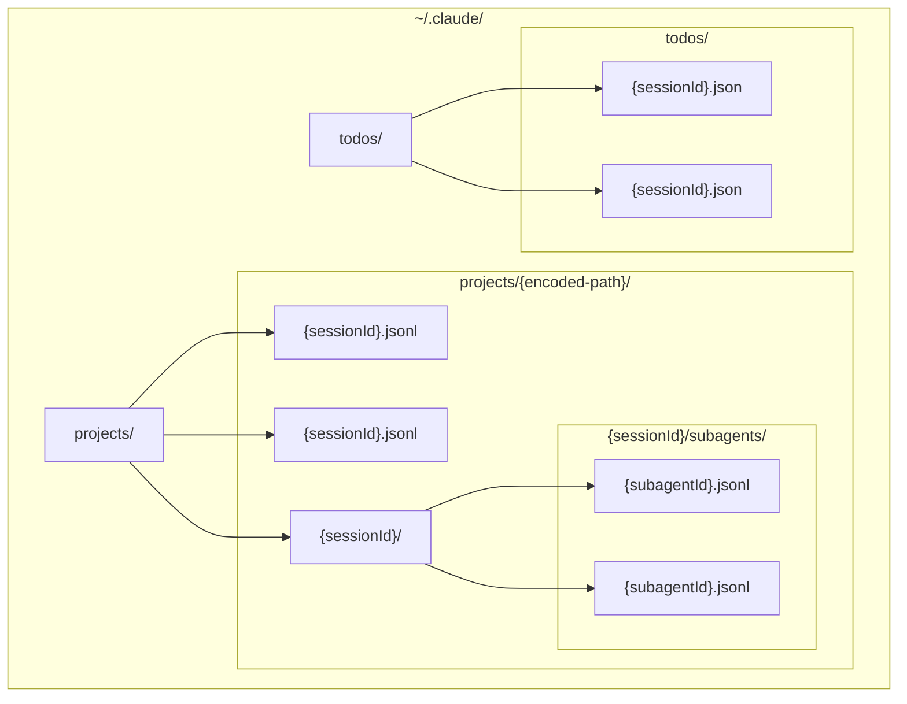
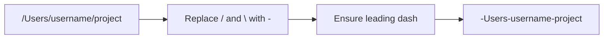
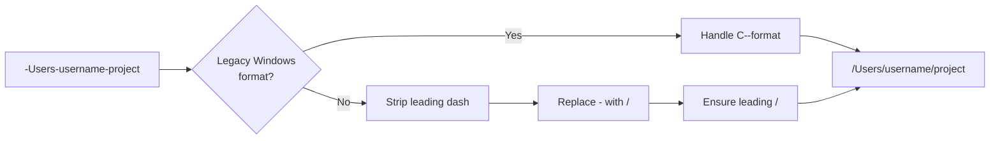
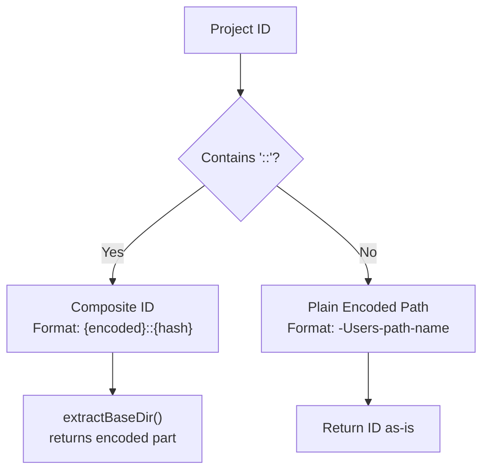
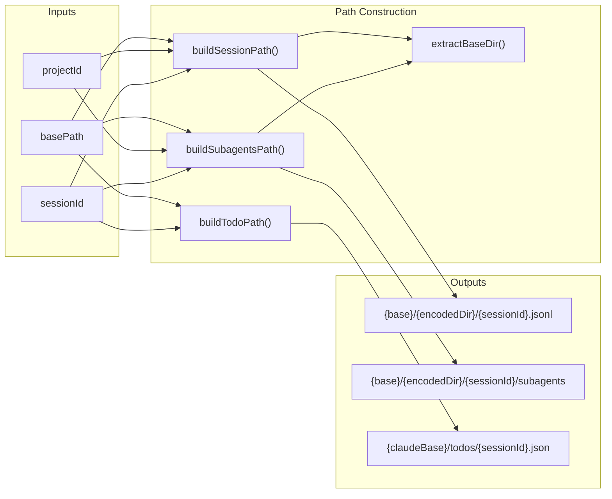
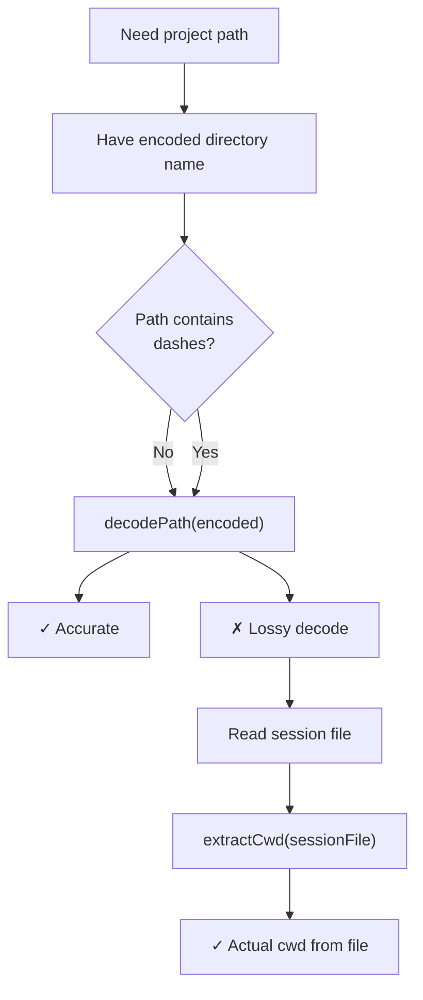

# 경로 인코딩 및 Project ID

<details>
<summary>관련 소스 파일</summary>

다음 파일들은 이 위키 페이지를 생성하기 위한 컨텍스트로 사용되었습니다.

- [.github/workflows/ci.yml](.github/workflows/ci.yml)
- [src/main/ipc/config.ts](src/main/ipc/config.ts)
- [src/main/services/error/ErrorTriggerChecker.ts](src/main/services/error/ErrorTriggerChecker.ts)
- [src/main/utils/metadataExtraction.ts](src/main/utils/metadataExtraction.ts)
- [src/main/utils/pathDecoder.ts](src/main/utils/pathDecoder.ts)
- [src/main/utils/pathValidation.ts](src/main/utils/pathValidation.ts)
- [src/renderer/components/chat/ChatHistoryLoadingState.tsx](src/renderer/components/chat/ChatHistoryLoadingState.tsx)
- [src/renderer/components/notifications/NotificationRow.tsx](src/renderer/components/notifications/NotificationRow.tsx)
- [src/renderer/index.html](src/renderer/index.html)
- [test/main/ipc/guards.test.ts](test/main/ipc/guards.test.ts)
- [test/main/services/discovery/ProjectPathResolver.test.ts](test/main/services/discovery/ProjectPathResolver.test.ts)
- [test/main/utils/pathDecoder.test.ts](test/main/utils/pathDecoder.test.ts)
- [test/main/utils/pathValidation.test.ts](test/main/utils/pathValidation.test.ts)
- [test/mocks/electronAPI.ts](test/mocks/electronAPI.ts)

</details>


이 페이지는 Claude Code가 파일 시스템에서 세션 파일을 구성하기 위해 사용하는 경로 인코딩 시스템과, `claude-devtools`가 프로젝트 메타데이터를 재구성하기 위해 이러한 경로를 디코딩하는 방식을 문서화합니다. 여기에는 인코딩/디코딩 알고리즘, subproject를 위한 composite project ID 형식, 검증 패턴, 경로 구성 유틸리티가 포함됩니다.

이렇게 인코딩된 디렉터리를 스캔하고 탐색하는 정보는 [Project Scanner]()를 참조하세요. 이 디렉터리 안의 세션 파일 파싱 세부 정보는 [JSONL Parsing]()을 참조하세요.

## 목적과 범위

Claude Code는 모든 세션 데이터를 `~/.claude/` 디렉터리에 저장합니다. 프로젝트 디렉터리는 절대 파일 시스템 경로(예: `/Users/username/myproject`)를 dash로 구분된 디렉터리 이름(예: `-Users-username-myproject`)으로 변환하여 인코딩됩니다. 이 인코딩은 dash가 포함된 경로에서는 **손실적**이므로, 원본 경로를 복구하기 위한 fallback 메커니즘이 필요합니다.

이 페이지는 다음을 다룹니다.
- Claude Code가 사용하는 디렉터리 구조
- 인코딩/디코딩 알고리즘과 그 한계
- multi-cwd 프로젝트를 위한 composite project ID
- 인코딩된 경로와 project ID에 대한 검증 패턴
- 세션 파일, subagents, todos를 위한 경로 구성 유틸리티

## Claude 디렉터리 구조

Claude Code는 `~/.claude/` 아래의 잘 정의된 디렉터리 계층에 세션 데이터를 구성합니다.

**Claude 디렉터리 계층**


**디렉터리 구조 예시:**
```
~/.claude/
├── projects/
│   ├── -Users-matt-myproject/
│   │   ├── abc123.jsonl           # Session file
│   │   ├── def456.jsonl           # Session file
│   │   └── abc123/                # Session-specific directory
│   │       └── subagents/
│   │           ├── sub1.jsonl     # Subagent session
│   │           └── sub2.jsonl     # Subagent session
│   └── -home-user-another-project/
│       └── xyz789.jsonl
└── todos/
    ├── abc123.json                # Task list for session abc123
    └── def456.json
```

**출처:** [src/main/utils/pathDecoder.ts:236-309]()

## 경로 인코딩 알고리즘

인코딩 알고리즘은 모든 경로 구분자(`/` 및 `\`)를 dash(`-`)로 대체하여 절대 파일 시스템 경로를 디렉터리 이름으로 변환합니다.

### 인코딩 함수

**경로에서 인코딩된 이름으로의 흐름**


**인코딩 과정:**
1. 모든 forward slash(`/`)와 backslash(`\`)를 dash(`-`)로 대체합니다 [src/main/utils/pathDecoder.ts:32-32]().
2. 절대 경로임을 나타내기 위해 결과가 dash로 시작하도록 보장합니다 [src/main/utils/pathDecoder.ts:35-35]().

**함수:** `encodePath(absolutePath: string): string` [src/main/utils/pathDecoder.ts:27-36]()

**예시:**
| 입력 경로 | 인코딩된 디렉터리 이름 |
|-----------|----------------------|
| `/Users/username/projectname` | `-Users-username-projectname` |
| `C:\Users\username\projectname` | `-C:-Users-username-projectname` |
| `/home/user/projects/myapp` | `-home-user-projects-myapp` |

**출처:** [src/main/utils/pathDecoder.ts:20-36](), [test/main/utils/pathDecoder.test.ts:18-44]()

### 디코딩 함수

디코딩 과정은 인코딩을 되돌리지만, 디렉터리 이름에 dash가 포함된 경로는 **정확히 복원할 수 없습니다** [src/main/utils/pathDecoder.ts:11-14]().

**인코딩된 이름에서 경로로의 흐름**


**디코딩 과정:**
1. drive separator가 `--`로 인코딩된 legacy Windows 형식(`C--Users-...`)인지 확인합니다 [src/main/utils/pathDecoder.ts:50-58]().
2. 선행 dash를 제거합니다 [src/main/utils/pathDecoder.ts:61-61]().
3. 모든 dash를 forward slash로 대체합니다 [src/main/utils/pathDecoder.ts:64-64]().
4. POSIX 경로에 선행 slash가 있도록 보장합니다(Windows drive가 감지된 경우 제외) [src/main/utils/pathDecoder.ts:71-72]().
5. Windows에서 실행 중이면 WSL mount path(예: `/mnt/c/...`)를 Windows drive letter로 변환합니다 [src/main/utils/pathDecoder.ts:75-75]().

**함수:** `decodePath(encodedName: string): string` [src/main/utils/pathDecoder.ts:45-76]()

**손실성 예시:**
```
Original path:    /Users/matt/claude-devtools
Encoded:          -Users-matt-claude-devtools
Decoded (lossy):  /Users/matt/claude/devtools  ❌ Incorrect!
```

**출처:** [src/main/utils/pathDecoder.ts:38-76](), [test/main/utils/pathDecoder.test.ts:46-82]()

### Project Name 추출

`extractProjectName` 함수는 인코딩된 디렉터리 이름에서 마지막 경로 segment를 추출합니다. 손실성을 피하기 위해 `cwdHint` 파라미터를 지원합니다 [src/main/utils/pathDecoder.ts:84-95]().

**함수 시그니처:**
```typescript
extractProjectName(encodedName: string, cwdHint?: string): string
```

**로직:**
1. `cwdHint`가 제공되면(실제 파일 시스템 경로), 구분자로 split하여 마지막 segment를 추출합니다 [src/main/utils/pathDecoder.ts:87-91]().
2. 그렇지 않으면 인코딩된 이름을 디코딩하고 마지막 segment를 추출합니다 [src/main/utils/pathDecoder.ts:92-94]().
3. 추출된 이름을 반환하거나 인코딩된 이름으로 fallback합니다 [src/main/utils/pathDecoder.ts:94-94]().

**출처:** [src/main/utils/pathDecoder.ts:79-95](), [test/main/utils/pathDecoder.test.ts:105-112]()

## Composite Project ID

단일 인코딩 디렉터리 안의 세션들이 서로 다른 `cwd` 값을 가지면, 시스템은 **composite IDs**를 사용해 이를 여러 논리적 프로젝트로 분할합니다.

### Composite ID 형식

```
{encodedPath}::{8-char-hex-hash}
```

**구성 요소:**
- **Base Directory:** 인코딩된 경로(예: `-Users-matt-workspace`).
- **Separator:** Double colon(`::`).
- **Hash Suffix:** `cwd` 경로에서 파생된 8자리 hex hash.

### ID 유형 결정 트리



**함수:**
- `extractBaseDir(projectId: string): string` - composite ID에서 base encoded path를 추출합니다 [src/main/utils/pathDecoder.ts:192-198]().
- `isValidProjectId(projectId: string): boolean` - plain ID와 composite ID 형식을 모두 검증합니다 [src/main/utils/pathDecoder.ts:169-185]().

**출처:** [src/main/utils/pathDecoder.ts:169-198](), [test/main/ipc/guards.test.ts:12-33]()

## 경로 검증

### 인코딩된 경로 검증

`isValidEncodedPath` 함수는 디렉터리 이름이 Claude 인코딩 패턴을 따르는지 검증합니다 [src/main/utils/pathDecoder.ts:124-160]().

**검증 규칙:**
1. dash(`-`)로 시작하거나 legacy Windows 형식(`C--...`)과 일치해야 합니다 [src/main/utils/pathDecoder.ts:131-137]().
2. 영숫자, underscores, dots, spaces, dashes만 허용합니다 [src/main/utils/pathDecoder.ts:142-143]().
3. single colon(`:`)은 Windows drive를 위해 선행 dash 바로 뒤에만 허용합니다(예: `-C:-...`) [src/main/utils/pathDecoder.ts:150-159]().

**유효한 예시:**
- `-Users-username-projectname` ✓
- `-C:-Users-username-projectname` ✓ (Windows)
- `C--Users-username-projectname` ✓ (legacy Windows)

**출처:** [src/main/utils/pathDecoder.ts:119-160](), [test/main/utils/pathDecoder.test.ts:119-160]()

## 경로 구성 유틸리티

`pathDecoder` 모듈은 세션 파일, subagents, todos의 전체 경로를 구성하기 위한 유틸리티 함수를 제공합니다.

### 경로 구성 로직



### 함수 시그니처

| 함수 | 목적 | 시그니처 |
|----------|---------|-----------|
| `buildSessionPath` | session JSONL 파일 경로 | `(basePath, projectId, sessionId) => string` [src/main/utils/pathDecoder.ts:216-223]() |
| `buildSubagentsPath` | subagents 디렉터리 경로 | `(basePath, projectId, sessionId) => string` [src/main/utils/pathDecoder.ts:228-234]() |
| `buildTodoPath` | task list JSON 파일 경로 | `(claudeBasePath, sessionId) => string` [src/main/utils/pathDecoder.ts:239-242]() |

**출처:** [src/main/utils/pathDecoder.ts:216-242](), [test/main/utils/pathDecoder.test.ts:182-210]()

## Base Path 구성

시스템은 WSL 지원을 포함해 Claude base directory paths를 가져오고 구성하는 함수를 제공합니다.

**함수:**
- `getClaudeBasePath()`: 수동 override(예: WSL)를 우선하여 현재 base path를 반환합니다 [src/main/utils/pathDecoder.ts:258-261]().
- `getProjectsBasePath()`: `projects` 디렉터리의 절대 경로를 반환합니다 [src/main/utils/pathDecoder.ts:276-278]().
- `getTodosBasePath()`: `todos` 디렉터리의 절대 경로를 반환합니다 [src/main/utils/pathDecoder.ts:283-285]().
- `translateWslMountPath(posixPath)`: Windows에서 실행 중일 때 `/mnt/X/...`를 `X:/...`로 변환합니다 [src/main/utils/pathDecoder.ts:101-112]().

**출처:** [src/main/utils/pathDecoder.ts:258-309](), [src/main/ipc/config.ts:117-120]()

## 메타데이터 추출 및 CWD Fallback

인코딩 알고리즘은 dash가 포함된 경로에 대해 손실적입니다. `claude-devtools`는 세션 JSONL 파일의 첫 번째 메시지에서 실제 `cwd` 필드를 읽어 이 문제를 해결합니다.

### 확인 전략



### ProjectPathResolver

`ProjectPathResolver` 서비스(`ProjectScanner`가 사용)는 `cwd` fallback을 사용해 경로 확인을 처리합니다.

**메서드:** `resolveProjectPath(projectId: string, options?: { cwdHint?: string })`

**확인 단계:**
1. `cwdHint`가 제공되면 이를 프로젝트 경로로 직접 사용합니다 [test/main/services/discovery/ProjectPathResolver.test.ts:34-44]().
2. 그렇지 않으면 resolver는 프로젝트 디렉터리의 첫 번째 세션 파일 첫 줄에서 `cwd`를 읽으려고 시도합니다 [test/main/services/discovery/ProjectPathResolver.test.ts:46-61]().
3. 세션이 없으면 손실적인 `decodePath()` 결과로 fallback합니다 [test/main/services/discovery/ProjectPathResolver.test.ts:63-71]().

**함수:** `extractCwd(filePath, fsProvider)` [src/main/utils/metadataExtraction.ts:41-75]()
- `readline`을 사용해 JSONL 파일을 줄 단위로 읽습니다.
- `cwd` 필드를 포함하는 첫 번째 entry를 파싱합니다.
- drive letter를 정규화하고 WSL 경로를 변환합니다 [src/main/utils/metadataExtraction.ts:64-64]().

**출처:** [src/main/utils/metadataExtraction.ts:41-75](), [test/main/services/discovery/ProjectPathResolver.test.ts:1-95]()
