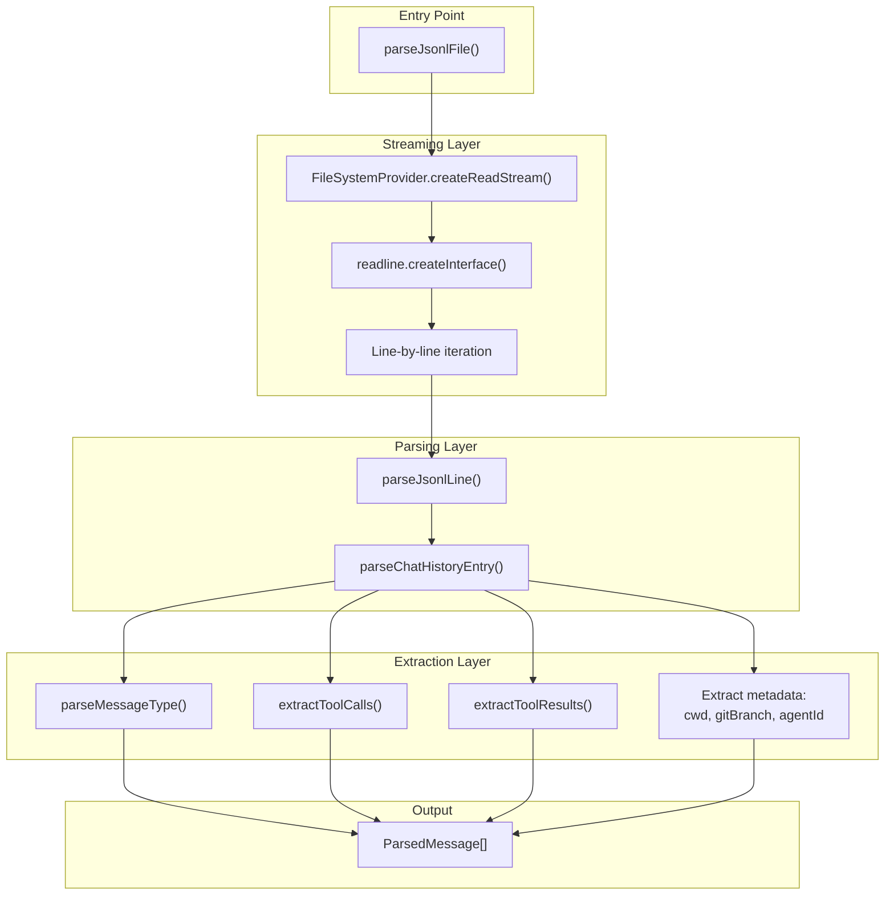
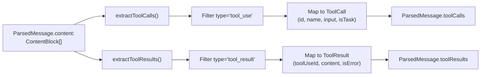
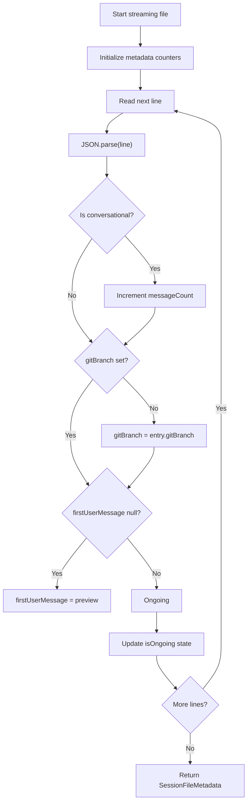

# JSONL 파싱

<details>
<summary>관련 소스 파일</summary>

다음 파일들은 이 위키 페이지를 생성하기 위한 컨텍스트로 사용되었습니다.

- [public/demo.mp4](public/demo.mp4)
- [public/icon.png](public/icon.png)
- [resources/demo.mp4](resources/demo.mp4)
- [src/main/services/discovery/SubagentResolver.ts](src/main/services/discovery/SubagentResolver.ts)
- [src/main/services/parsing/ClaudeMdReader.ts](src/main/services/parsing/ClaudeMdReader.ts)
- [src/main/services/parsing/SessionParser.ts](src/main/services/parsing/SessionParser.ts)
- [src/main/types/messages.ts](src/main/types/messages.ts)
- [src/main/utils/jsonl.ts](src/main/utils/jsonl.ts)
- [test/main/services/parsing/SessionParser.test.ts](test/main/services/parsing/SessionParser.test.ts)
- [test/main/utils/jsonl.test.ts](test/main/utils/jsonl.test.ts)

</details>


## 목적과 범위

이 페이지는 `claude-devtools`가 JSONL(JSON Lines) 형식으로 저장된 Claude Code 세션 파일을 파싱하는 방식을 설명합니다. 스트리밍 파싱 파이프라인, 메시지 타입 처리, 메타데이터 추출, 세션 상태 감지를 다룹니다.

세션이 탐색되고 색인되는 방식에 대한 정보는 [Project Scanner [4.1]]()를 참조하세요. 경로 인코딩과 project ID에 대한 세부 정보는 [Path Encoding & Project IDs [4.2]]()를 참조하세요. 반복 파싱을 최적화하는 캐싱 전략은 [Caching Strategy [4.4]]()를 참조하세요.

---

## JSONL 파일 형식

Claude Code 세션은 `~/.claude/projects/` 디렉터리의 `.jsonl` 파일로 저장됩니다. 각 파일은 줄마다 하나의 JSON 객체를 포함하며, 각 객체는 chat history entry를 나타냅니다.

**형식 특성:**
- 줄마다 하나의 완전한 JSON 객체 [src/main/utils/jsonl.ts:4-5]()
- 줄 사이에 trailing comma 없음 [src/main/utils/jsonl.ts:6]()
- 빈 줄은 파싱 중 건너뜀 [src/main/utils/jsonl.ts:7]()
- UTF-8 인코딩 [src/main/utils/jsonl.ts:62]()

**파일 위치 패턴:**
```
~/.claude/projects/{encoded-project-path}/{session-id}.jsonl
```

각 줄은 여러 타입 중 하나일 수 있는 `ChatHistoryEntry`를 나타냅니다.
- `user` - 사용자 메시지와 도구 결과 [src/main/utils/jsonl.ts:143-152]()
- `assistant` - usage와 tool calls를 포함한 AI 응답 [src/main/utils/jsonl.ts:153-159]()
- `system` - 시스템 메시지(메타 정보) [src/main/utils/jsonl.ts:160-162]()
- `summary` - 대화 요약 [src/main/utils/jsonl.ts:207-208]()
- `file-history-snapshot` - 파일 시스템 상태 스냅샷 [src/main/utils/jsonl.ts:209-210]()
- `queue-operation` - 작업 큐 entry [src/main/utils/jsonl.ts:211-212]()

**출처:** [src/main/utils/jsonl.ts:1-8](), [src/main/utils/jsonl.ts:199-217](), [src/main/types/messages.ts:63-108]()

---

## 핵심 파싱 파이프라인

### 스트리밍 아키텍처

parser는 Node.js `readline`을 사용해 파일을 줄 단위로 스트리밍하여 대형 세션 파일의 메모리 오버헤드를 피합니다. 이는 `parseJsonlFile`에 구현되어 있습니다.

**파싱 흐름 다이어그램:**



**출처:** [src/main/utils/jsonl.ts:52-82](), [src/main/utils/jsonl.ts:88-95]()

### 주요 파싱 클래스와 함수

`SessionParser` 클래스는 파싱을 위한 고수준 인터페이스를 제공하며, `jsonl.ts`는 유틸리티 로직을 포함합니다.

| 엔티티 | 파일 | 목적 |
|----------|---------|---------|
| `SessionParser` | [src/main/services/parsing/SessionParser.ts:54]() | 고수준 세션 데이터 추출 및 그룹화를 위한 서비스입니다. |
| `parseJsonlFile()` | [src/main/utils/jsonl.ts:52]() | 스트리밍으로 전체 JSONL 파일을 파싱합니다. |
| `parseJsonlLine()` | [src/main/utils/jsonl.ts:88]() | 단일 JSON 줄을 `ParsedMessage`로 파싱합니다. |
| `processMessages()` | [src/main/services/parsing/SessionParser.ts:84]() | 메시지를 타입별(realUser, internalUser, sidechain)로 분류합니다. |

**출처:** [src/main/services/parsing/SessionParser.ts:54-139](), [src/main/utils/jsonl.ts:52-95]()

---

## 메시지 타입과 구조

### ParsedMessage 구조

`parseChatHistoryEntry()` 함수는 원시 JSONL entry를 정규화된 `ParsedMessage` 형식으로 변환합니다.

```typescript
export interface ParsedMessage {
  uuid: string;
  parentUuid: string | null;
  type: MessageType;
  timestamp: Date;
  role?: string;
  content: ContentBlock[] | string;
  usage?: TokenUsage;
  model?: string;
  cwd?: string;
  gitBranch?: string;
  agentId?: string;
  isSidechain: boolean;
  isMeta: boolean;
  userType?: string;
  toolCalls: ToolCall[];
  toolResults: ToolResult[];
  requestId?: string;
}
```

**주요 파싱 로직:**

1. **UUID validation** - `uuid`가 없는 entry는 건너뜁니다 [src/main/utils/jsonl.ts:106-108]()
2. **Type filtering** - 알 수 없는 메시지 타입은 `null`을 반환합니다 [src/main/utils/jsonl.ts:199-217]()
3. **Tool extraction** - `extractToolCalls()`와 `extractToolResults()`를 호출합니다 [src/main/utils/jsonl.ts:166-167]()
4. **Metadata copying** - 대화 entry에서 `cwd`, `gitBranch`, `agentId`를 추출합니다 [src/main/utils/jsonl.ts:134-163]()

**출처:** [src/main/utils/jsonl.ts:104-194](), [src/main/types/messages.ts:63-108]()

---

## Content Block과 Tool 추출

Assistant 메시지는 `ContentBlock` 객체 배열을 포함합니다. `extractToolCalls`와 `extractToolResults`(`toolExtraction`에서 import됨)는 이 block들을 처리합니다.

**Tool Call 매핑:**

| 코드 엔티티 | 목적 |
|------------|---------|
| `ToolCall` | assistant `tool_use` block에서 추출됩니다 [src/main/types/messages.ts:28-41]() |
| `ToolResult` | user `tool_result` block에서 추출됩니다 [src/main/types/messages.ts:46-53]() |
| `isParsedRealUserMessage()` | 사람 입력과 도구 결과를 구분합니다 [src/main/types/messages.ts:125-144]() |

**Tool 추출 흐름:**



**출처:** [src/main/utils/jsonl.ts:166-167](), [src/main/types/messages.ts:25-53]()

---

## 메타데이터 추출

### 효율적인 세션 메타데이터

`analyzeSessionFileMetadata()` 함수는 전체 대화를 파싱하지 않고 주요 세션 정보를 추출하기 위해 **단일 스트리밍 pass**를 수행합니다.

**알고리즘:**



**Ongoing 감지 로직:**
마지막 "ending event"(`ExitPlanMode` 또는 `shutdown_response` 같은 이벤트) 이후 활동(thinking, tool calls)이 있으면 세션은 `isOngoing: true`로 표시됩니다.

**출처:** [src/main/utils/jsonl.ts:42](), [test/main/utils/jsonl.test.ts:139-184]()

---

## Metrics 계산

`calculateMetrics()` 함수는 모든 메시지의 token usage를 집계합니다.

**계산되는 metrics:**

| Metric | 출처 | 설명 |
|--------|--------|-------------|
| `inputTokens` | `usage.input_tokens` | 요청의 토큰 [test/main/utils/jsonl.test.ts:40-43]() |
| `outputTokens` | `usage.output_tokens` | 응답의 토큰 [test/main/utils/jsonl.test.ts:40-43]() |
| `cacheReadTokens` | `usage.cache_read_input_tokens` | Prompt cache hits [test/main/utils/jsonl.test.ts:75]() |
| `cacheCreationTokens` | `usage.cache_creation_input_tokens` | Prompt cache writes [test/main/utils/jsonl.test.ts:76]() |
| `durationMs` | Max - Min Timestamps | 세션 지속 시간 [test/main/utils/jsonl.test.ts:87-95]() |

**출처:** [test/main/utils/jsonl.test.ts:27-137](), [src/main/services/parsing/SessionParser.ts:126]()

---

## Subagent 확인

`SubagentResolver`는 부모 세션의 `Task` tool call을 해당 subagent JSONL 파일과 연결합니다.

1. **Detection:** `{sessionId}/subagents/` 디렉터리를 스캔합니다 [src/main/services/discovery/SubagentResolver.ts:45]().
2. **Parsing:** 각 subagent 파일은 `parseJsonlFile`을 사용해 파싱됩니다 [src/main/services/discovery/SubagentResolver.ts:91]().
3. **Filtering:** 첫 메시지 내용이 "Warmup"인 "Warmup" subagent는 폐기됩니다 [src/main/services/discovery/SubagentResolver.ts:144-154]().
4. **Linking:** `tool_result` 메시지에서 발견되는 `agentId`를 통해 subagent를 부모 `Task` call과 매칭합니다 [src/main/services/discovery/SubagentResolver.ts:207-211]().

**출처:** [src/main/services/discovery/SubagentResolver.ts:38-136](), [src/main/services/discovery/SubagentResolver.ts:144-154]()

---

## 오류 처리

parser는 잘못된 형식의 파일에도 견고하게 동작하도록 설계되었습니다.
- **Skip Malformed Lines:** 특정 줄에서 `JSON.parse`가 실패하면 로그를 남기고 건너뜁니다 [src/main/utils/jsonl.ts:71-79]().
- **Non-Existent Files:** 파일 경로가 유효하지 않으면 parser는 예외를 던지는 대신 빈 배열을 반환합니다 [src/main/utils/jsonl.ts:58-60]().
- **Incomplete Metadata:** 메타데이터 추출은 optional chaining과 fallback을 사용해 초기 세션 entry의 누락된 필드를 처리합니다.

**출처:** [src/main/utils/jsonl.ts:71-81](), [src/main/utils/jsonl.ts:58-60]()
