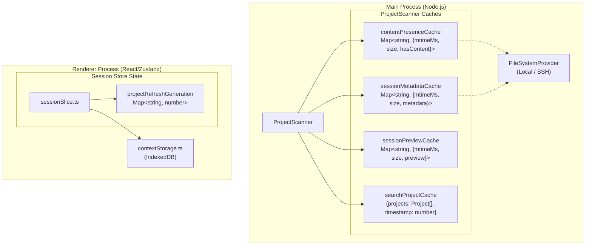
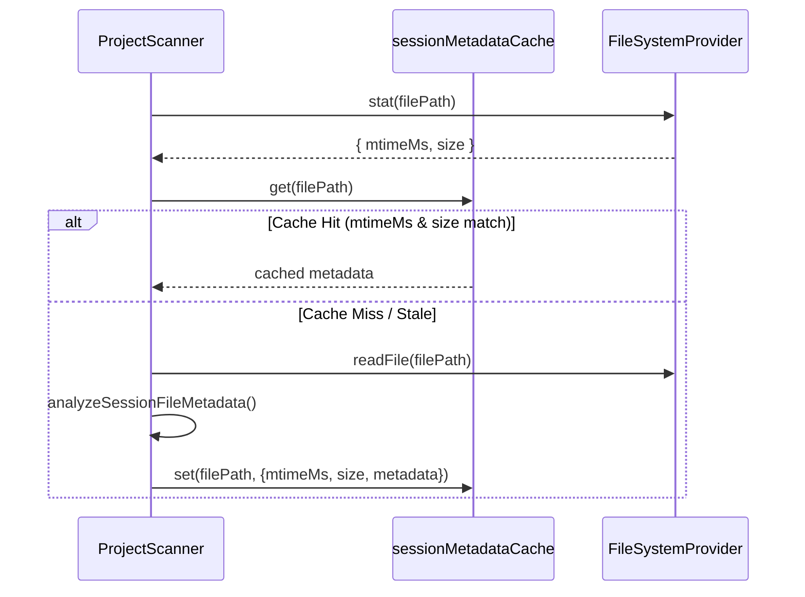
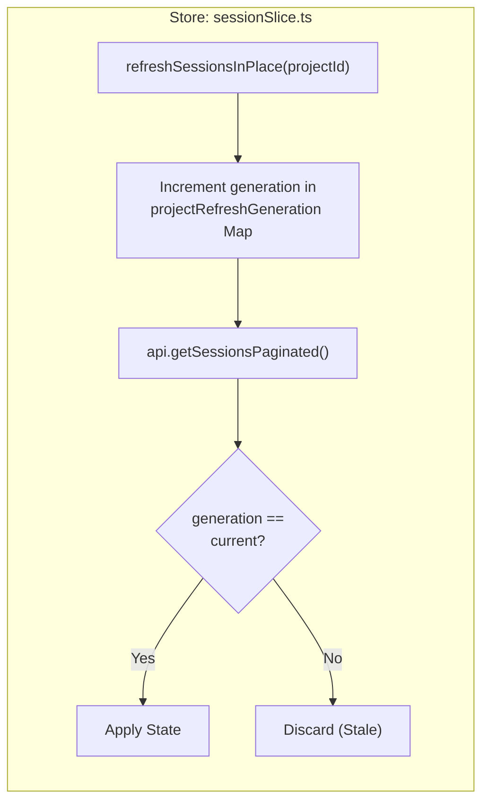

# 캐싱 전략

관련 소스 파일

다음 파일들은 이 위키 페이지를 생성하기 위한 컨텍스트로 사용되었습니다.

- [src/main/services/discovery/ProjectPathResolver.ts](src/main/services/discovery/ProjectPathResolver.ts)
- [src/main/services/discovery/ProjectScanner.ts](src/main/services/discovery/ProjectScanner.ts)
- [src/main/services/infrastructure/DataCache.ts](src/main/services/infrastructure/DataCache.ts)
- [src/main/services/infrastructure/FileSystemProvider.ts](src/main/services/infrastructure/FileSystemProvider.ts)
- [src/main/services/infrastructure/FileWatcher.ts](src/main/services/infrastructure/FileWatcher.ts)
- [src/main/services/infrastructure/SshFileSystemProvider.ts](src/main/services/infrastructure/SshFileSystemProvider.ts)
- [src/renderer/components/sidebar/SessionItem.tsx](src/renderer/components/sidebar/SessionItem.tsx)
- [src/renderer/store/slices/sessionSlice.ts](src/renderer/store/slices/sessionSlice.ts)

이 문서는 `claude-devtools` 전반에서 성능을 최적화하기 위해 사용하는 다계층 캐싱 아키텍처를 설명하며, 특히 SSH 원격 접근 시나리오에 중점을 둡니다. 캐싱 시스템은 main process의 인메모리 파일 메타데이터 cache, renderer의 IndexedDB 컨텍스트 스냅샷, stale data overwrite를 방지하는 generation tracking 등 여러 수준에서 동작합니다.

## 개요

캐싱 전략은 세 가지 성능 문제를 해결합니다.

1.  **Repeated File System Access**: 세션 파일(JSONL 형식)은 pagination, 실시간 업데이트, detail views 중 여러 번 읽힙니다.
2.  **SSH Latency**: SFTP를 통한 원격 파일 작업은 파일당 100-500ms가 걸릴 수 있어, cache 없는 접근은 감당하기 어려울 정도로 느립니다 [src/main/services/infrastructure/SshFileSystemProvider.ts:24-25]().
3.  **Context Switching**: 로컬 환경과 SSH 환경 사이의 전환은 즉각적이어야 하므로 전체 상태 보존이 필요합니다.

해결책은 서로 보완적인 캐싱 계층을 사용하며, 각 계층은 서로 다른 TTL 정책과 invalidation 전략을 가집니다.

출처: [src/main/services/discovery/ProjectScanner.ts:1-16](), [src/main/services/infrastructure/SshFileSystemProvider.ts:23-27]()

## Multi-Tier Cache 아키텍처

이 시스템은 자연어 요구 사항(빠른 UI, 원격 지원)을 코드 엔티티(특정 `Map` 객체와 서비스)에 연결합니다.

### 아키텍처 개요: Logic to Code Entity Mapping

**Cache 계층:**

| 계층 | 코드 엔티티 | Invalidation | 목적 |
| :--- | :--- | :--- | :--- |
| **Content Presence** | `contentPresenceCache` | `mtimeMs` + `size` | 노이즈 감지(표시 가능한 내용이 있는가?) |
| **Session Metadata** | `sessionMetadataCache` | `mtimeMs` + `size` | 전체 분석(tokens, git branch, message count) |
| **Session Preview** | `sessionPreviewCache` | `mtimeMs` + `size` | 경량 preview(첫 메시지 text/timestamp) |
| **Search Cache** | `searchProjectCache` | 30s TTL | 모든 검색 query마다 디스크를 다시 스캔하지 않도록 방지 |
| **Generation Tracking** | `projectRefreshGeneration` | 요청마다 증가 | stale async response가 상태를 덮어쓰지 못하게 방지 |

출처: [src/main/services/discovery/ProjectScanner.ts:64-85](), [src/renderer/store/slices/sessionSlice.ts:18](), [src/main/services/discovery/ProjectScanner.ts:62]()

## 세션 파일 캐싱(Main Process)

`ProjectScanner`는 세션 파일 데이터를 위해 세 개의 인메모리 cache를 유지합니다. 각 cache는 동일한 invalidation 전략을 사용하지만 서로 다른 세부 수준을 저장합니다.

### Cache 조회 및 Invalidation 흐름

invalidation 로직은 수정 시간(`mtimeMs`)과 파일 크기를 모두 비교하여, 파일이 수정된 뒤 빠르게 같은 크기로 복원되는 경우에도 cache 정확성을 보장합니다.

`DataCache` 서비스는 parsed `SessionDetail` 객체를 위한 더 높은 수준의 LRU(Least Recently Used) cache도 제공하며, 구성 가능한 `maxSize`(기본 50)와 `ttl`(기본 10분)을 가집니다 [src/main/services/infrastructure/DataCache.ts:27-40]().

출처: [src/main/services/discovery/ProjectScanner.ts:67-78](), [src/main/services/infrastructure/DataCache.ts:35-40]()

### Cache 세부 사항

1.  **Content Presence Cache**: "noise" 세션(예: 실제 user/assistant 메시지가 없는 세션)을 필터링하기 위해 프로젝트 스캔 중 채워집니다 [src/main/services/discovery/ProjectScanner.ts:67-70]().
2.  **Session Metadata Cache**: token counts와 message summaries를 포함하는 `analyzeSessionFileMetadata` 결과를 저장합니다 [src/main/services/discovery/ProjectScanner.ts:71-78]().
3.  **Search Project Cache**: 입력 중 UI 반응성을 유지하기 위해 30초 TTL(`SEARCH_PROJECT_CACHE_TTL_MS`)로 검색 작업을 위한 전체 프로젝트 목록을 별도로 캐시합니다 [src/main/services/discovery/ProjectScanner.ts:62-85]().

출처: [src/main/services/discovery/ProjectScanner.ts:61-85]()

## 실시간 업데이트를 위한 Generation Tracking

renderer process는 빠른 파일 변경 이벤트 상황에서 "last-write-wins" 의미론을 보장하기 위해 `sessionSlice.ts`에서 generation tracking을 사용합니다.

### Stale 업데이트 방지

파일이 변경되면 `FileWatcher`가 이벤트를 emit합니다 [src/main/services/infrastructure/FileWatcher.ts:8-10](). renderer는 `refreshSessionsInPlace`를 호출하여 이에 응답합니다.

이를 통해 여러 refresh가 빠르게 연속 트리거될 때(활성 Claude Code 세션 중 흔함), 더 느린 이전 요청이 더 빠른 최신 요청의 결과를 덮어쓸 수 없도록 보장합니다.

출처: [src/renderer/store/slices/sessionSlice.ts:15-18](), [src/renderer/store/slices/sessionSlice.ts:210-235]()

## SSH 성능 최적화

SFTP 작업의 오버헤드 때문에 SSH 성능에는 캐싱이 중요합니다.

### 다중 수준 메타데이터

시스템은 high-latency 연결에 최적화하기 위해 "light" 메타데이터와 "deep" 메타데이터를 구분합니다.

*   **Light Metadata**: sidebar에 필요한 항목(first message preview, timestamp)만 가져옵니다. SSH 모드의 기본값입니다 [src/main/services/discovery/ProjectScanner.ts:25-28]().
*   **Deep Metadata**: 전체 token analysis와 git 정보를 포함합니다.

### Batching과 동시성

`ProjectScanner`는 provider type에 따라 동시성을 조정합니다.
*   **Local**: 더 높은 동시성(24 batches)을 사용합니다 [src/main/services/discovery/ProjectScanner.ts:137]().
*   **SSH**: SSH channel 포화와 timeout을 피하기 위해 더 낮은 동시성(8 batches)을 사용합니다 [src/main/services/discovery/ProjectScanner.ts:137]().

### SSH Polling과 캐싱

SFTP에서는 `fs.watch`를 사용할 수 없으므로, `FileWatcher`는 SSH에 polling 메커니즘(`SSH_POLL_INTERVAL_MS = 3000`)을 사용합니다 [src/main/services/infrastructure/FileWatcher.ts:73-76](). 전체 파일을 다시 읽지 않고 변경을 감지하기 위해 `polledFileSizes` map을 유지합니다 [src/main/services/infrastructure/FileWatcher.ts:81-82]().

출처: [src/main/services/discovery/ProjectScanner.ts:135-139](), [src/main/services/infrastructure/FileWatcher.ts:73-82](), [src/main/services/infrastructure/SshFileSystemProvider.ts:23-27]()

## 경로 확인 캐싱

`ProjectPathResolver`는 project ID(인코딩된 경로)와 canonical filesystem path 사이의 매핑을 `projectPathCache`에 memoize합니다 [src/main/services/discovery/ProjectPathResolver.ts:30-33]().

이는 경로 확인에 다음이 필요할 수 있기 때문에 특히 중요합니다.
1.  `cwdHint` 확인 [src/main/services/discovery/ProjectPathResolver.ts:63-67]().
2.  실제 JSONL 세션 파일에서 `cwd` 추출 [src/main/services/discovery/ProjectPathResolver.ts:76-82]().
3.  fallback으로 디렉터리 이름 디코딩 [src/main/services/discovery/ProjectPathResolver.ts:88-90]().

이 결과를 캐싱하면 동일한 프로젝트에 대한 후속 조회(예: sidebar rendering 중)가 즉시 처리됩니다.

출처: [src/main/services/discovery/ProjectPathResolver.ts:30-33](), [src/main/services/discovery/ProjectPathResolver.ts:43-91]()
