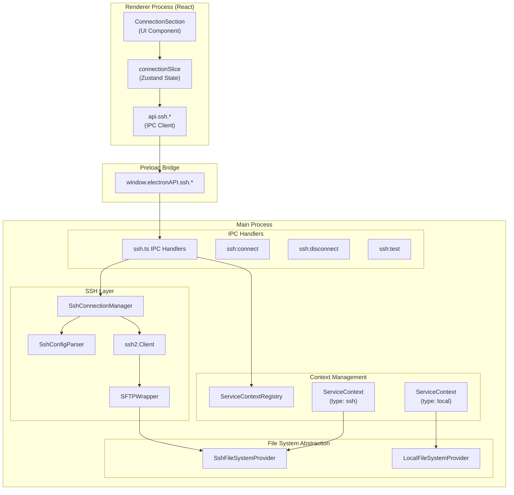
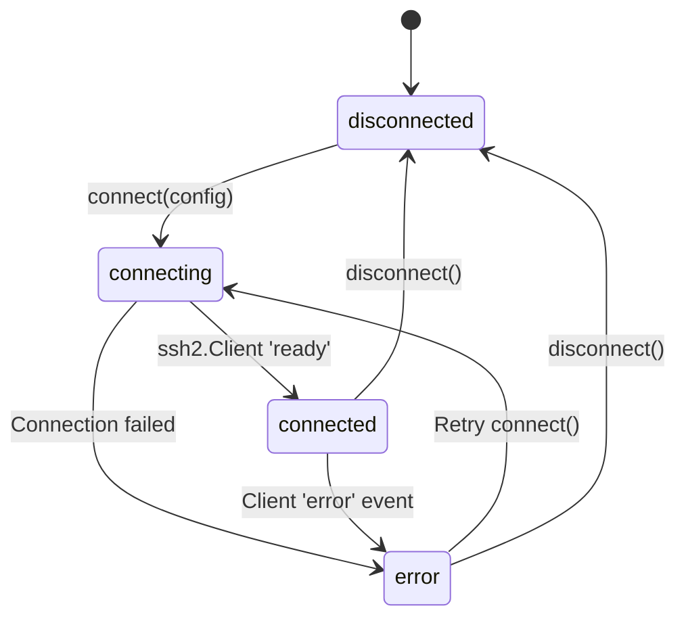
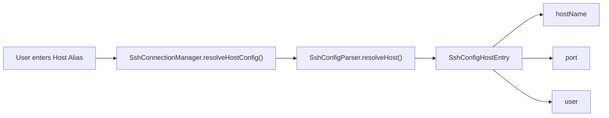
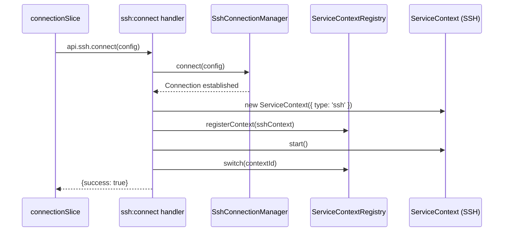

# SSH 원격 접근

<details>
<summary>관련 소스 파일</summary>

다음 파일들은 이 위키 페이지를 생성하기 위한 컨텍스트로 사용되었습니다.

- [.github/workflows/release.yml](.github/workflows/release.yml)
- [package.json](package.json)
- [pnpm-lock.yaml](pnpm-lock.yaml)
- [resources/afterInstall.sh](resources/afterInstall.sh)
- [src/main/ipc/context.ts](src/main/ipc/context.ts)
- [src/main/ipc/handlers.ts](src/main/ipc/handlers.ts)
- [src/main/ipc/ssh.ts](src/main/ipc/ssh.ts)
- [src/main/services/infrastructure/SshConnectionManager.ts](src/main/services/infrastructure/SshConnectionManager.ts)
- [src/renderer/store/slices/connectionSlice.ts](src/renderer/store/slices/connectionSlice.ts)

</details>


이 문서는 원격 머신에서 실행 중인 Claude Code 세션을 보고 분석할 수 있게 하는 claude-devtools의 SSH 원격 접근 시스템을 설명합니다. 연결 관리, 인증, 파일 시스템 추상화, 로컬 및 원격 데이터 소스 사이를 매끄럽게 전환할 수 있게 하는 multi-context 아키텍처를 다룹니다.

더 넓은 multi-context 시스템과 SSH 컨텍스트가 `ServiceContextRegistry`와 통합되는 방식은 [Multi-Context System](#3.2)을 참조하세요. 프로세스 사이에서 SSH 작업을 연결하는 IPC 통신 계층의 세부 정보는 [IPC Communication Layer](#3.3)를 참조하세요.

---

## 시스템 아키텍처

SSH 시스템은 main process의 **SshConnectionManager**, SSH 작업을 renderer에 노출하는 **IPC bridge**, 연결 관리를 위한 사용자 컨트롤을 제공하는 **ConnectionSection UI**라는 세 가지 주요 계층으로 구성됩니다.

### SSH 원격 접근 아키텍처



**출처:** [src/main/services/infrastructure/SshConnectionManager.ts:1-57](), [src/main/ipc/ssh.ts:1-13](), [src/renderer/store/slices/connectionSlice.ts:1-25](), [src/main/ipc/handlers.ts:64-101]()

---

## Connection Manager

`SshConnectionManager` 클래스는 연결 수립, 인증 처리, SFTP 채널 유지, 다른 서비스에 대한 `FileSystemProvider` 추상화 제공을 포함하여 SSH 연결 수명 주기를 관리합니다.

### 핵심 책임

| 책임 | 구현 |
|---|---|
| 연결 수명 주기 | `connect()`, `disconnect()`, `testConnection()` |
| SSH config 파싱 | `SshConfigParser`에 위임 |
| 파일 시스템 추상화 | `LocalFileSystemProvider`와 `SshFileSystemProvider` 사이 전환 |
| 상태 추적 | `SshConnectionState`와 `SshConnectionStatus` 유지 |

### 연결 상태 머신



**출처:** [src/main/services/infrastructure/SshConnectionManager.ts:57-66](), [src/main/services/infrastructure/SshConnectionManager.ts:125-181]()

### 주요 메서드

`SshConnectionManager`는 다음 주요 메서드를 노출합니다.

```typescript
// Connection lifecycle
connect(config: SshConnectionConfig): Promise<void>
disconnect(): void
testConnection(config: SshConnectionConfig): Promise<{success: boolean, error?: string}>

// Provider access
getProvider(): FileSystemProvider
getRemoteProjectsPath(): string | null
isRemote(): boolean

// Status tracking
getStatus(): SshConnectionStatus
```

**출처:** [src/main/services/infrastructure/SshConnectionManager.ts:77-106](), [src/main/services/infrastructure/SshConnectionManager.ts:125-238]()

---

## 인증 방식

SSH 시스템은 `SshAuthMethod` 타입에 정의된 여러 인증 방식을 지원합니다.

### 지원되는 인증 방식

| 방식 | 설명 | 구현 |
|---|---|---|
| `password` | password 기반 인증 | `config.password` |
| `privateKey` | private key 파일 인증 | `config.privateKeyPath` |
| `agent` | SSH agent 인증 | 로컬 SSH agent socket 사용 |
| `auto` | 자동 방식 선택 | SSH config 또는 기본값을 통해 확인 |

**출처:** [src/main/services/infrastructure/SshConnectionManager.ts:35-44](), [src/main/services/infrastructure/SshConnectionManager.ts:195-219]()

---

## SSH Config 통합

`SshConfigParser` 클래스는 `~/.ssh/config`를 파싱하여 UI에서 host alias 확인과 자동 채우기 기능을 제공합니다.

### Config Host 확인

사용자가 host alias를 입력하면 시스템은 이를 실제 연결 파라미터로 확인합니다.



**출처:** [src/main/services/infrastructure/SshConnectionManager.ts:111-120](), [src/main/ipc/ssh.ts:173-182]()

---

## 파일 시스템 추상화

SSH 시스템은 `FileSystemProvider` 인터페이스를 사용해 파일 작업을 추상화함으로써, 동일한 코드가 로컬 파일 시스템과 원격 파일 시스템 모두에서 동작할 수 있게 합니다.

### Provider 아키텍처

```mermaid
graph TB
    subgraph "Abstract Interface"
        FileSystemProvider["FileSystemProvider (interface)"]
    end
    
    subgraph "Implementations"
        LocalFileSystemProvider["LocalFileSystemProvider"]
        SshFileSystemProvider["SshFileSystemProvider"]
    end
    
    subgraph "Contexts"
        ServiceContext_Local["ServiceContext (Local)"]
        ServiceContext_SSH["ServiceContext (SSH)"]
    end
    
    ServiceContext_Local --> LocalFileSystemProvider
    ServiceContext_SSH --> SshFileSystemProvider
    LocalFileSystemProvider --|> FileSystemProvider
    SshFileSystemProvider --|> FileSystemProvider
```

**출처:** [src/main/services/infrastructure/SshConnectionManager.ts:58-60](), [src/main/ipc/ssh.ts:92-98]()

---

## Context Management 통합

SSH 연결이 수립되면 시스템은 type이 `'ssh'`인 새 `ServiceContext`를 생성하고 이를 `ServiceContextRegistry`에 등록합니다.

### Context 생성 흐름



**출처:** [src/main/ipc/ssh.ts:70-116](), [src/renderer/store/slices/connectionSlice.ts:65-103]()

---

## IPC 핸들러

`src/main/ipc/ssh.ts`의 SSH IPC 핸들러는 renderer와 main process 사이에서 SSH 작업을 연결합니다.

| 채널 | 목적 |
|---|---|
| `ssh:connect` | SSH 연결을 수립하고 context 생성 |
| `ssh:disconnect` | 연결을 해제하고 로컬 context로 다시 전환 |
| `ssh:test` | context 전환 없이 연결 테스트 |
| `ssh:getState` | 현재 연결 상태 가져오기 |
| `ssh:getConfigHosts` | SSH config host aliases 나열 |

**출처:** [src/main/ipc/ssh.ts:14-21](), [src/main/ipc/ssh.ts:70-182]()

---

## 하위 페이지

특정 하위 시스템에 대한 깊은 기술적 세부 정보는 다음을 참조하세요.
- [SSH Connection Manager](#5.1) — 자세한 서비스 로직, auth resolution, 상태 관리.
- [SSH Configuration](#5.2) — Config 파싱 로직, host resolution, profile persistence.
- [Remote File Operations](#5.3) — SFTP 구현 세부 정보와 원격 경로 탐색.
