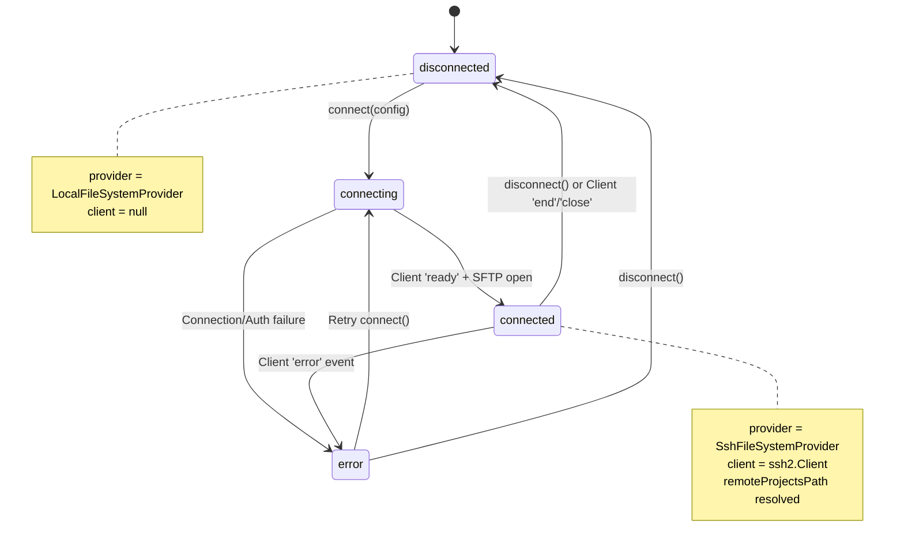
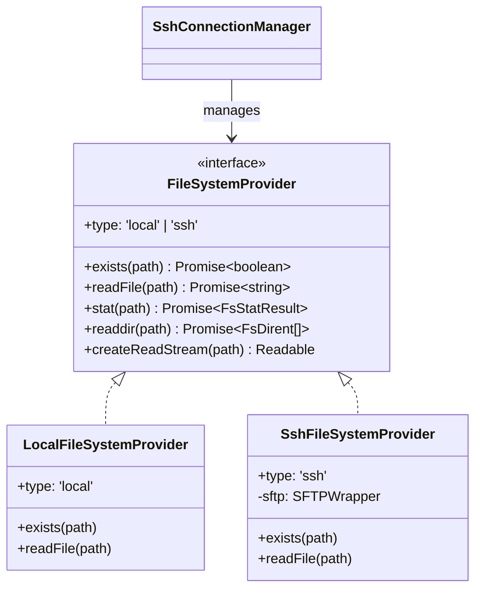

# SSH Connection Manager

<details>
<summary>관련 소스 파일</summary>

다음 파일들은 이 위키 페이지를 생성하기 위한 컨텍스트로 사용되었습니다.

- [.github/workflows/release.yml](.github/workflows/release.yml)
- [package.json](package.json)
- [pnpm-lock.yaml](pnpm-lock.yaml)
- [resources/afterInstall.sh](resources/afterInstall.sh)
- [src/main/services/discovery/ProjectPathResolver.ts](src/main/services/discovery/ProjectPathResolver.ts)
- [src/main/services/infrastructure/DataCache.ts](src/main/services/infrastructure/DataCache.ts)
- [src/main/services/infrastructure/FileSystemProvider.ts](src/main/services/infrastructure/FileSystemProvider.ts)
- [src/main/services/infrastructure/FileWatcher.ts](src/main/services/infrastructure/FileWatcher.ts)
- [src/main/services/infrastructure/SshConnectionManager.ts](src/main/services/infrastructure/SshConnectionManager.ts)
- [src/main/services/infrastructure/SshFileSystemProvider.ts](src/main/services/infrastructure/SshFileSystemProvider.ts)

</details>


**목적**: 이 문서는 SSH 연결 수명 주기와 인증을 관리하고, 원격 접근을 위한 통합 파일 시스템 추상화를 제공하는 `SshConnectionManager` 서비스를 설명합니다. 이 서비스를 통해 claude-devtools는 원격 머신에 연결하고 SSH를 통해 Claude Code 세션 파일에 접근할 수 있습니다.

---

## 개요

`SshConnectionManager` 클래스는 SSH 연결 수립과 유지를 담당하는 핵심 서비스입니다. SSH 인증, SFTP 채널 관리의 복잡성을 추상화하고, 애플리케이션의 나머지 부분이 로컬 및 원격 파일 시스템 모두에서 투명하게 동작할 수 있게 하는 일관된 `FileSystemProvider` 인터페이스를 제공합니다.

**핵심 책임**:
- SSH 연결 수명 주기(connect, disconnect, cleanup) 관리 [src/main/services/infrastructure/SshConnectionManager.ts:4-9]()
- 여러 인증 방식(password, private key, SSH agent, auto-detection) 처리 [src/main/services/infrastructure/SshConnectionManager.ts:35-44]()
- 원격 파일 접근을 위한 SFTP 기반 `FileSystemProvider` 제공 [src/main/services/infrastructure/SshConnectionManager.ts:158-158]()
- SSH config 파일(`~/.ssh/config`) 파싱 및 확인 [src/main/services/infrastructure/SshConnectionManager.ts:111-121]()
- UI 업데이트를 위한 연결 상태 이벤트 emit [src/main/services/infrastructure/SshConnectionManager.ts:180-180]()
- 원격 Claude 디렉터리 경로 확인 [src/main/services/infrastructure/SshConnectionManager.ts:161-161]()
- 플랫폼 전반에서 SSH agent socket 탐색 [src/main/services/infrastructure/SshConnectionManager.ts:310-380]()

**출처**: [src/main/services/infrastructure/SshConnectionManager.ts:1-544]()

---

## 시스템 아키텍처

다음 다이어그램은 `SshConnectionManager`가 Electron main process와 통합 파일 시스템 provider 모델에 어떻게 통합되는지 보여줍니다.

### Code Entity Space to Infrastructure Mapping

```mermaid
graph TB
    subgraph "Main Process (Code Entity Space)"
        Manager["SshConnectionManager class<br/>(EventEmitter)"]
        SshParser["SshConfigParser class"]
        SshFS["SshFileSystemProvider class"]
        LocalFS["LocalFileSystemProvider class"]
        
        subgraph "IPC Handlers (ssh.ts)"
            ConnectH["SSH_CONNECT handler"]
            DisconnectH["SSH_DISCONNECT handler"]
            TestH["SSH_TEST handler"]
        end
    end
    
    subgraph "External Resources"
        SshConfig["~/.ssh/config file"]
        SshAgent["SSH Agent Socket<br/>(SSH_AUTH_SOCK)"]
        RemoteHost["Remote SSH Server"]
    end

    ConnectH --> Manager
    DisconnectH --> Manager
    Manager --> SshParser
    SshParser -.->|reads| SshConfig
    Manager -.->|detects| SshAgent
    
    Manager --> SshFS
    SshFS -->|SFTP Protocol| RemoteHost
    
    Manager -->|getProvider()| ProviderInterface["FileSystemProvider interface"]
    ProviderInterface -.->|implemented by| SshFS
    ProviderInterface -.->|implemented by| LocalFS
```

**출처**: [src/main/services/infrastructure/SshConnectionManager.ts:57-73](), [src/main/services/infrastructure/SshFileSystemProvider.ts:23-27](), [src/main/services/infrastructure/FileSystemProvider.ts:60-81]()

---

## 연결 수명 주기

SSH 연결 수명 주기는 `disconnected`, `connecting`, `connected`, `error`라는 네 가지 상태를 가진 상태 머신을 따릅니다.

### 상태 머신 다이어그램



**출처**: [src/main/services/infrastructure/SshConnectionManager.ts:33-51](), [src/main/services/infrastructure/SshConnectionManager.ts:124-190]()

### 연결 흐름

`connect` 메서드는 세션을 수립하고 원격 파일 provider를 초기화하기 위해 일련의 비동기 단계를 수행합니다.

1.  **Disconnect Existing**: client가 있으면 먼저 정리합니다 [src/main/services/infrastructure/SshConnectionManager.ts:127-129]().
2.  **Build Config**: `~/.ssh/config`를 확인하고 인증 파라미터를 병합합니다 [src/main/services/infrastructure/SshConnectionManager.ts:138-138]().
3.  **Establish SSH**: `ssh2.Client`를 사용해 연결하고 `ready` 이벤트를 기다립니다 [src/main/services/infrastructure/SshConnectionManager.ts:140-144]().
4.  **Open SFTP**: client에서 SFTP 채널을 요청합니다 [src/main/services/infrastructure/SshConnectionManager.ts:147-155]().
5.  **Initialize Provider**: SFTP 채널을 `SshFileSystemProvider`로 래핑합니다 [src/main/services/infrastructure/SshConnectionManager.ts:158-158]().
6.  **Path Discovery**: 원격 `~/.claude/projects/` 경로를 확인합니다 [src/main/services/infrastructure/SshConnectionManager.ts:161-161]().

**출처**: [src/main/services/infrastructure/SshConnectionManager.ts:125-190]()

---

## 인증 방식

manager는 `SshAuthMethod` 타입을 통해 다양한 인증 전략을 지원합니다.

| 방식 | 설명 | 구성 키 |
| :--- | :--- | :--- |
| `password` | 표준 password auth | `password` |
| `privateKey` | key 기반 auth | `privateKeyPath` |
| `agent` | 로컬 SSH agent 사용 | `SSH_AUTH_SOCK` environment |
| `auto` | 단계적 fallback | IdentityFile → Agent → Default keys |

**출처**: [src/main/services/infrastructure/SshConnectionManager.ts:35-44](), [src/main/services/infrastructure/SshConnectionManager.ts:264-301]()

### SSH Agent 탐색

Electron GUI 앱은 macOS에서 shell environment variables가 없는 경우가 많기 때문에, manager는 `SSH_AUTH_SOCK`을 위한 플랫폼별 탐색을 구현합니다 [src/main/services/infrastructure/SshConnectionManager.ts:310-312]().

-   **macOS**: `launchctl getenv SSH_AUTH_SOCK` 조회를 시도합니다 [src/main/services/infrastructure/SshConnectionManager.ts:322-344]().
-   **Known Paths**: 1Password agent sockets와 `~/.ssh/agent.sock` 같은 표준 위치를 확인합니다 [src/main/services/infrastructure/SshConnectionManager.ts:347-372]().

---

## FileSystemProvider 추상화

`SshConnectionManager`의 중요한 기능은 파일 작업을 위한 통합 인터페이스를 제공하는 능력입니다. `ProjectScanner`나 `FileWatcher` 같은 서비스는 로컬에서 동작하는지 원격에서 동작하는지 알 필요가 없습니다.

### Code Entity Space: Provider Hierarchy



**출처**: [src/main/services/infrastructure/FileSystemProvider.ts:60-81](), [src/main/services/infrastructure/SshFileSystemProvider.ts:23-27](), [src/main/services/infrastructure/LocalFileSystemProvider.ts:1-20]()

### 파일 변경을 위한 SSH Polling

`fs.watch`는 SFTP에서 동작하지 않기 때문에, 시스템은 SSH 모드에서 polling 메커니즘으로 전환합니다. `FileWatcher` 서비스는 filesystem provider type을 확인하고 provider가 `ssh`이면 `startPollingMode()`를 활성화합니다 [src/main/services/infrastructure/FileWatcher.ts:137-141]().

-   **Interval**: 3000ms마다 polling합니다 [src/main/services/infrastructure/FileWatcher.ts:76-76]().
-   **Detection**: 변경을 감지하기 위해 원격 파일 크기와 `mtime`을 비교합니다 [src/main/services/infrastructure/FileWatcher.ts:81-82]().

**출처**: [src/main/services/infrastructure/FileWatcher.ts:73-82](), [src/main/services/infrastructure/FileWatcher.ts:137-141]()

---

## 원격 경로 확인

SSH 연결이 수립되면 manager는 원격 host에서 Claude projects 디렉터리를 찾아야 합니다. 이는 `resolveRemoteProjectsPath` [src/main/services/infrastructure/SshConnectionManager.ts:437-460]()가 처리합니다.

1.  **Home Detection**: 사용자 home directory를 찾기 위해 원격 명령 `printf %s "$HOME"`을 실행합니다 [src/main/services/infrastructure/SshConnectionManager.ts:465-477]().
2.  **Candidate Checking**: 일반적인 경로를 순회합니다.
    -   `$HOME/.claude/projects`
    -   `/home/{username}/.claude/projects`
    -   `/Users/{username}/.claude/projects`
3.  **Validation**: 실제로 데이터가 포함된 경로를 확인하기 위해 `provider.exists()`를 사용합니다 [src/main/services/infrastructure/SshConnectionManager.ts:452-452]().

**출처**: [src/main/services/infrastructure/SshConnectionManager.ts:437-477]()

---

## 오류 처리 및 정리

이 서비스는 네트워크 중단이나 수동 연결 해제가 dangling SSH sessions를 남기지 않도록 보장합니다.

-   **Event Listeners**: `ssh2.Client`의 `end`, `close`, `error` 이벤트를 수신합니다 [src/main/services/infrastructure/SshConnectionManager.ts:164-178]().
-   **Cleanup**: `cleanup()` 메서드는 client session을 종료하고 `SshFileSystemProvider`를 dispose합니다(SFTP 채널 닫기) [src/main/services/infrastructure/SshConnectionManager.ts:526-538]().
-   **Fallback**: 연결 해제 시 manager는 provider를 자동으로 `localProvider`로 되돌립니다 [src/main/services/infrastructure/SshConnectionManager.ts:518-524]().

**출처**: [src/main/services/infrastructure/SshConnectionManager.ts:518-538](), [src/main/services/infrastructure/SshConnectionManager.ts:164-178]()
