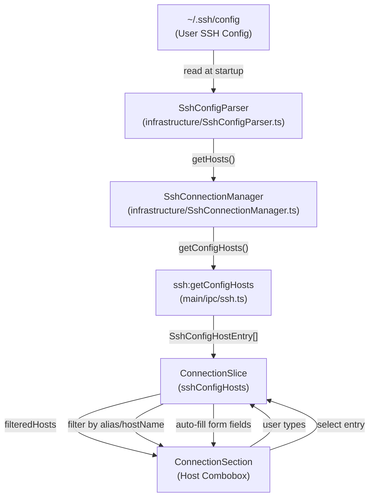
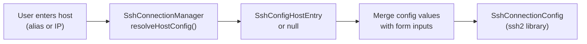
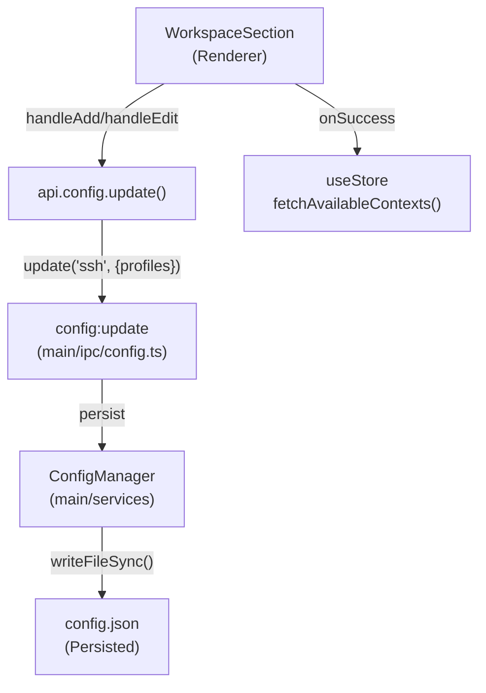
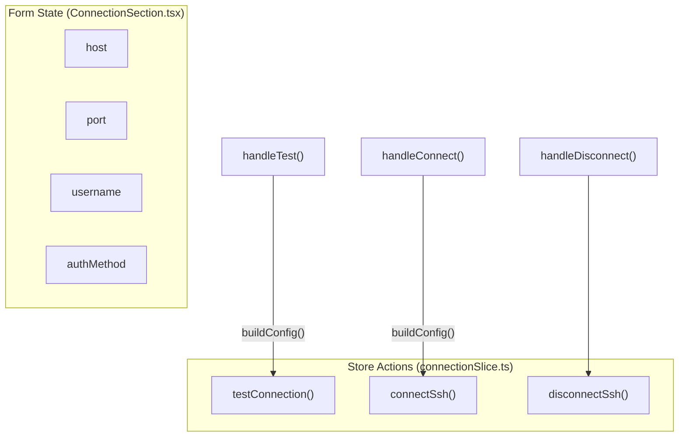
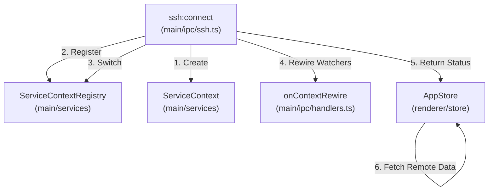

# SSH 구성

<details>
<summary>관련 소스 파일</summary>

다음 파일들은 이 위키 페이지를 생성하기 위한 컨텍스트로 사용되었습니다.

- [src/main/ipc/context.ts](src/main/ipc/context.ts)
- [src/main/ipc/handlers.ts](src/main/ipc/handlers.ts)
- [src/main/ipc/ssh.ts](src/main/ipc/ssh.ts)
- [src/main/services/infrastructure/SshConfigParser.ts](src/main/services/infrastructure/SshConfigParser.ts)
- [src/main/services/infrastructure/TriggerManager.ts](src/main/services/infrastructure/TriggerManager.ts)
- [src/renderer/App.tsx](src/renderer/App.tsx)
- [src/renderer/components/common/ConfirmDialog.tsx](src/renderer/components/common/ConfirmDialog.tsx)
- [src/renderer/components/settings/NotificationTriggerSettings/utils/trigger.ts](src/renderer/components/settings/NotificationTriggerSettings/utils/trigger.ts)
- [src/renderer/components/settings/components/SettingsSelect.tsx](src/renderer/components/settings/components/SettingsSelect.tsx)
- [src/renderer/components/settings/sections/ConnectionSection.tsx](src/renderer/components/settings/sections/ConnectionSection.tsx)
- [src/renderer/components/settings/sections/WorkspaceSection.tsx](src/renderer/components/settings/sections/WorkspaceSection.tsx)
- [src/renderer/hooks/useKeyboardShortcuts.ts](src/renderer/hooks/useKeyboardShortcuts.ts)
- [src/renderer/store/slices/connectionSlice.ts](src/renderer/store/slices/connectionSlice.ts)

</details>


이 페이지는 SSH config 파일 파싱, workspace profiles, connection UI를 포함하여 claude-devtools의 SSH 구성 관리를 문서화합니다. SSH 연결 수명 주기와 파일 시스템 작업에 대한 정보는 [SSH Connection Manager](#5.1)와 [Remote File Operations](#5.3)를 참조하세요.

## 개요

claude-devtools의 SSH 구성은 세 가지 주요 영역을 포함합니다.

1.  **SSH Config Parsing**: 자동 채우기를 위해 `~/.ssh/config`에서 host entries를 읽고 확인합니다.
2.  **Workspace Profiles**: 빠른 재연결을 위해 SSH 연결 profiles를 저장합니다.
3.  **Connection UI**: host auto-completion이 있는 form 기반 SSH 연결 인터페이스입니다.
4.  **Local Claude Root Management**: Windows의 WSL 감지를 포함해 로컬 `~/.claude` 디렉터리 경로를 구성합니다.

모든 SSH 구성은 Settings 패널을 통해 관리되며, 상태는 main process(config persistence)와 renderer(UI) 사이에서 동기화됩니다.

---

## SSH Config 파일 파싱

### SshConfigParser 서비스

`SshConfigParser` 클래스는 connection form의 자동 채우기를 가능하게 하기 위해 사용자의 SSH config 파일을 읽고 파싱합니다. alias, hostname, port, username, identity file hint를 포함한 host entries를 추출합니다.

**자연어와 코드 엔티티 매핑: SSH Host Discovery**



**SSH Config Host Entry 구조**

출처: [src/renderer/components/settings/sections/ConnectionSection.tsx:24-27](), [src/main/ipc/ssh.ts:162-171]()

```typescript
interface SshConfigHostEntry {
  alias: string;           // Host alias from config
  hostName?: string;       // Resolved HostName
  port?: number;          // Port if specified
  user?: string;          // User if specified
  hasIdentityFile?: boolean; // Whether IdentityFile is configured
}
```

parser는 `SshConnectionManager`에 의해 인스턴스화되며, IPC 계층이 host 데이터를 renderer에 노출할 수 있도록 핵심 메서드를 제공합니다.

- `getConfigHosts`: 파싱된 모든 host entries를 반환합니다 [src/main/ipc/ssh.ts:162-171]().
- `resolveHost`: 특정 host alias를 전체 구성으로 확인합니다 [src/main/ipc/ssh.ts:173-182]().

### 연결 흐름의 Host 확인

사용자가 connection form에 host를 입력하면, 시스템은 올바른 연결 파라미터를 결정하기 위해 SSH config와 대조하여 이를 확인하려고 시도합니다.



**확인 우선순위**
`SshConnectionManager`는 사용자가 form에 제공한 데이터와 SSH config 기본값의 병합을 처리합니다.

출처: [src/main/ipc/ssh.ts:173-182](), [src/renderer/store/slices/connectionSlice.ts:205-211]()

### Connection UI의 자동 채우기

`ConnectionSection` 컴포넌트는 사용자가 입력할 때 SSH config hosts를 필터링하는 combobox를 제공합니다.

**필터링 로직**

출처: [src/renderer/components/settings/sections/ConnectionSection.tsx:130-137]()

```typescript
const filteredHosts = useMemo(() => {
  if (!host.trim()) return sshConfigHosts;
  const lower = host.toLowerCase();
  return sshConfigHosts.filter(
    (entry) =>
      entry.alias.toLowerCase().includes(lower) || entry.hostName?.toLowerCase().includes(lower)
  );
}, [host, sshConfigHosts]);
```

사용자가 `handleSelectConfigHost`를 통해 SSH config host를 선택하면 form은 다음을 자동으로 채웁니다.
- `host` → `entry.alias`
- `port` → `entry.port`(있는 경우)
- `username` → `entry.user`(있는 경우)
- `authMethod` → `'auto'`(SSH config identity files 사용)

출처: [src/renderer/components/settings/sections/ConnectionSection.tsx:141-149]()

---

## Workspace Profiles

Workspace profiles를 통해 사용자는 빠른 재연결을 위해 SSH 연결 구성을 저장할 수 있습니다. Profiles는 `ConfigManager`를 통해 유지됩니다.

### Profile 데이터 구조

출처: [src/renderer/components/settings/sections/WorkspaceSection.tsx:23]()

```typescript
interface SshConnectionProfile {
  id: string;                    // UUID
  name: string;                  // User-friendly name
  host: string;                  // Hostname or SSH config alias
  port: number;                  // SSH port (default 22)
  username: string;              // SSH username
  authMethod: SshAuthMethod;     // 'auto' | 'agent' | 'privateKey' | 'password'
  privateKeyPath?: string;       // Path to private key
}
```

### Profile 저장 흐름



**Profile 관리 작업**

| 작업 | 핸들러 | 설명 |
| :--- | :--- | :--- |
| **List profiles** | `loadProfiles()` | 저장된 profiles를 config에서 가져옵니다 [src/renderer/components/settings/sections/WorkspaceSection.tsx:71-82](). |
| **Add profile** | `handleAdd()` | UUID가 있는 새 profile을 유지합니다 [src/renderer/components/settings/sections/WorkspaceSection.tsx:103-119](). |
| **Edit profile** | `handleEdit()` | ID 기준으로 기존 profile을 업데이트합니다 [src/renderer/components/settings/sections/WorkspaceSection.tsx:121-141](). |
| **Delete profile** | `handleDelete()` | 확인 후 profile을 제거합니다 [src/renderer/components/settings/sections/WorkspaceSection.tsx:143-159](). |

출처: [src/renderer/components/settings/sections/WorkspaceSection.tsx:103-159]()

### WorkspaceSection UI 컴포넌트

`WorkspaceSection` 컴포넌트는 profiles를 위한 inline editing을 제공합니다. 인증 드롭다운 `SettingsSelect`는 다음 옵션을 제공합니다.

- **Auto**: SSH config identity files 또는 agent를 사용합니다.
- **SSH Agent**: 실행 중인 SSH agent를 명시적으로 대상으로 합니다.
- **Private Key**: private key 파일 경로가 필요합니다.
- **Password**: 연결 중 입력을 요청합니다.

출처: [src/renderer/components/settings/sections/WorkspaceSection.tsx:32-37](), [src/renderer/components/settings/sections/WorkspaceSection.tsx:164-210]()

---

## Connection UI

`ConnectionSection` 컴포넌트는 Settings 패널에서 기본 SSH 연결 인터페이스를 제공합니다.

### Connection Form 아키텍처



**buildConfig() 함수**
연결 시도를 위해 main process로 전달되는 구성 객체를 생성합니다.

출처: [src/renderer/components/settings/sections/ConnectionSection.tsx:162-169]()

```typescript
const buildConfig = (): SshConnectionConfig => ({
  host,
  port: parseInt(port, 10) || 22,
  username,
  authMethod,
  password: authMethod === 'password' ? password : undefined,
  privateKeyPath: authMethod === 'privateKey' ? privateKeyPath : undefined,
});
```

### 연결 상태 관리

`connectionSlice`는 활성 연결 상태를 관리하고, 연결 성공 시 context switch를 트리거합니다.

**연결 흐름**
1.  **Connect**: `connectSsh`가 `api.ssh.connect(config)`를 호출합니다 [src/renderer/store/slices/connectionSlice.ts:65-73]().
2.  **State Update**: 성공 시 `connectionMode`가 `'ssh'`가 되고, `activeContextId`가 `ssh-${config.host}`로 설정됩니다 [src/renderer/store/slices/connectionSlice.ts:74-82]().
3.  **Data Reset**: cross-context leakage를 방지하기 위해 로컬 데이터(tabs, projects)가 지워집니다 [src/renderer/store/slices/connectionSlice.ts:83-100]().
4.  **Data Fetch**: 원격 projects와 repository groups를 가져옵니다 [src/renderer/store/slices/connectionSlice.ts:108-109]().

출처: [src/renderer/store/slices/connectionSlice.ts:65-121]()

### 연결 테스트 흐름

전체 연결을 수립하기 전에 사용자는 `ssh:test` IPC 핸들러를 호출하는 `handleTest`를 사용해 credentials를 테스트할 수 있습니다. 이는 애플리케이션 context를 전환하지 않고 설정을 검증하기 위해 임시 연결을 생성합니다.

출처: [src/renderer/components/settings/sections/ConnectionSection.tsx:171-177](), [src/main/ipc/ssh.ts:152-160]()

---

## Local Claude Root 구성

`ConnectionSection`은 로컬 모드 작업에 중요한 로컬 Claude root 디렉터리 경로도 표시합니다.

### Claude Root 정보

UI는 확인된 경로(기본 `~/.claude` 또는 사용자 override)를 표시합니다.

출처: [src/renderer/components/settings/sections/ConnectionSection.tsx:189](), [src/renderer/components/settings/sections/ConnectionSection.tsx:78-85]()

### Context Switching과 SSH

SSH 연결이 수립되면 애플리케이션은 context switch를 수행합니다.

**자연어와 코드 엔티티 매핑: Context Switching**



**Context Switching의 핵심 코드 엔티티:**
- `ServiceContext`: 특정 환경에 대한 `FileSystemProvider`와 경로 구성을 캡슐화합니다 [src/main/ipc/ssh.ts:92-98]().
- `ServiceContextRegistry`: 여러 `ServiceContext` 인스턴스의 수명 주기와 활성 상태를 관리합니다 [src/main/ipc/ssh.ts:101-105]().
- `onContextRewire`: file watcher가 새 context에 올바르게 연결되도록 보장하기 위해 초기화 중 전달되는 callback입니다 [src/main/ipc/ssh.ts:108]().

출처: [src/main/ipc/ssh.ts:70-116](), [src/main/ipc/handlers.ts:64-84]()

---

## IPC 핸들러 요약

`src/main/ipc/ssh.ts`의 `registerSshHandlers` 함수는 다음 채널을 renderer에 노출합니다.

| 채널 | 기능 |
| :--- | :--- |
| `ssh:connect` | host에 연결하고 context를 전환합니다 [src/main/ipc/ssh.ts:70-116](). |
| `ssh:disconnect` | 연결을 해제하고 로컬 context로 되돌립니다 [src/main/ipc/ssh.ts:118-146](). |
| `ssh:getState` | 현재 연결 상태를 가져옵니다 [src/main/ipc/ssh.ts:148-150](). |
| `ssh:test` | 연결 파라미터를 검증합니다 [src/main/ipc/ssh.ts:152-160](). |
| `ssh:getConfigHosts` | `~/.ssh/config`의 entries를 나열합니다 [src/main/ipc/ssh.ts:162-171](). |
| `ssh:saveLastConnection` | form pre-fill을 위해 연결 메타데이터를 유지합니다 [src/main/ipc/ssh.ts:184-198](). |

출처: [src/main/ipc/ssh.ts:69-205]()
