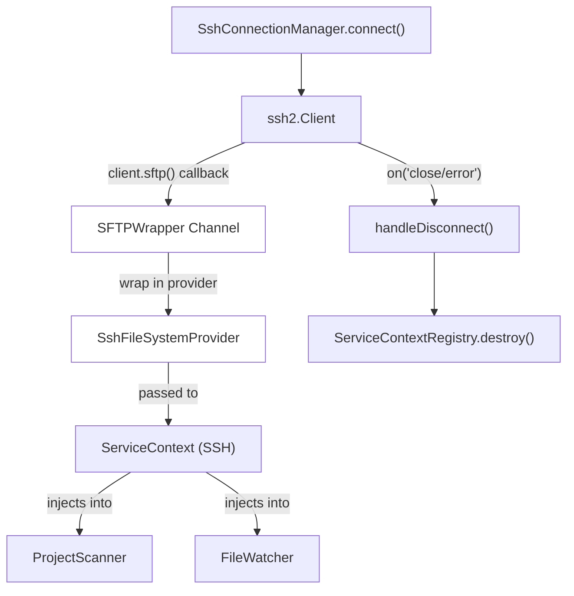
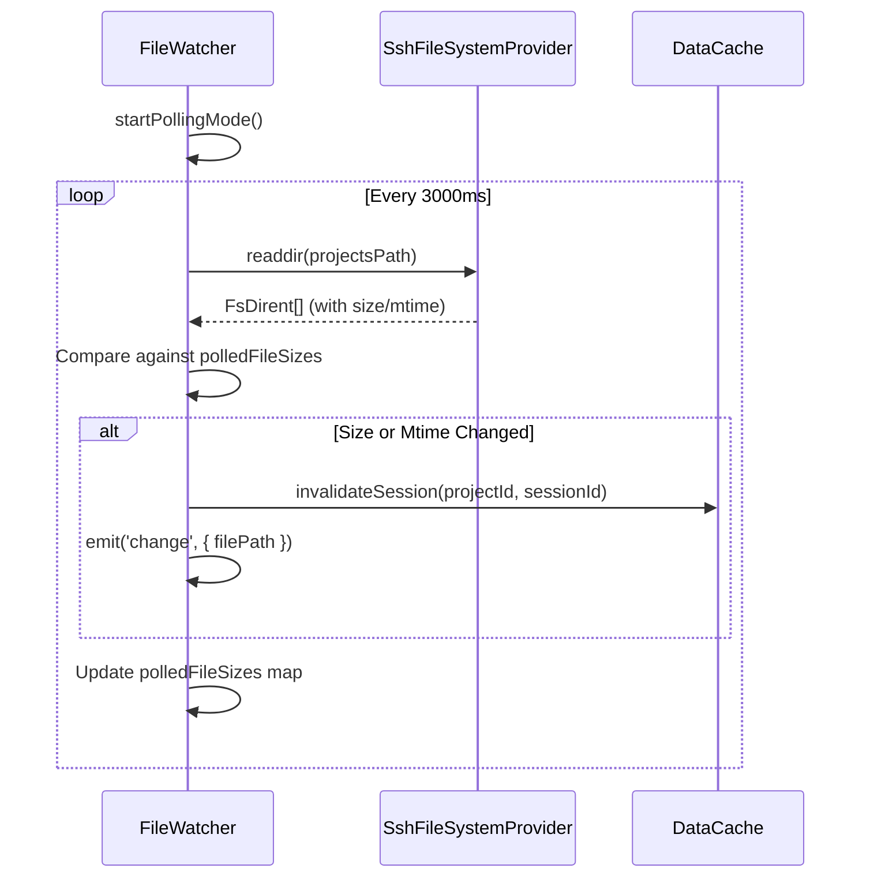

# 원격 파일 작업

관련 소스 파일

다음 파일들은 이 위키 페이지를 생성하기 위한 컨텍스트로 사용되었습니다.

- [src/main/services/discovery/ProjectPathResolver.ts](src/main/services/discovery/ProjectPathResolver.ts)
- [src/main/services/infrastructure/DataCache.ts](src/main/services/infrastructure/DataCache.ts)
- [src/main/services/infrastructure/FileSystemProvider.ts](src/main/services/infrastructure/FileSystemProvider.ts)
- [src/main/services/infrastructure/FileWatcher.ts](src/main/services/infrastructure/FileWatcher.ts)
- [src/main/services/infrastructure/ServiceContext.ts](src/main/services/infrastructure/ServiceContext.ts)
- [src/main/services/infrastructure/ServiceContextRegistry.ts](src/main/services/infrastructure/ServiceContextRegistry.ts)
- [src/main/services/infrastructure/SshFileSystemProvider.ts](src/main/services/infrastructure/SshFileSystemProvider.ts)
- [src/main/services/infrastructure/index.ts](src/main/services/infrastructure/index.ts)
- [src/renderer/components/common/WorkspaceIndicator.tsx](src/renderer/components/common/WorkspaceIndicator.tsx)

## 목적과 범위

이 페이지는 `claude-devtools`가 원격 SSH host에서 세션 파일을 읽을 수 있게 하는 SFTP 통합 계층을 문서화합니다. `SshFileSystemProvider` 구현, 원격 컨텍스트를 위한 polling 기반 file watching, 네트워크 latency를 완화하도록 설계된 성능 최적화를 다룹니다.

SSH 연결 수명 주기와 인증은 [SSH Connection Manager (5.1)]()를 참조하세요. SSH configuration 파싱과 host resolution은 [SSH Configuration (5.2)]()를 참조하세요.

---

## SFTP Channel 아키텍처

SSH 연결이 수립되면 애플리케이션은 지속 SFTP channel을 엽니다. 이 channel은 `FileSystemProvider` 인터페이스를 구현하는 `SshFileSystemProvider` 클래스로 래핑됩니다. 이 추상화를 통해 모든 탐색 및 파싱 서비스는 로컬 환경과 원격 환경에서 동일하게 동작할 수 있습니다.

**SFTP Channel 수명 주기**

출처: [src/main/services/infrastructure/SshConnectionManager.ts:146-158](), [src/main/services/infrastructure/SshFileSystemProvider.ts:23-32](), [src/main/services/infrastructure/ServiceContext.ts:81-119]()

`SshFileSystemProvider`는 `ssh2` 라이브러리의 `SFTPWrapper`를 사용해 추상 파일 작업을 SFTP 명령으로 변환합니다.

출처: [src/main/services/infrastructure/SshFileSystemProvider.ts:57-70](), [src/main/services/infrastructure/SshFileSystemProvider.ts:86-111]()

---

## FileSystemProvider 구현

`FileSystemProvider` 인터페이스는 모든 session-data 서비스에 대한 contract를 정의합니다. `SshFileSystemProvider`는 SFTP callback을 Promise로 래핑하고 Node 호환 stream을 제공하는 방식으로 이를 구현합니다.

**주요 구현 세부 사항**

| 메서드 | SSH 구현 세부 사항 |
|--------|---------------------------|
| `type` | `'ssh'`로 hardcoded되어 있습니다. [src/main/services/infrastructure/SshFileSystemProvider.ts:27-27]() |
| `stat()` | SFTP mode bitmask를 `isFile()`/`isDirectory()`로 변환합니다. [src/main/services/infrastructure/SshFileSystemProvider.ts:96-109]() |
| `readdir()` | SFTP attributes(size, mtime)를 `FsDirent`로 직접 매핑합니다. [src/main/services/infrastructure/SshFileSystemProvider.ts:138-156]() |
| `readFile()` | transient SFTP errors를 위한 retry logic을 구현합니다. [src/main/services/infrastructure/SshFileSystemProvider.ts:58-81]() |
| `createReadStream()` | Node 호환성을 위해 SFTP stream을 `PassThrough`로 pipe합니다. [src/main/services/infrastructure/SshFileSystemProvider.ts:178-192]() |

provider는 `not_found`, `transient`(retry 가능), `permanent` 오류를 구분하는 classification system을 사용합니다. Transient errors(SFTP code 4/EOF 또는 `ETIMEDOUT` 등)는 exponential backoff retry mechanism을 트리거합니다.

출처: [src/main/services/infrastructure/SshFileSystemProvider.ts:34-55](), [src/main/services/infrastructure/SshFileSystemProvider.ts:211-235]()

---

## 원격 File Watching(Polling Mode)

`fs.watch`를 사용하는 로컬 컨텍스트와 달리, 원격 컨텍스트는 SFTP가 native file system events를 지원하지 않기 때문에 `FileWatcher` 안의 polling mechanism을 활용합니다.

**Polling 로직 흐름**

출처: [src/main/services/infrastructure/FileWatcher.ts:73-82](), [src/main/services/infrastructure/FileWatcher.ts:137-141](), [src/main/services/infrastructure/FileWatcher.ts:446-485]()

**Polling의 최적화:**
- **Metadata Reuse:** `FileWatcher`는 `SshFileSystemProvider.readdir`가 초기 디렉터리 목록에서 file sizes와 mtimes를 반환한다는 점을 활용하여, 이후 N개의 `stat` 호출을 피합니다. [src/main/services/infrastructure/FileWatcher.ts:460-475]()
- **Priming Phase:** 첫 번째 poll cycle("priming")은 연결 시 알림이 폭주하지 않도록 이벤트를 emit하지 않고 baseline을 설정합니다. [src/main/services/infrastructure/FileWatcher.ts:455-458]()
- **Concurrency Guard:** 큰 원격 디렉터리 스캔이 interval보다 오래 걸릴 경우 poll cycles가 겹치지 않도록 `pollingInProgress`가 방지합니다. [src/main/services/infrastructure/FileWatcher.ts:447-450]()

---

## 성능 최적화

원격 작업은 round-trip을 줄이고 high-latency links를 처리하도록 최적화되어 있습니다.

### Batched Parallel Operations
`ProjectScanner`는 provider type에 따라 batch size를 동적으로 조정합니다. SSH batch는 SFTP channel 포화를 방지하기 위해 훨씬 작습니다.

| 작업 | Local Batch | SSH Batch |
|-----------|-------------|-----------|
| Project directory scan | 24 | 8 |
| Session file stat calls | 128 | 32 |
| Paginated metadata | 200 | 48 |
| Metadata parsing | 16 | 4 |

출처: [src/main/services/discovery/ProjectScanner.ts:129-133](), [src/main/services/discovery/ProjectScanner.ts:227-231](), [src/main/services/discovery/ProjectScanner.ts:512-527](), [src/main/services/discovery/ProjectScanner.ts:639-653]()

### Metadata Level Selection
시스템은 SSH 모드를 위한 `light` metadata level을 지원합니다. 이 level은 multi-megabyte 세션 파일 전체를 파싱하는 대신, 첫 사용자 메시지를 추출하기 위해 JSONL 파일의 시작 부분만 읽습니다.

- **Light Metadata:** 첫 사용자 메시지, timestamp, basic stats. [src/main/services/discovery/ProjectScanner.ts:764-815]()
- **Deep Metadata:** tool usage, token costs, subagents를 포함한 전체 분석. [src/main/services/discovery/ProjectScanner.ts:701-762]()

SSH 모드에서 renderer의 `sessionSlice`는 list views에 기본적으로 `light` metadata를 사용합니다.

출처: [src/main/services/discovery/ProjectScanner.ts:821-870](), [src/main/services/discovery/ProjectScanner.ts:398-398]()

### Path Resolution Short-circuit
`ProjectPathResolver`는 SSH resolution을 최적화하여, session file에서 첫 번째로 성공적인 CWD 추출이 이루어지면 중단합니다. 반면 로컬 모드에서는 정확성을 위해 여러 파일을 검사할 수 있습니다.

출처: [src/main/services/discovery/ProjectPathResolver.ts:73-76]()

---

## 캐싱 전략

중복 네트워크 요청을 피하기 위해 `ProjectScanner`는 file path를 key로 하고 `mtimeMs`와 `size`로 검증되는 내부 cache를 유지합니다.

**Scanner Caches**

| Cache 이름 | 저장 데이터 | Invalidation Trigger |
|------------|-------------|----------------------|
| `contentPresenceCache` | Boolean(non-noise content 존재 여부) | size 또는 mtime 변경 |
| `sessionMetadataCache` | 전체 `ParsedSessionMetadata` | size 또는 mtime 변경 |
| `sessionPreviewCache` | 첫 사용자 메시지 preview | size 또는 mtime 변경 |

출처: [src/main/services/discovery/ProjectScanner.ts:64-79](), [src/main/services/discovery/ProjectScanner.ts:1209-1237]()

`DataCache` 서비스는 `ServiceContext` 전반에서 공유되는 완전히 파싱된 `SessionDetail` 객체를 위한 더 높은 수준의 LRU cache도 제공합니다.

출처: [src/main/services/infrastructure/DataCache.ts:27-40](), [src/main/services/infrastructure/ServiceContext.ts:108-108]()

---

## 원격 오류 처리

Transient network failures는 UI flickering 또는 session loss를 방지하기 위해 우아하게 처리됩니다.

**Retry and Fallback Strategy**
1. **Transient Detection:** `ECONNRESET` 또는 SFTP EOF 같은 오류는 75ms base delay로 최대 3회 retry를 트리거합니다. [src/main/services/infrastructure/SshFileSystemProvider.ts:24-25](), [src/main/services/infrastructure/SshFileSystemProvider.ts:211-235]()
2. **Graceful Degradation:** SSH에서 `deep` metadata parse가 실패하면 scanner는 오류를 던지는 대신 해당 세션에 대해 자동으로 `light` metadata로 fallback합니다. [src/main/services/discovery/ProjectScanner.ts:843-869]()
3. **Potentially Present:** `exists()` 확인에서 transient SFTP errors(code 4)는 일시적인 연결 hiccup 중 false negatives를 피하기 위해 `true` 반환값을 만듭니다. [src/main/services/infrastructure/SshFileSystemProvider.ts:45-51]()

출처: [src/main/services/infrastructure/SshFileSystemProvider.ts:34-55](), [src/main/services/discovery/ProjectScanner.ts:1131-1154]()
