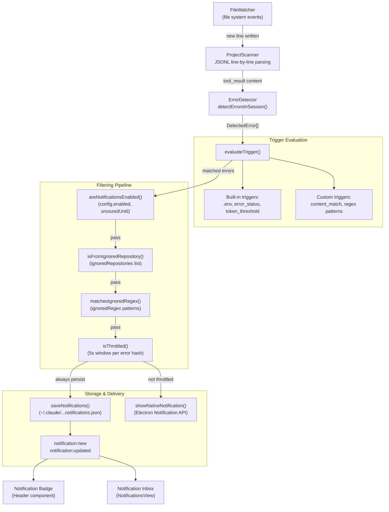

# 알림 시스템

관련 소스 파일

다음 파일들은 이 위키 페이지를 생성하기 위한 컨텍스트로 사용되었습니다.

- [electron.vite.config.ts](electron.vite.config.ts)
- [src/main/services/infrastructure/NotificationManager.ts](src/main/services/infrastructure/NotificationManager.ts)
- [src/renderer/components/notifications/NotificationsView.tsx](src/renderer/components/notifications/NotificationsView.tsx)
- [src/renderer/store/slices/notificationSlice.ts](src/renderer/store/slices/notificationSlice.ts)
- [test/renderer/store/notificationSlice.test.ts](test/renderer/store/notificationSlice.test.ts)

알림 시스템은 Claude Code 세션 파일을 실시간으로 모니터링하고 특정 조건이 충족되면 알림을 생성합니다. 오류 감지, 사용자 지정 트리거 평가, 다단계 필터링, 네이티브 OS 알림을 결합하여 사용자가 중요한 이벤트를 파악할 수 있게 하면서도 불필요한 노이즈로 압도되지 않도록 합니다.

이 페이지는 **상위 페이지**입니다. 특정 컴포넌트의 구현 세부 정보는 다음을 참조하세요.
- [Notification Manager](#6.1) — NotificationManager 서비스, persistence, 네이티브 macOS 알림.
- [Trigger System](#6.2) — built-in triggers, custom trigger 생성, pattern matching, testing.
- [Filtering & Throttling](#6.3) — 알림 필터링 파이프라인, ignore lists, throttling mechanisms.

---

## 시스템 아키텍처

알림 시스템은 세션 파일 변경을 오류 감지, 트리거 평가, 필터링, 저장, 전달이라는 여러 단계를 통해 처리하는 파이프라인으로 동작합니다.

### 알림 흐름 다이어그램

**출처:** [src/main/services/infrastructure/NotificationManager.ts:1-13](), [src/renderer/components/notifications/NotificationsView.tsx:32-53]()

---

## 핵심 컴포넌트

### NotificationManager

`NotificationManager` 클래스 [src/main/services/infrastructure/NotificationManager.ts:86-112]()는 알림 파이프라인을 조율하는 중앙 서비스입니다. 다음을 관리하는 singleton입니다.

- **Persistence**: `~/.claude/claude-devtools-notifications.json`에 최대 100개의 알림을 저장합니다 [src/main/services/infrastructure/NotificationManager.ts:74-80]().
- **Native notifications**: Electron의 `Notification` API를 통해 macOS toast를 표시합니다 [src/main/services/infrastructure/NotificationManager.ts:6-6]().
- **Throttling**: 고유 error hash별 5초 window를 사용해 알림을 deduplicate합니다 [src/main/services/infrastructure/NotificationManager.ts:76-77]().
- **IPC events**: renderer에 `notification:new`과 `notification:updated`를 broadcast합니다 [src/main/services/infrastructure/NotificationManager.ts:12-12]().

persistence와 macOS 통합에 대한 세부 정보는 [Notification Manager](#6.1)를 참조하세요.

**출처:** [src/main/services/infrastructure/NotificationManager.ts:1-112]()

### Trigger System

시스템은 built-in trigger와 사용자 정의 trigger 모두에 대해 세션 데이터를 평가합니다. 트리거가 일치하면 `DetectedError` 객체 [src/main/services/infrastructure/NotificationManager.ts:36-41]()가 생성됩니다.

- **Built-in triggers**: `.env` 파일 접근 알림, 도구 결과 오류, 높은 토큰 사용량 threshold를 포함합니다.
- **Custom triggers**: `command`, `content`, `thinking` 같은 필드에 대한 regex pattern matching을 지원합니다.

트리거 생성과 테스트에 대한 세부 정보는 [Trigger System](#6.2)을 참조하세요.

**출처:** [src/main/services/infrastructure/NotificationManager.ts:22-31](), [src/renderer/components/notifications/NotificationsView.tsx:79-97]()

### 필터링 파이프라인

알림 시스템은 spam을 방지하기 위해 다단계 필터링 파이프라인을 구현합니다. 이 파이프라인은 비대칭입니다. **모든 오류는 디스크에 유지**되지만, 모든 필터를 통과한 오류만 네이티브 OS 알림을 트리거합니다.

| 필터 | 로직 |
|--------|-------|
| **Enable Check** | 전역 `enabled` flag와 `snoozedUntil` timestamp를 따릅니다 [src/main/services/infrastructure/NotificationManager.ts:8-8](). |
| **Repository Filter** | `ignoredProjects` 목록에 있는 프로젝트의 오류를 필터링합니다 [src/main/services/infrastructure/NotificationManager.ts:10-10](). |
| **Regex Filter** | `ignoredRegex` pattern과 일치하는 메시지를 필터링합니다 [src/main/services/infrastructure/NotificationManager.ts:9-9](). |
| **Throttle** | 고유 error hash별 5초 window를 강제합니다 [src/main/services/infrastructure/NotificationManager.ts:7-7](). |

필터 구성과 throttling에 대한 세부 정보는 [Filtering & Throttling](#6.3)을 참조하세요.

**출처:** [src/main/services/infrastructure/NotificationManager.ts:1-13]()

---

## 저장소 및 UI 통합

### 데이터 유지

알림은 `StoredNotification` 객체 [src/main/services/infrastructure/NotificationManager.ts:36-41]()로 저장됩니다. `NotificationManager`는 100개 entry 제한을 유지하기 위해 시작 시 auto-pruning을 수행합니다 [src/main/services/infrastructure/NotificationManager.ts:11-11]().

### Renderer Store

`notificationSlice` [src/renderer/store/slices/notificationSlice.ts:43-46]()는 frontend 상태를 관리합니다. main process에서 알림을 가져오고, 알림을 읽음으로 표시하거나 삭제하는 actions를 제공합니다.

| Action | 설명 |
|--------|-------------|
| `fetchNotifications` | main process에서 history를 로드합니다 [src/renderer/store/slices/notificationSlice.ts:54-79](). |
| `markNotificationRead` | 단일 entry의 읽음 상태를 업데이트합니다 [src/renderer/store/slices/notificationSlice.ts:82-100](). |
| `clearNotifications` | 선택적으로 trigger별 범위를 적용하여 알림을 제거합니다 [src/renderer/store/slices/notificationSlice.ts:162-200](). |

### Notifications View

`NotificationsView` [src/renderer/components/notifications/NotificationsView.tsx:32-53]()는 알림을 탐색하기 위한 inbox 스타일 인터페이스를 제공합니다. 여기에는 다음이 포함됩니다.
- **Filter Chips**: trigger name별로 목록을 필터링할 수 있습니다 [src/renderer/components/notifications/NotificationsView.tsx:79-97]().
- **Virtual List**: 큰 알림 history를 성능 좋게 렌더링하기 위해 `@tanstack/react-virtual`을 사용합니다 [src/renderer/components/notifications/NotificationsView.tsx:119-124]().
- **Deep Linking**: 세션 view의 오류 위치로 직접 이동합니다 [src/renderer/components/notifications/NotificationsView.tsx:165-171]().

**출처:** [src/renderer/store/slices/notificationSlice.ts:1-200](), [src/renderer/components/notifications/NotificationsView.tsx:1-214]()
