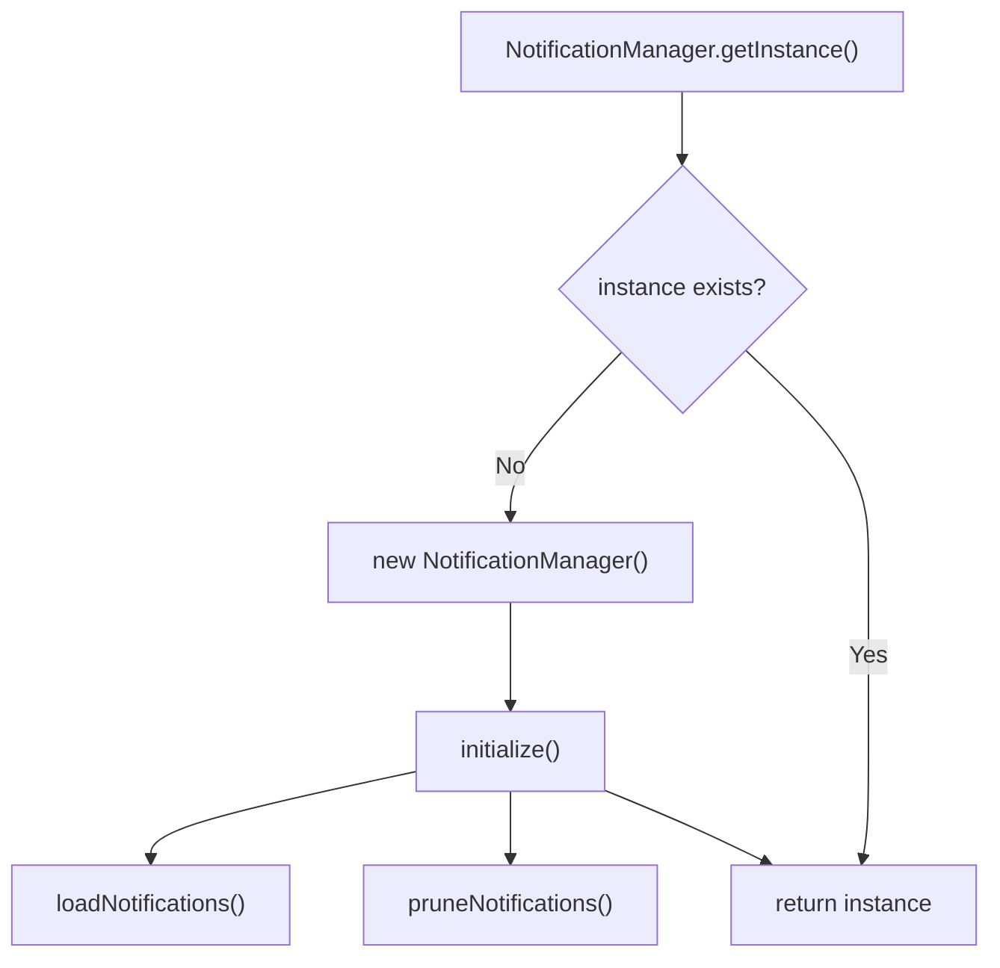
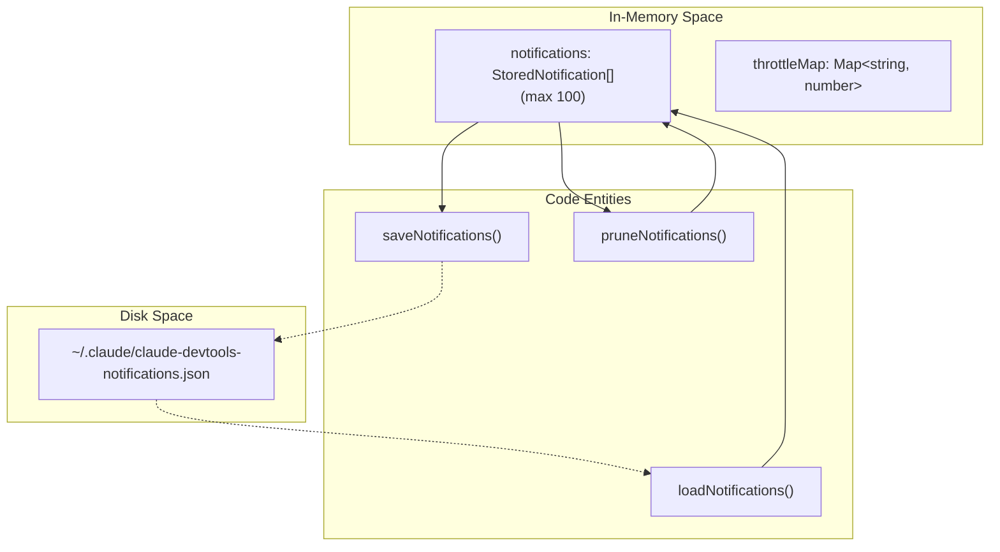
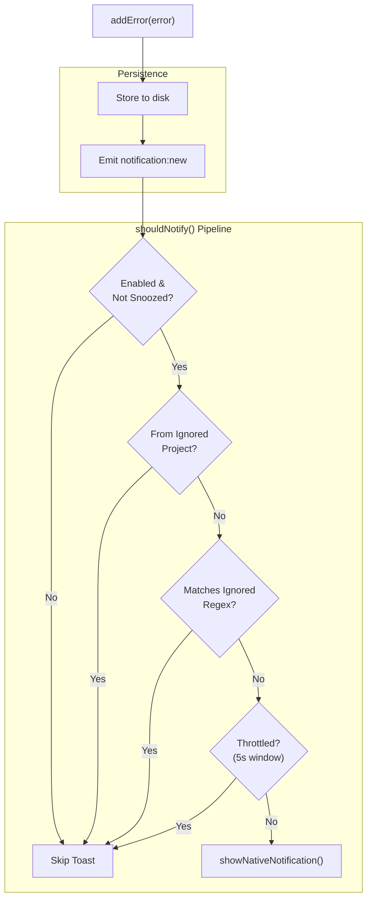
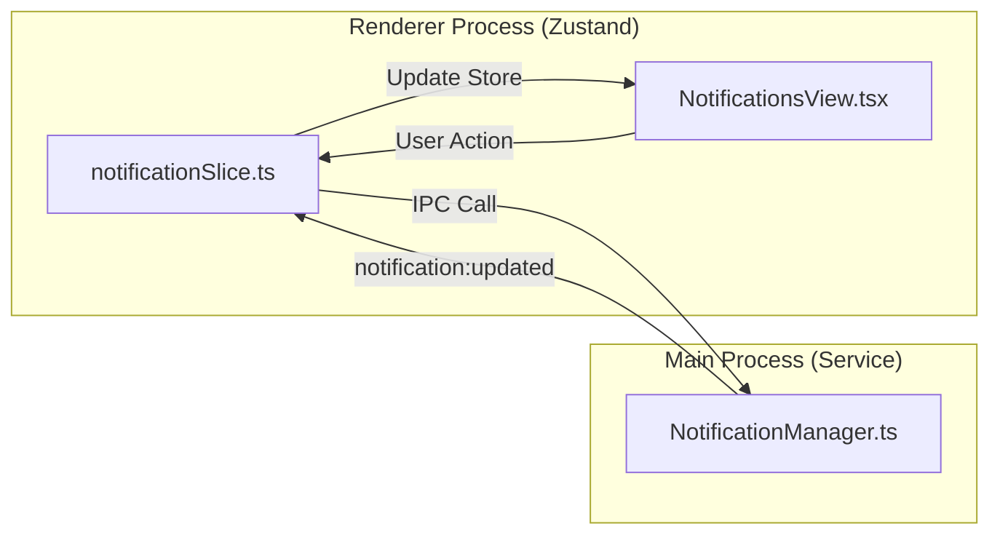

# Notification Manager

관련 소스 파일

다음 파일들은 이 위키 페이지를 생성하기 위한 컨텍스트로 사용되었습니다.

- [electron.vite.config.ts](electron.vite.config.ts)
- [src/main/services/infrastructure/NotificationManager.ts](src/main/services/infrastructure/NotificationManager.ts)
- [src/renderer/components/notifications/NotificationsView.tsx](src/renderer/components/notifications/NotificationsView.tsx)
- [src/renderer/store/slices/notificationSlice.ts](src/renderer/store/slices/notificationSlice.ts)
- [src/renderer/types/notifications.ts](src/renderer/types/notifications.ts)
- [test/renderer/store/notificationSlice.test.ts](test/renderer/store/notificationSlice.test.ts)

`NotificationManager` 서비스는 claude-devtools의 네이티브 macOS 알림과 오류 history 추적을 관리합니다. 감지된 오류의 영구 저장소를 제공하고, 알림 spam을 방지하기 위한 다단계 필터링을 구현하며, renderer 동기화를 위한 IPC 이벤트를 emit합니다.

---

## 개요

`NotificationManager` 클래스([src/main/services/infrastructure/NotificationManager.ts:86]())는 다음을 담당하는 singleton 서비스입니다.

- **Persistence**: `~/.claude/claude-devtools-notifications.json`([src/main/services/infrastructure/NotificationManager.ts:74-80]())에 최대 100개의 알림을 저장합니다.
- **Native notifications**: Electron의 `Notification` API를 통해 macOS toast notifications를 표시합니다([src/main/services/infrastructure/NotificationManager.ts:369-406]()).
- **Filtering pipeline**: status checks, repository ignores, regex filtering, throttling을 포함하여 spam을 방지하는 다단계 filter입니다([src/main/services/infrastructure/NotificationManager.ts:219-366]()).
- **IPC events**: 알림 이벤트(`notification:new`, `notification:updated`)를 renderer process에 broadcast합니다([src/main/services/infrastructure/NotificationManager.ts:409-438]()).
- **Read status tracking**: unread counts를 관리하고 개별 또는 전체 알림을 읽음으로 표시합니다([src/main/services/infrastructure/NotificationManager.ts:500-573]()).

**출처**: [src/main/services/infrastructure/NotificationManager.ts:1-13](), [src/main/services/infrastructure/NotificationManager.ts:86-92]()

---

## 초기화와 수명 주기

### Singleton 패턴

`NotificationManager`는 lazy initialization이 적용된 singleton 패턴을 사용합니다.

Title: NotificationManager Singleton Initialization

singleton은 테스트를 위해 `resetInstance()`로 재설정하거나 `setInstance()`로 주입할 수 있습니다([src/main/services/infrastructure/NotificationManager.ts:106-126]()).

### Main Process 통합

notification manager는 애플리케이션 시작 중 초기화되며, `setMainWindow()`를 통해 IPC 이벤트를 emit하기 위해 `BrowserWindow` 참조가 필요합니다([src/main/services/infrastructure/NotificationManager.ts:151-153]()).

**출처**: [src/main/services/infrastructure/NotificationManager.ts:106-153]()

---

## 저장소와 Persistence

### 저장 형식

알림은 `~/.claude/claude-devtools-notifications.json`에 JSON으로 저장됩니다([src/main/services/infrastructure/NotificationManager.ts:80]()). `StoredNotification` 인터페이스는 UI용 메타데이터를 포함하도록 `DetectedError`를 확장합니다([src/main/services/infrastructure/NotificationManager.ts:36-41]()).

| 필드 | 타입 | 설명 |
|-------|------|-------------|
| `id` | `string` | 고유 알림 ID |
| `isRead` | `boolean` | 알림을 읽었는지 여부 |
| `createdAt` | `number` | 알림이 생성된 시각(ms) |
| `triggerName` | `string?` | 오류를 생성한 trigger 이름 |
| `message` | `string` | 오류 메시지 내용 |
| `timestamp` | `number` | 오류가 원래 발생한 시각 |

Title: Notification Storage Architecture

### Pruning 로직

알림이 `MAX_NOTIFICATIONS`(100)를 초과하면 `createdAt` 내림차순을 기준으로 가장 오래된 항목이 제거됩니다([src/main/services/infrastructure/NotificationManager.ts:202-214]()).

**출처**: [src/main/services/infrastructure/NotificationManager.ts:74-80](), [src/main/services/infrastructure/NotificationManager.ts:158-214]()

---

## 오류 필터링 파이프라인

`shouldNotify()` 메서드([src/main/services/infrastructure/NotificationManager.ts:219]())는 네이티브 toast notification을 표시할지 결정하기 위해 다단계 filter pipeline을 구현합니다. toast가 건너뛰어져도 오류는 history에 계속 저장됩니다.

Title: Notification Filtering Pipeline

### Stage 1: Enabled Check
`config.notifications.enabled`와 `config.notifications.snoozedUntil`을 확인합니다. snooze가 만료되었으면 자동으로 지워집니다([src/main/services/infrastructure/NotificationManager.ts:269-288]()).

### Stage 2: Project Filter
오류의 `projectId`가 `config.notifications.ignoredProjects` 목록에 있는지 확인합니다([src/main/services/infrastructure/NotificationManager.ts:317-342]()).

### Stage 3: Regex Filter
`config.notifications.ignoredRegex`의 pattern에 대해 `error.message`를 테스트합니다([src/main/services/infrastructure/NotificationManager.ts:291-314]()).

### Stage 4: Throttle Filter
5초 window(`THROTTLE_MS`) 안에서 동일한 오류(`projectId:message` hash로 정의)에 대한 중복 toast를 방지합니다([src/main/services/infrastructure/NotificationManager.ts:233-248]()).

**출처**: [src/main/services/infrastructure/NotificationManager.ts:219-366]()

---

## Renderer 상태 관리

renderer process는 Zustand store의 `notificationSlice`를 통해 알림 상태를 유지합니다([src/renderer/store/slices/notificationSlice.ts:43]()).

### notificationSlice Actions

| Action | 목적 | 호출되는 IPC 메서드 |
|--------|---------|-------------------|
| `fetchNotifications` | history로 store를 hydrate합니다 | `api.notifications.get` |
| `markNotificationRead` | 단일 ID를 읽음으로 표시합니다 | `api.notifications.markRead` |
| `markAllNotificationsRead` | 범위 지정 또는 전역 mark read | `api.notifications.markAllRead` |
| `deleteNotification` | 단일 알림을 제거합니다 | `api.notifications.delete` |
| `clearNotifications` | 범위 지정 또는 전역 삭제 | `api.notifications.clear` |

Title: Notification State Synchronization

### Scoped Operations
UI는 `triggerName`으로 알림을 필터링할 수 있습니다([src/renderer/components/notifications/NotificationsView.tsx:107-113]()). `markAllNotificationsRead` 같은 action은 활성 filter로 범위가 지정될 수 있으며, 이 경우 slice는 일치하는 알림을 순회하고 개별 `markRead` IPC 메서드를 호출합니다([src/renderer/store/slices/notificationSlice.ts:103-124]()).

**출처**: [src/renderer/store/slices/notificationSlice.ts:22-37](), [src/renderer/components/notifications/NotificationsView.tsx:32-53](), [test/renderer/store/notificationSlice.test.ts:90-103]()

---

## Tool Use ID 중복 제거

`addError()` 메서드는 `toolUseId` 기준 중복 제거를 구현합니다([src/main/services/infrastructure/NotificationManager.ts:449]()). 이를 통해 동일한 도구 오류가 서로 다른 event stream을 통해 보고될 때(예: subagent 오류가 부모 세션에 나타나는 경우) 중복 알림을 방지합니다.

1. 오류에 `toolUseId`가 있으면 manager는 해당 ID를 가진 기존 알림을 확인합니다([src/main/services/infrastructure/NotificationManager.ts:452-454]()).
2. 기존 알림이 발견되었고 `subagentId`가 없지만 새 오류에는 `subagentId`가 있으면, 더 나은 context를 제공하기 위해 기존 알림을 대체합니다([src/main/services/infrastructure/NotificationManager.ts:457-463]()).
3. 그렇지 않으면 중복 항목은 건너뜁니다([src/main/services/infrastructure/NotificationManager.ts:466-468]()).

**출처**: [src/main/services/infrastructure/NotificationManager.ts:443-472]()
