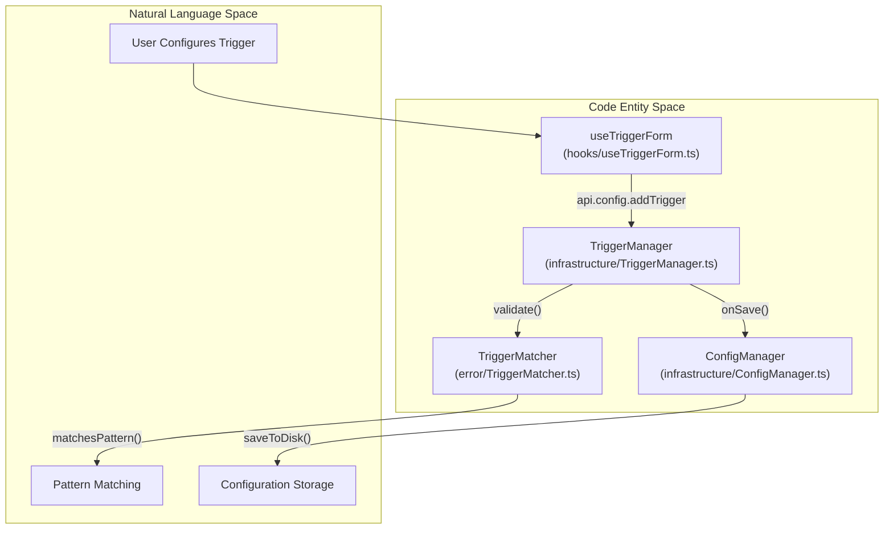
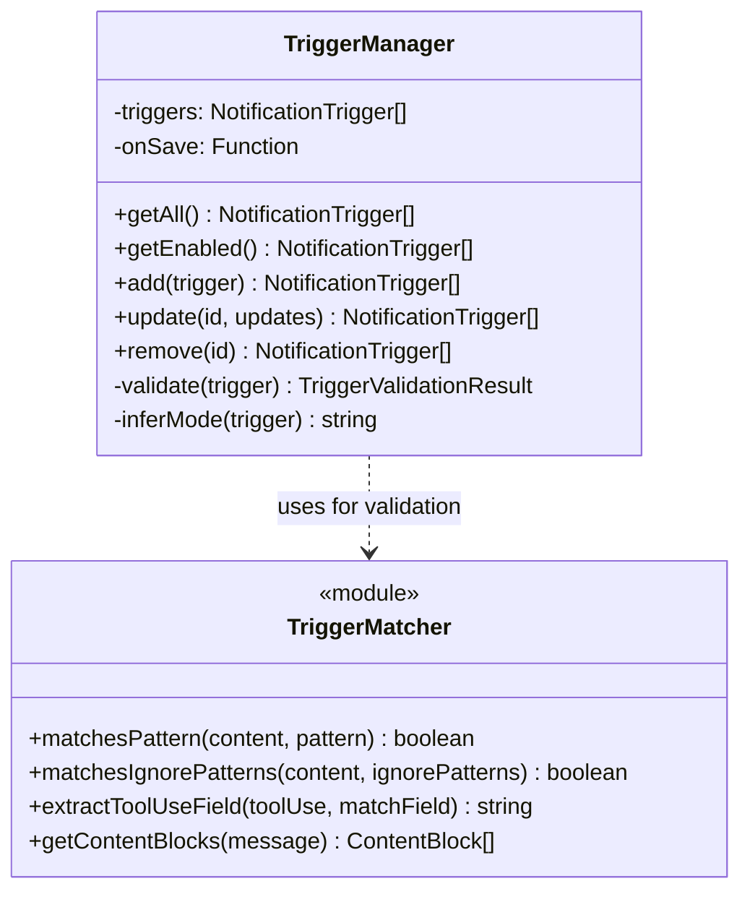

# Trigger System

관련 소스 파일

다음 파일들은 이 위키 페이지를 생성하기 위한 컨텍스트로 사용되었습니다.

- [src/main/services/error/TriggerMatcher.ts](src/main/services/error/TriggerMatcher.ts)
- [src/main/services/infrastructure/SshConfigParser.ts](src/main/services/infrastructure/SshConfigParser.ts)
- [src/main/services/infrastructure/TriggerManager.ts](src/main/services/infrastructure/TriggerManager.ts)
- [src/renderer/components/settings/NotificationTriggerSettings/hooks/useTriggerForm.ts](src/renderer/components/settings/NotificationTriggerSettings/hooks/useTriggerForm.ts)
- [src/renderer/components/settings/NotificationTriggerSettings/utils/trigger.ts](src/renderer/components/settings/NotificationTriggerSettings/utils/trigger.ts)

## 목적과 범위

**Trigger System**은 `claude-devtools` 알림 엔진의 핵심 컴포넌트입니다. Claude Code 세션 파일 안에서 특정 이벤트, 오류, 패턴을 감지하는 로직을 정의합니다. 이 시스템은 민감한 파일 접근 같은 built-in safety alerts와, 고급 regex matching, token thresholds, repository scoping을 지원하는 사용자 정의 custom triggers를 모두 허용합니다.

이 시스템은 주로 수명 주기 관리를 위한 `TriggerManager`와 패턴 평가를 위한 `TriggerMatcher`에 구현되어 있습니다.

---

## Trigger 아키텍처

trigger system은 원시 세션 데이터(JSONL 파일)와 알림 파이프라인 사이를 연결합니다.

### 데이터 흐름과 로직

**출처:** [src/main/services/infrastructure/TriggerManager.ts:72-79](), [src/main/services/error/TriggerMatcher.ts:60-67](), [src/renderer/components/settings/NotificationTriggerSettings/hooks/useTriggerForm.ts:91-106]()

---

## Trigger 구성

Triggers는 `NotificationTrigger` 인터페이스로 정의됩니다. 이들은 어떤 content를 감시하고 어떻게 평가할지를 지정합니다.

### Built-in Triggers
시스템은 일반적인 개발자 우려를 다루는 세 가지 기본 trigger를 제공합니다. 이들은 `isBuiltin: true`로 표시되며 제거할 수 없고 비활성화만 가능합니다.

| ID | 이름 | 모드 | 목적 |
|----|------|------|---------|
| `builtin-bash-command` | .env File Access Alert | `content_match` | `tool_use`를 통한 `.env` 파일 읽기 또는 쓰기 시도를 감지합니다. |
| `builtin-tool-result-error` | Tool Result Error | `error_status` | 사용자 중단을 제외하고 error status를 반환하는 모든 도구를 포착합니다. |
| `builtin-high-token-usage` | High Token Usage | `token_threshold` | 세션이 총 8,000 tokens를 초과하면 알립니다. |

**출처:** [src/main/services/infrastructure/TriggerManager.ts:30-66]()

### Trigger Modes
`mode` 속성은 평가 로직을 결정합니다.
1.  **`error_status`**: `tool_result`에 error flag가 포함되어 있는지 확인합니다. [src/main/services/infrastructure/TriggerManager.ts:168]()
2.  **`content_match`**: 특정 필드(예: `command`, `file_path`, `text`)에 대해 regex matching을 수행합니다. [src/main/services/infrastructure/TriggerManager.ts:169]()
3.  **`token_threshold`**: 세션 token counts를 정의된 limit과 비교합니다. [src/main/services/infrastructure/TriggerManager.ts:170]()

---

## Pattern Matching과 보안

`TriggerMatcher` 서비스는 regex pattern 실행을 처리합니다. **Regular Expression Denial of Service (ReDoS)** 공격을 방지하기 위해 시스템은 validation 및 caching 계층을 사용합니다.

### ReDoS 보호와 캐싱
-   **Validation**: 모든 pattern은 수락되기 전에 `validateRegexPattern`을 사용해 검증됩니다. [src/main/services/infrastructure/TriggerManager.ts:223-238]()
-   **Safe Compilation**: 시스템은 pattern을 인스턴스화하기 위해 `createSafeRegExp`를 사용합니다. [src/main/services/error/TriggerMatcher.ts:46]()
-   **LRU Cache**: 컴파일된 `RegExp` 객체는 대량 세션 스캔 중 성능을 개선하기 위해 `regexCache`(500 entries로 제한)에 저장됩니다. [src/main/services/error/TriggerMatcher.ts:18-49]()

### Content Type별 Match Fields
`contentType`에 따라 matching에 사용할 수 있는 필드가 달라집니다.

| Content Type | 사용 가능한 필드 |
|--------------|------------------|
| `tool_use` | `command`, `file_path`, `old_string`, `new_string`, `url`, `query`, etc. |
| `tool_result`| `content` |
| `thinking`   | `thinking` |
| `text`       | `text` |

**출처:** [src/renderer/components/settings/NotificationTriggerSettings/utils/trigger.ts:17-85]()

---

## Trigger 관리

`TriggerManager` 클래스는 CRUD 작업을 처리하고 trigger 목록의 무결성을 보장합니다.

### 구현 세부 사항
-   **Validation**: `validate()` 메서드는 필수 필드(ID, Name, Mode)가 존재하는지, regex patterns가 안전한지 확인합니다. [src/main/services/infrastructure/TriggerManager.ts:202-238]()
-   **Persistence**: 모든 mutation(`add`, `update`, `remove`)은 업데이트된 목록을 애플리케이션 구성에 유지하는 `onSave` callback을 트리거합니다. [src/main/services/infrastructure/TriggerManager.ts:124-158]()
-   **Immutability**: Built-in triggers는 보호됩니다. built-in trigger를 `remove()`하려는 시도는 오류를 던집니다. [src/main/services/infrastructure/TriggerManager.ts:186-188]()

**출처:** [src/main/services/infrastructure/TriggerManager.ts:72-193](), [src/main/services/error/TriggerMatcher.ts:60-121]()

---

## 테스트와 Preview

시스템은 사용자가 trigger를 저장하기 전에 historical data를 대상으로 테스트할 수 있게 합니다. 이는 `useTriggerForm` hook과 `api.config.testTrigger` IPC 메서드로 지원됩니다.

### 테스트 실행 흐름
1.  **Form Construction**: `buildTriggerForTest`는 UI 상태에서 임시 `NotificationTrigger`를 생성합니다. [src/renderer/components/settings/NotificationTriggerSettings/hooks/useTriggerForm.ts:136-174]()
2.  **Scanning**: main process는 hit를 찾기 위해 최대 100개의 과거 세션을 스캔합니다(30초 또는 10,000 matches로 제한). [src/renderer/components/settings/NotificationTriggerSettings/hooks/useTriggerForm.ts:84-90]()
3.  **Result Mapping**: Hits는 deep-linking을 위한 `toolUseId`와 `lineNumber`를 포함하는 `TriggerTestResult`로 반환됩니다. [src/renderer/components/settings/NotificationTriggerSettings/hooks/useTriggerForm.ts:113-128]()

**출처:** [src/renderer/components/settings/NotificationTriggerSettings/hooks/useTriggerForm.ts:91-131]()
