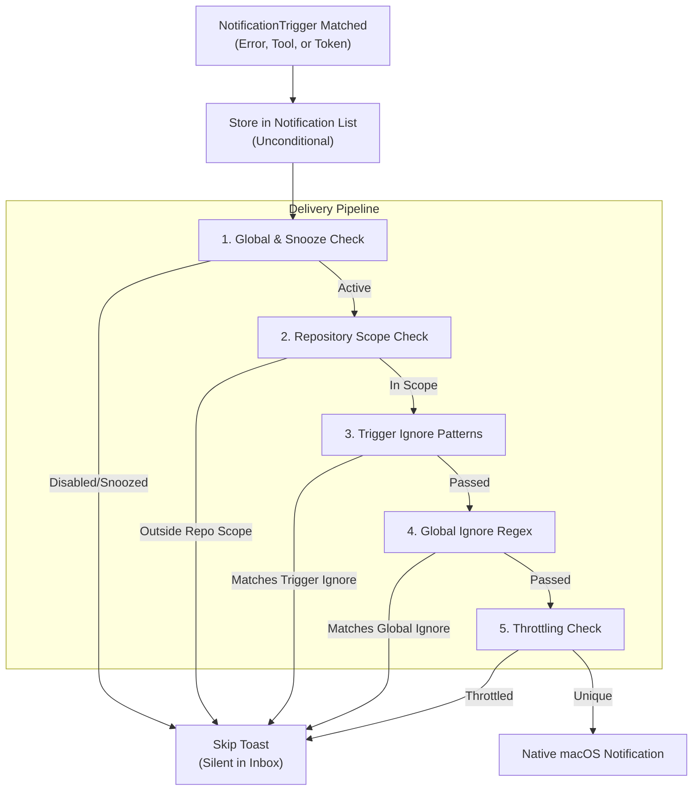
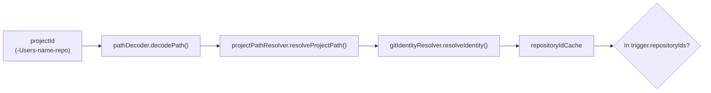

# 필터링 및 Throttling

관련 소스 파일

다음 파일들은 이 위키 페이지를 생성하기 위한 컨텍스트로 사용되었습니다.

- [src/main/ipc/config.ts](src/main/ipc/config.ts)
- [src/main/ipc/configValidation.ts](src/main/ipc/configValidation.ts)
- [src/main/services/error/ErrorTriggerChecker.ts](src/main/services/error/ErrorTriggerChecker.ts)
- [src/main/services/infrastructure/ConfigManager.ts](src/main/services/infrastructure/ConfigManager.ts)
- [src/main/utils/pathDecoder.ts](src/main/utils/pathDecoder.ts)
- [src/renderer/components/notifications/NotificationRow.tsx](src/renderer/components/notifications/NotificationRow.tsx)
- [src/renderer/components/settings/hooks/useSettingsConfig.ts](src/renderer/components/settings/hooks/useSettingsConfig.ts)
- [src/renderer/components/settings/hooks/useSettingsHandlers.ts](src/renderer/components/settings/hooks/useSettingsHandlers.ts)
- [src/renderer/components/settings/sections/GeneralSection.tsx](src/renderer/components/settings/sections/GeneralSection.tsx)
- [src/shared/types/notifications.ts](src/shared/types/notifications.ts)
- [test/main/ipc/guards.test.ts](test/main/ipc/guards.test.ts)
- [test/main/utils/pathDecoder.test.ts](test/main/utils/pathDecoder.test.ts)
- [test/mocks/electronAPI.ts](test/mocks/electronAPI.ts)

이 페이지는 claude-devtools에서 알림 spam을 방지하는 알림 필터링 파이프라인과 throttling 메커니즘을 문서화합니다. 이 시스템은 감지된 오류가 네이티브 macOS toast notification을 트리거할지 제어하면서도, 모든 오류를 나중에 검토할 수 있도록 persistent storage에 보존합니다.

`NotificationManager` 서비스와 알림 저장소에 대한 정보는 [Notification Manager](6.1)를 참조하세요. 오류 감지와 custom triggers에 대한 정보는 [Trigger System](6.2)을 참조하세요.

## 목적과 범위

필터링 및 throttling 시스템은 근본적인 문제를 해결합니다. Claude Code 세션은 집중적인 개발 중 수많은 이벤트(errors, tool uses, high token usage)를 생성할 수 있습니다. 필터링이 없으면 사용자는 끊임없는 알림에 압도됩니다. 이 시스템은 여러 제어 계층을 제공합니다.

1.  **Global enable/disable** - 모든 알림을 위한 master switch입니다. [src/main/services/infrastructure/ConfigManager.ts:35-35]()
2.  **Snooze timer** - 지정된 기간 동안 일시적으로 알림을 끕니다. [src/main/services/infrastructure/ConfigManager.ts:39-40]()
3.  **Repository filtering** - 특정 repository groups의 오류를 무시합니다. [src/main/services/infrastructure/ConfigManager.ts:38-38]()
4.  **Regex pattern matching** - 메시지 content 또는 특정 trigger fields 기준으로 알림을 필터링합니다. [src/main/services/infrastructure/ConfigManager.ts:37-37](), [src/main/services/infrastructure/ConfigManager.ts:147-147]()
5.  **Throttling** - 시간 window 안에서 동일한 알림을 deduplicate합니다.

**핵심 설계 원칙:** 필터링 로직은 저장소와 분리되어 있습니다. trigger와 일치하는 감지된 모든 이벤트는 notification store에 유지되지만, 필터링 파이프라인이 네이티브 UI toast 표시 여부를 결정합니다. [src/shared/types/notifications.ts:22-60]()

출처: [src/main/services/infrastructure/ConfigManager.ts:34-45](), [src/shared/types/notifications.ts:151-194]()

## 5단계 필터링 파이프라인

알림이 생성되면(`NotificationTrigger`를 통해), 전달 상태를 결정하기 위해 일련의 검사를 통과합니다.

### 파이프라인 개요

출처: [src/main/services/infrastructure/ConfigManager.ts:133-176](), [src/main/services/error/ErrorTriggerChecker.ts:98-114](), [src/main/services/error/TriggerMatcher.ts:34-36]()

## Stage 1: Enabled and Snooze Check

첫 번째 filter는 `NotificationConfig`의 조건을 확인합니다.

| 조건 | 구성 키 | 동작 |
| :--- | :--- | :--- |
| Global Enable | `notifications.enabled` | `false`이면 모든 네이티브 알림이 억제됩니다. [src/main/services/infrastructure/ConfigManager.ts:35-35]() |
| Snooze Timer | `notifications.snoozedUntil` | 현재 Unix timestamp < `snoozedUntil`이면 알림이 억제됩니다. [src/main/services/infrastructure/ConfigManager.ts:39-39]() |

Snooze는 `config:snooze`와 `config:clearSnooze` IPC 핸들러를 통해 관리됩니다. [src/main/ipc/config.ts:96-97]()

출처: [src/main/services/infrastructure/ConfigManager.ts:34-45](), [src/main/ipc/config.ts:96-97]()

## Stage 2: Repository Scope Check

Triggers는 특정 repositories로 범위를 지정할 수 있습니다. trigger에 `repositoryIds`가 정의되어 있으면, 시스템은 현재 프로젝트의 repository identity를 확인하여 일치 여부를 봅니다. [src/main/services/infrastructure/ConfigManager.ts:171-171]()

### Repository 확인 로직

`ErrorTriggerChecker`는 `GitIdentityResolver`를 사용해 `projectId`(encoded path)를 안정적인 repository ID에 매핑합니다. [src/main/services/error/ErrorTriggerChecker.ts:65-75]()

출처: [src/main/services/error/ErrorTriggerChecker.ts:56-75](), [src/main/services/error/ErrorTriggerChecker.ts:98-114]()

## Stage 3: Trigger-Specific Ignore Patterns

각 `NotificationTrigger`는 자체 `ignorePatterns`를 정의할 수 있습니다. 이들은 trigger와 일치한 특정 field(예: error message 또는 tool command)에 대해 테스트되는 regex 문자열입니다. [src/main/services/infrastructure/ConfigManager.ts:147-147]()

*   **Logic:** `matchesIgnorePatterns(content, trigger.ignorePatterns)`가 true를 반환하면 알림이 억제됩니다. [src/main/services/error/TriggerMatcher.ts:34-36]()
*   **Evaluation:** Patterns는 case-insensitive regular expressions로 컴파일됩니다. [src/main/services/error/ErrorTriggerChecker.ts:179-181]()

출처: [src/main/services/infrastructure/ConfigManager.ts:147-147](), [src/main/services/error/ErrorTriggerChecker.ts:179-181]()

## Stage 4: Global Ignore Regex

trigger-specific ignores 외에도 notification config에는 전역 `ignoredRegex` 목록이 있습니다. [src/main/services/infrastructure/ConfigManager.ts:37-37]()

*   **Usage:** 일반적으로 모든 프로젝트에서 알려진 안전한 오류를 광범위하게 억제하는 데 사용됩니다.
*   **Management:** `config:addIgnoreRegex`와 `config:removeIgnoreRegex` 핸들러를 통해 사용자가 이 목록을 업데이트할 수 있습니다. [src/main/ipc/config.ts:88-89]()
*   **Validation:** 저장 전에 유효한 regular expressions인지 확인하기 위해 IPC 호출 중 patterns가 검증됩니다. [src/main/ipc/config.ts:199-204]()

출처: [src/main/services/infrastructure/ConfigManager.ts:37-37](), [src/main/ipc/config.ts:199-204]()

## Stage 5: Throttling Mechanism

Throttling은 시간 window 안에서 동일한 이벤트를 deduplicate하여 notification fatigue를 방지합니다. Claude가 loop에 빠지거나 실패하는 tool call을 반복할 때 특히 중요합니다.

### Throttle 로직 구현

시스템은 고유 event signatures에 대해 sliding window(일반적으로 5-10초)를 유지합니다.

1.  **Signature Generation:** `projectId`, `triggerId`, primary content(예: `message`)로 hash를 생성합니다.
2.  **Check:** signature가 recent history map에 있으면 알림이 억제됩니다.
3.  **Cleanup:** 만료된 signatures는 주기적으로 map에서 pruning됩니다.

출처: [src/main/services/infrastructure/ConfigManager.ts:34-45](), [src/shared/types/notifications.ts:22-60]()

## IPC를 통한 구성 관리

`ConfigManager`는 이러한 filter를 위한 backend를 제공하며, `registerConfigHandlers` 함수는 이를 renderer에 노출합니다. [src/main/ipc/config.ts:80-126]()

### IPC Handler Reference

| Handler | Parameters | 목적 |
| :--- | :--- | :--- |
| `config:addIgnoreRegex` | `pattern: string` | 전역 regex suppression을 추가합니다. [src/main/ipc/config.ts:190-210]() |
| `config:addIgnoreRepository` | `repositoryId: string` | 특정 repo의 모든 알림을 억제합니다. [src/main/ipc/config.ts:233-250]() |
| `config:snooze` | `minutes: number` | 모든 알림을 일시적으로 끕니다. [src/main/ipc/config.ts:273-286]() |
| `config:updateTrigger` | `id, updates` | 특정 trigger의 `ignorePatterns`를 수정합니다. [src/main/ipc/config.ts:101-101]() |

### Validation Layer

모든 구성 업데이트는 type safety를 보장하고 invalid data가 configuration file을 손상시키지 않도록 `validateConfigUpdatePayload`를 통과합니다. [src/main/ipc/configValidation.ts:31-37]()

*   **Regex Validation:** `new RegExp(pattern)`을 사용해 syntax를 확인합니다. [src/main/ipc/config.ts:201-201]()
*   **Snooze Validation:** duration을 24시간(1440분)으로 제한합니다. [src/main/ipc/configValidation.ts:46-46]()
*   **Trigger Validation:** `id`, `name`, `mode` 같은 mandatory fields가 존재하는지 보장합니다. [src/main/ipc/configValidation.ts:60-95]()

출처: [src/main/ipc/config.ts:80-126](), [src/main/ipc/configValidation.ts:1-193]()

## UI 통합

renderer process는 Settings interface를 통해 이러한 메커니즘과 상호작용합니다.

*   **`useSettingsHandlers`**: 알림 상태 toggle과 ignore lists 관리를 위한 React callbacks를 제공합니다. [src/renderer/components/settings/hooks/useSettingsHandlers.ts:92-128]()
*   **`useSettingsConfig`**: disk write가 완료되기 전에도 UI가 반응성 있게 느껴지도록 filters의 optimistic state를 관리합니다. [src/renderer/components/settings/hooks/useSettingsConfig.ts:115-145]()
*   **`GeneralSection`**: repository matching을 위해 project paths가 디코딩되는 방식에 영향을 주는 Claude root path 구성을 처리합니다. [src/renderer/components/settings/sections/GeneralSection.tsx:123-149]()

출처: [src/renderer/components/settings/hooks/useSettingsHandlers.ts:1-215](), [src/renderer/components/settings/hooks/useSettingsConfig.ts:1-205]()
