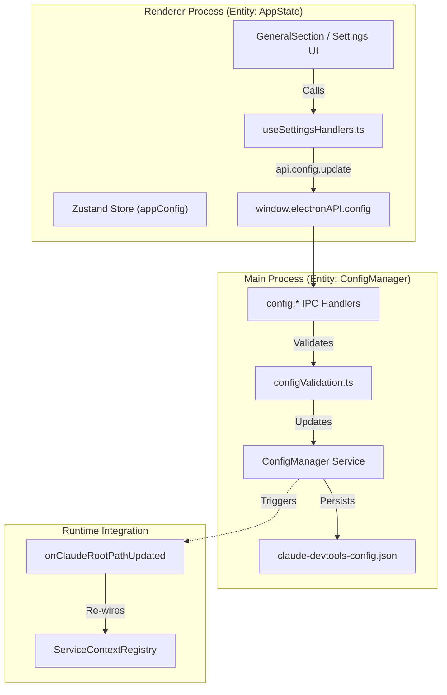
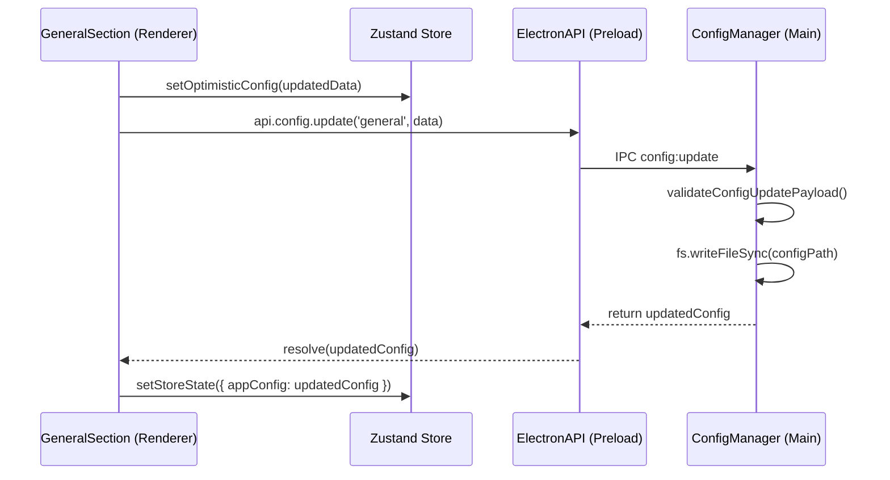

# 구성 관리

관련 소스 파일

다음 파일들은 이 위키 페이지를 생성하기 위한 컨텍스트로 사용되었습니다.

- [src/main/ipc/configValidation.ts](src/main/ipc/configValidation.ts)
- [src/main/ipc/context.ts](src/main/ipc/context.ts)
- [src/main/ipc/handlers.ts](src/main/ipc/handlers.ts)
- [src/main/ipc/ssh.ts](src/main/ipc/ssh.ts)
- [src/main/services/infrastructure/ConfigManager.ts](src/main/services/infrastructure/ConfigManager.ts)
- [src/renderer/components/settings/hooks/useSettingsConfig.ts](src/renderer/components/settings/hooks/useSettingsConfig.ts)
- [src/renderer/components/settings/hooks/useSettingsHandlers.ts](src/renderer/components/settings/hooks/useSettingsHandlers.ts)
- [src/renderer/components/settings/sections/GeneralSection.tsx](src/renderer/components/settings/sections/GeneralSection.tsx)
- [src/renderer/store/slices/connectionSlice.ts](src/renderer/store/slices/connectionSlice.ts)
- [src/shared/types/notifications.ts](src/shared/types/notifications.ts)

Configuration Management는 애플리케이션 설정 유지, Claude root path 감지, 런타임 구성 업데이트를 처리합니다. 사용자 preferences를 디스크에 유지하고 IPC 핸들러를 통해 renderer process에 노출하는 중앙화된 `ConfigManager` 서비스를 제공합니다.

특정 IPC 채널과 해당 파라미터에 대한 세부 정보는 [Config IPC Handlers](#7.1)를 참조하세요. Claude root path 자동 감지와 WSL 통합은 [Claude Root Detection](#7.2)을 참조하세요.

## 개요

구성은 main process의 `ConfigManager` singleton이 관리하는 JSON 파일로 저장됩니다. renderer는 `window.electronAPI.config.*` 메서드를 통해 구성에 접근하며, 이 메서드들은 서비스 계층에 위임하는 IPC 핸들러를 호출합니다. 구성 업데이트는 서비스를 다시 초기화할 수 있는 callback을 트리거합니다(예: Claude root path 전환은 project rescanning을 트리거함).

**핵심 컴포넌트:**
- **ConfigManager** ([src/main/services/infrastructure/ConfigManager.ts:24-24]()): `~/.claude/claude-devtools-config.json`의 config file을 관리하는 singleton 서비스 [src/main/services/infrastructure/ConfigManager.ts:26-28]().
- **Config IPC Handlers** ([src/main/ipc/handlers.ts:19-19]()): 구성 section 읽기/업데이트를 위한 핸들러이며, `initializeConfigHandlers`를 통해 초기화됩니다 [src/main/ipc/handlers.ts:82-84]().
- **GeneralSection** ([src/renderer/components/settings/sections/GeneralSection.tsx:34-39]()): Claude root 선택, theme 관리, WSL 감지를 위한 UI입니다.
- **useSettingsConfig** ([src/renderer/components/settings/hooks/useSettingsConfig.ts:72-72]()): settings state를 관리하고 안전한 기본값을 제공하는 hook입니다 [src/renderer/components/settings/hooks/useSettingsConfig.ts:151-179]().

## 구성 아키텍처

다음 다이어그램은 UI 상호작용에서 디스크 유지와 서비스 재연결까지의 흐름을 보여줍니다.

Title: Configuration Management Data Flow

**출처:** [src/main/services/infrastructure/ConfigManager.ts:1-28](), [src/main/ipc/handlers.ts:82-84](), [src/renderer/components/settings/hooks/useSettingsHandlers.ts:1-13](), [src/renderer/components/settings/hooks/useSettingsConfig.ts:130-145]()

## 구성 구조

`AppConfig` 인터페이스는 JSON 파일에 저장되는 여러 section을 정의합니다 [src/main/services/infrastructure/ConfigManager.ts:217-224]().

| Section | 주요 필드 | 목적 |
|---------|------------|---------|
| **general** | `theme`, `claudeRootPath`, `launchAtLogin` | 핵심 앱 동작과 pathing [src/main/services/infrastructure/ConfigManager.ts:178-186](). |
| **notifications** | `enabled`, `triggers`, `ignoredRepositories`, `snoozedUntil` | 알림 규칙과 silence periods [src/main/services/infrastructure/ConfigManager.ts:34-45](). |
| **display** | `showTimestamps`, `compactMode`, `syntaxHighlighting` | UI 표시 preferences [src/main/services/infrastructure/ConfigManager.ts:188-192](). |
| **ssh** | `profiles`, `lastConnection`, `autoReconnect` | 원격 연결 persistence [src/main/services/infrastructure/ConfigManager.ts:199-210](). |
| **httpServer** | `enabled`, `port` | Sidecar API 구성 [src/main/services/infrastructure/ConfigManager.ts:212-215](). |

**출처:** [src/main/services/infrastructure/ConfigManager.ts:34-224]()

## IPC 핸들러 등록

IPC 핸들러는 `src/main/ipc/handlers.ts`에서 조율됩니다 [src/main/ipc/handlers.ts:1-14](). 구성 핸들러는 `registerConfigHandlers(ipcMain)`를 통해 등록됩니다 [src/main/ipc/handlers.ts:94-94]().

| Handler Channel | 기능 |
|-----------------|---------------|
| `config:get` | 현재 전체 `AppConfig`를 조회합니다 [src/renderer/components/settings/hooks/useSettingsConfig.ts:94-94](). |
| `config:update` | 특정 config section을 검증하고 업데이트합니다 [src/main/ipc/configValidation.ts:31-37](). |
| `config:snooze` | 알림을 위한 임시 suppression을 설정합니다 [src/renderer/components/settings/hooks/useSettingsHandlers.ts:103-103](). |
| `config:getClaudeRootInfo` | 자동 감지 경로와 override 경로를 반환합니다 [src/renderer/components/settings/sections/GeneralSection.tsx:66-66](). |
| `config:findWslClaudeRoots` | Claude 세션 데이터를 찾기 위해 WSL distributions를 스캔합니다 [src/renderer/components/settings/sections/GeneralSection.tsx:211-211](). |

**출처:** [src/main/ipc/handlers.ts:82-94](), [src/renderer/components/settings/hooks/useSettingsHandlers.ts:99-106](), [src/main/ipc/configValidation.ts:31-37]()

## 구성 업데이트 흐름

사용자가 UI에서 설정을 토글하면, 시스템은 main process에 유지하기 전에 renderer의 상태를 optimistic update합니다.

Title: Settings Update Sequence

**출처:** [src/renderer/components/settings/hooks/useSettingsConfig.ts:116-145](), [src/main/ipc/configValidation.ts:1-4]()

## Claude Root Path 시스템

Claude root path는 세션 탐색에 중요합니다. 애플리케이션은 기본 platform path와 사용자 override를 모두 추적합니다.

### 경로 확인
`GeneralSection` 컴포넌트는 `api.config.getClaudeRootInfo()`를 사용해 현재 경로 상태를 표시합니다 [src/renderer/components/settings/sections/GeneralSection.tsx:64-73](). 사용자가 `api.config.selectClaudeRootFolder()`를 통해 새 폴더를 선택하면, 시스템은 해당 폴더에 `projects` 디렉터리가 포함되어 있는지 검증합니다 [src/renderer/components/settings/sections/GeneralSection.tsx:151-182]().

### 런타임 재연결
`claudeRootPath`가 업데이트되면 `onClaudeRootPathUpdated` callback이 실행됩니다 [src/main/ipc/handlers.ts:71-71](). 이는 renderer에서 workspace reset을 트리거하여 projects와 repository groups를 지우고 UI가 새 root를 반영하도록 보장합니다 [src/renderer/components/settings/sections/GeneralSection.tsx:100-121]().

**출처:** [src/renderer/components/settings/sections/GeneralSection.tsx:123-149](), [src/main/ipc/handlers.ts:82-84]()

## SSH Persistence

`ConfigManager`는 매끄러운 재연결을 가능하게 하기 위해 SSH 연결 세부 정보를 유지합니다. 여기에는 다음이 포함됩니다.
- **Profiles**: 저장된 SSH host configurations [src/main/services/infrastructure/ConfigManager.ts:208-208]().
- **Last Connection**: connection forms를 미리 채우기 위한 가장 최근 세션의 메타데이터(host, port, user) [src/main/services/infrastructure/ConfigManager.ts:200-206]().
- **Active Context**: 앱이 local 또는 특정 SSH context로 시작해야 하는지 추적 [src/main/services/infrastructure/ConfigManager.ts:209-209]().

SSH 연결이 수립되면 `connectionSlice`가 `api.ssh.saveLastConnection`을 호출하여 이러한 설정을 업데이트합니다 [src/renderer/store/slices/connectionSlice.ts:112-120]().

**출처:** [src/main/services/infrastructure/ConfigManager.ts:199-210](), [src/renderer/store/slices/connectionSlice.ts:65-129]()

## 검증과 안전성

구성 손상을 방지하기 위해 시스템은 런타임 검증을 사용합니다.
- **Type Checking**: `config:update`의 payload는 `configValidation.ts`에서 허용된 key와 type에 대해 확인됩니다 [src/main/ipc/configValidation.ts:39-45]().
- **Constraint Enforcement**: 예를 들어 `snoozeMinutes`는 1440분(24시간)으로 제한됩니다 [src/main/ipc/configValidation.ts:46-46]().
- **Safe Defaults**: config file이 없거나 일부만 있어도 UI가 valid default values를 받아 crash를 방지하도록 `useSettingsConfig` hook이 보장합니다 [src/renderer/components/settings/hooks/useSettingsConfig.ts:151-179]().

**출처:** [src/main/ipc/configValidation.ts:48-95](), [src/renderer/components/settings/hooks/useSettingsConfig.ts:151-179]()
