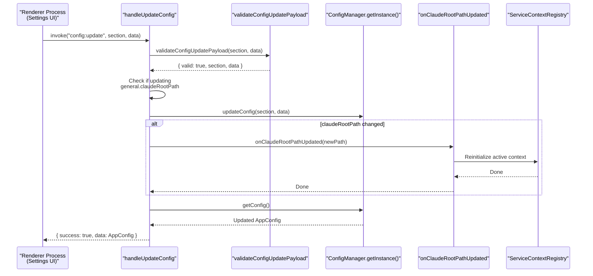
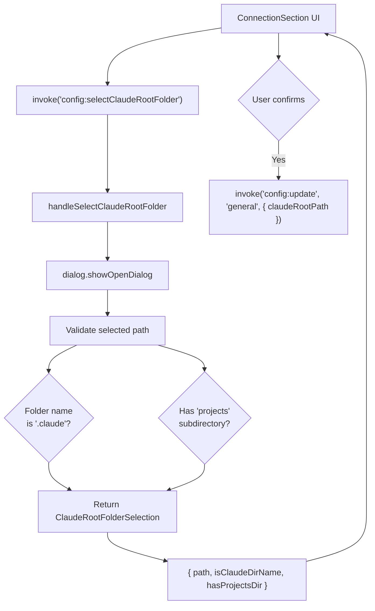
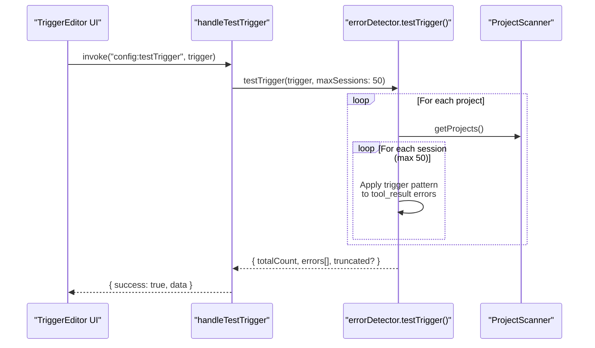

# Config IPC Handlers

<details>
<summary>관련 소스 파일</summary>

다음 파일들은 이 위키 페이지를 생성하기 위한 컨텍스트로 사용되었습니다.

- [src/main/http/config.ts](src/main/http/config.ts)
- [src/main/http/events.ts](src/main/http/events.ts)
- [src/main/http/notifications.ts](src/main/http/notifications.ts)
- [src/main/http/projects.ts](src/main/http/projects.ts)
- [src/main/http/ssh.ts](src/main/http/ssh.ts)
- [src/main/http/subagents.ts](src/main/http/subagents.ts)
- [src/main/ipc/config.ts](src/main/ipc/config.ts)
- [src/main/ipc/context.ts](src/main/ipc/context.ts)
- [src/main/ipc/handlers.ts](src/main/ipc/handlers.ts)
- [src/main/ipc/ssh.ts](src/main/ipc/ssh.ts)
- [src/main/services/error/ErrorTriggerChecker.ts](src/main/services/error/ErrorTriggerChecker.ts)
- [src/main/utils/pathDecoder.ts](src/main/utils/pathDecoder.ts)
- [src/renderer/components/notifications/NotificationRow.tsx](src/renderer/components/notifications/NotificationRow.tsx)
- [src/renderer/store/slices/connectionSlice.ts](src/renderer/store/slices/connectionSlice.ts)
- [test/main/ipc/guards.test.ts](test/main/ipc/guards.test.ts)
- [test/main/utils/pathDecoder.test.ts](test/main/utils/pathDecoder.test.ts)
- [test/mocks/electronAPI.ts](test/mocks/electronAPI.ts)

</details>


## 목적과 범위

config IPC handlers 모듈은 모든 애플리케이션 구성 작업을 위한 프로세스 간 통신 인터페이스를 제공합니다. renderer process가 `ConfigManager`가 저장한 설정을 읽고 수정하는 데 사용하는 `config:*` namespace의 IPC 채널을 노출합니다 [src/main/ipc/config.ts:5-17]().

이 페이지는 IPC 계층을 구체적으로 문서화합니다. 구성 유지와 기반 저장소에 대한 정보는 [Configuration Management](#7)를 참조하세요. Claude root path 자동 감지 로직은 [Claude Root Detection](#7.2)을 참조하세요. 이 핸들러를 호출하는 UI는 [Settings Interface](#9.4)를 참조하세요.

**출처:** [src/main/ipc/config.ts:1-126]()

## 핸들러 등록

이 모듈은 main process 시작 중 호출해야 하는 두 개의 초기화 함수를 내보냅니다 [src/main/ipc/handlers.ts:64-73]().

```typescript
initializeConfigHandlers(options: {
  onClaudeRootPathUpdated?: (claudeRootPath: string | null) => Promise<void> | void;
})
```

앱 수준 서비스가 필요한 선택적 callback을 등록합니다. `onClaudeRootPathUpdated` callback은 Claude root path가 런타임에 변경될 때 active service context를 다시 초기화하여 main process가 이에 대응할 수 있게 합니다 [src/main/ipc/config.ts:69-75]().

```typescript
registerConfigHandlers(ipcMain: IpcMain)
```

모든 config IPC 핸들러를 Electron의 `ipcMain`에 등록합니다 [src/main/ipc/config.ts:80-126](). 애플리케이션 초기화 중 `initializeIpcHandlers`를 통해 한 번 호출됩니다 [src/main/ipc/handlers.ts:94]().

### IPC Channel Mapping

| Code Entity (Handler) | IPC Channel Name | 목적 |
|:---|:---|:---|
| `handleGetConfig` | `config:get` | 전체 `AppConfig` 객체 반환 |
| `handleUpdateConfig` | `config:update` | runtime callback 지원과 함께 config section 업데이트 |
| `handleAddTrigger` | `config:addTrigger` | custom notification trigger 추가 |
| `handleUpdateTrigger` | `config:updateTrigger` | 기존 trigger 속성 업데이트 |
| `handleRemoveTrigger` | `config:removeTrigger` | ID 기준 trigger 삭제 |
| `handleGetTriggers` | `config:getTriggers` | 모든 trigger 목록 조회(built-in + custom) |
| `handleTestTrigger` | `config:testTrigger` | historical sessions에 대해 trigger 테스트 |
| `handleAddIgnoreRegex` | `config:addIgnoreRegex` | notification ignore list에 regex pattern 추가 |
| `handleRemoveIgnoreRegex` | `config:removeIgnoreRegex` | ignore list에서 regex pattern 제거 |
| `handleAddIgnoreRepository` | `config:addIgnoreRepository` | ignore list에 repository ID 추가 |
| `handleRemoveIgnoreRepository` | `config:removeIgnoreRepository` | ignore list에서 repository ID 제거 |
| `handleSnooze` | `config:snooze` | snooze duration 설정 |
| `handleClearSnooze` | `config:clearSnooze` | 활성 snooze timer 해제 |
| `handlePinSession` | `config:pinSession` | session을 project list 상단에 고정 |
| `handleUnpinSession` | `config:unpinSession` | project에서 session 고정 해제 |
| `handleSelectFolders` | `config:selectFolders` | 네이티브 folder picker 열기(multi-select) |
| `handleSelectClaudeRootFolder` | `config:selectClaudeRootFolder` | Claude root용 folder picker 열기 |
| `handleGetClaudeRootInfo` | `config:getClaudeRootInfo` | 현재/default/custom Claude root paths 가져오기 |
| `handleFindWslClaudeRoots` | `config:findWslClaudeRoots` | WSL Claude root 후보 감지(Windows 전용) |
| `handleOpenInEditor` | `config:openInEditor` | 외부 editor에서 config JSON 열기 |

**출처:** [src/main/ipc/config.ts:80-126](), [src/main/ipc/handlers.ts:64-101]()

## Runtime Callback을 포함한 Config Update 흐름

`handleUpdateConfig` 핸들러에는 Claude root path가 변경될 때 runtime context 재초기화를 트리거하는 특수 로직이 포함되어 있습니다 [src/main/ipc/config.ts:162-176]().



**구현 세부 사항:**

1.  **Validation:** `ConfigManager`를 호출하기 전에 type safety를 보장하기 위해 `validateConfigUpdatePayload`를 사용합니다 [src/main/ipc/config.ts:157-160]().
2.  **Detection:** update에 `general.claudeRootPath` 속성이 포함되는지 확인합니다 [src/main/ipc/config.ts:162-164]().
3.  **Callback Invocation:** Claude root가 변경되었고 `onClaudeRootPathUpdated` callback이 등록되어 있으면 새 경로와 함께 호출됩니다 [src/main/ipc/config.ts:168-176]().
4.  **Error Handling:** Callback 오류는 로그에 남기지만 config update 작업을 실패시키지는 않습니다 [src/main/ipc/config.ts:174-175]().

**출처:** [src/main/ipc/config.ts:151-184]()

## Claude Root 선택 시스템

config 핸들러는 Claude root path를 선택하기 위한 세 가지 메커니즘을 제공합니다.

### 수동 폴더 선택



핸들러는 path validation을 수행하고 UI가 confirmation dialogs를 표시하는 데 도움이 되는 metadata를 반환합니다 [src/main/ipc/config.ts:648-696]().

### WSL Claude Root 감지(Windows)

Windows에서 `handleFindWslClaudeRoots`는 UNC paths를 통해 WSL2 distributions 안의 Claude roots를 감지합니다 [src/main/ipc/config.ts:742-750]().

1.  **Executable Search:** 다양한 `wsl.exe` 위치를 시도합니다 [src/main/ipc/config.ts:752-763]().
2.  **Distro Parsing:** `wsl --list --quiet`를 실행하고 UTF-16 LE 출력을 디코딩합니다 [src/main/ipc/config.ts:765-812]().
3.  **Home Resolution:** 각 distro 안에서 `sh -lc 'printf %s "$HOME"'`를 실행해 POSIX home을 찾습니다 [src/main/ipc/config.ts:886-896]().
4.  **Path Construction:** POSIX home을 UNC path `\\wsl.localhost\<distro>\home\...`로 매핑합니다 [src/main/ipc/config.ts:930-935]().

**출처:** [src/main/ipc/config.ts:742-959]()

## Trigger Testing 시스템

`handleTestTrigger` 핸들러는 detection results를 미리 보기 위해 historical session data에 대해 trigger pattern을 실행합니다 [src/main/ipc/config.ts:464-470]().



**안전 제한:**
*   최대 50개 세션을 스캔합니다 [src/main/ipc/config.ts:488]().
*   내부 safety thresholds를 초과하면 결과가 잘립니다 [src/main/ipc/config.ts:505-509]().

**출처:** [src/main/ipc/config.ts:464-516](), [src/main/services/error/ErrorTriggerChecker.ts:157-198]()

## 서비스와의 통합

모든 핸들러는 singleton `ConfigManager` 인스턴스와 상호작용합니다 [src/main/ipc/config.ts:53]().

| Handler Action | ConfigManager Method | 목적 |
|:---|:---|:---|
| `handleGetConfig` | `getConfig()` | 전체 config 읽기 [src/main/ipc/config.ts:138]() |
| `handleUpdateConfig` | `updateConfig()` | section 업데이트 [src/main/ipc/config.ts:166]() |
| `handleAddIgnoreRegex` | `addIgnoreRegex()` | ignore list에 추가 [src/main/ipc/config.ts:207]() |
| `handleSnooze` | `setSnooze()` | snooze timer 설정 [src/main/ipc/config.ts:291]() |
| `handleAddTrigger` | `addTrigger()` | trigger 추가 [src/main/ipc/config.ts:347]() |

**출처:** [src/main/ipc/config.ts:53-350]()

## Renderer 통합

renderer는 preload script에 정의된 `api.config` 객체를 통해 이 핸들러들에 접근합니다 [test/mocks/electronAPI.ts:56-77]().


**출처:** [test/mocks/electronAPI.ts:129-179](), [src/renderer/store/slices/connectionSlice.ts:120]()

## Handler Cleanup

이 모듈은 애플리케이션 종료 중 등록된 모든 핸들러를 정리하기 위한 `removeConfigHandlers()`를 내보냅니다 [src/main/ipc/config.ts:969-991]().

```typescript
export function removeConfigHandlers(ipcMain: IpcMain): void {
  ipcMain.removeHandler('config:get');
  ipcMain.removeHandler('config:update');
  // ...
}
```

**출처:** [src/main/ipc/config.ts:969-991](), [src/main/ipc/handlers.ts:115]()
