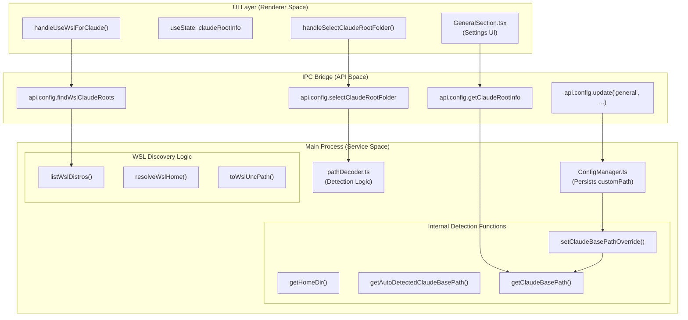
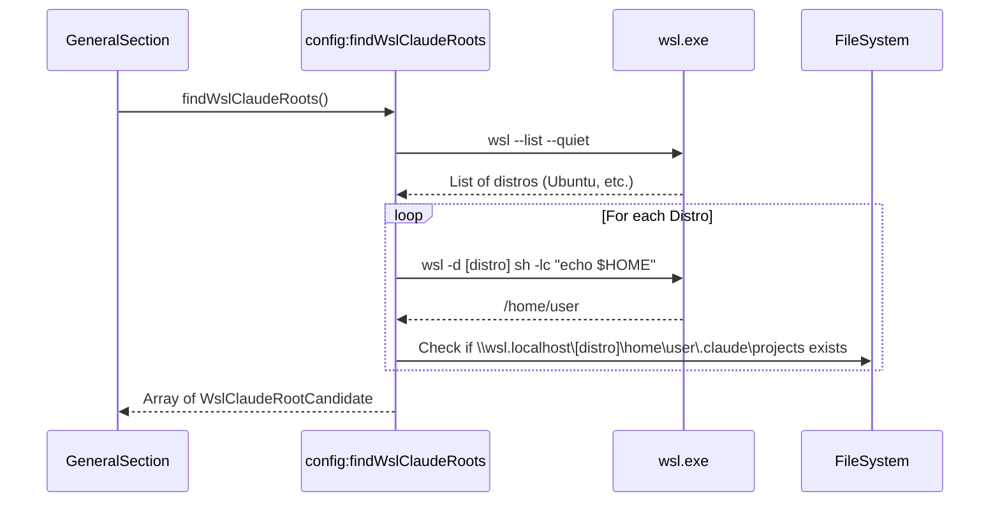

# Claude Root 감지

<details>
<summary>관련 소스 파일</summary>

다음 파일들은 이 위키 페이지를 생성하기 위한 컨텍스트로 사용되었습니다.

- [src/main/ipc/configValidation.ts](src/main/ipc/configValidation.ts)
- [src/main/services/infrastructure/ConfigManager.ts](src/main/services/infrastructure/ConfigManager.ts)
- [src/preload/index.ts](src/preload/index.ts)
- [src/renderer/api/httpClient.ts](src/renderer/api/httpClient.ts)
- [src/renderer/components/settings/hooks/useSettingsConfig.ts](src/renderer/components/settings/hooks/useSettingsConfig.ts)
- [src/renderer/components/settings/hooks/useSettingsHandlers.ts](src/renderer/components/settings/hooks/useSettingsHandlers.ts)
- [src/renderer/components/settings/sections/GeneralSection.tsx](src/renderer/components/settings/sections/GeneralSection.tsx)
- [src/shared/types/api.ts](src/shared/types/api.ts)
- [src/shared/types/notifications.ts](src/shared/types/notifications.ts)

</details>


이 페이지는 세션 로그, 프로젝트 데이터, 구성 파일을 포함하는 Claude 데이터 디렉터리(일반적으로 `~/.claude`)를 찾고 구성하는 시스템을 문서화합니다. 이 시스템은 자동 감지, 수동 선택, Windows Subsystem for Linux(WSL) 통합을 지원합니다.

SSH 원격 경로 구성은 [SSH Remote Access]()를 참조하세요. 일반적인 구성 관리는 [Configuration Management]()를 참조하세요.

---

## 목적과 범위

Claude Root Detection 시스템은 `claude-devtools`가 로컬 파일 시스템에서 세션 데이터를 어디에서 읽어야 하는지 결정합니다. 이 시스템은 다음을 제공합니다.

- 플랫폼 전반에서 기본 `~/.claude` 디렉터리 **자동 감지**.
- 네이티브 폴더 선택 dialog를 통한 **수동 override**.
- Linux 환경에서 Claude를 실행하는 Windows 사용자를 위한 **WSL 통합**.
- 선택된 디렉터리에 예상 구조(예: `projects` 폴더)가 있는지 확인하는 **경로 검증**.
- 재시작 없이 애플리케이션 상태를 업데이트하는 **런타임 재구성**.

이 시스템은 **로컬** 파일 시스템 경로를 처리합니다. SSH를 통해 접근하는 원격 경로는 `SshConnectionManager` [src/main/services/ssh/SshConnectionManager.ts:1-20]()가 관리합니다.

---

## 시스템 아키텍처

다음 다이어그램은 감지 및 override 흐름에 관련된 자연어 개념을 특정 코드 엔티티에 매핑합니다.

### 로직 흐름: UI에서 코드 엔티티까지



**출처:** [src/renderer/components/settings/sections/GeneralSection.tsx:52-182](), [src/main/ipc/config.ts:649-732](), [src/main/utils/pathDecoder.ts:228-310]()

---

## 자동 감지 로직

시스템은 사용자 home directory를 찾고 `.claude`를 덧붙이는 방식으로 Claude root directory를 자동 감지합니다.

### Home Directory 확인

`getHomeDir()` 함수는 macOS, Linux, Windows 전반에서 신뢰성을 보장하기 위해 cross-platform fallback chain을 사용합니다.

**구현:** [src/main/utils/pathDecoder.ts:228-234]()

| 플랫폼 | 일반적인 결과 |
|----------|----------------|
| macOS | `/Users/username` |
| Linux | `/home/username` |
| Windows | `C:\Users\username` |

### 기본 경로 구성

`getAutoDetectedClaudeBasePath()`는 active override와 관계없이 기본 경로를 반환합니다.

```typescript
// Simplified logic from pathDecoder.ts
const defaultPath = path.join(getHomeDir(), '.claude');
```

**구현:** [src/main/utils/pathDecoder.ts:245-247]()

---

## 수동 선택 및 검증

사용자는 Settings UI의 folder picker dialog를 통해 자동 감지된 경로를 override할 수 있습니다.

### 폴더 선택 흐름

1. **Selection**: renderer가 `api.config.selectClaudeRootFolder()`를 호출합니다 [src/shared/types/api.ts:100]().
2. **Native Dialog**: main process가 네이티브 directory picker를 엽니다.
3. **Validation**: 선택 후 시스템은 다음을 확인합니다.
   - 폴더 이름이 정확히 `.claude`인지 [src/shared/types/api.ts:134]().
   - 폴더가 `projects` 디렉터리를 포함하는지 [src/shared/types/api.ts:135]().
4. **Normalization**: 경로는 절대 경로이고 trailing slash가 없도록 `normalizeOverridePath()`를 통과합니다 [src/main/utils/pathDecoder.ts:249-275]().

### 경로 정규화 규칙

| 입력 | 출력 | 참고 |
|-------|--------|-------|
| `/Users/name/.claude/` | `/Users/name/.claude` | Trailing slash 제거 |
| `C:\Users\name\.claude\` | `C:\Users\name\.claude` | Windows path 정규화 |
| `.claude` | `null` | 상대 경로 거부 |

**출처:** [src/main/utils/pathDecoder.ts:249-275](), [src/renderer/components/settings/sections/GeneralSection.tsx:151-182]()

---

## WSL 통합(Windows 전용)

Windows에서 사용자는 UNC 경로(예: `\\wsl.localhost\Ubuntu\home\user\.claude`)를 통해 WSL distributions의 Claude 데이터 디렉터리를 선택할 수 있습니다.

### WSL 탐색 로직

시스템은 설치된 distributions와 각각의 home directories를 탐색하기 위해 `wsl.exe`를 실행합니다.



**구현 세부 사항:**
- **Encoding Detection**: WSL 출력은 UTF-16 LE 또는 UTF-8일 수 있으며, 시스템은 byte-pattern heuristics로 이를 감지합니다 [src/main/ipc/config.ts:765-796]().
- **UNC Conversion**: POSIX 경로는 `\\wsl.localhost\[distro]` prefix를 사용해 변환됩니다 [src/main/ipc/config.ts:747-750]().

**출처:** [src/main/ipc/config.ts:734-959](), [src/renderer/components/settings/sections/GeneralSection.tsx:207-235]()

---

## Runtime Override와 Persistence

Override 경로는 persistent storage와 in-memory state를 통해 관리됩니다.

### Persistent Storage
`ConfigManager`는 `general` section 아래 `~/.claude/claude-devtools-config.json`에 `claudeRootPath`를 유지합니다 [src/main/services/infrastructure/ConfigManager.ts:183]().

### In-Memory State
`pathDecoder` 모듈은 module-level 변수 `claudeBasePathOverride`를 유지합니다 [src/main/utils/pathDecoder.ts:281]().

```typescript
export function getClaudeBasePath(): string {
  return claudeBasePathOverride ?? getAutoDetectedClaudeBasePath();
}
```

### 변경 시 Workspace Reset
UI에서 새 Claude root가 적용되면, 애플리케이션은 데이터 일관성을 보장하기 위해 workspace state의 "Soft Reset"을 수행합니다.

**Reset Actions:**
- Zustand store의 `projects`와 `repositoryGroups`를 지웁니다 [src/renderer/components/settings/sections/GeneralSection.tsx:101-103]().
- `paneLayout`과 `openTabs`를 재설정합니다 [src/renderer/components/settings/sections/GeneralSection.tsx:104-118]().
- 새 경로를 사용해 `fetchProjects()`와 `fetchRepositoryGroups()`를 다시 트리거합니다 [src/renderer/components/settings/sections/GeneralSection.tsx:134]().

**출처:** [src/renderer/components/settings/sections/GeneralSection.tsx:100-149](), [src/main/utils/pathDecoder.ts:281-295](), [src/main/services/infrastructure/ConfigManager.ts:178-186]()

---

## IPC 핸들러 요약

`src/main/ipc/config.ts`의 다음 핸들러는 root detection system을 지원합니다.

| 채널 | 설명 |
|---------|-------------|
| `config:getClaudeRootInfo` | default, resolved, custom paths를 반환합니다 [src/main/ipc/config.ts:701-732](). |
| `config:selectClaudeRootFolder` | folder picker를 열고 선택 항목을 검증합니다 [src/main/ipc/config.ts:649-696](). |
| `config:findWslClaudeRoots` | Claude 데이터를 찾기 위해 WSL distributions를 스캔합니다 [src/main/ipc/config.ts:734-745](). |
| `config:update` | 새 경로를 유지하고 runtime override를 업데이트합니다 [src/main/ipc/config.ts:160-177](). |

**출처:** [src/main/ipc/config.ts:649-745](), [src/shared/types/api.ts:99-104]()
