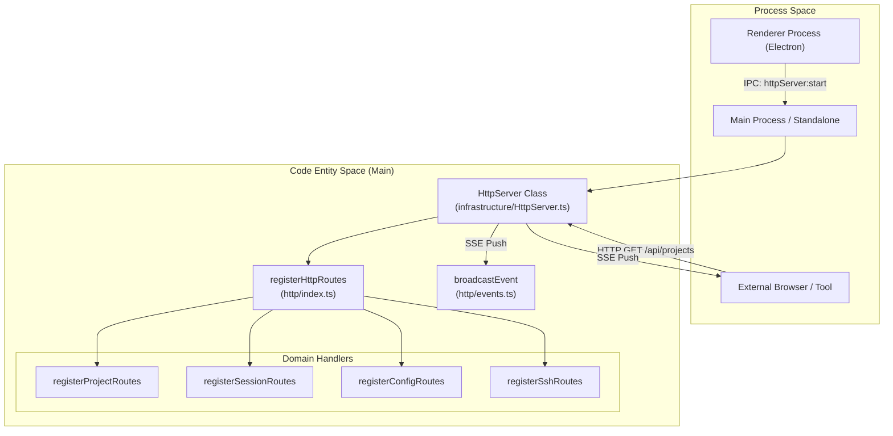
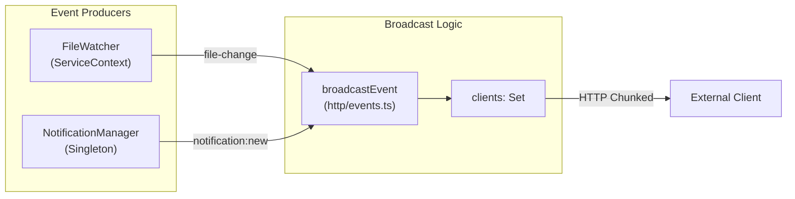

# HTTP Sidecar Server

<details>
<summary>관련 소스 파일</summary>

다음 파일들은 이 위키 페이지를 생성하기 위한 컨텍스트로 사용되었습니다.

- [knip.json](knip.json)
- [src/main/http/config.ts](src/main/http/config.ts)
- [src/main/http/events.ts](src/main/http/events.ts)
- [src/main/http/index.ts](src/main/http/index.ts)
- [src/main/http/notifications.ts](src/main/http/notifications.ts)
- [src/main/http/projects.ts](src/main/http/projects.ts)
- [src/main/http/ssh.ts](src/main/http/ssh.ts)
- [src/main/http/subagents.ts](src/main/http/subagents.ts)
- [src/main/services/infrastructure/HttpServer.ts](src/main/services/infrastructure/HttpServer.ts)
- [src/main/standalone.ts](src/main/standalone.ts)
- [vite.standalone.config.ts](vite.standalone.config.ts)

</details>


HTTP Sidecar Server는 외부 도구, 통합, 원격 클라이언트가 `claude-devtools` 데이터에 접근하고 실시간 업데이트를 받을 수 있게 하는 Fastify 기반 HTTP API입니다. projects, sessions, configuration을 조회하기 위한 REST endpoints를 노출하고, 파일 변경 및 시스템 이벤트의 live notifications를 위해 Server-Sent Events(SSE)를 제공합니다. 

Electron 통합 모드 외에도 codebase는 **Standalone Mode** [src/main/standalone.ts:1-7]()를 지원하여, 서버가 Docker 또는 원격 서버 같은 headless environments에서 Electron dependencies 없이 실행될 수 있게 합니다.

## 목적과 아키텍처

HTTP server는 Electron main process 내부에서(또는 standalone Node.js process로) 실행되며, 기본적으로 localhost-only API를 제공합니다. 세 가지 주요 기능을 수행합니다.

1.  **REST API**: 세션 데이터, 프로젝트 메타데이터, 시스템 상태에 대한 프로그래밍 방식 접근을 제공합니다 [src/main/http/index.ts:1-6]().
2.  **Event Streaming**: 파일 변경, SSH 상태, 알림을 위한 Server-Sent Events(SSE)를 통해 실시간 업데이트를 broadcast합니다 [src/main/http/events.ts:1-6]().
3.  **Static Hosting**: 번들된 Renderer UI를 Single Page Application(SPA)으로 제공하여 표준 웹 브라우저에서 인터페이스에 접근할 수 있게 합니다 [src/main/services/infrastructure/HttpServer.ts:94-118]().

### 시스템 컨텍스트 및 데이터 흐름



**출처:** [src/main/services/infrastructure/HttpServer.ts:45-63](), [src/main/http/index.ts:45-63](), [src/main/standalone.ts:118-158]()

## 서버 수명 주기

### 초기화와 포트 할당
서버는 `HttpServer` 클래스 [src/main/services/infrastructure/HttpServer.ts:45]()를 통해 인스턴스화됩니다. 선호 port(기본 `3456`)부터 시작하여 host(기본 `127.0.0.1`)에 bind하려고 시도합니다. port가 사용 중이면 port 번호를 증가시키고 최대 10회 재시도합니다 [src/main/services/infrastructure/HttpServer.ts:124-143]().

| Environment | 기본 Host | 기본 Port | 동작 |
| :--- | :--- | :--- | :--- |
| **Electron** | `127.0.0.1` | `3456` | desktop app을 위한 localhost 보안 [src/main/services/infrastructure/HttpServer.ts:4-5]() |
| **Standalone** | `0.0.0.0` | `3456` | network/Docker 전반에서 접근 가능 [src/main/standalone.ts:35-36]() |

**출처:** [src/main/services/infrastructure/HttpServer.ts:124-143](), [src/main/standalone.ts:35-36]()

### Static File 및 SPA 처리
서버는 renderer build output 경로를 동적으로 확인합니다 [src/main/services/infrastructure/HttpServer.ts:25-43](). 찾으면 다음을 수행합니다.
1.  root `/`에서 assets를 제공하기 위해 `@fastify/static`을 등록합니다 [src/main/services/infrastructure/HttpServer.ts:103-107]().
2.  non-API routes에 대해 `index.html`을 제공하는 "Not Found" handler를 설정하여 SPA client-side routing을 가능하게 합니다 [src/main/services/infrastructure/HttpServer.ts:113-118]().

## API Route 구조

API는 Electron 앱에서 사용되는 IPC handler 구조를 반영하여 domain-specific modules로 구성됩니다 [src/main/http/index.ts:1-6]().

| Endpoint Prefix | 설명 | 파일 |
| :--- | :--- | :--- |
| `/api/projects` | projects와 worktrees 목록 | [src/main/http/projects.ts]() |
| `/api/sessions` | session JSONL 및 metadata 가져오기 | [src/main/http/sessions.ts]() |
| `/api/config` | 앱 settings와 triggers 조회/업데이트 | [src/main/http/config.ts]() |
| `/api/ssh` | 원격 연결 관리 | [src/main/http/ssh.ts]() |
| `/api/notifications` | persistent notification history 접근 | [src/main/http/notifications.ts]() |
| `/api/events` | 실시간 업데이트를 위한 SSE stream | [src/main/http/events.ts]() |

**출처:** [src/main/http/index.ts:50-61]()

## Event Broadcasting(SSE)

서버는 `/api/events` [src/main/http/events.ts:23]()에 Server-Sent Events(SSE) stream을 구현합니다. active `FastifyReply` 객체 집합을 유지하고, 연결 유지를 위해 주기적으로 `:ping` comments를 전송합니다 [src/main/http/events.ts:17-36]().

### 이벤트 흐름: Source에서 Client까지



**출처:** [src/main/http/events.ts:53-63](), [src/main/standalone.ts:122-138]()

## Standalone Mode

`standalone.ts` entry point는 Electron 없이 애플리케이션을 실행할 수 있게 합니다 [src/main/standalone.ts:2-7](). 

### Electron Mode와의 차이점:
1.  **Stubbed Services**: `UpdaterService`(auto-updates)와 `SshConnectionManager`(multi-user SSH profiles) 같은 기능은 no-op stubs로 대체됩니다 [src/main/standalone.ts:49-75]().
2.  **Environment Configuration**: 설정을 위해 `CLAUDE_ROOT`, `HOST`, `PORT` environment variables를 사용합니다 [src/main/standalone.ts:35-37]().
3.  **CORS**: Docker containers 안에서 사용하기 쉽도록 기본값은 `*`(모두 허용)이며, network isolation은 container runtime이 처리합니다 [src/main/standalone.ts:39-42]().
4.  **Process Lifecycle**: Fastify server와 service contexts를 graceful shutdown하기 위해 `SIGTERM`과 `SIGINT`를 수신합니다 [src/main/standalone.ts:179-180]().

**출처:** [src/main/standalone.ts:1-195](), [vite.standalone.config.ts:1-115]()

## 보안 및 CORS

서버는 접근 제어를 위해 `@fastify/cors`를 사용합니다. 표준 모드에서는 localhost origins만 엄격하게 허용하기 위해 regex를 사용합니다 [src/main/services/infrastructure/HttpServer.ts:77-91]().

```typescript
const localhostPattern = /^https?:\/\/(?:localhost|127\.0\.0\.1)(?::\d+)?$/;
```

`CORS_ORIGIN`이 `*`로 설정되어 있으면(Standalone/Docker 모드에서 흔함), 모든 origins를 허용합니다 [src/main/services/infrastructure/HttpServer.ts:67-69]().

**출처:** [src/main/services/infrastructure/HttpServer.ts:65-92]()
